# 🏗️ Developer Architecture Guide

> **⚠️ LOCAL-ONLY DOCUMENTATION**  
> This file is gitignored and for developer reference only. Do not commit to version control.

---

## Table of Contents

1. [System Architecture](#system-architecture)
2. [Application Flow](#application-flow)
3. [Module Dependencies](#module-dependencies)
4. [Data Flow Architecture](#data-flow-architecture)
5. [Authentication & Authorization Flow](#authentication--authorization-flow)
6. [Order Processing Flow](#order-processing-flow)
7. [Kitchen Display System Flow](#kitchen-display-system-flow)
8. [Reservation System Flow](#reservation-system-flow)
9. [Room Management Flow](#room-management-flow)
10. [Inventory Management Flow](#inventory-management-flow)
11. [Payment Processing Flow](#payment-processing-flow)
12. [Real-time Subscriptions](#real-time-subscriptions)
13. [Edge Function Architecture](#edge-function-architecture)
14. [Component Hierarchy](#component-hierarchy)
15. [Database Entity Relationships](#database-entity-relationships)

---

## System Architecture

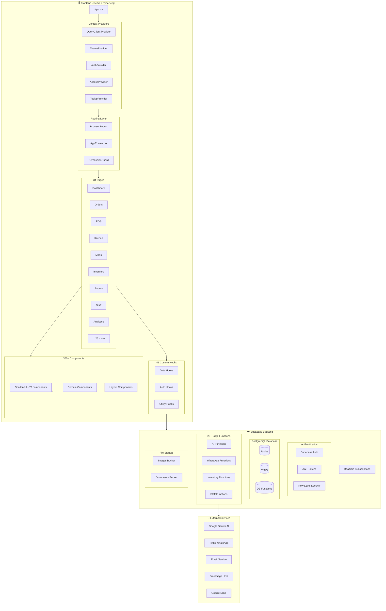

---

## Application Flow

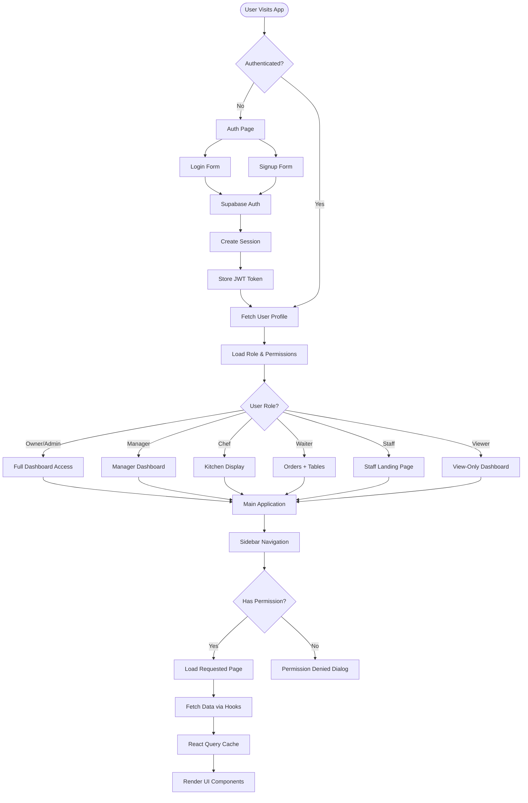

---

## Module Dependencies

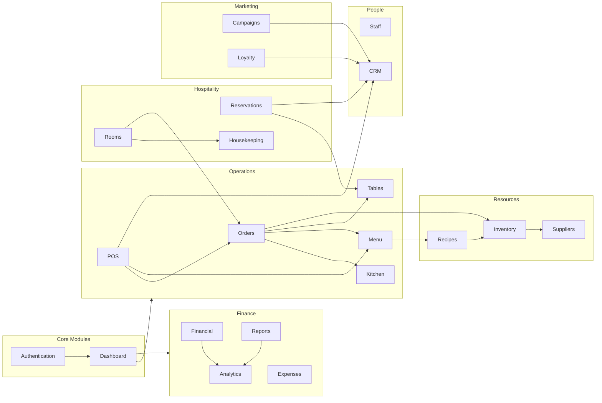

---

## Data Flow Architecture

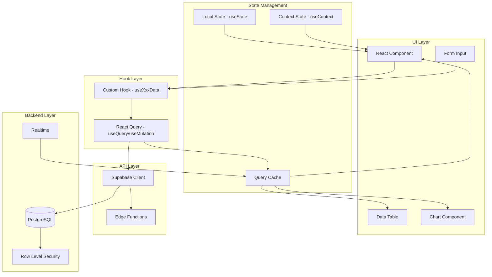

---

## Authentication & Authorization Flow

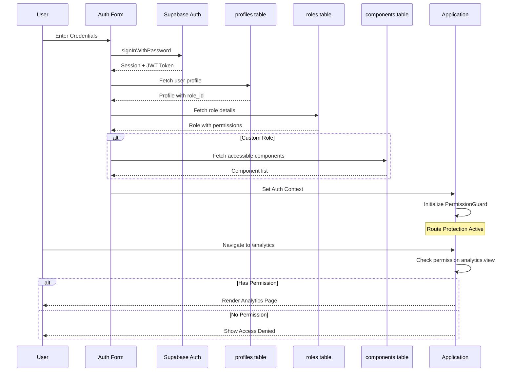

---

## Order Processing Flow

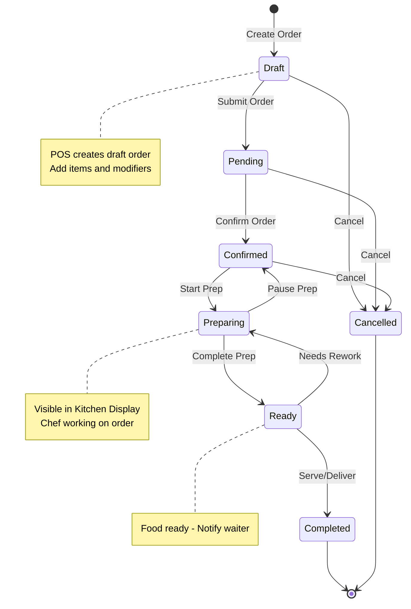

---

## Kitchen Display System Flow

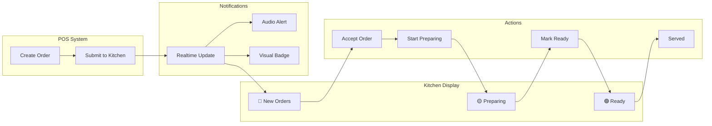

---

## Reservation System Flow

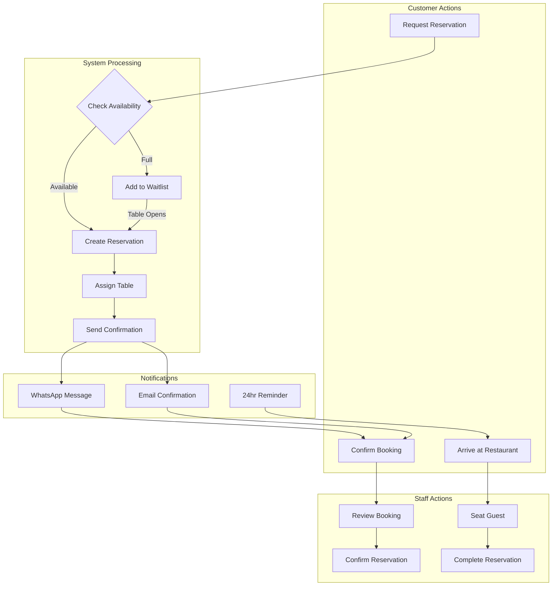

---

## Room Management Flow

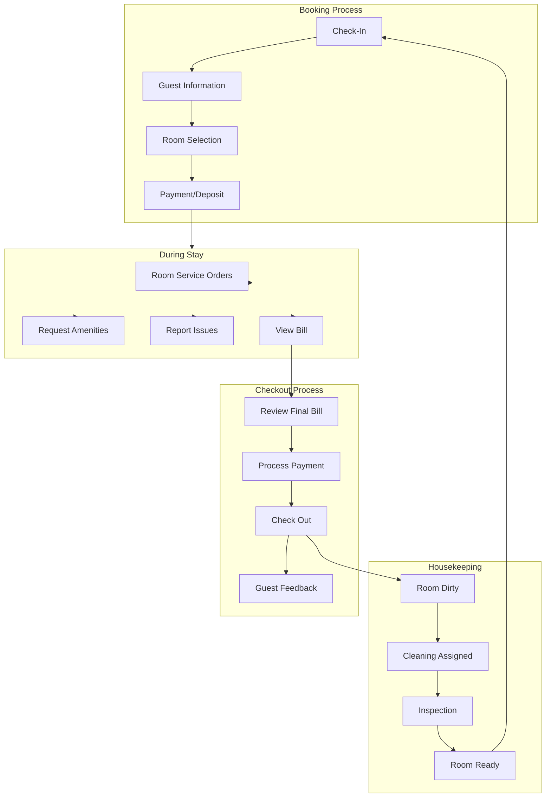

---

## Inventory Management Flow

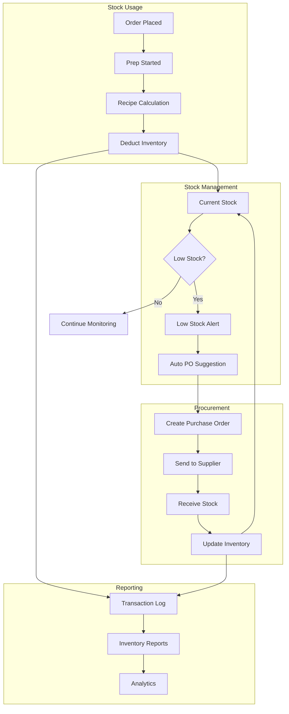

---

## Payment Processing Flow

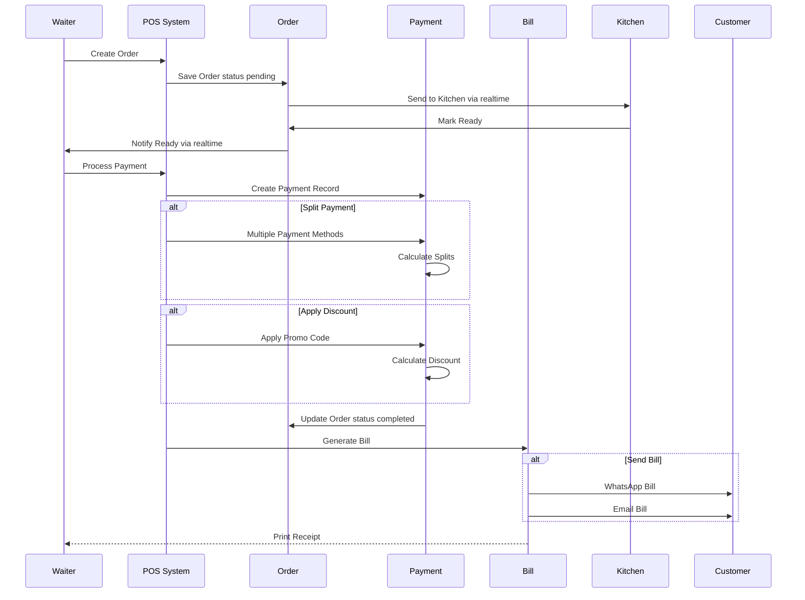

---

## Real-time Subscriptions

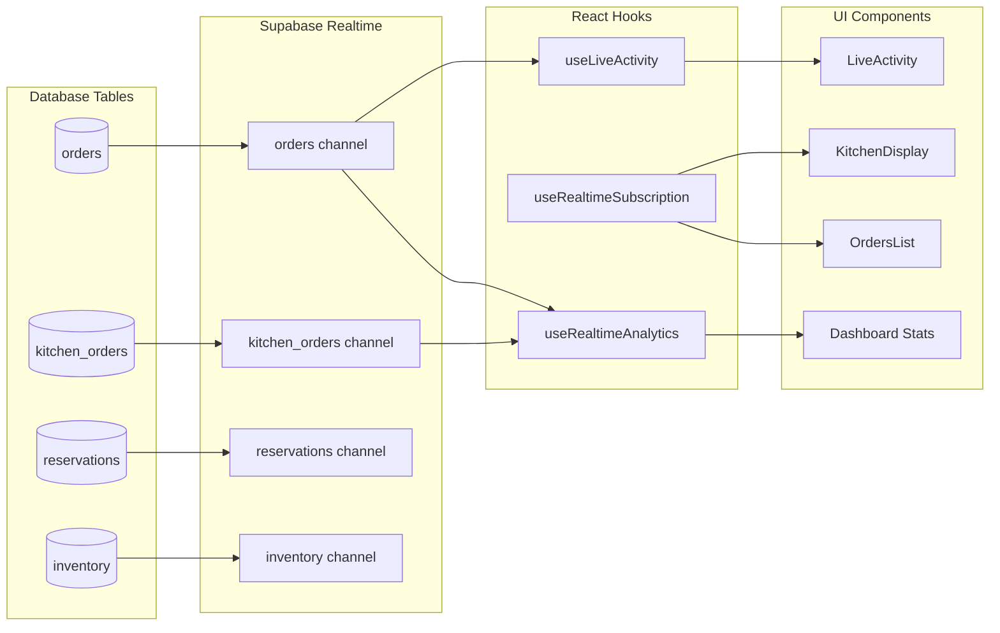

---

## Edge Function Architecture

```mermaid
graph TB
    subgraph Client["Client Requests"]
        WebApp[Web Application]
        External[External Webhooks]
    end
    
    subgraph EdgeLayer["Supabase Edge Functions"]
        subgraph AI["AI Functions"]
            ChatGemini[chat-with-gemini]
            ChatAI[chat-with-ai]
            ChatAPI[chat-with-api]
        end
        
        subgraph Messaging["Messaging Functions"]
            SendWhatsApp[send-whatsapp]
            SendWhatsAppBill[send-whatsapp-bill]
            SendEmail[send-email-bill]
            ResConfirm[send-reservation-confirmation]
            ResReminder[send-reservation-reminder]
        end
        
        subgraph Inventory["Inventory Functions"]
            CheckLowStock[check-low-stock]
            DeductInventory[deduct-inventory-on-prep]
        end
        
        subgraph Staff["Staff Functions"]
            ClockEntry[record-clock-entry]
            MissedClocks[check-missed-clocks]
        end
        
        subgraph Admin["Admin Functions"]
            RoleMgmt[role-management]
            UserMgmt[user-management]
            GetComponents[get-user-components]
            Backup[backup-restore]
        end
        
        subgraph Utils["Utility Functions"]
            ValidatePromo[validate-promo-code]
            LogPromo[log-promotion-usage]
            Upload[upload-image]
            FreeImg[freeimage-upload]
            SyncChannels[sync-channels]
        end
    end
    
    subgraph External_Services["External Services"]
        Gemini[Google Gemini]
        Twilio[Twilio API]
        EmailSvc[Email Service]
        FreeImage[FreeImage.host]
        GDrive[Google Drive]
    end
    
    WebApp --> EdgeLayer
    External --> EdgeLayer
    
    ChatGemini --> Gemini
    SendWhatsApp --> Twilio
    SendEmail --> EmailSvc
    Upload --> FreeImage
    Backup --> GDrive
```

---

## Component Hierarchy

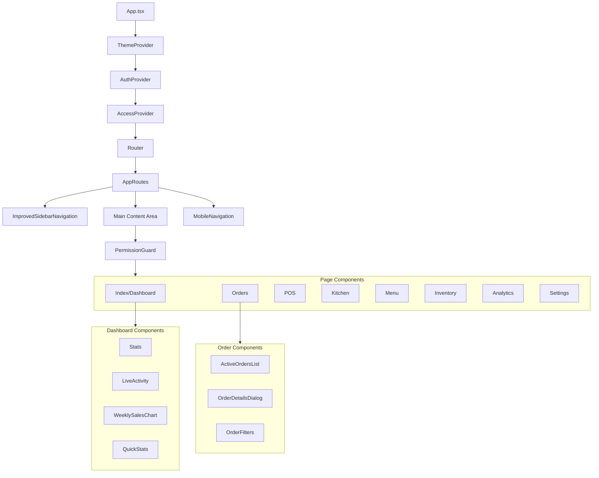

---

## Database Entity Relationships

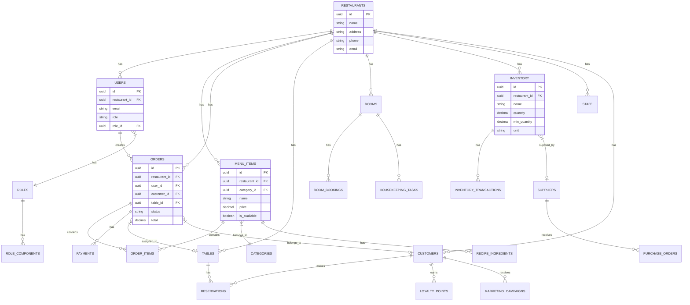

---

## RBAC Permission Matrix

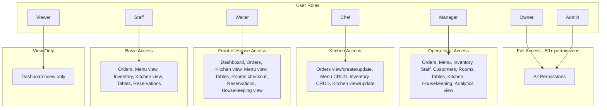

---

## File Structure Reference

```
src/
├── App.tsx                 # Main app with providers
├── main.tsx                # Entry point
├── components/
│   ├── Auth/               # 15 auth components
│   ├── Dashboard/          # 18 dashboard widgets
│   ├── Orders/             # 19 order components
│   ├── Kitchen/            # 4 KDS components
│   ├── Menu/               # 2 menu components
│   ├── Inventory/          # 7 inventory components
│   ├── Rooms/              # 31 room components
│   ├── Staff/              # 17 staff components
│   ├── CRM/                # 7 customer components
│   ├── Analytics/          # 26 analytics components
│   ├── Financial/          # 10 financial components
│   ├── Reporting/          # 5 report components
│   ├── Marketing/          # 6 marketing components
│   ├── Housekeeping/       # 10 housekeeping components
│   ├── Settings/           # 3 settings tabs
│   ├── Layout/             # 11 layout components
│   └── ui/                 # 72 Shadcn UI components
├── hooks/                  # 41 custom hooks
├── pages/                  # 34 page components
├── types/                  # TypeScript definitions
├── contexts/               # React contexts
├── integrations/           # Supabase client
└── tests/                  # Test suite

supabase/
└── functions/              # 25+ Edge Functions
```

---

## Quick Commands

```bash
# Development
npm run dev              # Start dev server
npm test                 # Run tests
npm test -- --coverage   # Test with coverage
npm run build            # Production build
npx tsc --noEmit         # Type check
npm run lint             # Lint code
```

---

*Last Updated: December 2024*
