# 🏗️ Developer Architecture Guide

> **⚠️ LOCAL-ONLY DOCUMENTATION**  
> This file is gitignored and for developer reference only. Do not commit to version control.

---

## Table of Contents

1. [System Architecture](#system-architecture)
2. [Application Flow](#application-flow)
3. [Module Dependencies](#module-dependencies)
4. [Data Flow Architecture](#data-flow-architecture)
5. [Authentication & Authorization Flow](#authentication--authorization-flow)
6. [Order Processing Flow](#order-processing-flow)
7. [Kitchen Display System Flow](#kitchen-display-system-flow)
8. [QSR POS Flow](#qsr-pos-flow)
9. [QR Ordering & Customer Self-Service Flow](#qr-ordering--customer-self-service-flow)
10. [Reservation System Flow](#reservation-system-flow)
11. [Room Management Flow](#room-management-flow)
12. [Inventory Management Flow](#inventory-management-flow)
13. [Payment Processing Flow](#payment-processing-flow)
14. [Customizable Dashboard & Widget System](#customizable-dashboard--widget-system)
15. [AI & Chatbot Integration](#ai--chatbot-integration)
16. [Non-Chargeable (NC) Order Flow](#non-chargeable-nc-order-flow)
17. [Night Audit Flow](#night-audit-flow)
18. [Platform Admin Panel](#platform-admin-panel)
19. [Revenue & Channel Management Flow](#revenue--channel-management-flow)
20. [Landing Website & Public Pages](#landing-website--public-pages)
21. [Security & Compliance](#security--compliance)
22. [Real-time Subscriptions](#real-time-subscriptions)
23. [Edge Function Architecture](#edge-function-architecture)
24. [Component Hierarchy](#component-hierarchy)
25. [Database Entity Relationships](#database-entity-relationships)
26. [RBAC Permission Matrix](#rbac-permission-matrix)
27. [File Structure Reference](#file-structure-reference)
28. [Quick Commands](#quick-commands)

---

## System Architecture

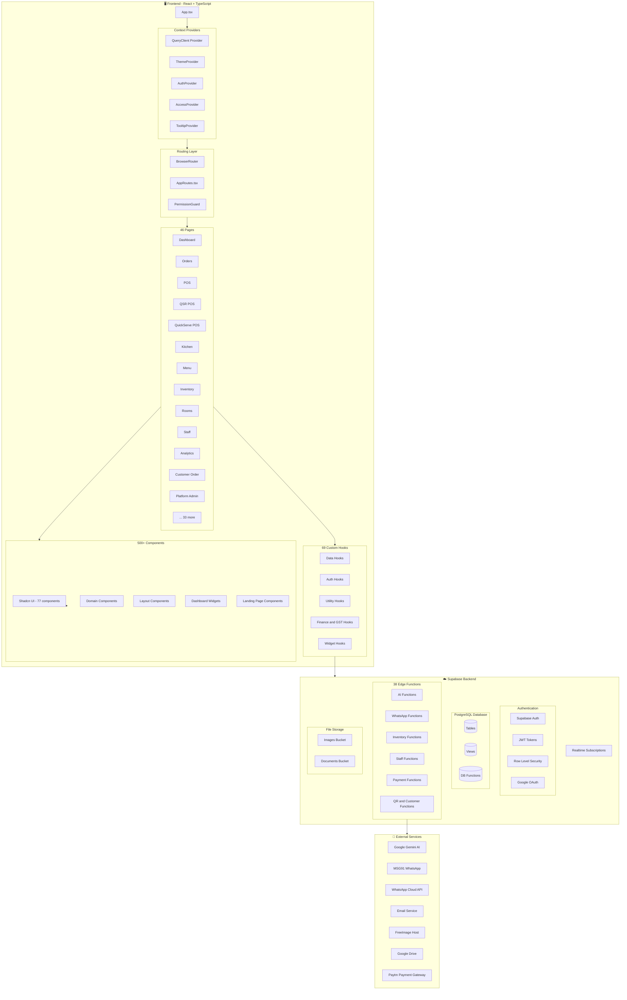
```mermaid
graph TB
    subgraph Client["🖥️ Frontend - React + TypeScript"]
        App[App.tsx]
        
        subgraph Providers["Context Providers"]
            QC[QueryClient Provider]
            Theme[ThemeProvider]
            Auth[AuthProvider]
            Access[AccessProvider]
            Tooltip[TooltipProvider]
        end
        
        subgraph Routing["Routing Layer"]
            Router[BrowserRouter]
            AppRoutes[AppRoutes.tsx]
            PermGuard[PermissionGuard]
        end
        
        subgraph Pages["46 Pages"]
            Dashboard[Dashboard]
            Orders[Orders]
            POS[POS]
            QSRPOS[QSR POS]
            QuickServe[QuickServe POS]
            Kitchen[Kitchen]
            Menu[Menu]
            Inventory[Inventory]
            Rooms[Rooms]
            Staff[Staff]
            Analytics[Analytics]
            CustomerOrder[Customer Order]
            Platform[Platform Admin]
            More["... 33 more"]
        end
        
        subgraph Components["500+ Components"]
            UI["Shadcn UI - 77 components"]
            Domain[Domain Components]
            Layout[Layout Components]
            Widgets[Dashboard Widgets]
            Landing[Landing Page Components]
        end
        
        subgraph Hooks["69 Custom Hooks"]
            DataHooks[Data Hooks]
            AuthHooks[Auth Hooks]
            UtilHooks[Utility Hooks]
            FinanceHooks["Finance and GST Hooks"]
            WidgetHooks[Widget Hooks]
        end
    end
    
    subgraph Backend["☁️ Supabase Backend"]
        subgraph Auth_Backend["Authentication"]
            SupaAuth[Supabase Auth]
            JWT[JWT Tokens]
            RLS[Row Level Security]
            GoogleAuth[Google OAuth]
        end
        
        subgraph Database["PostgreSQL Database"]
            Tables[(Tables)]
            Views[(Views)]
            Functions[(DB Functions)]
        end
        
        subgraph EdgeFunctions["38 Edge Functions"]
            AI_Fn[AI Functions]
            WhatsApp_Fn[WhatsApp Functions]
            Inventory_Fn[Inventory Functions]
            Staff_Fn[Staff Functions]
            Payment_Fn[Payment Functions]
            QR_Fn["QR and Customer Functions"]
        end
        
        subgraph Storage["File Storage"]
            Images[Images Bucket]
            Documents[Documents Bucket]
        end
        
        Realtime[Realtime Subscriptions]
    end
    
    subgraph External["🔌 External Services"]
        Gemini[Google Gemini AI]
        MSG91[MSG91 WhatsApp]
        WhatsAppCloud[WhatsApp Cloud API]
        Email[Email Service]
        FreeImage[FreeImage Host]
        GDrive[Google Drive]
        Paytm[Paytm Payment Gateway]
    end
    
    App --> Providers
    Providers --> Routing
    Routing --> Pages
    Pages --> Components
    Pages --> Hooks
    Hooks --> Backend
    EdgeFunctions --> External
    Components --> UI
```

---

## Application Flow

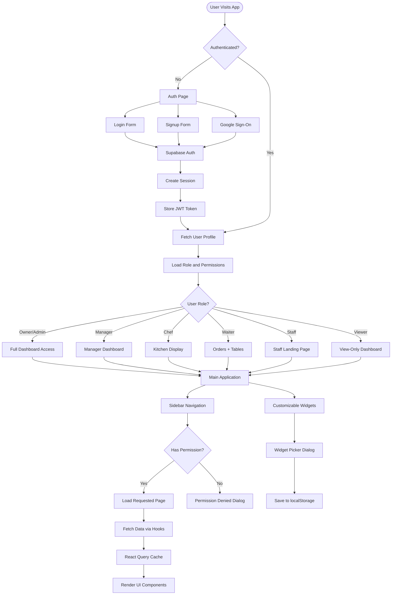
```mermaid
flowchart TD
    Start([User Visits App]) --> CheckAuth{Authenticated?}
    
    CheckAuth -->|No| AuthPage[Auth Page]
    AuthPage --> Login[Login Form]
    AuthPage --> Signup[Signup Form]
    AuthPage --> GoogleSSO[Google Sign-On]
    Login --> SupaAuth[Supabase Auth]
    Signup --> SupaAuth
    GoogleSSO --> SupaAuth
    SupaAuth --> CreateSession[Create Session]
    CreateSession --> StoreJWT[Store JWT Token]
    StoreJWT --> FetchProfile[Fetch User Profile]
    
    CheckAuth -->|Yes| FetchProfile
    FetchProfile --> LoadRole["Load Role and Permissions"]
    LoadRole --> CheckRole{User Role?}
    
    CheckRole -->|Owner/Admin| FullDashboard[Full Dashboard Access]
    CheckRole -->|Manager| ManagerDash[Manager Dashboard]
    CheckRole -->|Chef| KitchenView[Kitchen Display]
    CheckRole -->|Waiter| WaiterView[Orders + Tables]
    CheckRole -->|Staff| StaffLanding[Staff Landing Page]
    CheckRole -->|Viewer| ViewerDash[View-Only Dashboard]
    
    FullDashboard --> MainApp[Main Application]
    ManagerDash --> MainApp
    KitchenView --> MainApp
    WaiterView --> MainApp
    StaffLanding --> MainApp
    ViewerDash --> MainApp
    
    MainApp --> Navigation[Sidebar Navigation]
    Navigation --> PermCheck{Has Permission?}
    PermCheck -->|Yes| LoadPage[Load Requested Page]
    PermCheck -->|No| AccessDenied[Permission Denied Dialog]
    
    LoadPage --> FetchData[Fetch Data via Hooks]
    FetchData --> ReactQuery[React Query Cache]
    ReactQuery --> RenderUI[Render UI Components]
    
    MainApp --> WidgetConfig[Customizable Widgets]
    WidgetConfig --> WidgetPicker[Widget Picker Dialog]
    WidgetPicker --> LocalPrefs[Save to localStorage]
```

---

## Module Dependencies

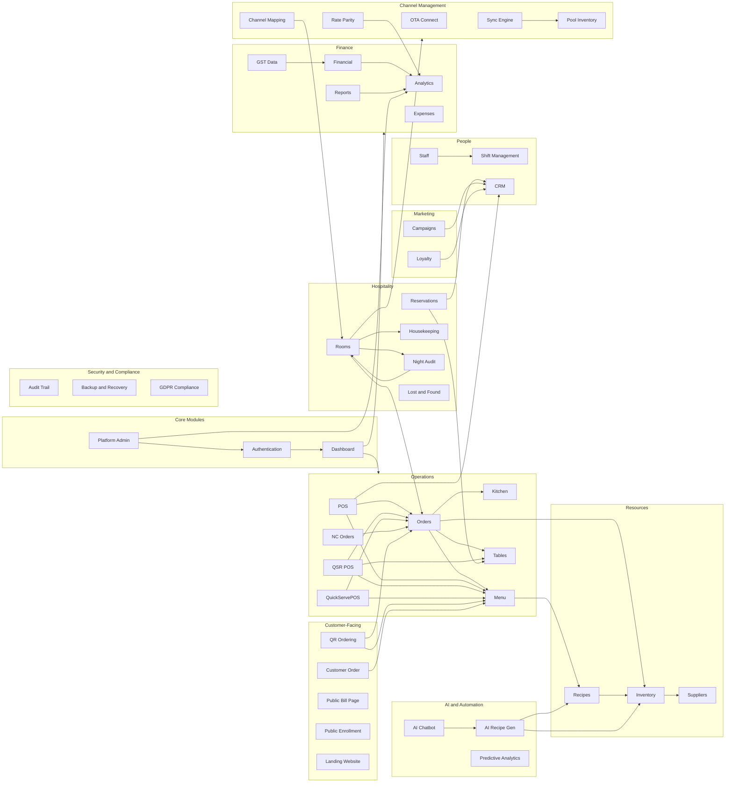
```mermaid
graph LR
    subgraph Core["Core Modules"]
        Auth[Authentication]
        Dashboard[Dashboard]
        Platform[Platform Admin]
    end
    
    subgraph Operations["Operations"]
        Orders[Orders]
        POS[POS]
        QSRPOS[QSR POS]
        QuickServe[QuickServePOS]
        Kitchen[Kitchen]
        Menu[Menu]
        Tables[Tables]
        NCOrders[NC Orders]
    end
    
    subgraph Resources["Resources"]
        Inventory[Inventory]
        Recipes[Recipes]
        Suppliers[Suppliers]
    end
    
    subgraph Hospitality["Hospitality"]
        Reservations[Reservations]
        Rooms[Rooms]
        Housekeeping[Housekeeping]
        NightAudit[Night Audit]
        LostFound["Lost and Found"]
    end
    
    subgraph People["People"]
        Staff[Staff]
        Shifts[Shift Management]
        Customers[CRM]
    end
    
    subgraph Finance["Finance"]
        Analytics[Analytics]
        Financial[Financial]
        Reports[Reports]
        Expenses[Expenses]
        GST[GST Data]
    end
    
    subgraph Marketing["Marketing"]
        Campaigns[Campaigns]
        Loyalty[Loyalty]
    end
    
    subgraph ChannelMgmt["Channel Management"]
        OTAConnect[OTA Connect]
        ChannelMapping[Channel Mapping]
        RateParity[Rate Parity]
        SyncEngine[Sync Engine]
        PoolInventory[Pool Inventory]
    end
    
    subgraph CustomerFacing["Customer-Facing"]
        QROrdering[QR Ordering]
        CustomerOrder[Customer Order]
        PublicBill[Public Bill Page]
        PublicEnroll[Public Enrollment]
        LandingWeb[Landing Website]
    end
    
    subgraph Intelligence["AI and Automation"]
        Chatbot[AI Chatbot]
        AIAssist[AI Recipe Gen]
        Predictive[Predictive Analytics]
    end
    
    subgraph SecurityMod["Security and Compliance"]
        AuditTrail[Audit Trail]
        Backup["Backup and Recovery"]
        GDPR[GDPR Compliance]
    end
    
    Auth --> Dashboard
    Dashboard --> Operations
    Dashboard --> Finance
    
    Orders --> Kitchen
    Orders --> Menu
    Orders --> Tables
    Orders --> Inventory
    
    POS --> Orders
    POS --> Menu
    POS --> Customers
    
    QSRPOS --> Orders
    QSRPOS --> Menu
    QSRPOS --> Tables
    
    QuickServe --> Orders
    QuickServe --> Menu
    
    NCOrders --> Orders
    
    Menu --> Recipes
    Recipes --> Inventory
    
    Reservations --> Tables
    Reservations --> Customers
    
    Rooms --> Housekeeping
    Rooms --> Orders
    Rooms --> NightAudit
    NightAudit --> Rooms
    
    Inventory --> Suppliers
    
    Financial --> Analytics
    Reports --> Analytics
    GST --> Financial
    
    Campaigns --> Customers
    Loyalty --> Customers
    
    QROrdering --> Menu
    QROrdering --> Orders
    CustomerOrder --> Menu
    
    Chatbot --> AIAssist
    AIAssist --> Recipes
    AIAssist --> Inventory
    
    Staff --> Shifts
    
    Platform --> Auth
    Platform --> Analytics
    
    Rooms --> ChannelMgmt
    ChannelMgmt --> SyncEngine
    SyncEngine --> PoolInventory
    ChannelMapping --> Rooms
    RateParity --> Analytics
```

---

## Data Flow Architecture

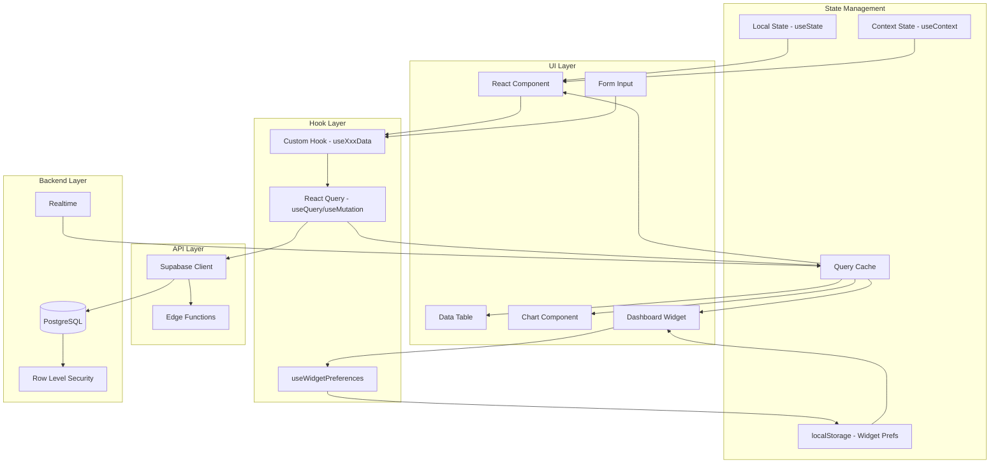
```mermaid
flowchart TB
    subgraph UI["UI Layer"]
        Component[React Component]
        Form[Form Input]
        Table[Data Table]
        Chart[Chart Component]
        Widget[Dashboard Widget]
    end
    
    subgraph HookLayer["Hook Layer"]
        CustomHook["Custom Hook - useXxxData"]
        ReactQuery["React Query - useQuery/useMutation"]
        WidgetHook["useWidgetPreferences"]
    end
    
    subgraph StateLayer["State Management"]
        QueryCache[Query Cache]
        LocalState["Local State - useState"]
        Context["Context State - useContext"]
        LocalStorage["localStorage - Widget Prefs"]
    end
    
    subgraph APILayer["API Layer"]
        SupaClient[Supabase Client]
        EdgeFn[Edge Functions]
    end
    
    subgraph Backend["Backend Layer"]
        DB[(PostgreSQL)]
        RLS[Row Level Security]
        Realtime[Realtime]
    end
    
    Component --> CustomHook
    Form --> CustomHook
    Widget --> WidgetHook
    
    CustomHook --> ReactQuery
    ReactQuery --> QueryCache
    ReactQuery --> SupaClient
    WidgetHook --> LocalStorage
    
    SupaClient --> DB
    SupaClient --> EdgeFn
    DB --> RLS
    
    Realtime --> QueryCache
    QueryCache --> Component
    QueryCache --> Table
    QueryCache --> Chart
    QueryCache --> Widget
    
    LocalState --> Component
    Context --> Component
    LocalStorage --> Widget
```

---

## Authentication & Authorization Flow

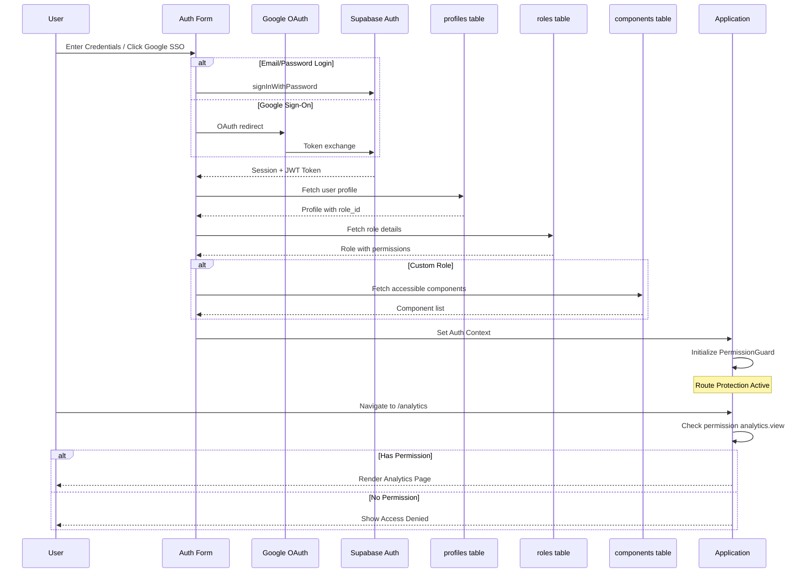
```mermaid
sequenceDiagram
    participant U as User
    participant A as Auth Form
    participant G as Google OAuth
    participant S as Supabase Auth
    participant P as profiles table
    participant R as roles table
    participant C as components table
    participant App as Application
    
    U->>A: Enter Credentials / Click Google SSO
    
    alt Email/Password Login
        A->>S: signInWithPassword
    else Google Sign-On
        A->>G: OAuth redirect
        G->>S: Token exchange
    end
    
    S-->>A: Session + JWT Token
    A->>P: Fetch user profile
    P-->>A: Profile with role_id
    A->>R: Fetch role details
    R-->>A: Role with permissions
    
    alt Custom Role
        A->>C: Fetch accessible components
        C-->>A: Component list
    end
    
    A->>App: Set Auth Context
    App->>App: Initialize PermissionGuard
    
    Note over App: Route Protection Active
    
    U->>App: Navigate to /analytics
    App->>App: Check permission analytics.view
    
    alt Has Permission
        App-->>U: Render Analytics Page
    else No Permission
        App-->>U: Show Access Denied
    end
```

---

## Order Processing Flow

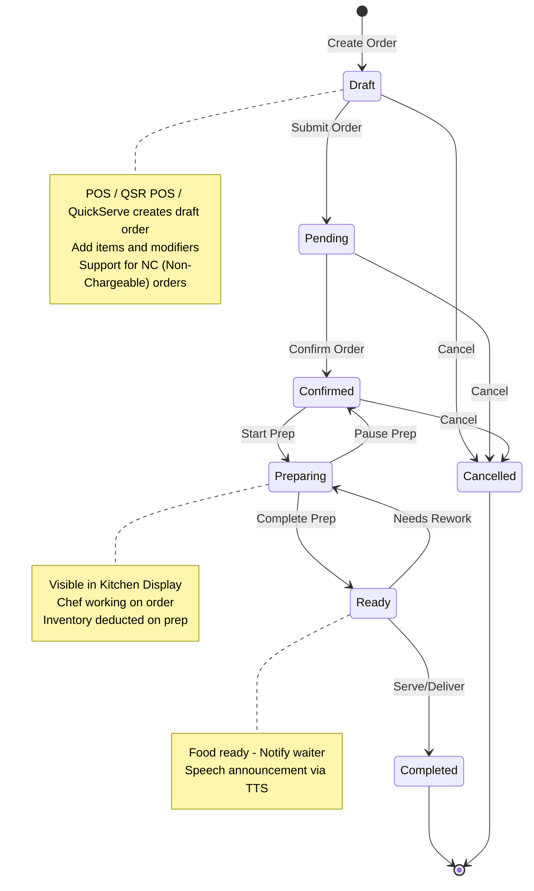
```mermaid
stateDiagram-v2
    [*] --> Draft: Create Order
    
    Draft --> Pending: Submit Order
    Draft --> Cancelled: Cancel
    
    Pending --> Confirmed: Confirm Order
    Pending --> Cancelled: Cancel
    
    Confirmed --> Preparing: Start Prep
    Confirmed --> Cancelled: Cancel
    
    Preparing --> Ready: Complete Prep
    Preparing --> Confirmed: Pause Prep
    
    Ready --> Completed: Serve/Deliver
    Ready --> Preparing: Needs Rework
    
    Completed --> [*]
    Cancelled --> [*]
    
    note right of Draft
        POS / QSR POS / QuickServe creates draft order
        Add items and modifiers
        Support for NC (Non-Chargeable) orders
    end note
    
    note right of Preparing
        Visible in Kitchen Display
        Chef working on order
        Inventory deducted on prep
    end note
    
    note right of Ready
        Food ready - Notify waiter
        Speech announcement via TTS
    end note
```

---

## Kitchen Display System Flow

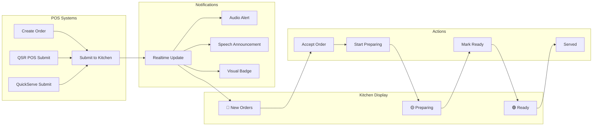
```mermaid
flowchart LR
    subgraph POS["POS Systems"]
        CreateOrder[Create Order]
        SubmitOrder[Submit to Kitchen]
        QSRSubmit[QSR POS Submit]
        QSSubmit[QuickServe Submit]
    end
    
    subgraph Kitchen["Kitchen Display"]
        NewOrders["🔴 New Orders"]
        Preparing["🟡 Preparing"]
        Ready["🟢 Ready"]
    end
    
    subgraph Actions["Actions"]
        Accept[Accept Order]
        StartPrep[Start Preparing]
        MarkReady[Mark Ready]
        Serve[Served]
    end
    
    subgraph Notifications["Notifications"]
        Sound[Audio Alert]
        Speech[Speech Announcement]
        Visual[Visual Badge]
        Realtime[Realtime Update]
    end
    
    CreateOrder --> SubmitOrder
    QSRSubmit --> SubmitOrder
    QSSubmit --> SubmitOrder
    SubmitOrder --> Realtime
    Realtime --> NewOrders
    Realtime --> Sound
    Realtime --> Speech
    Realtime --> Visual
    
    NewOrders --> Accept
    Accept --> StartPrep
    StartPrep --> Preparing
    Preparing --> MarkReady
    MarkReady --> Ready
    Ready --> Serve
```

---

## QSR POS Flow

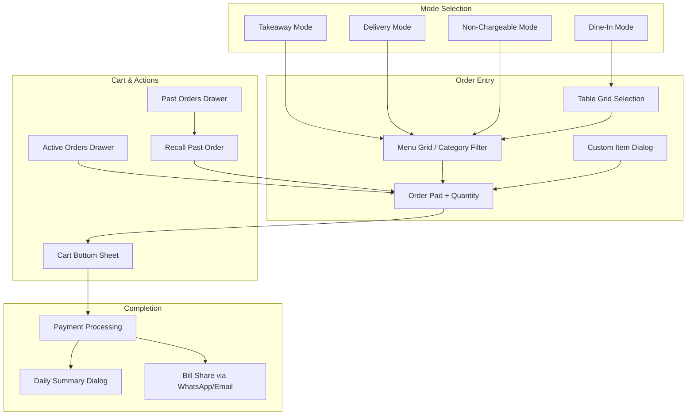
```mermaid
flowchart TD
    subgraph ModeSelect["Mode Selection"]
        DineIn[Dine-In Mode]
        Takeaway[Takeaway Mode]
        Delivery[Delivery Mode]
        NC[Non-Chargeable Mode]
    end
    
    subgraph OrderEntry["Order Entry"]
        TableGrid[Table Grid Selection]
        MenuGrid[Menu Grid / Category Filter]
        CustomItem[Custom Item Dialog]
        OrderPad[Order Pad + Quantity]
    end
    
    subgraph CartActions["Cart & Actions"]
        CartSheet[Cart Bottom Sheet]
        ActiveOrders[Active Orders Drawer]
        PastOrders[Past Orders Drawer]
        RecallOrder[Recall Past Order]
    end
    
    subgraph Completion["Completion"]
        Payment[Payment Processing]
        DailySummary[Daily Summary Dialog]
        BillShare[Bill Share via WhatsApp/Email]
    end
    
    DineIn --> TableGrid
    Takeaway --> MenuGrid
    Delivery --> MenuGrid
    NC --> MenuGrid
    
    TableGrid --> MenuGrid
    MenuGrid --> OrderPad
    CustomItem --> OrderPad
    OrderPad --> CartSheet
    
    CartSheet --> Payment
    ActiveOrders --> OrderPad
    PastOrders --> RecallOrder
    RecallOrder --> OrderPad
    
    Payment --> DailySummary
    Payment --> BillShare
```

---

## QR Ordering & Customer Self-Service Flow

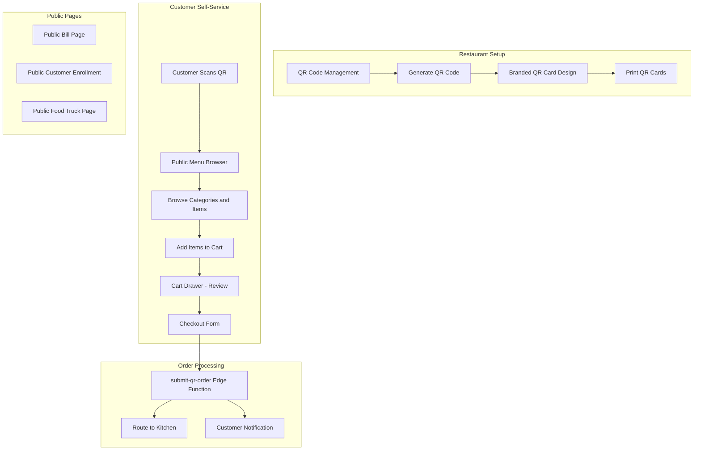
```mermaid
flowchart TD
    subgraph Setup["Restaurant Setup"]
        QRManage[QR Code Management]
        GenQR[Generate QR Code]
        BrandedCard[Branded QR Card Design]
        PrintQR[Print QR Cards]
    end
    
    subgraph CustomerFlow["Customer Self-Service"]
        ScanQR[Customer Scans QR]
        PublicMenu[Public Menu Browser]
        BrowseItems["Browse Categories and Items"]
        AddToCart[Add Items to Cart]
        CartDrawer["Cart Drawer - Review"]
        Checkout[Checkout Form]
    end
    
    subgraph OrderSubmit["Order Processing"]
        SubmitQR["submit-qr-order Edge Function"]
        KitchenRoute["Route to Kitchen"]
        CustomerNotify[Customer Notification]
    end
    
    subgraph PublicPages["Public Pages"]
        PublicBill[Public Bill Page]
        PublicEnroll[Public Customer Enrollment]
        PublicTruck[Public Food Truck Page]
    end
    
    QRManage --> GenQR
    GenQR --> BrandedCard
    BrandedCard --> PrintQR
    
    ScanQR --> PublicMenu
    PublicMenu --> BrowseItems
    BrowseItems --> AddToCart
    AddToCart --> CartDrawer
    CartDrawer --> Checkout
    Checkout --> SubmitQR
    SubmitQR --> KitchenRoute
    SubmitQR --> CustomerNotify
```

---

## Reservation System Flow

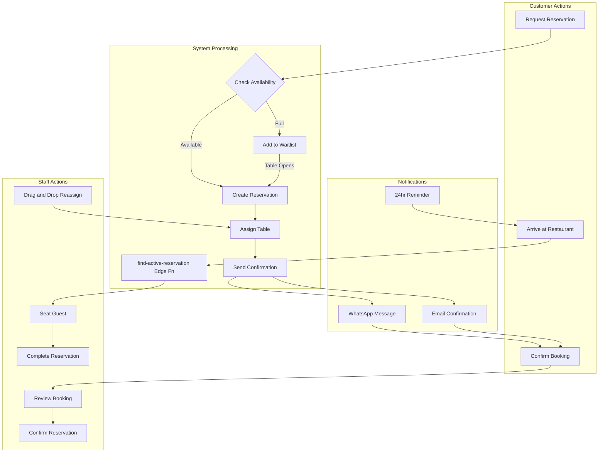
```mermaid
flowchart TD
    subgraph Customer["Customer Actions"]
        Request[Request Reservation]
        Confirm[Confirm Booking]
        Arrive[Arrive at Restaurant]
    end
    
    subgraph System["System Processing"]
        CheckAvail{Check Availability}
        CreateRes[Create Reservation]
        AssignTable[Assign Table]
        SendConfirm[Send Confirmation]
        AddWaitlist[Add to Waitlist]
        FindActive["find-active-reservation Edge Fn"]
    end
    
    subgraph Notifications["Notifications"]
        WhatsApp[WhatsApp Message]
        Email[Email Confirmation]
        Reminder[24hr Reminder]
    end
    
    subgraph Staff["Staff Actions"]
        Review[Review Booking]
        ConfirmRes[Confirm Reservation]
        SeatGuest[Seat Guest]
        Complete[Complete Reservation]
        DragDrop["Drag and Drop Reassign"]
    end
    
    Request --> CheckAvail
    CheckAvail -->|Available| CreateRes
    CheckAvail -->|Full| AddWaitlist
    
    CreateRes --> AssignTable
    AssignTable --> SendConfirm
    SendConfirm --> WhatsApp
    SendConfirm --> Email
    
    WhatsApp --> Confirm
    Email --> Confirm
    
    Confirm --> Review
    Review --> ConfirmRes
    
    Reminder --> Arrive
    Arrive --> FindActive
    FindActive --> SeatGuest
    SeatGuest --> Complete
    
    AddWaitlist -->|Table Opens| CreateRes
    DragDrop --> AssignTable
```

---

## Room Management Flow

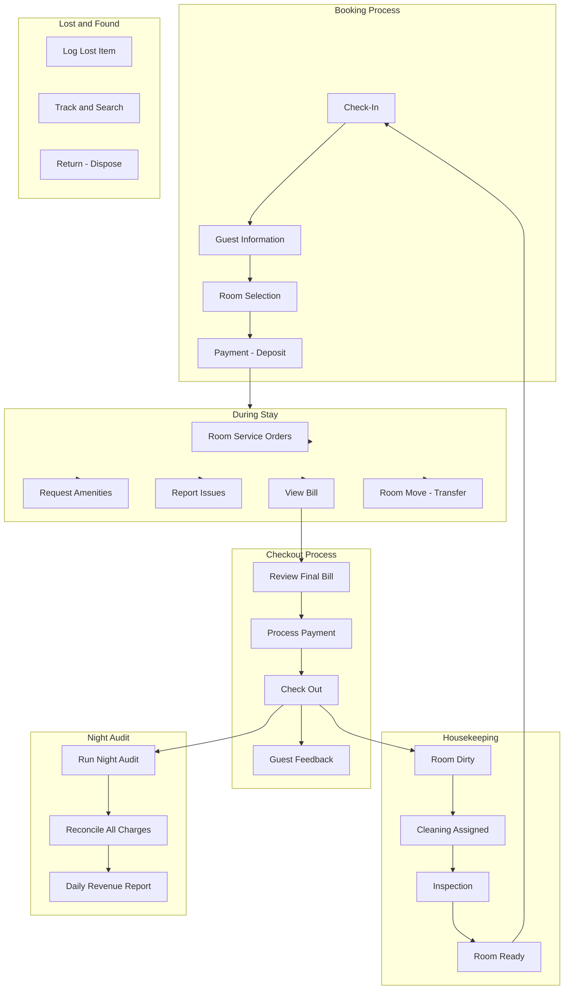
```mermaid
flowchart TB
    subgraph Booking["Booking Process"]
        CheckIn[Check-In]
        GuestInfo[Guest Information]
        RoomSelect[Room Selection]
        Payment["Payment - Deposit"]
    end
    
    subgraph Stay["During Stay"]
        RoomService[Room Service Orders]
        Amenities[Request Amenities]
        Maintenance[Report Issues]
        Billing[View Bill]
        RoomMove["Room Move - Transfer"]
    end
    
    subgraph Checkout["Checkout Process"]
        ReviewBill[Review Final Bill]
        ProcessPayment[Process Payment]
        CheckOut[Check Out]
        Feedback[Guest Feedback]
    end
    
    subgraph Housekeeping["Housekeeping"]
        Dirty[Room Dirty]
        Cleaning[Cleaning Assigned]
        Inspection[Inspection]
        Ready[Room Ready]
    end
    
    subgraph NightAuditProc["Night Audit"]
        AuditRun[Run Night Audit]
        ReconcileCharges[Reconcile All Charges]
        GenerateReport[Daily Revenue Report]
    end
    
    subgraph LostFoundProc["Lost and Found"]
        LogItem[Log Lost Item]
        TrackItem["Track and Search"]
        ResolveItem["Return - Dispose"]
    end
    
    CheckIn --> GuestInfo
    GuestInfo --> RoomSelect
    RoomSelect --> Payment
    Payment --> Stay
    
    Stay --> RoomService
    Stay --> Amenities
    Stay --> Maintenance
    Stay --> Billing
    Stay --> RoomMove
    
    Billing --> ReviewBill
    ReviewBill --> ProcessPayment
    ProcessPayment --> CheckOut
    CheckOut --> Feedback
    
    CheckOut --> Dirty
    Dirty --> Cleaning
    Cleaning --> Inspection
    Inspection --> Ready
    Ready --> CheckIn
    
    CheckOut --> AuditRun
    AuditRun --> ReconcileCharges
    ReconcileCharges --> GenerateReport
```

---

## Inventory Management Flow

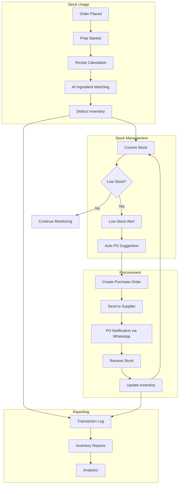
```mermaid
flowchart TD
    subgraph Stock["Stock Management"]
        CurrentStock[Current Stock]
        LowStock{Low Stock?}
        Alert[Low Stock Alert]
        AutoPO[Auto PO Suggestion]
    end
    
    subgraph Procurement["Procurement"]
        CreatePO[Create Purchase Order]
        SendPO[Send to Supplier]
        PONotify[PO Notification via WhatsApp]
        ReceiveStock[Receive Stock]
        UpdateInventory[Update Inventory]
    end
    
    subgraph Usage["Stock Usage"]
        OrderPlaced[Order Placed]
        PrepStarted[Prep Started]
        DeductStock[Deduct Inventory]
        RecipeCalc[Recipe Calculation]
        AIIngredient[AI Ingredient Matching]
    end
    
    subgraph Reporting["Reporting"]
        Transactions[Transaction Log]
        Reports[Inventory Reports]
        Analytics[Analytics]
    end
    
    CurrentStock --> LowStock
    LowStock -->|Yes| Alert
    LowStock -->|No| Monitor[Continue Monitoring]
    Alert --> AutoPO
    AutoPO --> CreatePO
    CreatePO --> SendPO
    SendPO --> PONotify
    PONotify --> ReceiveStock
    ReceiveStock --> UpdateInventory
    UpdateInventory --> CurrentStock
    
    OrderPlaced --> PrepStarted
    PrepStarted --> RecipeCalc
    RecipeCalc --> AIIngredient
    AIIngredient --> DeductStock
    DeductStock --> CurrentStock
    
    DeductStock --> Transactions
    UpdateInventory --> Transactions
    Transactions --> Reports
    Reports --> Analytics
```

---

## Payment Processing Flow

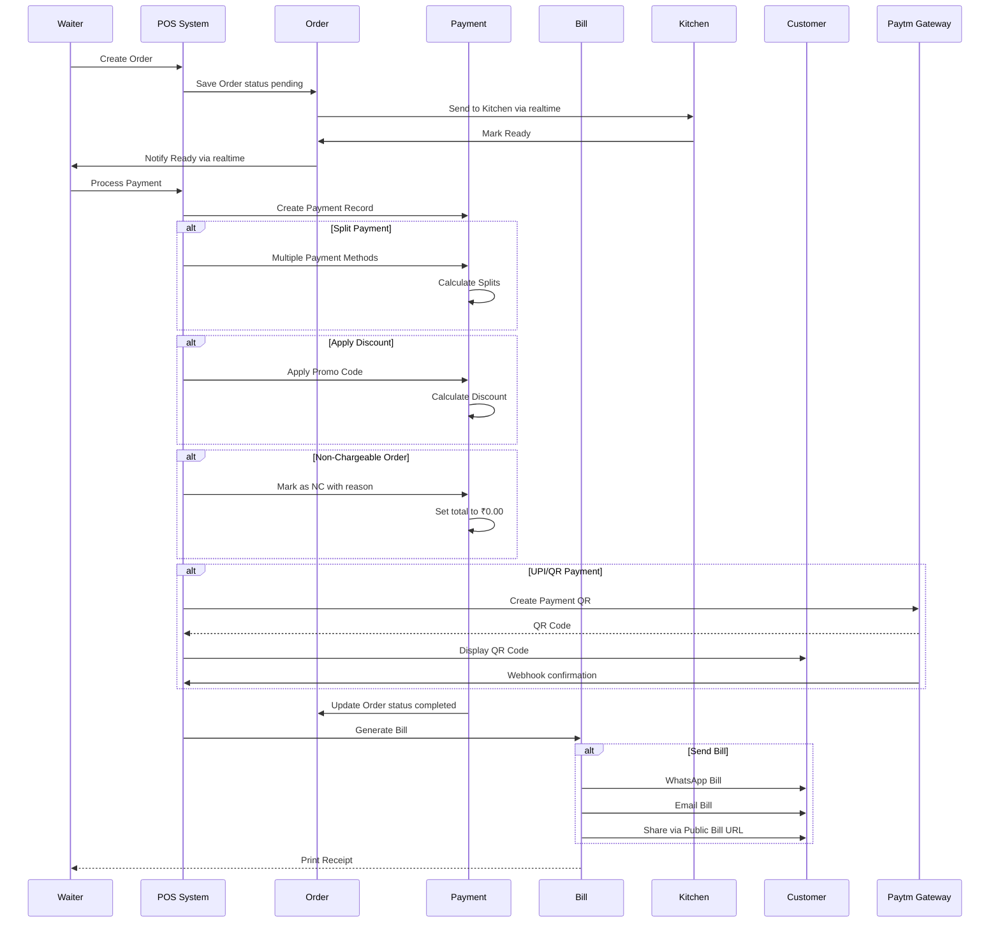
```mermaid
sequenceDiagram
    participant W as Waiter
    participant POS as POS System
    participant O as Order
    participant P as Payment
    participant B as Bill
    participant K as Kitchen
    participant C as Customer
    participant PTM as Paytm Gateway
    
    W->>POS: Create Order
    POS->>O: Save Order status pending
    O->>K: Send to Kitchen via realtime
    
    K->>O: Mark Ready
    O->>W: Notify Ready via realtime
    
    W->>POS: Process Payment
    POS->>P: Create Payment Record
    
    alt Split Payment
        POS->>P: Multiple Payment Methods
        P->>P: Calculate Splits
    end
    
    alt Apply Discount
        POS->>P: Apply Promo Code
        P->>P: Calculate Discount
    end
    
    alt Non-Chargeable Order
        POS->>P: Mark as NC with reason
        P->>P: Set total to ₹0.00
    end
    
    alt UPI/QR Payment
        POS->>PTM: Create Payment QR
        PTM-->>POS: QR Code
        POS->>C: Display QR Code
        PTM->>POS: Webhook confirmation
    end
    
    P->>O: Update Order status completed
    POS->>B: Generate Bill
    
    alt Send Bill
        B->>C: WhatsApp Bill
        B->>C: Email Bill
        B->>C: Share via Public Bill URL
    end
    
    B-->>W: Print Receipt
```

---

## Customizable Dashboard & Widget System

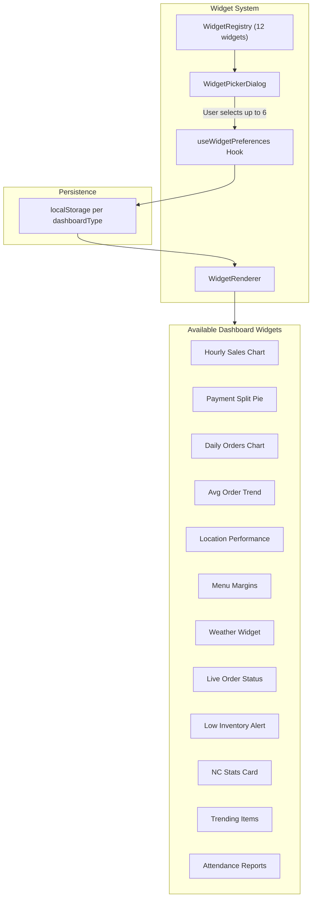
```mermaid
flowchart TD
    subgraph WidgetSystem["Widget System"]
        Registry["WidgetRegistry (12 widgets)"]
        Picker[WidgetPickerDialog]
        Renderer[WidgetRenderer]
        Prefs["useWidgetPreferences Hook"]
    end
    
    subgraph AvailableWidgets["Available Dashboard Widgets"]
        HourlySales[Hourly Sales Chart]
        PaymentSplit[Payment Split Pie]
        DailyOrders[Daily Orders Chart]
        AvgOrderTrend[Avg Order Trend]
        LocationPerf[Location Performance]
        MenuMargins[Menu Margins]
        Weather[Weather Widget]
        LiveOrders[Live Order Status]
        LowInventory[Low Inventory Alert]
        NCStats[NC Stats Card]
        TrendingItems[Trending Items]
        AttendanceRpt[Attendance Reports]
    end
    
    subgraph Storage["Persistence"]
        LocalStorage["localStorage per dashboardType"]
    end
    
    Registry --> Picker
    Picker -->|"User selects up to 6"| Prefs
    Prefs --> LocalStorage
    LocalStorage --> Renderer
    Renderer --> AvailableWidgets
```

---

## AI & Chatbot Integration

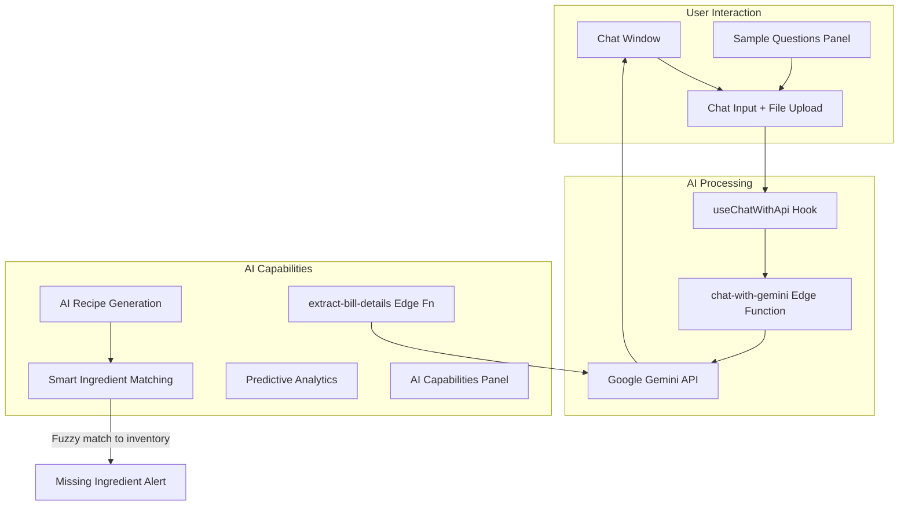
```mermaid
flowchart TD
    subgraph UserInteraction["User Interaction"]
        ChatWindow[Chat Window]
        ChatInput[Chat Input + File Upload]
        SampleQ[Sample Questions Panel]
    end
    
    subgraph Processing["AI Processing"]
        ChatAPI["useChatWithApi Hook"]
        GeminiEdge["chat-with-gemini Edge Function"]
        GeminiAPI[Google Gemini API]
    end
    
    subgraph AIFeatures["AI Capabilities"]
        RecipeGen[AI Recipe Generation]
        IngredientMatch[Smart Ingredient Matching]
        PredictiveAnalytics[Predictive Analytics]
        BillExtract["extract-bill-details Edge Fn"]
        AICaps[AI Capabilities Panel]
    end
    
    ChatWindow --> ChatInput
    SampleQ --> ChatInput
    ChatInput --> ChatAPI
    ChatAPI --> GeminiEdge
    GeminiEdge --> GeminiAPI
    GeminiAPI --> ChatWindow
    
    RecipeGen --> IngredientMatch
    IngredientMatch -->|"Fuzzy match to inventory"| MissingAlert[Missing Ingredient Alert]
    BillExtract --> GeminiAPI
```

---

## Non-Chargeable (NC) Order Flow

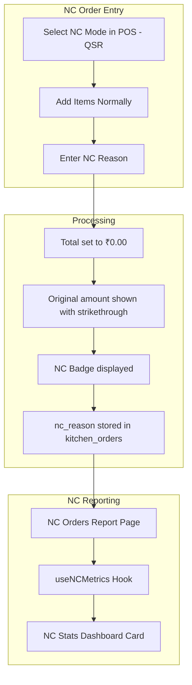
```mermaid
flowchart TD
    subgraph Entry["NC Order Entry"]
        SelectNC["Select NC Mode in POS - QSR"]
        AddItems[Add Items Normally]
        EnterReason[Enter NC Reason]
    end
    
    subgraph Processing["Processing"]
        ZeroTotal["Total set to ₹0.00"]
        OriginalStrike["Original amount shown with strikethrough"]
        NCBadge["NC Badge displayed"]
        StoreReason["nc_reason stored in kitchen_orders"]
    end
    
    subgraph Reporting["NC Reporting"]
        NCReport[NC Orders Report Page]
        NCMetrics["useNCMetrics Hook"]
        NCDashCard[NC Stats Dashboard Card]
    end
    
    SelectNC --> AddItems
    AddItems --> EnterReason
    EnterReason --> ZeroTotal
    ZeroTotal --> OriginalStrike
    OriginalStrike --> NCBadge
    NCBadge --> StoreReason
    
    StoreReason --> NCReport
    NCReport --> NCMetrics
    NCMetrics --> NCDashCard
```

---

## Night Audit Flow

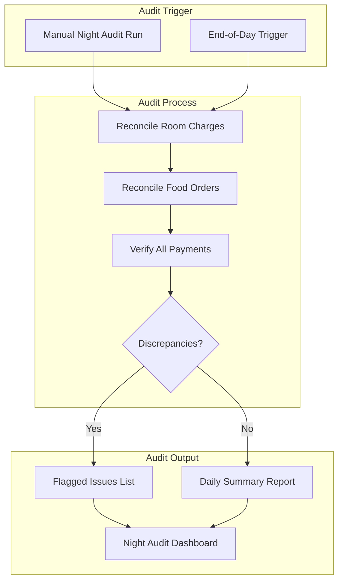
```mermaid
flowchart TD
    subgraph Trigger["Audit Trigger"]
        ManualRun[Manual Night Audit Run]
        ScheduledRun[End-of-Day Trigger]
    end
    
    subgraph AuditProcess["Audit Process"]
        ReconcileRooms[Reconcile Room Charges]
        ReconcileOrders[Reconcile Food Orders]
        VerifyPayments[Verify All Payments]
        CheckDiscrepancy{Discrepancies?}
    end
    
    subgraph Output["Audit Output"]
        AuditDashboard[Night Audit Dashboard]
        DailySummary[Daily Summary Report]
        FlagIssues[Flagged Issues List]
    end
    
    ManualRun --> ReconcileRooms
    ScheduledRun --> ReconcileRooms
    ReconcileRooms --> ReconcileOrders
    ReconcileOrders --> VerifyPayments
    VerifyPayments --> CheckDiscrepancy
    CheckDiscrepancy -->|Yes| FlagIssues
    CheckDiscrepancy -->|No| DailySummary
    FlagIssues --> AuditDashboard
    DailySummary --> AuditDashboard
```

---

## Platform Admin Panel

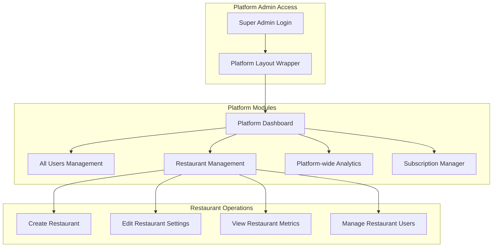
```mermaid
flowchart TD
    subgraph PlatformAccess["Platform Admin Access"]
        PlatformLogin[Super Admin Login]
        PlatformLayout[Platform Layout Wrapper]
    end
    
    subgraph PlatformModules["Platform Modules"]
        PlatformDash[Platform Dashboard]
        AllUsers[All Users Management]
        RestaurantMgmt[Restaurant Management]
        PlatformAnalytics[Platform-wide Analytics]
        SubManager[Subscription Manager]
    end
    
    subgraph RestaurantOps["Restaurant Operations"]
        CreateRest[Create Restaurant]
        EditRest[Edit Restaurant Settings]
        ViewMetrics[View Restaurant Metrics]
        ManageUsers[Manage Restaurant Users]
    end
    
    PlatformLogin --> PlatformLayout
    PlatformLayout --> PlatformDash
    PlatformDash --> AllUsers
    PlatformDash --> RestaurantMgmt
    PlatformDash --> PlatformAnalytics
    PlatformDash --> SubManager
    
    RestaurantMgmt --> CreateRest
    RestaurantMgmt --> EditRest
    RestaurantMgmt --> ViewMetrics
    RestaurantMgmt --> ManageUsers
```

---

## Revenue & Channel Management System (CMS)

The Channel Management System is a complete, production-grade OTA integration platform that acts as a centralized switchboard between the HMS and Online Travel Agencies. It supports two-way API integrations, pooled inventory, rate parity monitoring, and automated sync via pg_cron.

### CMS System Architecture

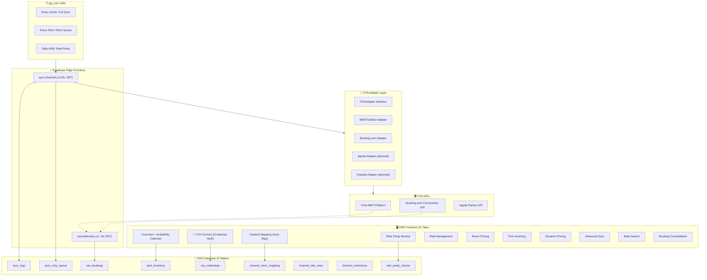
```mermaid
graph TB
    subgraph Frontend["🖥️ CMS Frontend (11 Tabs)"]
        Overview[Overview + Availability Calendar]
        OTAConnect["🔑 OTA Connect (Credential Vault)"]
        ChannelMapping["Channel Mapping (Auto-Map)"]
        RateParity["Rate Parity Monitor"]
        Rates[Rate Management]
        RoomPricing[Room Pricing]
        Inventory[Pool Inventory]
        Dynamic[Dynamic Pricing]
        Sync[Advanced Sync]
        Meta[Meta Search]
        Bookings[Booking Consolidation]
    end

    subgraph EdgeFunctions["⚡ Supabase Edge Functions"]
        SyncEngine["sync-channels (v125, JWT)"]
        WebhookReceiver["ota-webhooks (v1, No JWT)"]
    end

    subgraph Adapters["🔌 OTA Adapter Layer"]
        AdapterInterface["OTAAdapter Interface"]
        MMTAdapter["MMT/Goibibo Adapter"]
        BDCAdapter["Booking.com Adapter"]
        AgodaPlaceholder["Agoda Adapter (planned)"]
        ExpediaPlaceholder["Expedia Adapter (planned)"]
    end

    subgraph OTAAPIs["🌍 OTA APIs"]
        MMTAPI["InGo-MMT Platform"]
        BDCAPI["Booking.com Connectivity API"]
        AgodaAPI["Agoda Partner API"]
    end

    subgraph Database["💾 CMS Database (9 Tables)"]
        OTACreds[ota_credentials]
        ChannelRoomMap[channel_room_mapping]
        PoolInv[pool_inventory]
        SyncLogs[sync_logs]
        RetryQueue[sync_retry_queue]
        OTABookings[ota_bookings]
        RateRules[channel_rate_rules]
        Restrictions[channel_restrictions]
        ParityChecks[rate_parity_checks]
    end

    subgraph Automation["⏰ pg_cron Jobs"]
        AutoSync["Every 15min: Full Sync"]
        RetryProcessor["Every 5min: Retry Queue"]
        ParityCheck["Daily 6AM: Rate Parity"]
    end

    OTAConnect --> OTACreds
    ChannelMapping --> ChannelRoomMap
    Overview --> PoolInv
    RateParity --> ParityChecks

    SyncEngine --> Adapters
    WebhookReceiver --> OTABookings
    Adapters --> OTAAPIs

    MMTAPI -.-> WebhookReceiver
    BDCAPI -.-> WebhookReceiver

    Automation --> SyncEngine
    SyncEngine --> SyncLogs
    SyncEngine --> RetryQueue
```

---

### OTA Adapter Pattern

Every OTA integration implements the `OTAAdapter` interface, ensuring the sync engine is completely OTA-agnostic.

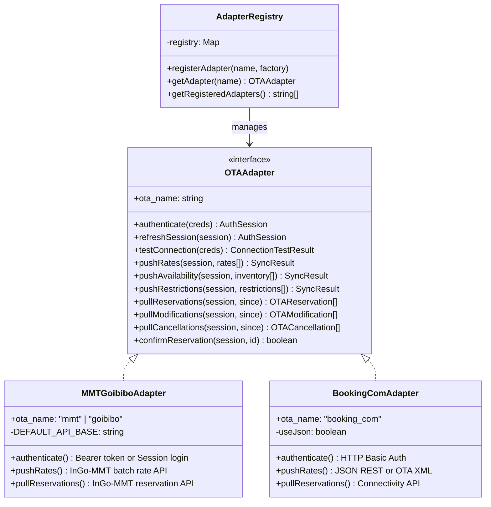
```mermaid
classDiagram
    class OTAAdapter {
        <<interface>>
        +ota_name: string
        +authenticate(creds) AuthSession
        +refreshSession(session) AuthSession
        +testConnection(creds) ConnectionTestResult
        +pushRates(session, rates[]) SyncResult
        +pushAvailability(session, inventory[]) SyncResult
        +pushRestrictions(session, restrictions[]) SyncResult
        +pullReservations(session, since) OTAReservation[]
        +pullModifications(session, since) OTAModification[]
        +pullCancellations(session, since) OTACancellation[]
        +confirmReservation(session, id) boolean
    }

    class MMTGoibiboAdapter {
        +ota_name: "mmt" | "goibibo"
        -DEFAULT_API_BASE: string
        +authenticate() Bearer token or Session login
        +pushRates() InGo-MMT batch rate API
        +pullReservations() InGo-MMT reservation API
    }

    class BookingComAdapter {
        +ota_name: "booking_com"
        -useJson: boolean
        +authenticate() HTTP Basic Auth
        +pushRates() JSON REST or OTA XML
        +pullReservations() Connectivity API
    }

    class AdapterRegistry {
        -registry: Map
        +registerAdapter(name, factory)
        +getAdapter(name) OTAAdapter
        +getRegisteredAdapters() string[]
    }

    OTAAdapter <|.. MMTGoibiboAdapter
    OTAAdapter <|.. BookingComAdapter
    AdapterRegistry --> OTAAdapter : manages
```

**Registered Adapters:**

| Alias | Adapter Class | Auth Type |
|-------|--------------|-----------|
| `mmt`, `makemytrip` | MMTGoibiboAdapter | Token / Session |
| `goibibo` | MMTGoibiboAdapter | Token / Session |
| `booking_com`, `booking.com`, `bookingcom` | BookingComAdapter | HTTP Basic Auth |

---

### Sync Engine — Full Sync Sequence

```mermaid
sequenceDiagram
    participant Cron as pg_cron (15min)
    participant Sync as sync-channels Edge Function
    participant DB as Supabase PostgreSQL
    participant Adapter as OTA Adapter
    participant OTA as OTA API

    Cron->>Sync: Invoke (restaurantId, syncType: all)

    Sync->>DB: Fetch active booking_channels
    Sync->>DB: Fetch ota_credentials (by channel_id)
    Sync->>DB: Fetch rooms + rate_plans
    Sync->>DB: Fetch channel_room_mapping
    Sync->>DB: Fetch channel_rate_rules
    Sync->>DB: Fetch pool_inventory (next 90 days)

    loop For each active channel
        Sync->>DB: INSERT sync_logs (status: started)
        Sync->>Adapter: getAdapter(ota_name)
        Sync->>Adapter: authenticate(credentials)
        Adapter->>OTA: Login / Token exchange
        OTA-->>Adapter: AuthSession

        Note over Sync: PUSH RATES
        Sync->>Sync: Apply rate_rules + commission offset
        Sync->>Adapter: pushRates(session, adjusted_rates)
        Adapter->>OTA: POST /rates/update
        OTA-->>Adapter: SyncResult

        Note over Sync: PUSH AVAILABILITY
        Sync->>Sync: Calculate available = total - buffer - blocked
        Sync->>Adapter: pushAvailability(session, inventory)
        Adapter->>OTA: POST /availability/update
        OTA-->>Adapter: SyncResult

        Note over Sync: PULL BOOKINGS
        Sync->>Adapter: pullReservations(session, since: lastSync)
        Adapter->>OTA: GET /reservations?since=...
        OTA-->>Adapter: OTAReservation[]
        Sync->>DB: UPSERT ota_bookings
        Note over DB: Trigger: trg_ota_booking_inventory
        DB->>DB: Decrement pool_inventory

        Sync->>Adapter: pullCancellations(session, since)
        Sync->>DB: UPDATE ota_bookings SET cancelled

        alt Any Failures
            Sync->>DB: INSERT sync_retry_queue (exponential backoff)
        end

        Sync->>DB: UPDATE sync_logs (status, records, duration)
        Sync->>DB: UPDATE booking_channels (last_sync)
    end
```

---

### Webhook Booking Flow (OTA → Your System)

```mermaid
flowchart TD
    subgraph OTAs["OTA Webhook Sources"]
        MMTHook["MakeMyTrip Webhook"]
        GIBHook["Goibibo Webhook"]
        BDCHook["Booking.com Notification"]
    end

    subgraph WebhookFn["ota-webhooks Edge Function"]
        ParseBody["Parse JSON / XML body"]
        ValidateSecret["Validate x-webhook-secret"]
        FindChannel["Find booking_channels match"]
        Normalize["normalizeBooking() per OTA"]
    end

    subgraph DBActions["Database Actions"]
        LogSync["INSERT sync_logs (inbound)"]
        UpsertBooking["UPSERT ota_bookings (idempotent)"]
        TriggerInv["DB Trigger: decrement pool_inventory"]
    end

    subgraph CrossChannel["Cross-Channel Update"]
        QueuePush["Queue availability_push for OTHER channels"]
        InvokeSync["Invoke sync-channels (availability only)"]
    end

    MMTHook --> ParseBody
    GIBHook --> ParseBody
    BDCHook --> ParseBody

    ParseBody --> ValidateSecret
    ValidateSecret --> FindChannel
    FindChannel --> Normalize
    Normalize --> LogSync
    LogSync --> UpsertBooking
    UpsertBooking --> TriggerInv

    TriggerInv --> QueuePush
    QueuePush --> InvokeSync

    style TriggerInv fill:#f59e0b,color:#000
    style QueuePush fill:#3b82f6,color:#fff
```

---

### Pooled Inventory Model

```mermaid
flowchart LR
    subgraph Central["Central Pool (pool_inventory table)"]
        Room1["Deluxe Room: 5 total"]
        Room2["Standard Room: 10 total"]
    end

    subgraph Channels["OTA Channels"]
        MMT["MakeMyTrip: sees 4 available"]
        BDC["Booking.com: sees 4 available"]
        Agoda["Agoda: sees 4 available"]
        Direct["Direct Website: sees 5"]
    end

    subgraph Events["Booking Events"]
        BookMMT["Guest books on MMT"]
        DecPool["pool_inventory -= 1"]
        PushAll["Push updated count to ALL"]
    end

    Room1 --> MMT
    Room1 --> BDC
    Room1 --> Agoda
    Room1 --> Direct

    BookMMT --> DecPool
    DecPool --> |"Now 4 total, 3 available"| PushAll
    PushAll --> MMT
    PushAll --> BDC
    PushAll --> Agoda

    style DecPool fill:#ef4444,color:#fff
    style PushAll fill:#22c55e,color:#fff
```

**Key Rule:** `available_count = total_count - booked_count - blocked_count - buffer_count`

---

### Channel Mapping UI Flow

```mermaid
flowchart TD
    subgraph UserAction["User Actions"]
        AutoMap["Quick Auto-Map (1-click)"]
        ManualMap["Manual Map Room Dialog"]
    end

    subgraph MappingData["Mapping Record"]
        HMSRoom["HMS Room: Dhanvantari (local ID)"]
        Arrow["→ maps to →"]
        OTARoom["OTA Room Type ID: 12345"]
        RatePlan["OTA Rate Plan ID: BAR"]
    end

    subgraph SyncReady["Ready for Sync"]
        PushRates["Push base_rate + rules to OTA ID 12345"]
        PushAvail["Push pool_inventory to OTA ID 12345"]
        PullBook["Pull bookings for OTA ID 12345"]
    end

    AutoMap --> |"Creates mapping for ALL unmapped rooms"| MappingData
    ManualMap --> |"User enters OTA room ID"| MappingData

    MappingData --> SyncReady
```

---

### Rate Parity Monitoring

```mermaid
flowchart TD
    subgraph BaseRates["Your Base Rates"]
        Deluxe["Deluxe: ₹3,000"]
        Standard["Standard: ₹1,500"]
    end

    subgraph Rules["Channel Rate Rules"]
        Markup["MMT: +15% markup"]
        Commission["BDC: +12% commission offset"]
        RoundTo["Round to ₹100"]
    end

    subgraph EffectiveRates["Effective Selling Prices"]
        MMTRate["MMT: ₹3,450"]
        BDCRate["BDC: ₹3,360"]
        DirectRate["Direct: ₹3,000"]
    end

    subgraph ParityStatus["Parity Status"]
        InParity["✅ In Parity (less than 1% diff)"]
        OutParity["⚠️ Out of Parity (greater than 1%)"]
        Critical["🔴 Critical (greater than 10%)"]
    end

    Deluxe --> Rules
    Rules --> EffectiveRates
    EffectiveRates --> ParityStatus

    style InParity fill:#22c55e,color:#fff
    style OutParity fill:#f59e0b,color:#000
    style Critical fill:#ef4444,color:#fff
```

**Daily Parity Check (pg_cron at 6 AM):** Automatically inserts records into `rate_parity_checks` comparing base rates against channel-adjusted rates.

---

### CMS Database Schema (ERD)

```mermaid
erDiagram
    ota_credentials {
        uuid id PK
        uuid restaurant_id FK
        uuid channel_id FK
        text ota_name
        text username
        text password_encrypted
        text access_token
        text auth_type
        jsonb extra_config
        boolean is_active
    }

    channel_room_mapping {
        uuid id PK
        uuid restaurant_id FK
        uuid channel_id FK
        text hms_room_type
        uuid hms_room_type_id FK
        text ota_room_type_id
        text ota_rate_plan_id
        text ota_room_name
        boolean is_active
    }

    pool_inventory {
        uuid id PK
        uuid restaurant_id FK
        text room_type
        date date
        int total_count
        int available_count
        int booked_count
        int blocked_count
        int buffer_count
    }

    sync_logs {
        uuid id PK
        uuid restaurant_id FK
        uuid channel_id FK
        text sync_type
        text direction
        text status
        int records_processed
        int records_failed
        jsonb request_payload
        jsonb response_payload
        int duration_ms
        text triggered_by
    }

    ota_bookings {
        uuid id PK
        uuid restaurant_id FK
        uuid channel_id FK
        text ota_booking_id UK
        text ota_name
        text guest_name
        date check_in
        date check_out
        text room_type
        numeric total_amount
        numeric commission_amount
        text booking_status
        jsonb raw_payload
    }

    channel_rate_rules {
        uuid id PK
        uuid restaurant_id FK
        uuid channel_id FK
        text rule_type
        numeric value
        boolean is_percentage
        numeric min_price
        numeric max_price
        int priority
    }

    rate_parity_checks {
        uuid id PK
        uuid restaurant_id FK
        uuid channel_id FK
        text room_type
        numeric base_rate
        numeric ota_rate
        text parity_status
        timestamp checked_at
    }

    sync_retry_queue {
        uuid id PK
        uuid restaurant_id FK
        uuid channel_id FK
        text sync_type
        jsonb payload
        int retry_count
        text status
        timestamp next_retry_at
    }

    channel_restrictions {
        uuid id PK
        uuid restaurant_id FK
        uuid channel_id FK
        text room_type
        date date
        text restriction_type
        text value
    }

    ota_credentials ||--o{ sync_logs : "logs syncs"
    ota_credentials ||--o{ ota_bookings : "receives bookings"
    channel_room_mapping ||--o{ pool_inventory : "maps inventory"
    pool_inventory ||--o{ ota_bookings : "decremented by"
    sync_logs ||--o{ sync_retry_queue : "retries from"
    channel_rate_rules ||--o{ rate_parity_checks : "checked against"
```

---

### CMS File Reference

| Category | File | Description |
|----------|------|-------------|
| **Edge Functions** | `sync-channels/index.ts` | Full sync engine — pushes ARI, pulls bookings, logs everything |
| **Edge Functions** | `ota-webhooks/index.ts` | Webhook receiver — normalizes OTA bookings, triggers cross-channel sync |
| **Shared Types** | `_shared/ota-adapter-types.ts` | OTAAdapter interface, types, adapter registry |
| **Adapters** | `_shared/adapters/mmt-goibibo-adapter.ts` | MMT/Goibibo adapter (InGo-MMT platform) |
| **Adapters** | `_shared/adapters/booking-com-adapter.ts` | Booking.com adapter (JSON + XML) |
| **UI — Dashboard** | `ChannelManagementDashboard.tsx` | Main CMS dashboard with 11 tabs |
| **UI — Credentials** | `OTACredentialManager.tsx` | Secure OTA credential vault (5 OTA presets) |
| **UI — Calendar** | `RoomInventoryCalendar.tsx` | Asiatech-style availability grid + click-to-book |
| **UI — Mapping** | `ChannelMappingManager.tsx` | Channel room mapping with auto-map |
| **UI — Parity** | `RateParityDashboard.tsx` | Rate parity score + channel comparison |
| **Hook** | `useOTACredentials.tsx` | CRUD for OTA credentials + sync logs |
| **Migration** | `20260322_channel_management_system.sql` | 9 tables, indexes, triggers, RLS |

### pg_cron Scheduled Jobs

| Job Name | Schedule | Description |
|----------|----------|-------------|
| `channel-auto-sync-15min` | `*/15 * * * *` | Full ARI sync: push rates + availability, pull bookings |
| `retry-queue-processor-5min` | `*/5 * * * *` | Process failed syncs with exponential backoff (max 10 retries) |
| `rate-parity-check-daily` | `0 6 * * *` | Compare base rates vs channel-adjusted rates, log to rate_parity_checks |

---

## Landing Website & Public Pages

```mermaid
flowchart TD
    subgraph LandingPage["Landing Website"]
        NavHeader[Navigation Header]
        Hero[Hero Section]
        Features[Features Section]
        HowItWorks[How It Works Section]
        About[About Section]
        WhyChoose[Why Choose Us Section]
        Portfolio[Portfolio Section]
        Pricing[Pricing Section]
        Testimonials[Testimonials Section]
        FAQ[FAQ Section]
        CTA[CTA Section]
        Footer[Footer Section]
    end
    
    subgraph PublicPages["Public Pages"]
        PublicBill[Public Bill Viewer]
        PublicEnroll[Customer Enrollment]
        PublicTruck[Food Truck Public Page]
        CustomerOrderPage[Customer Self-Order]
        PrivacyPolicy[Privacy Policy]
        DeleteAccount[Delete Account]
    end
    
    NavHeader --> Hero
    Hero --> Features
    Features --> HowItWorks
    HowItWorks --> About
    About --> WhyChoose
    WhyChoose --> Portfolio
    Portfolio --> Pricing
    Pricing --> Testimonials
    Testimonials --> FAQ
    FAQ --> CTA
    CTA --> Footer
```

---

## Security & Compliance

```mermaid
flowchart TD
    subgraph SecurityModules["Security Modules"]
        AuditTrail[Audit Trail]
        BackupRecovery["Backup and Recovery"]
        GDPRComp[GDPR Compliance]
    end
    
    subgraph AuditFeatures["Audit Trail Features"]
        LogActions[Log All User Actions]
        ViewHistory[View Action History]
        FilterByUser["Filter by User - Date - Action"]
    end
    
    subgraph BackupFeatures["Backup Features"]
        ManualBackup[Manual Backup to Google Drive]
        ScheduledBackup[Scheduled Backups]
        RestoreData[Restore from Backup]
    end
    
    subgraph GDPRFeatures["GDPR Features"]
        DataExport[Customer Data Export]
        DataDeletion[Right to Deletion]
        ConsentMgmt[Consent Management]
    end
    
    AuditTrail --> AuditFeatures
    BackupRecovery --> BackupFeatures
    GDPRComp --> GDPRFeatures
    
    BackupFeatures -->|"google-drive-upload"| GDrive[Google Drive Storage]
```

---

## Real-time Subscriptions

```mermaid
flowchart LR
    subgraph Tables["Database Tables"]
        OrdersTable[(orders)]
        KitchenTable[(kitchen_orders)]
        ReservationsTable[(reservations)]
        InventoryTable[(inventory)]
        RoomsTable[(rooms)]
    end
    
    subgraph Supabase["Supabase Realtime"]
        Channel1[orders channel]
        Channel2[kitchen_orders channel]
        Channel3[reservations channel]
        Channel4[inventory channel]
        Channel5[rooms channel]
    end
    
    subgraph Hooks["React Hooks"]
        useRealtimeAnalytics[useRealtimeAnalytics]
        useLiveActivity[useRealTimeBusinessData]
        useRealtimeSub[useRealtimeSubscription]
        useSpeech[useSpeechAnnouncement]
    end
    
    subgraph Components["UI Components"]
        LiveActivity[LiveActivity]
        KitchenDisplay[KitchenDisplay]
        OrdersList[OrdersList]
        Dashboard[Dashboard Stats]
        FoodTruckDash[FoodTruck Dashboard]
    end
    
    OrdersTable --> Channel1
    KitchenTable --> Channel2
    ReservationsTable --> Channel3
    InventoryTable --> Channel4
    RoomsTable --> Channel5
    
    Channel1 --> useRealtimeAnalytics
    Channel2 --> useRealtimeAnalytics
    Channel1 --> useLiveActivity
    
    useRealtimeAnalytics --> Dashboard
    useLiveActivity --> LiveActivity
    useRealtimeSub --> KitchenDisplay
    useRealtimeSub --> OrdersList
    useSpeech --> KitchenDisplay
    
    Channel1 --> FoodTruckDash
```

---

## Edge Function Architecture

```mermaid
graph TB
    subgraph Client["Client Requests"]
        WebApp[Web Application]
        ExtWebhook[External Webhooks]
        QRScan[QR Code Scans]
        CustomerApp[Customer Self-Service]
    end

    subgraph AI_Fns["AI Functions"]
        ChatGemini[chat-with-gemini]
        ExtractBill[extract-bill-details]
    end

    subgraph Messaging["Messaging Functions"]
        SendWhatsApp[send-whatsapp]
        SendWhatsAppBill[send-whatsapp-bill]
        SendWhatsAppCloud[send-whatsapp-cloud]
        SendMSG91[send-msg91-whatsapp]
        SendEmail[send-email]
        SendEmailBill[send-email-bill]
        ResConfirm[send-reservation-confirmation]
        ResReminder[send-reservation-reminder]
        SendPONotify[send-purchase-order-notification]
    end

    subgraph InvFn["Inventory Functions"]
        CheckLowStock[check-low-stock]
        DeductInventory[deduct-inventory-on-prep]
    end

    subgraph StaffFn["Staff Functions"]
        ClockEntry[record-clock-entry]
        MissedClocks[check-missed-clocks]
        AutoClockOut[auto-clock-out]
    end

    subgraph PayFn["Payment Functions"]
        CreatePaymentQR[create-payment-qr]
        CreatePaytmQR[create-paytm-qr]
        CheckPaytmStatus[check-paytm-status]
        PaytmWebhook[paytm-webhook]
    end

    subgraph CustomerFn["Customer and QR Functions"]
        SubmitQROrder[submit-qr-order]
        CustomerMenuAPI[customer-menu-api]
        EnrollCustomer[enroll-customer]
        FindReservation[find-active-reservation]
        GenerateQR[generate-qr-code]
        WhatsAppWebhook[whatsapp-webhook]
    end

    subgraph AdminFn["Admin Functions"]
        RoleMgmt[role-management]
        UserMgmt[user-management]
        GetComponents[get-user-components]
        MigrateRoles[migrate-roles-data]
        Backup[backup-restore]
    end

    subgraph UtilFn["Utility Functions"]
        ValidatePromo[validate-promo-code]
        LogPromo[log-promotion-usage]
        Upload[upload-image]
        FreeImg[freeimage-upload]
        SyncChannels[sync-channels]
        GDriveUpload[google-drive-upload]
    end

    subgraph External_Services["External Services"]
        Gemini[Google Gemini]
        MSG91API[MSG91 API]
        WhatsAppCloudAPI[WhatsApp Cloud API]
        EmailSvc[Email Service]
        FreeImage[FreeImage.host]
        GDrive[Google Drive]
        PaytmGW[Paytm Gateway]
    end

    WebApp --> AI_Fns
    WebApp --> Messaging
    WebApp --> InvFn
    WebApp --> StaffFn
    WebApp --> PayFn
    WebApp --> AdminFn
    WebApp --> UtilFn
    ExtWebhook --> PaytmWebhook
    ExtWebhook --> WhatsAppWebhook
    QRScan --> SubmitQROrder
    QRScan --> CustomerMenuAPI
    CustomerApp --> EnrollCustomer

    ChatGemini --> Gemini
    ExtractBill --> Gemini
    SendWhatsApp --> MSG91API
    SendMSG91 --> MSG91API
    SendWhatsAppCloud --> WhatsAppCloudAPI
    SendEmail --> EmailSvc
    SendEmailBill --> EmailSvc
    Upload --> FreeImage
    Backup --> GDrive
    GDriveUpload --> GDrive
    CreatePaytmQR --> PaytmGW
    CheckPaytmStatus --> PaytmGW
```

---

## Component Hierarchy

```mermaid
graph TD
    App[App.tsx]
    
    App --> ThemeProvider
    ThemeProvider --> AuthProvider
    AuthProvider --> AccessProvider
    AccessProvider --> Router
    
    Router --> AppRoutes
    
    AppRoutes --> Sidebar[ImprovedSidebarNavigation]
    AppRoutes --> MainContent[Main Content Area]
    AppRoutes --> MobileNav[MobileNavigation]
    
    MainContent --> PermissionGuard
    PermissionGuard --> Pages
    
    subgraph Pages["46 Page Components"]
        Index["Index - Dashboard"]
        Orders[Orders]
        POS[POS]
        QSRPos[QSR POS]
        QuickServePOS[QuickServe POS]
        Kitchen[Kitchen]
        Menu[Menu]
        Inventory[Inventory]
        Analytics[Analytics]
        Settings[Settings]
        CustomerOrder[Customer Order]
        NCOrders[NC Orders]
        Security[Security]
        ShiftMgmt[Shift Management]
        PlatformPages[Platform Admin Pages]
        PublicPages[Public Pages]
    end

    subgraph DashboardComponents["Dashboard Components"]
        Stats[Stats]
        LiveActivity[LiveOrderStatus]
        WeeklySalesChart[WeeklySalesChart]
        QuickStats[QuickStats]
        CustomDash[CustomizableDashboard]
        WidgetPicker[WidgetPickerDialog]
        WidgetRenderer[WidgetRenderer]
        FoodTruckDash[FoodTruckDashboard]
        PredictiveAI[PredictiveAnalytics]
    end

    subgraph OrderComponents["45 Order Components"]
        ActiveOrdersList[ActiveOrdersList]
        OrderDetailsDialog[OrderDetailsDialog]
        OrderFilters[OrderFilters]
        PaymentDialog[PaymentDialog]
        BillSharing[Bill Sharing]
    end

    subgraph QSRComponents["14 QSR Components"]
        QSRPosMain[QSRPosMain]
        QSRMenuGrid[QSRMenuGrid]
        QSROrderPad[QSROrderPad]
        QSRCartSheet[QSRCartBottomSheet]
        QSRActiveDrawer[QSRActiveOrdersDrawer]
        QSRPastDrawer[QSRPastOrdersDrawer]
    end

    Index --> DashboardComponents
    Orders --> OrderComponents
    QSRPos --> QSRComponents
```

---

## Database Entity Relationships

```mermaid
erDiagram
    RESTAURANTS ||--o{ USERS : has
    RESTAURANTS ||--o{ MENU_ITEMS : has
    RESTAURANTS ||--o{ ORDERS : has
    RESTAURANTS ||--o{ TABLES : has
    RESTAURANTS ||--o{ ROOMS : has
    RESTAURANTS ||--o{ INVENTORY : has
    RESTAURANTS ||--o{ STAFF : has
    RESTAURANTS ||--o{ CUSTOMERS : has
    
    USERS ||--o{ ORDERS : creates
    USERS }|--|| ROLES : has
    ROLES ||--o{ ROLE_COMPONENTS : has
    
    MENU_ITEMS ||--o{ ORDER_ITEMS : contains
    MENU_ITEMS }|--|| CATEGORIES : belongs_to
    MENU_ITEMS ||--o{ RECIPE_INGREDIENTS : has
    
    ORDERS ||--o{ ORDER_ITEMS : contains
    ORDERS ||--o{ PAYMENTS : has
    ORDERS ||--o{ KITCHEN_ORDERS : generates
    ORDERS }|--o| TABLES : assigned_to
    ORDERS }|--o| CUSTOMERS : belongs_to
    
    KITCHEN_ORDERS {
        uuid id PK
        uuid order_id FK
        string status
        string nc_reason
        timestamp created_at
    }
    
    TABLES ||--o{ RESERVATIONS : has
    CUSTOMERS ||--o{ RESERVATIONS : makes
    
    ROOMS ||--o{ ROOM_BOOKINGS : has
    ROOMS ||--o{ HOUSEKEEPING_TASKS : has
    ROOMS ||--o{ NIGHT_AUDIT_ENTRIES : audited_in
    
    INVENTORY ||--o{ INVENTORY_TRANSACTIONS : has
    INVENTORY }|--o| SUPPLIERS : supplied_by
    
    SUPPLIERS ||--o{ PURCHASE_ORDERS : receives
    
    CUSTOMERS ||--o{ LOYALTY_POINTS : earns
    CUSTOMERS ||--o{ MARKETING_CAMPAIGNS : receives
    
    RESTAURANTS {
        uuid id PK
        string name
        string address
        string phone
        string email
    }
    
    USERS {
        uuid id PK
        uuid restaurant_id FK
        string email
        string role
        uuid role_id FK
    }
    
    ORDERS {
        uuid id PK
        uuid restaurant_id FK
        uuid user_id FK
        uuid customer_id FK
        uuid table_id FK
        string status
        string order_type
        decimal total
        boolean is_nc
    }
    
    MENU_ITEMS {
        uuid id PK
        uuid restaurant_id FK
        uuid category_id FK
        string name
        decimal price
        boolean is_available
    }
    
    INVENTORY {
        uuid id PK
        uuid restaurant_id FK
        string name
        decimal quantity
        decimal min_quantity
        string unit
    }
```

---

## RBAC Permission Matrix

```mermaid
graph TB
    subgraph Roles["User Roles"]
        Owner[Owner]
        Admin[Admin]
        Manager[Manager]
        Chef[Chef]
        Waiter[Waiter]
        Staff[Staff]
        Viewer[Viewer]
        Custom[Custom Role]
    end
    
    subgraph FullAccess["Full Access - 50+ permissions"]
        All[All Permissions]
    end
    
    subgraph OperationalAccess["Operational Access"]
        OpPerms["Orders, Menu, Inventory, Staff, Customers, Rooms, Tables, Kitchen, Housekeeping, Analytics view"]
    end
    
    subgraph KitchenAccess["Kitchen Access"]
        KitchenPerms["Orders view/create/update, Menu CRUD, Inventory CRUD, Kitchen view/update"]
    end
    
    subgraph FOHAccess["Front-of-House Access"]
        FOHPerms["Dashboard, Orders, Kitchen view, Menu view, Tables, Rooms checkout, Reservations, Housekeeping view"]
    end
    
    subgraph BasicAccess["Basic Access"]
        BasicPerms["Orders, Menu view, Inventory, Kitchen view, Tables, Reservations"]
    end
    
    subgraph ViewOnly["View Only"]
        ViewPerms[Dashboard view only]
    end
    
    subgraph CustomAccess["Custom Access"]
        CustomPerms["Per-component granular permissions via role_components table"]
    end
    
    Owner --> All
    Admin --> All
    Manager --> OpPerms
    Chef --> KitchenPerms
    Waiter --> FOHPerms
    Staff --> BasicPerms
    Viewer --> ViewPerms
    Custom --> CustomPerms
```

---

## File Structure Reference

```
src/
├── App.tsx                     # Main app with providers
├── main.tsx                    # Entry point
├── components/
│   ├── AI/                     # 2 AI capability components
│   ├── Admin/                  # 6 admin panel components
│   ├── Analytics/              # 26 analytics components
│   ├── Auth/                   # 14 auth components
│   ├── Branding/               # 1 branding component
│   ├── CRM/                    # 9 customer relationship components
│   ├── Chatbot/                # 5 AI chatbot components
│   ├── CustomerOrder/          # 4 customer self-order components
│   ├── Customers/              # 1 customer component
│   ├── Dashboard/              # 29 dashboard components + 10 widgets
│   │   └── widgets/            # 10 customizable widget components
│   ├── Email/                  # 1 email component
│   ├── Expenses/               # 5 expense components
│   ├── Financial/              # 18 financial components
│   ├── GuestExperience/        # 1 guest experience component
│   ├── Guests/                 # 3 guest management components
│   ├── Help/                   # 4 contextual help guides
│   ├── Housekeeping/           # 13 housekeeping components
│   ├── Inventory/              # 9 inventory components
│   ├── Kitchen/                # 4 KDS components
│   ├── Landing/                # 12 landing website components
│   ├── Layout/                 # 11 layout components
│   ├── LostFound/              # 3 lost & found components
│   ├── Marketing/              # 6 marketing components
│   ├── Menu/                   # 2 menu components
│   ├── NC/                     # 1 NC orders report component
│   ├── NightAudit/             # 2 night audit components
│   ├── Notifications/          # 1 notification component
│   ├── Orders/                 # 45 order components
│   ├── Promotions/             # 1 promotions component
│   ├── QR/                     # 1 QR code management component
│   ├── QSR/                    # 14 QSR POS components
│   ├── QuickServe/             # 8 QuickServe POS components
│   ├── Recipes/                # 4 recipe components
│   ├── Reporting/              # 5 report components
│   ├── Reports/                # 1 report component
│   ├── Reservations/           # 5 reservation components
│   ├── Revenue/                # 17 revenue & channel management components
│   ├── RoleManagement/         # 4 role management components
│   ├── Rooms/                  # 51 room management components
│   ├── Security/               # 3 security & compliance components
│   ├── Settings/               # 5 settings tabs
│   ├── Shared/                 # 3 shared utility components
│   ├── Staff/                  # 21 staff components
│   ├── Tables/                 # 4 table components
│   ├── UserManagement/         # 5 user management components
│   └── ui/                     # 77 Shadcn UI components
├── hooks/                      # 69 custom hooks
├── pages/                      # 46 page components
│   └── Platform/               # 7 super-admin platform pages
├── types/                      # TypeScript definitions
├── contexts/                   # React contexts
├── integrations/               # Supabase client
└── tests/                      # Test suite

supabase/
└── functions/                  # 38 Edge Functions
    ├── _shared/                # Shared utilities (CORS headers, etc.)
    ├── AI: chat-with-gemini, extract-bill-details
    ├── Messaging: send-whatsapp, send-whatsapp-bill, send-whatsapp-cloud,
    │             send-msg91-whatsapp, send-email, send-email-bill,
    │             send-reservation-confirmation, send-reservation-reminder,
    │             send-purchase-order-notification
    ├── Inventory: check-low-stock, deduct-inventory-on-prep
    ├── Staff: record-clock-entry, check-missed-clocks, auto-clock-out
    ├── Payments: create-payment-qr, create-paytm-qr, check-paytm-status, paytm-webhook
    ├── Customer: submit-qr-order, customer-menu-api, enroll-customer,
    │            find-active-reservation, generate-qr-code, whatsapp-webhook
    ├── Admin: role-management, user-management, get-user-components,
    │         migrate-roles-data, backup-restore
    └── Utils: validate-promo-code, log-promotion-usage, upload-image,
              freeimage-upload, sync-channels, google-drive-upload
```

---

## Quick Commands

```bash
# Development
npm run dev              # Start dev server
npm test                 # Run tests
npm test -- --coverage   # Test with coverage
npm run build            # Production build
npx tsc --noEmit         # Type check
npm run lint             # Lint code
```

---

*Last Updated: February 2026*
