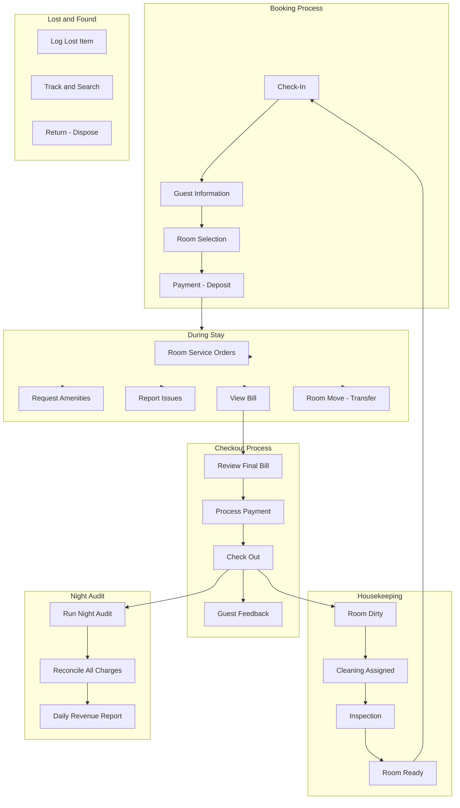

# 🏗️ Developer Architecture Guide

> **⚠️ LOCAL-ONLY DOCUMENTATION**  
> This file is gitignored and for developer reference only. Do not commit to version control.

---

## Table of Contents

1. [System Architecture](#system-architecture)
2. [Application Flow](#application-flow)
3. [Module Dependencies](#module-dependencies)
4. [Data Flow Architecture](#data-flow-architecture)
5. [Authentication & Authorization Flow](#authentication--authorization-flow)
6. [Order Processing Flow](#order-processing-flow)
7. [Kitchen Display System Flow](#kitchen-display-system-flow)
8. [QSR POS Flow](#qsr-pos-flow)
9. [QR Ordering & Customer Self-Service Flow](#qr-ordering--customer-self-service-flow)
10. [Reservation System Flow](#reservation-system-flow)
11. [Room Management Flow](#room-management-flow)
12. [Inventory Management Flow](#inventory-management-flow)
13. [Payment Processing Flow](#payment-processing-flow)
14. [Customizable Dashboard & Widget System](#customizable-dashboard--widget-system)
15. [AI & Chatbot Integration](#ai--chatbot-integration)
16. [Non-Chargeable (NC) Order Flow](#non-chargeable-nc-order-flow)
17. [Night Audit Flow](#night-audit-flow)
18. [Platform Admin Panel](#platform-admin-panel)
19. [Revenue & Channel Management Flow](#revenue--channel-management-flow)
20. [Landing Website & Public Pages](#landing-website--public-pages)
21. [Security & Compliance](#security--compliance)
22. [Real-time Subscriptions](#real-time-subscriptions)
23. [Edge Function Architecture](#edge-function-architecture)
24. [Component Hierarchy](#component-hierarchy)
25. [Database Entity Relationships](#database-entity-relationships)
26. [RBAC Permission Matrix](#rbac-permission-matrix)
27. [File Structure Reference](#file-structure-reference)
28. [Quick Commands](#quick-commands)

---

## System Architecture


---

## Application Flow


---

## Module Dependencies


---

## Data Flow Architecture


---

## Authentication & Authorization Flow


---

## Order Processing Flow


---

## Kitchen Display System Flow

```mermaid
flowchart LR
    subgraph POS["POS Systems"]
        CreateOrder[Create Order]
        SubmitOrder[Submit to Kitchen]
        QSRSubmit[QSR POS Submit]
        QSSubmit[QuickServe Submit]
    end
    
    subgraph Kitchen["Kitchen Display"]
        NewOrders["🔴 New Orders"]
        Preparing["🟡 Preparing"]
        Ready["🟢 Ready"]
    end
    
    subgraph Actions["Actions"]
        Accept[Accept Order]
        StartPrep[Start Preparing]
        MarkReady[Mark Ready]
        Serve[Served]
    end
    
    subgraph Notifications["Notifications"]
        Sound[Audio Alert]
        Speech[Speech Announcement]
        Visual[Visual Badge]
        Realtime[Realtime Update]
    end
    
    CreateOrder --> SubmitOrder
    QSRSubmit --> SubmitOrder
    QSSubmit --> SubmitOrder
    SubmitOrder --> Realtime
    Realtime --> NewOrders
    Realtime --> Sound
    Realtime --> Speech
    Realtime --> Visual
    
    NewOrders --> Accept
    Accept --> StartPrep
    StartPrep --> Preparing
    Preparing --> MarkReady
    MarkReady --> Ready
    Ready --> Serve
```



---

## QSR POS Flow


---

## QR Ordering & Customer Self-Service Flow


---

## Reservation System Flow


---

## Room Management Flow



---

## Inventory Management Flow


---

## Payment Processing Flow


---

## Customizable Dashboard & Widget System


---

## AI & Chatbot Integration


---

## Non-Chargeable (NC) Order Flow

```mermaid
flowchart TD
    subgraph Entry["NC Order Entry"]
        SelectNC["Select NC Mode in POS - QSR"]
        AddItems[Add Items Normally]
        EnterReason[Enter NC Reason]
    end
    
    subgraph Processing["Processing"]
        ZeroTotal["Total set to ₹0.00"]
        OriginalStrike["Original amount shown with strikethrough"]
        NCBadge["NC Badge displayed"]
        StoreReason["nc_reason stored in kitchen_orders"]
    end
    
    subgraph Reporting["NC Reporting"]
        NCReport[NC Orders Report Page]
        NCMetrics["useNCMetrics Hook"]
        NCDashCard[NC Stats Dashboard Card]
    end
    
    SelectNC --> AddItems
    AddItems --> EnterReason
    EnterReason --> ZeroTotal
    ZeroTotal --> OriginalStrike
    OriginalStrike --> NCBadge
    NCBadge --> StoreReason
    
    StoreReason --> NCReport
    NCReport --> NCMetrics
    NCMetrics --> NCDashCard
```



---

## Night Audit Flow


---

## Platform Admin Panel


---

## Revenue & Channel Management Flow


---

## Landing Website & Public Pages


---

## Security & Compliance

```mermaid
flowchart TD
    subgraph SecurityModules["Security Modules"]
        AuditTrail[Audit Trail]
        BackupRecovery["Backup and Recovery"]
        GDPRComp[GDPR Compliance]
    end
    
    subgraph AuditFeatures["Audit Trail Features"]
        LogActions[Log All User Actions]
        ViewHistory[View Action History]
        FilterByUser["Filter by User - Date - Action"]
    end
    
    subgraph BackupFeatures["Backup Features"]
        ManualBackup[Manual Backup to Google Drive]
        ScheduledBackup[Scheduled Backups]
        RestoreData[Restore from Backup]
    end
    
    subgraph GDPRFeatures["GDPR Features"]
        DataExport[Customer Data Export]
        DataDeletion[Right to Deletion]
        ConsentMgmt[Consent Management]
    end
    
    AuditTrail --> AuditFeatures
    BackupRecovery --> BackupFeatures
    GDPRComp --> GDPRFeatures
    
    BackupFeatures -->|"google-drive-upload"| GDrive[Google Drive Storage]
```

---

## Real-time Subscriptions

```mermaid
flowchart LR
    subgraph Tables["Database Tables"]
        OrdersTable[(orders)]
        KitchenTable[(kitchen_orders)]
        ReservationsTable[(reservations)]
        InventoryTable[(inventory)]
        RoomsTable[(rooms)]
    end
    
    subgraph Supabase["Supabase Realtime"]
        Channel1[orders channel]
        Channel2[kitchen_orders channel]
        Channel3[reservations channel]
        Channel4[inventory channel]
        Channel5[rooms channel]
    end
    
    subgraph Hooks["React Hooks"]
        useRealtimeAnalytics[useRealtimeAnalytics]
        useLiveActivity[useRealTimeBusinessData]
        useRealtimeSub[useRealtimeSubscription]
        useSpeech[useSpeechAnnouncement]
    end
    
    subgraph Components["UI Components"]
        LiveActivity[LiveActivity]
        KitchenDisplay[KitchenDisplay]
        OrdersList[OrdersList]
        Dashboard[Dashboard Stats]
        FoodTruckDash[FoodTruck Dashboard]
    end
    
    OrdersTable --> Channel1
    KitchenTable --> Channel2
    ReservationsTable --> Channel3
    InventoryTable --> Channel4
    RoomsTable --> Channel5
    
    Channel1 --> useRealtimeAnalytics
    Channel2 --> useRealtimeAnalytics
    Channel1 --> useLiveActivity
    
    useRealtimeAnalytics --> Dashboard
    useLiveActivity --> LiveActivity
    useRealtimeSub --> KitchenDisplay
    useRealtimeSub --> OrdersList
    useSpeech --> KitchenDisplay
    
    Channel1 --> FoodTruckDash
```

---

## Edge Function Architecture

```mermaid
graph TB
    subgraph Client["Client Requests"]
        WebApp[Web Application]
        ExtWebhook[External Webhooks]
        QRScan[QR Code Scans]
        CustomerApp[Customer Self-Service]
    end

    subgraph AI_Fns["AI Functions"]
        ChatGemini[chat-with-gemini]
        ExtractBill[extract-bill-details]
    end

    subgraph Messaging["Messaging Functions"]
        SendWhatsApp[send-whatsapp]
        SendWhatsAppBill[send-whatsapp-bill]
        SendWhatsAppCloud[send-whatsapp-cloud]
        SendMSG91[send-msg91-whatsapp]
        SendEmail[send-email]
        SendEmailBill[send-email-bill]
        ResConfirm[send-reservation-confirmation]
        ResReminder[send-reservation-reminder]
        SendPONotify[send-purchase-order-notification]
    end

    subgraph InvFn["Inventory Functions"]
        CheckLowStock[check-low-stock]
        DeductInventory[deduct-inventory-on-prep]
    end

    subgraph StaffFn["Staff Functions"]
        ClockEntry[record-clock-entry]
        MissedClocks[check-missed-clocks]
        AutoClockOut[auto-clock-out]
    end

    subgraph PayFn["Payment Functions"]
        CreatePaymentQR[create-payment-qr]
        CreatePaytmQR[create-paytm-qr]
        CheckPaytmStatus[check-paytm-status]
        PaytmWebhook[paytm-webhook]
    end

    subgraph CustomerFn["Customer and QR Functions"]
        SubmitQROrder[submit-qr-order]
        CustomerMenuAPI[customer-menu-api]
        EnrollCustomer[enroll-customer]
        FindReservation[find-active-reservation]
        GenerateQR[generate-qr-code]
        WhatsAppWebhook[whatsapp-webhook]
    end

    subgraph AdminFn["Admin Functions"]
        RoleMgmt[role-management]
        UserMgmt[user-management]
        GetComponents[get-user-components]
        MigrateRoles[migrate-roles-data]
        Backup[backup-restore]
    end

    subgraph UtilFn["Utility Functions"]
        ValidatePromo[validate-promo-code]
        LogPromo[log-promotion-usage]
        Upload[upload-image]
        FreeImg[freeimage-upload]
        SyncChannels[sync-channels]
        GDriveUpload[google-drive-upload]
    end

    subgraph External_Services["External Services"]
        Gemini[Google Gemini]
        MSG91API[MSG91 API]
        WhatsAppCloudAPI[WhatsApp Cloud API]
        EmailSvc[Email Service]
        FreeImage[FreeImage.host]
        GDrive[Google Drive]
        PaytmGW[Paytm Gateway]
    end

    WebApp --> AI_Fns
    WebApp --> Messaging
    WebApp --> InvFn
    WebApp --> StaffFn
    WebApp --> PayFn
    WebApp --> AdminFn
    WebApp --> UtilFn
    ExtWebhook --> PaytmWebhook
    ExtWebhook --> WhatsAppWebhook
    QRScan --> SubmitQROrder
    QRScan --> CustomerMenuAPI
    CustomerApp --> EnrollCustomer

    ChatGemini --> Gemini
    ExtractBill --> Gemini
    SendWhatsApp --> MSG91API
    SendMSG91 --> MSG91API
    SendWhatsAppCloud --> WhatsAppCloudAPI
    SendEmail --> EmailSvc
    SendEmailBill --> EmailSvc
    Upload --> FreeImage
    Backup --> GDrive
    GDriveUpload --> GDrive
    CreatePaytmQR --> PaytmGW
    CheckPaytmStatus --> PaytmGW
```

---

## Component Hierarchy

```mermaid
graph TD
    App[App.tsx]
    
    App --> ThemeProvider
    ThemeProvider --> AuthProvider
    AuthProvider --> AccessProvider
    AccessProvider --> Router
    
    Router --> AppRoutes
    
    AppRoutes --> Sidebar[ImprovedSidebarNavigation]
    AppRoutes --> MainContent[Main Content Area]
    AppRoutes --> MobileNav[MobileNavigation]
    
    MainContent --> PermissionGuard
    PermissionGuard --> Pages
    
    subgraph Pages["46 Page Components"]
        Index["Index - Dashboard"]
        Orders[Orders]
        POS[POS]
        QSRPos[QSR POS]
        QuickServePOS[QuickServe POS]
        Kitchen[Kitchen]
        Menu[Menu]
        Inventory[Inventory]
        Analytics[Analytics]
        Settings[Settings]
        CustomerOrder[Customer Order]
        NCOrders[NC Orders]
        Security[Security]
        ShiftMgmt[Shift Management]
        PlatformPages[Platform Admin Pages]
        PublicPages[Public Pages]
    end

    subgraph DashboardComponents["Dashboard Components"]
        Stats[Stats]
        LiveActivity[LiveOrderStatus]
        WeeklySalesChart[WeeklySalesChart]
        QuickStats[QuickStats]
        CustomDash[CustomizableDashboard]
        WidgetPicker[WidgetPickerDialog]
        WidgetRenderer[WidgetRenderer]
        FoodTruckDash[FoodTruckDashboard]
        PredictiveAI[PredictiveAnalytics]
    end

    subgraph OrderComponents["45 Order Components"]
        ActiveOrdersList[ActiveOrdersList]
        OrderDetailsDialog[OrderDetailsDialog]
        OrderFilters[OrderFilters]
        PaymentDialog[PaymentDialog]
        BillSharing[Bill Sharing]
    end

    subgraph QSRComponents["14 QSR Components"]
        QSRPosMain[QSRPosMain]
        QSRMenuGrid[QSRMenuGrid]
        QSROrderPad[QSROrderPad]
        QSRCartSheet[QSRCartBottomSheet]
        QSRActiveDrawer[QSRActiveOrdersDrawer]
        QSRPastDrawer[QSRPastOrdersDrawer]
    end

    Index --> DashboardComponents
    Orders --> OrderComponents
    QSRPos --> QSRComponents
```

---

## Database Entity Relationships

```mermaid
erDiagram
    RESTAURANTS ||--o{ USERS : has
    RESTAURANTS ||--o{ MENU_ITEMS : has
    RESTAURANTS ||--o{ ORDERS : has
    RESTAURANTS ||--o{ TABLES : has
    RESTAURANTS ||--o{ ROOMS : has
    RESTAURANTS ||--o{ INVENTORY : has
    RESTAURANTS ||--o{ STAFF : has
    RESTAURANTS ||--o{ CUSTOMERS : has
    
    USERS ||--o{ ORDERS : creates
    USERS }|--|| ROLES : has
    ROLES ||--o{ ROLE_COMPONENTS : has
    
    MENU_ITEMS ||--o{ ORDER_ITEMS : contains
    MENU_ITEMS }|--|| CATEGORIES : belongs_to
    MENU_ITEMS ||--o{ RECIPE_INGREDIENTS : has
    
    ORDERS ||--o{ ORDER_ITEMS : contains
    ORDERS ||--o{ PAYMENTS : has
    ORDERS ||--o{ KITCHEN_ORDERS : generates
    ORDERS }|--o| TABLES : assigned_to
    ORDERS }|--o| CUSTOMERS : belongs_to
    
    KITCHEN_ORDERS {
        uuid id PK
        uuid order_id FK
        string status
        string nc_reason
        timestamp created_at
    }
    
    TABLES ||--o{ RESERVATIONS : has
    CUSTOMERS ||--o{ RESERVATIONS : makes
    
    ROOMS ||--o{ ROOM_BOOKINGS : has
    ROOMS ||--o{ HOUSEKEEPING_TASKS : has
    ROOMS ||--o{ NIGHT_AUDIT_ENTRIES : audited_in
    
    INVENTORY ||--o{ INVENTORY_TRANSACTIONS : has
    INVENTORY }|--o| SUPPLIERS : supplied_by
    
    SUPPLIERS ||--o{ PURCHASE_ORDERS : receives
    
    CUSTOMERS ||--o{ LOYALTY_POINTS : earns
    CUSTOMERS ||--o{ MARKETING_CAMPAIGNS : receives
    
    RESTAURANTS {
        uuid id PK
        string name
        string address
        string phone
        string email
    }
    
    USERS {
        uuid id PK
        uuid restaurant_id FK
        string email
        string role
        uuid role_id FK
    }
    
    ORDERS {
        uuid id PK
        uuid restaurant_id FK
        uuid user_id FK
        uuid customer_id FK
        uuid table_id FK
        string status
        string order_type
        decimal total
        boolean is_nc
    }
    
    MENU_ITEMS {
        uuid id PK
        uuid restaurant_id FK
        uuid category_id FK
        string name
        decimal price
        boolean is_available
    }
    
    INVENTORY {
        uuid id PK
        uuid restaurant_id FK
        string name
        decimal quantity
        decimal min_quantity
        string unit
    }
```

---

## RBAC Permission Matrix

```mermaid
graph TB
    subgraph Roles["User Roles"]
        Owner[Owner]
        Admin[Admin]
        Manager[Manager]
        Chef[Chef]
        Waiter[Waiter]
        Staff[Staff]
        Viewer[Viewer]
        Custom[Custom Role]
    end
    
    subgraph FullAccess["Full Access - 50+ permissions"]
        All[All Permissions]
    end
    
    subgraph OperationalAccess["Operational Access"]
        OpPerms["Orders, Menu, Inventory, Staff, Customers, Rooms, Tables, Kitchen, Housekeeping, Analytics view"]
    end
    
    subgraph KitchenAccess["Kitchen Access"]
        KitchenPerms["Orders view/create/update, Menu CRUD, Inventory CRUD, Kitchen view/update"]
    end
    
    subgraph FOHAccess["Front-of-House Access"]
        FOHPerms["Dashboard, Orders, Kitchen view, Menu view, Tables, Rooms checkout, Reservations, Housekeeping view"]
    end
    
    subgraph BasicAccess["Basic Access"]
        BasicPerms["Orders, Menu view, Inventory, Kitchen view, Tables, Reservations"]
    end
    
    subgraph ViewOnly["View Only"]
        ViewPerms[Dashboard view only]
    end
    
    subgraph CustomAccess["Custom Access"]
        CustomPerms["Per-component granular permissions via role_components table"]
    end
    
    Owner --> All
    Admin --> All
    Manager --> OpPerms
    Chef --> KitchenPerms
    Waiter --> FOHPerms
    Staff --> BasicPerms
    Viewer --> ViewPerms
    Custom --> CustomPerms
```

---

## File Structure Reference

```
src/
├── App.tsx                     # Main app with providers
├── main.tsx                    # Entry point
├── components/
│   ├── AI/                     # 2 AI capability components
│   ├── Admin/                  # 6 admin panel components
│   ├── Analytics/              # 26 analytics components
│   ├── Auth/                   # 14 auth components
│   ├── Branding/               # 1 branding component
│   ├── CRM/                    # 9 customer relationship components
│   ├── Chatbot/                # 5 AI chatbot components
│   ├── CustomerOrder/          # 4 customer self-order components
│   ├── Customers/              # 1 customer component
│   ├── Dashboard/              # 29 dashboard components + 10 widgets
│   │   └── widgets/            # 10 customizable widget components
│   ├── Email/                  # 1 email component
│   ├── Expenses/               # 5 expense components
│   ├── Financial/              # 18 financial components
│   ├── GuestExperience/        # 1 guest experience component
│   ├── Guests/                 # 3 guest management components
│   ├── Help/                   # 4 contextual help guides
│   ├── Housekeeping/           # 13 housekeeping components
│   ├── Inventory/              # 9 inventory components
│   ├── Kitchen/                # 4 KDS components
│   ├── Landing/                # 12 landing website components
│   ├── Layout/                 # 11 layout components
│   ├── LostFound/              # 3 lost & found components
│   ├── Marketing/              # 6 marketing components
│   ├── Menu/                   # 2 menu components
│   ├── NC/                     # 1 NC orders report component
│   ├── NightAudit/             # 2 night audit components
│   ├── Notifications/          # 1 notification component
│   ├── Orders/                 # 45 order components
│   ├── Promotions/             # 1 promotions component
│   ├── QR/                     # 1 QR code management component
│   ├── QSR/                    # 14 QSR POS components
│   ├── QuickServe/             # 8 QuickServe POS components
│   ├── Recipes/                # 4 recipe components
│   ├── Reporting/              # 5 report components
│   ├── Reports/                # 1 report component
│   ├── Reservations/           # 5 reservation components
│   ├── Revenue/                # 17 revenue & channel management components
│   ├── RoleManagement/         # 4 role management components
│   ├── Rooms/                  # 51 room management components
│   ├── Security/               # 3 security & compliance components
│   ├── Settings/               # 5 settings tabs
│   ├── Shared/                 # 3 shared utility components
│   ├── Staff/                  # 21 staff components
│   ├── Tables/                 # 4 table components
│   ├── UserManagement/         # 5 user management components
│   └── ui/                     # 77 Shadcn UI components
├── hooks/                      # 69 custom hooks
├── pages/                      # 46 page components
│   └── Platform/               # 7 super-admin platform pages
├── types/                      # TypeScript definitions
├── contexts/                   # React contexts
├── integrations/               # Supabase client
└── tests/                      # Test suite

supabase/
└── functions/                  # 38 Edge Functions
    ├── _shared/                # Shared utilities (CORS headers, etc.)
    ├── AI: chat-with-gemini, extract-bill-details
    ├── Messaging: send-whatsapp, send-whatsapp-bill, send-whatsapp-cloud,
    │             send-msg91-whatsapp, send-email, send-email-bill,
    │             send-reservation-confirmation, send-reservation-reminder,
    │             send-purchase-order-notification
    ├── Inventory: check-low-stock, deduct-inventory-on-prep
    ├── Staff: record-clock-entry, check-missed-clocks, auto-clock-out
    ├── Payments: create-payment-qr, create-paytm-qr, check-paytm-status, paytm-webhook
    ├── Customer: submit-qr-order, customer-menu-api, enroll-customer,
    │            find-active-reservation, generate-qr-code, whatsapp-webhook
    ├── Admin: role-management, user-management, get-user-components,
    │         migrate-roles-data, backup-restore
    └── Utils: validate-promo-code, log-promotion-usage, upload-image,
              freeimage-upload, sync-channels, google-drive-upload
```

---

## Quick Commands

```bash
# Development
npm run dev              # Start dev server
npm test                 # Run tests
npm test -- --coverage   # Test with coverage
npm run build            # Production build
npx tsc --noEmit         # Type check
npm run lint             # Lint code
```

---

*Last Updated: February 2026*
