# Tasty Bite Harbor - Mermaid Flow Diagrams

Last updated: 2026-04-11

## 1. End-to-End System Context

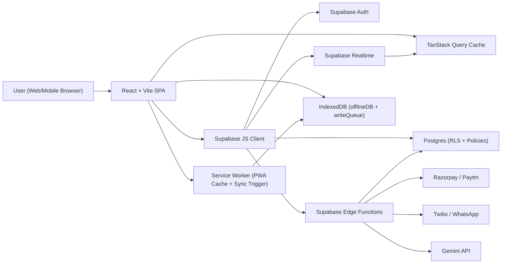

## 2. Frontend Boot and Provider Initialization

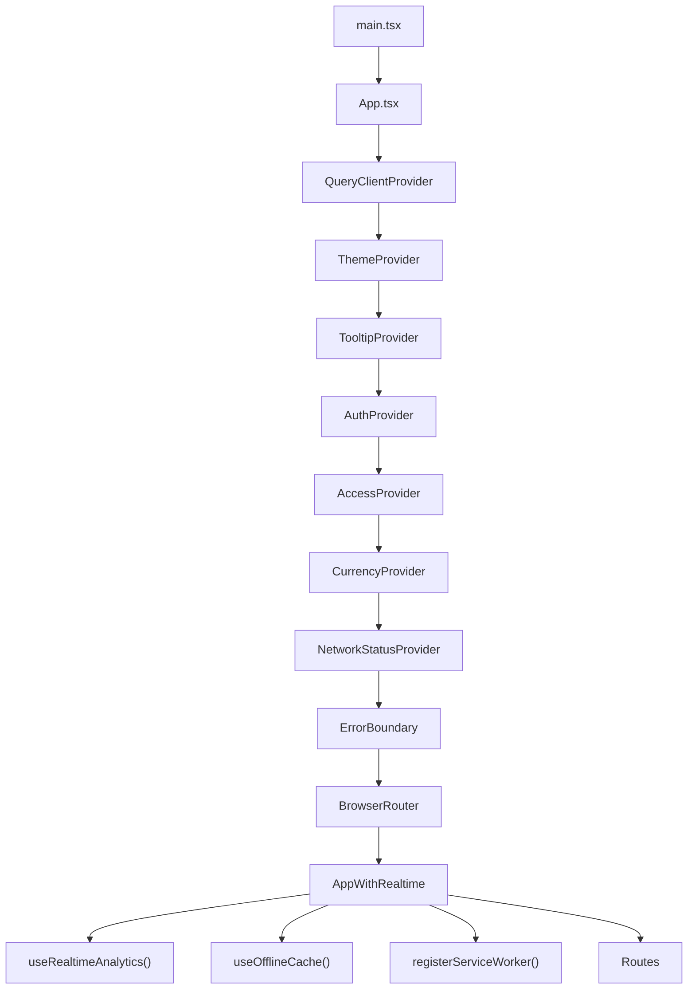

## 3. Auth and Routing Decision Flow

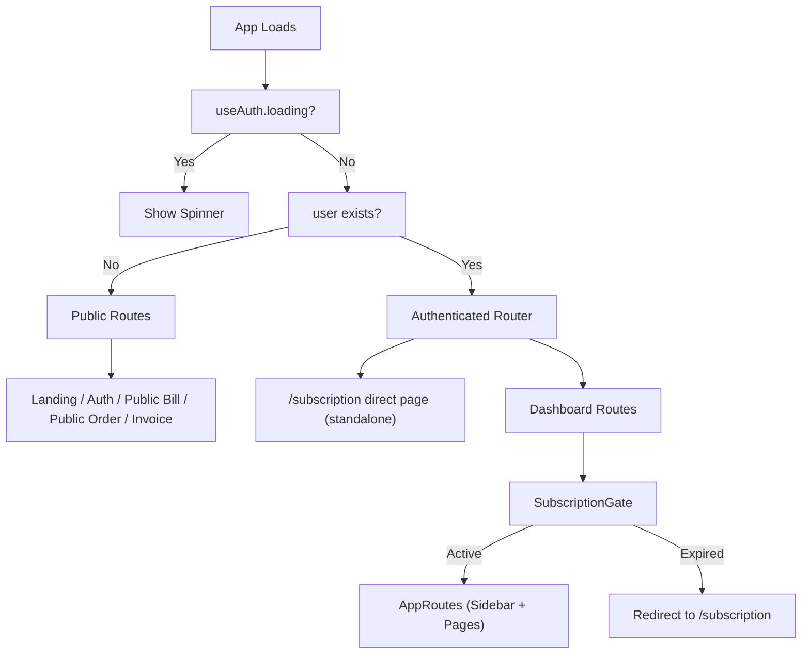

## 4. Layered Access Control Model

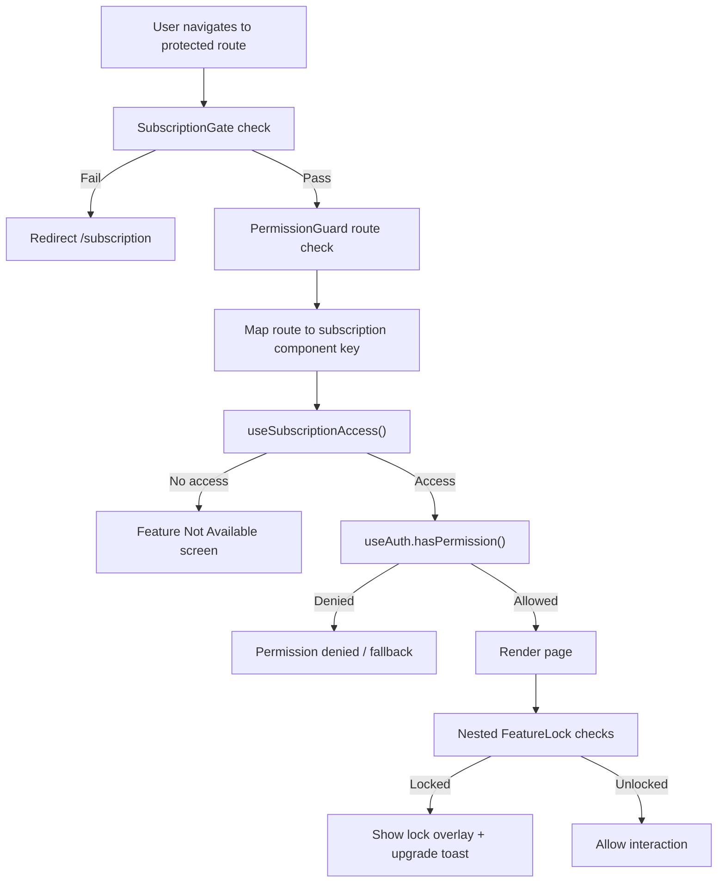

## 5. Subscription and Feature Entitlement Flow

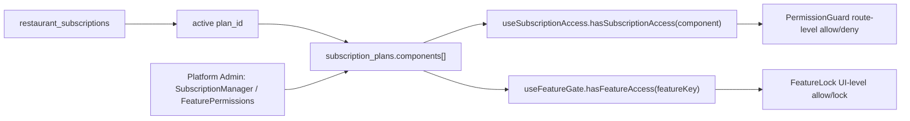

## 6. Frontend to Backend Data Request Flow

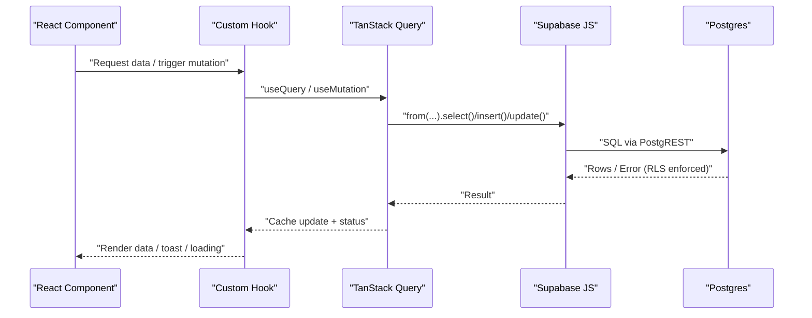

## 7. Realtime Update and Cache Invalidation Flow

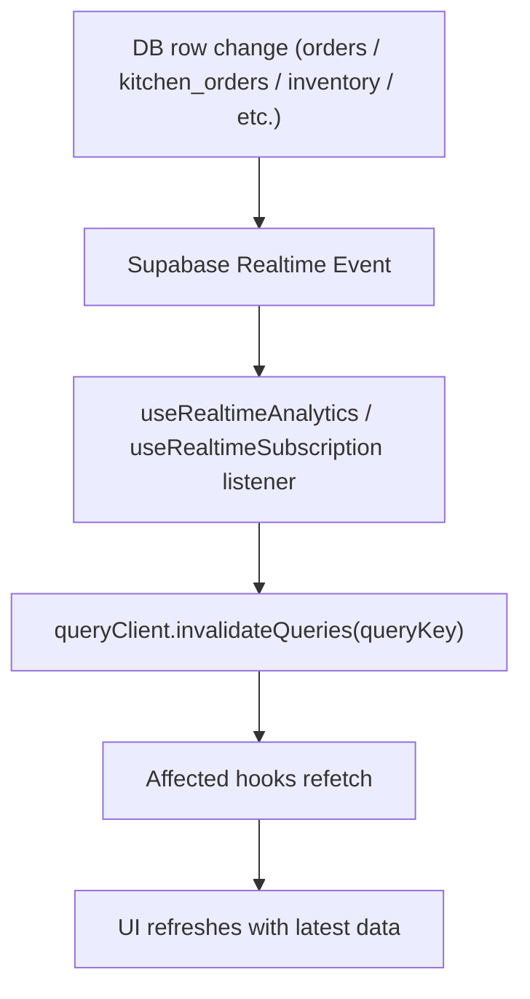

## 8. Offline Queue and Sync Recovery Flow

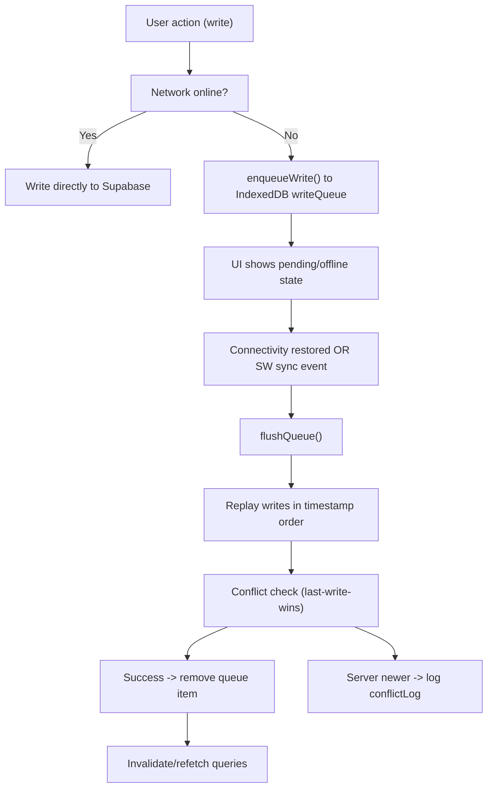

## 9. POS to Kitchen to Order Lifecycle

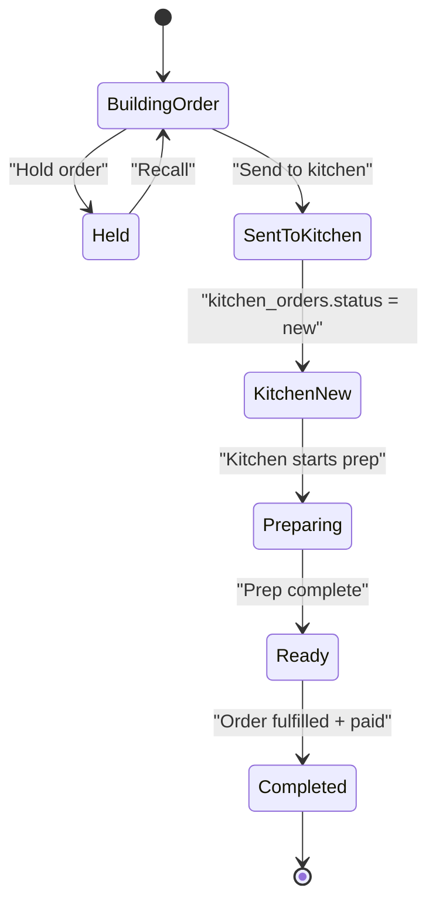

## 10. Reservation Flow (Table and Room)

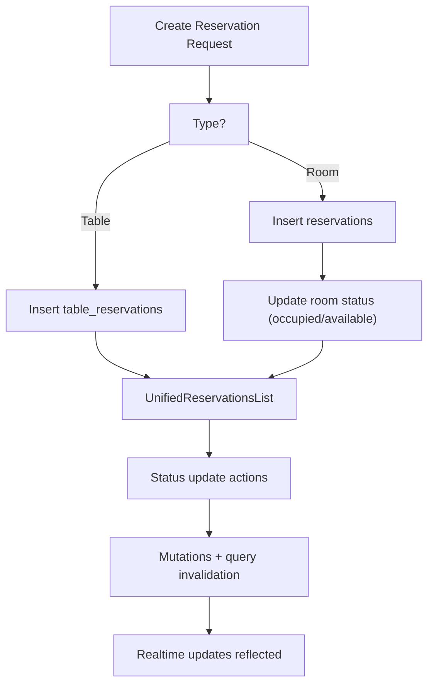

## 11. Inventory Low Stock and Purchase Intelligence Flow

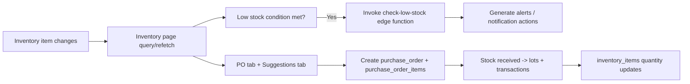

## 12. Subscription Payment Activation Flow (Razorpay)

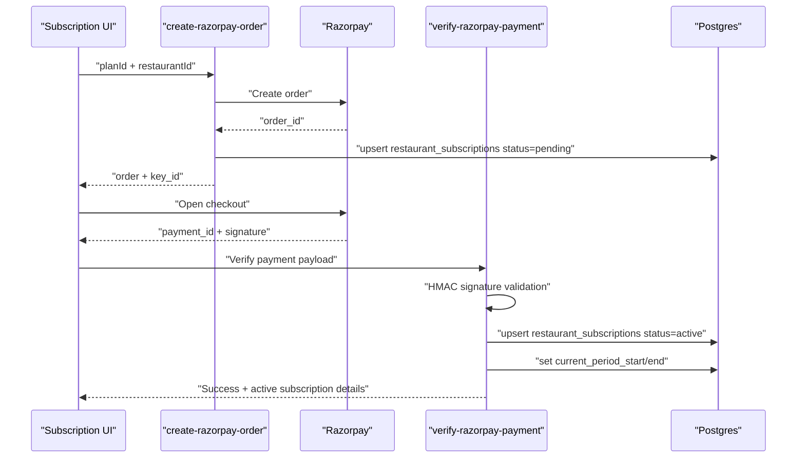

## 13. AI Assistant Flow

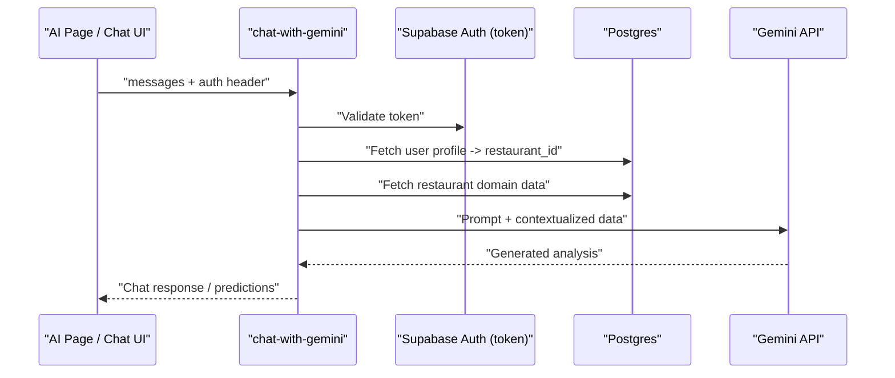

## 14. Platform Admin Onboarding and Control Flow

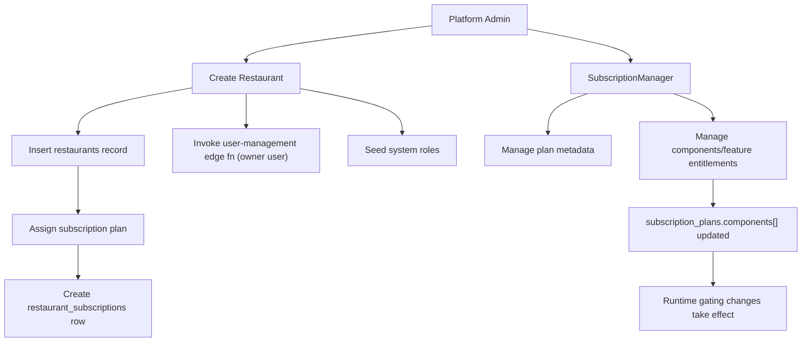

## 15. Deployment and Network Proxy Flow

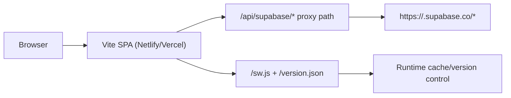

