# Tasty Bite Harbor - Mermaid Flow Diagrams

Last updated: 2026-06-04

## 0. Super Diagram: End-to-End Application Flow (Login to Logout)

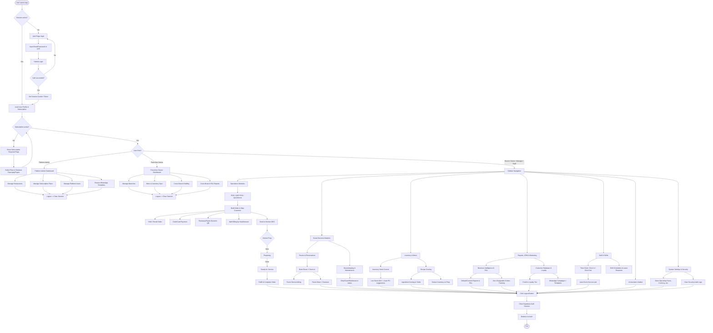

## 1. End-to-End System Context

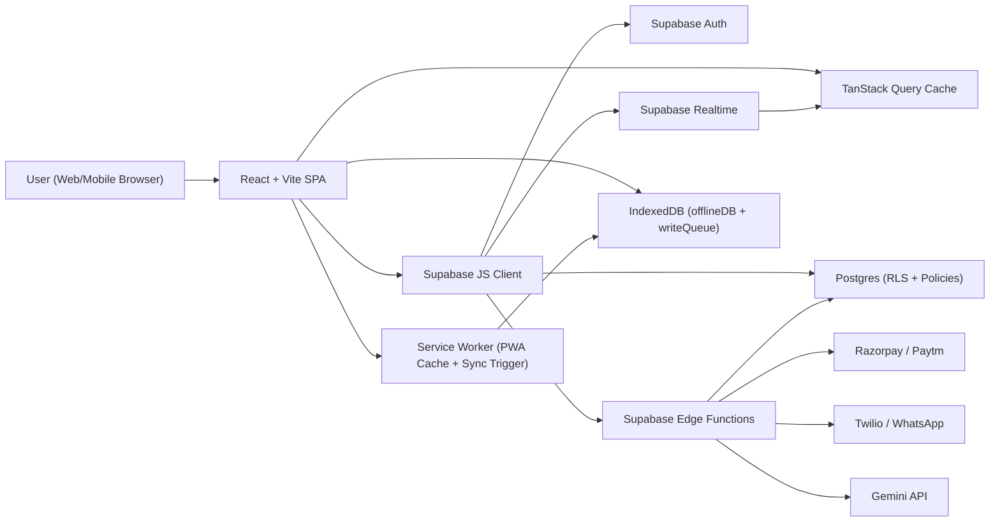

## 2. Frontend Boot and Provider Initialization

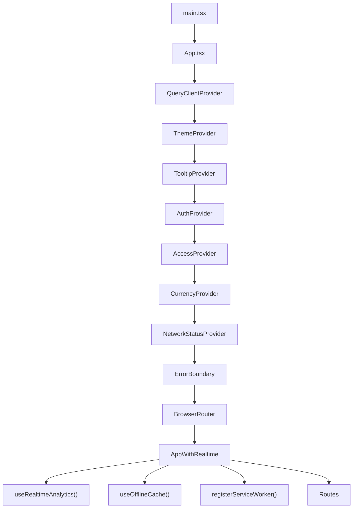

## 3. Auth and Routing Decision Flow

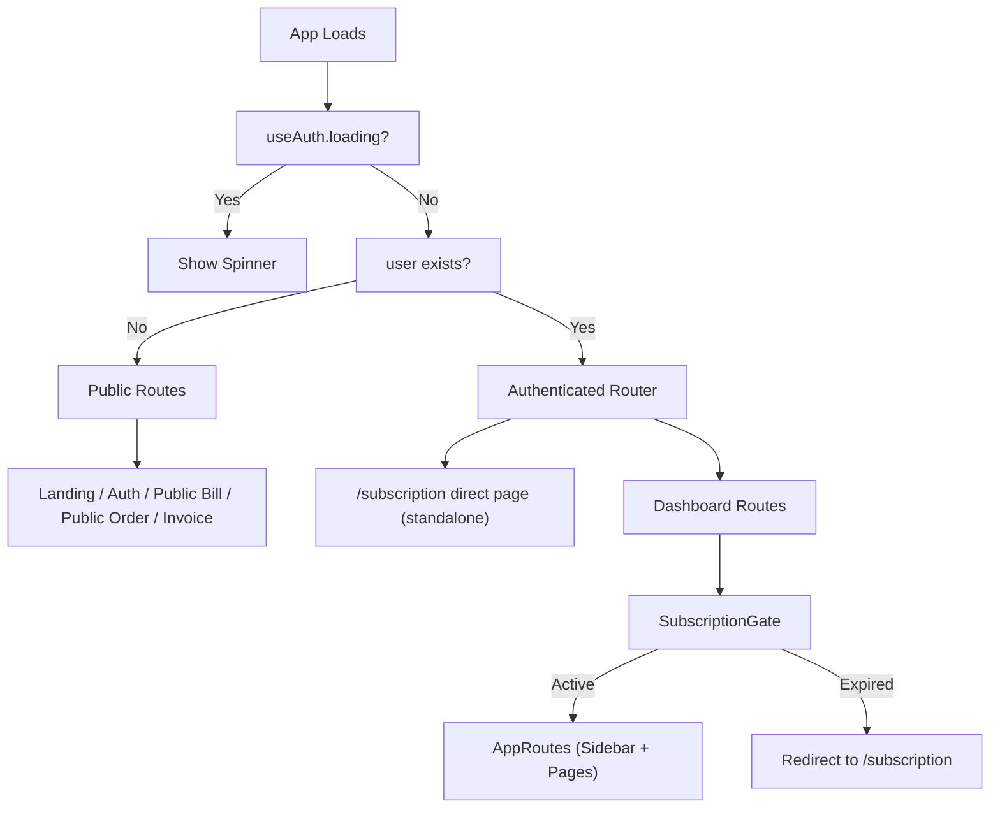

## 4. Layered Access Control Model

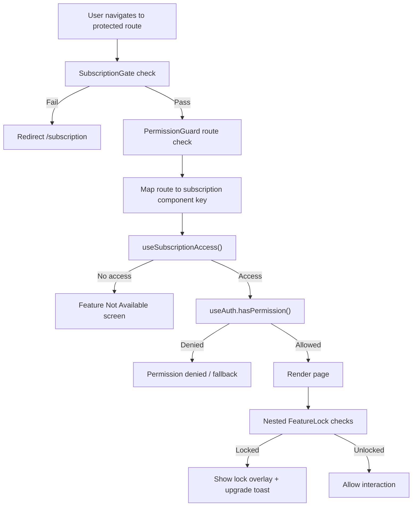

## 5. Subscription and Feature Entitlement Flow

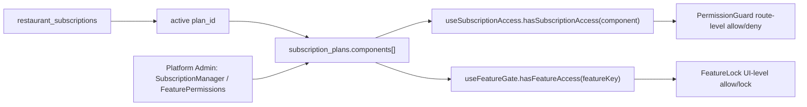

## 6. Frontend to Backend Data Request Flow

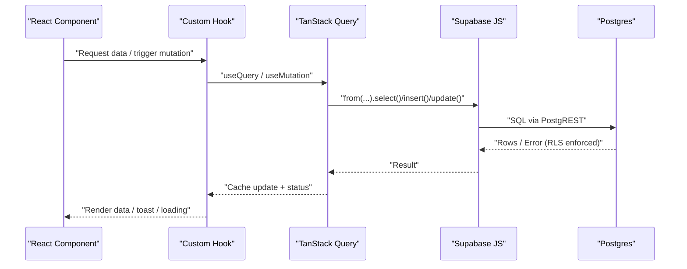

## 7. Realtime Update and Cache Invalidation Flow

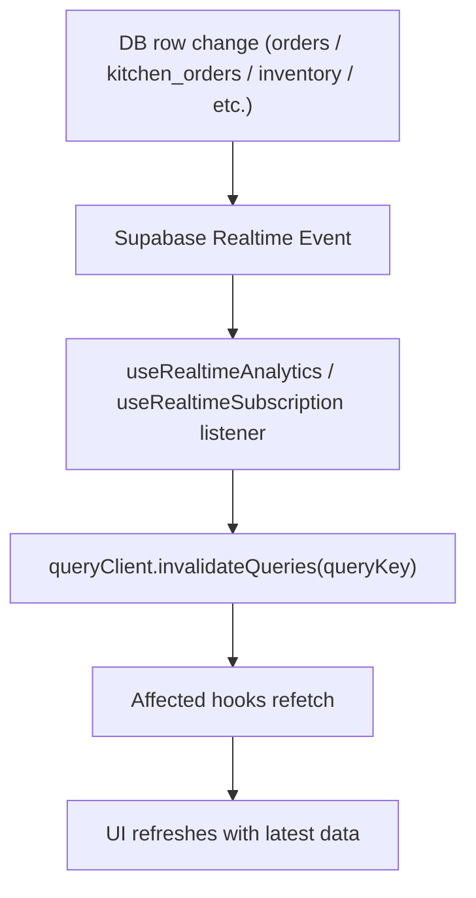

## 8. Offline Queue and Sync Recovery Flow

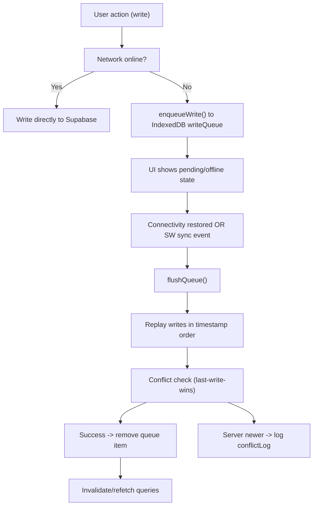

## 9. POS to Kitchen to Order Lifecycle

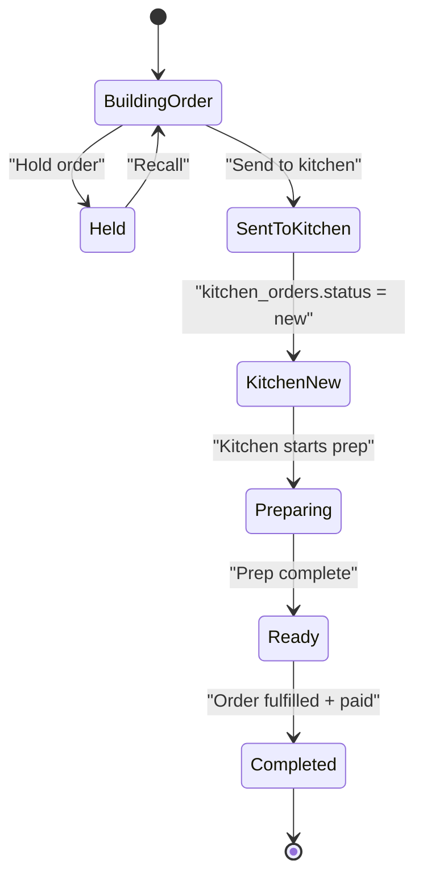

## 10. Reservation Flow (Table and Room)

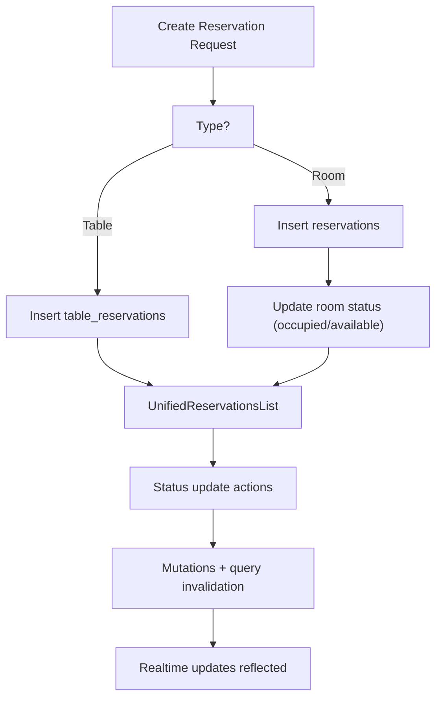

## 11. Inventory Low Stock and Purchase Intelligence Flow

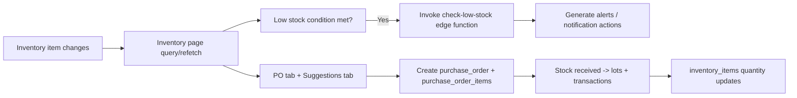

## 12. Subscription Payment Activation Flow (Razorpay)

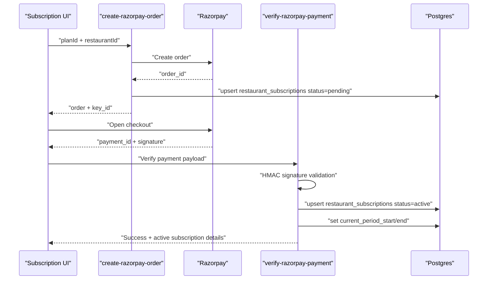

## 13. AI Assistant Flow

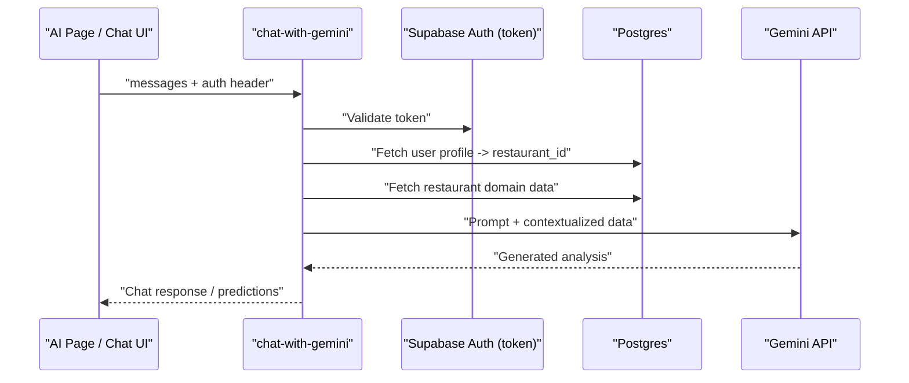

## 14. Platform Admin Onboarding and Control Flow

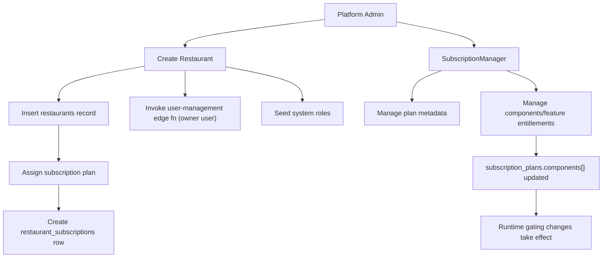

## 15. Deployment and Network Proxy Flow

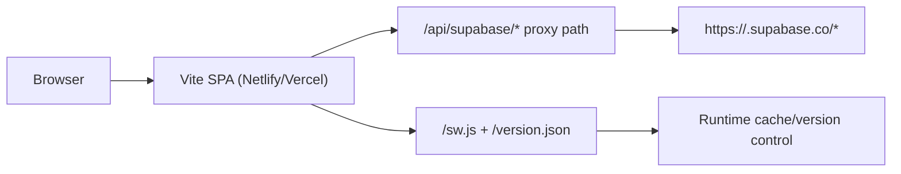

## 16. Reports Dashboard and Tab-Level Gating Flow

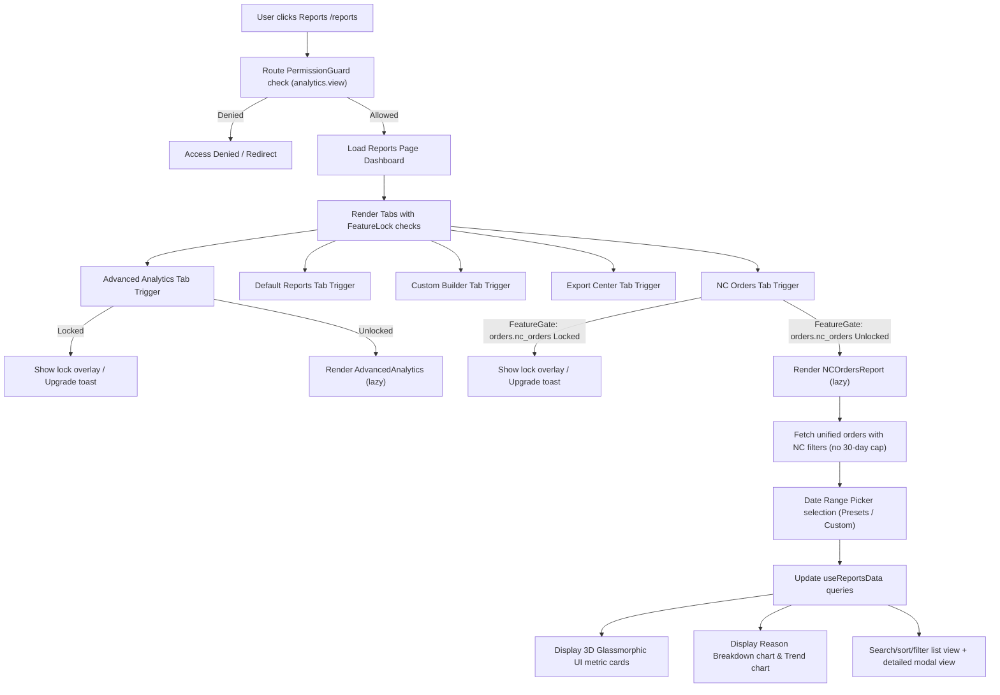

## 17. POS Order & Billing Flow

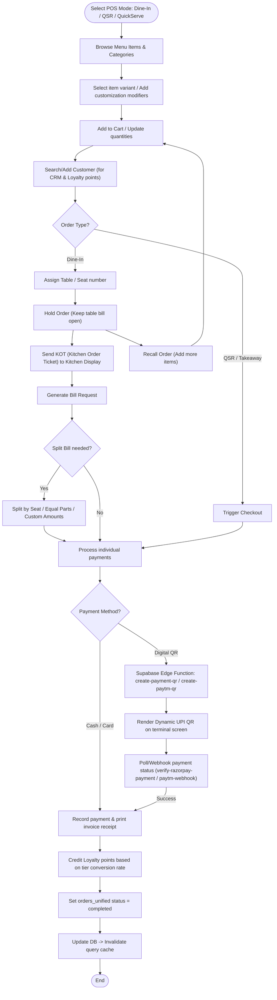

## 18. Room Booking & Housekeeping Lifecycle

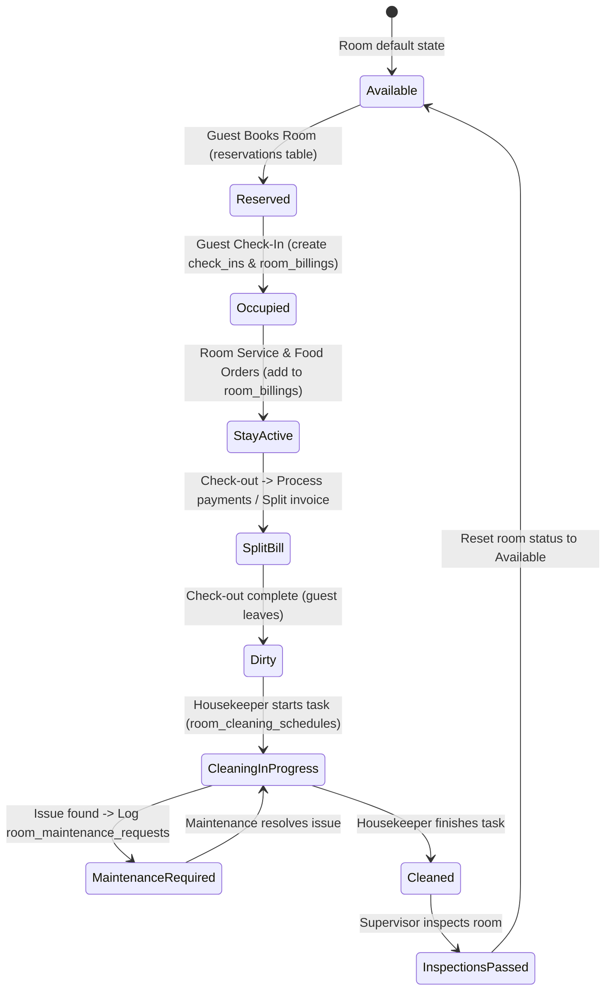

## 19. Recipe Costing & Inventory Flow

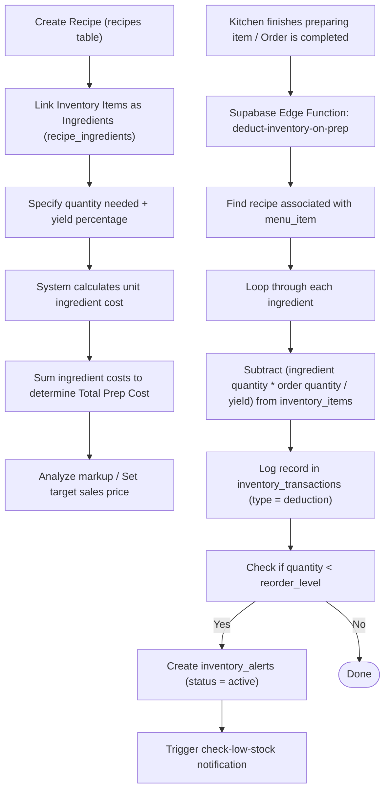

## 20. Staff Shifts & Shift Automation Flow

```mermaid
flowchart TD
  ClockIn["Staff Clocks In (useAutoClockOut / record-clock-entry)"] --> RecordEntry["Create staff_time_clock entry"]
  RecordEntry --> ActiveShift["Status set to Active"]
  
  %% Daily operations
  ActiveShift --> DayPasses["Shift duration passes"]
  
  %% Clock out flows
  ActiveShift --> ManualOut["Staff manually Clocks Out"]
  ManualOut --> CompleteEntry["Set clock_out time & calculate total hours"]
  
  ActiveShift --> Forgotten["Staff forgets to Clock Out"]
  Forgotten --> CronTrigger["Supabase Edge Function Cron: check-missed-clocks / auto-clock-out"]
  CronTrigger --> FindMissed["Query active time clocks older than shift threshold (e.g., 12h)"]
  FindMissed --> AutoOut["Force clock_out to scheduled shift end & mark auto_clocked_out = true"]
  
  CompleteEntry & AutoOut --> ShiftSummary["Log shift summary & update staff_shift_assignments"]
  ShiftSummary --> End(["End"])
```

## 21. CRM, WhatsApp Campaigns & Marketing

```mermaid
sequenceDiagram
  participant Owner as Marketing Dashboard
  participant DB as Supabase DB
  participant EF as send-msg91-whatsapp / send-whatsapp
  participant MSG as MSG91 / Twilio API
  participant Cust as Customer Phone
  
  Owner->>DB: Create whatsapp_templates (name, type, body, parameters)
  Owner->>EF: Submit template to MSG91/Meta for approval
  EF->>MSG: Submit Template API
  MSG-->>EF: Pending status
  EF->>DB: Update template status = pending
  
  Note over Owner, DB: Background Sync Cron (sync-msg91-template-status)
  
  Owner->>DB: Create promotion_campaigns (segment criteria, template selection)
  Owner->>EF: Trigger send campaign
  EF->>DB: Fetch customers matching segment (e.g., active in 30 days, high tier)
  DB-->>EF: List of customer phone numbers
  
  loop Every Target Customer
    EF->>MSG: Send template message with dynamic parameters
    MSG->>Cust: Deliver WhatsApp Message
    MSG-->>EF: Delivery Status callback
    EF->>DB: Log to whatsapp_campaign_sends (status = sent/delivered)
    EF->>DB: Insert customer_activities (type = marketing_msg)
  end
  
  EF-->>Owner: Campaign completed report
```

## 22. Detailed Inventory Replenishment & Supplier Flow

```mermaid
flowchart TD
  Alert["Inventory Item quantity falls below reorder_level"] --> Trigger["Generate low-stock alert"]
  Trigger --> ViewInv["Manager views Inventory Alerts screen"]
  ViewInv --> AutoPO["System suggests replenishment quantity & Supplier based on supplier_orders history"]
  
  AutoPO --> CreatePO["Create Purchase Order (purchase_orders table)"]
  CreatePO --> AddPOItems["Add items and costs (purchase_order_items table)"]
  AddPOItems --> SendPO["Send PO to Supplier (Email / WhatsApp PDF)"]
  
  SendPO --> SupplierDeliver["Supplier delivers stock items"]
  SupplierDeliver --> RecvPO["Receive PO in system"]
  
  RecvPO --> CreateLot["Create Inventory Batch/Lot record"]
  CreateLot --> UpdateInv["Increment inventory_items quantity (on-hand stock)"]
  UpdateInv --> LogTrans["Log inventory_transactions (type = replenishment)"]
  LogTrans --> AccountsPayable["Generate supplier invoice billing in accounts payable"]
  AccountsPayable --> End(["End"])
```

## 23. Detailed Recipe & Preparation Deductions Flow

```mermaid
flowchart TD
  EventSource{Trigger Event?}
  
  EventSource -->|POS Direct Checkout| POSCheckout["Order completed in QSR/QuickServe"]
  EventSource -->|Kitchen KDS Done| KDSPrep["Chef marks kitchen_orders item as 'Ready'"]
  EventSource -->|Manual Production| BatchProd["Chef logs Batch Production (batch_productions table)"]
  
  POSCheckout & KDSPrep --> EdgeFn["Invoke deduct-inventory-on-prep edge function"]
  
  EdgeFn --> CheckRecipe{"Does Menu Item have a recipe?"}
  CheckRecipe -->|No| NoDeduct["No stock deduction (Direct retail item)"]
  CheckRecipe -->|Yes| FetchIngredients["Fetch ingredients from recipe_ingredients"]
  
  FetchIngredients --> DeductOnHand["Deduct (ingredient quantity * item quantity / yield) from inventory_items"]
  
  BatchProd --> FetchPrepRecipe["Fetch prep recipe (e.g. sauce recipe)"]
  FetchPrepRecipe --> DeductPrepIngredients["Deduct base raw ingredients from inventory_items"]
  DeductPrepIngredients --> AddPrepItem["Add finished prep item (e.g. 5L Marinara Sauce) to inventory_items"]
  
  DeductOnHand & AddPrepItem --> LogInvTrans["Create inventory_transactions record"]
  LogInvTrans --> CheckAlerts{"Stock < reorder_level?"}
  CheckAlerts -->|Yes| SetAlert["Create active inventory_alerts record"]
  CheckAlerts -->|No| Done(["Done"])
```

## 24. Franchise Menu Sync Flow

```mermaid
flowchart TD
  Parent["Franchise Owner creates menu_items on parent branch"] --> SelectBranches["Select child branches to sync to"]
  SelectBranches --> ClickSync["Click Sync Menu button"]
  
  ClickSync --> SupaSync["Invoke sync-channels / menu-sync function"]
  SupaSync --> FetchChildren["Fetch active child branch restaurant IDs"]
  
  FetchChildren --> LoopBranches["Loop through each child branch"]
  LoopBranches --> MatchItems{"Check if menu_item exists on child?"}
  
  MatchItems -->|Yes| UpdateItem["Update child menu_items / menu_item_variants matching franchise_parent_id"]
  MatchItems -->|No| CreateItem["Insert new menu_items / menu_item_variants copying details"]
  
  UpdateItem & CreateItem --> InvalidateCache["Invalidate child branch queryCache on active client sessions"]
  InvalidateCache --> SyncSuccess["Log Sync status to sync_logs table"]
  SyncSuccess --> End(["Sync complete"])
```

**Description:**
The franchise menu sync ensures menu consistency across branches. Parent items are pushed using unique identifiers (`franchise_parent_id`) allowing update and insert operations.

## 25. Offline PWA IndexedDB Write Queue Sync Flow

```mermaid
flowchart TD
  UserAction["User performs action (e.g. Save Order) when offline"] --> SWCheck{"Service Worker checks network status"}
  SWCheck -->|Offline| Enqueue["Insert transaction into IndexedDB writeQueue table"]
  Enqueue --> UI["Update UI with local cache & show offline badge"]
  
  UI --> NetworkRestored["Device gains network connection"]
  NetworkRestored --> TriggerSync["Service Worker triggers sync event (flushQueue)"]
  
  TriggerSync --> ReadQueue["Read transactions from IndexedDB in timestamp order"]
  ReadQueue --> SubmitServer["Post items to Supabase DB endpoints"]
  SubmitServer --> ConflictCheck{"Conflict / Version mismatch?"}
  
  ConflictCheck -->|No| RemoveQueue["Delete transaction from IndexedDB writeQueue"]
  ConflictCheck -->|Yes| ResolveConflict["Resolve using Last-Write-Wins or flag for Manager review"]
  
  RemoveQueue & ResolveConflict --> ClearOffline["Clear offline UI badges and trigger query refetch"]
  ClearOffline --> End(["Queue fully synced"])
```

**Description:**
Enables full offline operations in remote areas. All write operations are queued in local IndexedDB until connection is restored.

## 26. Paytm Webhook & Payment Processing Flow

```mermaid
sequenceDiagram
  participant Client as POS Terminal / Customer Order App
  participant EF as Paytm Webhook Edge Function
  participant PT as Paytm Payment Gateway
  participant DB as Supabase Postgres Database
  
  Client->>PT: Initiate payment request (amount, transaction_id)
  PT-->>Client: Generate Dynamic UPI Intent String / QR Code
  Client->>Client: Render QR on screen / User scans
  
  Note over Client, PT: User authenticates and authorizes UPI transaction
  
  PT->>EF: HTTP POST Webhook (Transaction Status Callback)
  EF->>EF: Verify Request Signature (HMAC validation using merchant key)
  
  alt Signature Verified & Status is SUCCESS
    EF->>DB: Update payments / payment_transactions table (status = success)
    EF->>DB: Update orders_unified table (status = completed, payment_status = paid)
    EF-->>PT: HTTP 200 OK (Acknowledge callback)
    DB-->>Client: Realtime notification (Supabase Broadcast Channel)
    Client->>Client: Close billing screen and print invoice receipt
  else Signature Verification Failed or Status is FAILED
    EF->>DB: Update payments table (status = failed)
    EF-->>PT: HTTP 400 Bad Request
    DB-->>Client: Realtime alert message (Payment Failed)
  end
```

**Description:**
Secures and automates UPI digital payments by subscribing to Paytm transaction hooks, validating payload signatures, and updating order status in real time.

## 27. Hotel Night Audit & Ledger Reconciliation Flow

```mermaid
flowchart TD
  TriggerAudit["Cron trigger / Manual launch of Night Audit"] --> CloseDay["Lock all transaction entries for previous calendar day"]
  CloseDay --> ProcessShow["Auto-charge No-Shows / Cancel expired bookings"]
  ProcessShow --> PostRoomCharge["Post room rates & taxes to active check_ins (generate room_billings lines)"]
  
  PostRoomCharge --> Summarize["Calculate Daily Revenue stats (daily_revenue_stats)"]
  Summarize --> ReconCash["Compare physical cash/card drops against system journal entries"]
  
  ReconCash --> MatchLedger{"Reconciliation balance matches?"}
  MatchLedger -->|Yes| SuccessAudit["Close Day & increment hotel accounting date"]
  MatchLedger -->|No| FlagAudit["Flag discrepancy in night_audit_logs & notify GM"]
  
  SuccessAudit & FlagAudit --> GenerateReport["Create daily_summary_reports record"]
  GenerateReport --> End(["Night Audit complete"])
```

**Description:**
Ensures hotel account accuracy at the end of each day by posting room charges, tracking active occupancy metrics, and generating financial reconciliations.

## 28. OTA Channel Management & Parity Sync Flow

```mermaid
flowchart TD
  UpdateRoom["Room status / Inventory updates in local PMS"] --> ChannelSync["Trigger channel-sync edge function"]
  ChannelSync --> FetchOTA["Fetch registered OTA credentials (ota_credentials)"]
  FetchOTA --> DirectOTA["Send rate & availability updates to OTAs (Booking.com, Expedia, etc.)"]
  
  DirectOTA --> ParityJob["Background Cron: rate_parity_checks"]
  ParityJob --> ScrapeOTA["Fetch live prices from booking channels"]
  ScrapeOTA --> VerifyParity{"Are prices identical to local PMS rates?"}
  VerifyParity -->|Yes| End(["No action"])
  VerifyParity -->|No| AlertParity["Create rate_parity_checks alert & email warning to manager"]
```

**Description:**
Maintains rate consistency across different online travel agencies (OTAs) and direct booking channels to prevent OTA penalties and ensure maximum profit margins.

## 29. Split Billing & Invoice Calculation Flow

```mermaid
flowchart TD
  RequestSplit["Request Split Bill from POS screen"] --> CheckMethod{Split Method?}
  
  CheckMethod -->|Split by Seat| MapSeat["Group order_items by target customer seat number"]
  CheckMethod -->|Equal Split| CalcDivide["Divide total bill amount equally by N portions"]
  CheckMethod -->|Custom Amount| CustomInput["Manager inputs manual amounts for each portion"]
  
  MapSeat & CalcDivide & CustomInput --> CreateSplit["Create split_bills record"]
  CreateSplit --> CreatePortions["Create split_bill_portions records (status = unpaid)"]
  
  CreatePortions --> ProcessPay["Collect payment for a portion"]
  ProcessPay --> UpdatePortion["Mark split_bill_portions status = paid & link payment_id"]
  
  UpdatePortion --> AllPaid{"Are all portions paid?"}
  AllPaid -->|No| WaitPay["Hold main order status = open / partially_paid"]
  AllPaid -->|Yes| CloseMain["Mark parent orders_unified status = completed & paid"]
  CloseMain --> End(["End"])
```

**Description:**
Handles complex dining scenarios by allowing a single table invoice to be split into multiple payments (either equally, by seat, or custom amounts) while keeping track of paid/unpaid status.


