# Tasty Bite Harbor: Complete Operations Architecture, Component Flow Diagrams & Technical Guide

A comprehensive, unified technical reference document providing both **in-depth functional specifications** and **dedicated Mermaid flowcharts** for all 10 Operations components in the restaurant management system.

---

## Master System Architecture

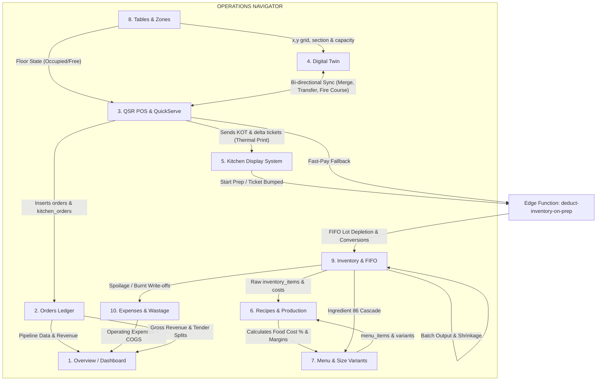

---

## 1. Overview (Dashboard & Analytics)

### 1.1 Functional Specification
* **Component Path**: [`src/pages/Dashboard.tsx`](file:///G:/restaurant/Sudip/tasty-bite-harbor/src/pages/Dashboard.tsx), [`src/pages/EnhancedDashboard.tsx`](file:///G:/restaurant/Sudip/tasty-bite-harbor/src/pages/EnhancedDashboard.tsx)
* **Data Hook**: [`src/hooks/useBusinessDashboardData.tsx`](file:///G:/restaurant/Sudip/tasty-bite-harbor/src/hooks/useBusinessDashboardData.tsx)
* **Realtime Hook**: [`src/hooks/useRealtimeSubscription.tsx`](file:///G:/restaurant/Sudip/tasty-bite-harbor/src/hooks/useRealtimeSubscription.tsx)
* **Underlying Tables**: `orders`, `order_items`, `kitchen_orders`, `tables`, `inventory_items`, `expenses`.

#### Key Capabilities:
1. **Real-Time Data Ingestion**: Automatically establishes WebSocket subscriptions to PostgreSQL changes on `orders`, `kitchen_orders`, and `expenses`.
2. **Aggregated Business Metrics**:
   * **Gross Sales**: Total value of all orders punched today across POS, Takeaway, Delivery, and QR ordering.
   * **Net Sales**: Gross Sales minus customer discounts, promotional vouchers, and voided/non-chargeable items.
   * **Live Capacity Tracker**: Ratio of occupied tables to total active tables ($occupied / total$).
   * **Kitchen Latency Gauge**: Average preparation delay and current active tickets waiting in kitchen queue.
   * **Stock Threshold Monitor**: Immediate alert count of ingredients currently below their minimum reorder point.
3. **Live Profit & Loss Engine**:
   $$\text{Gross Sales} - \text{Discounts} - \text{Taxes} - \text{COGS (from FIFO inventory deductions)} - \text{Operating Expenses} = \text{Live Operating Profit}$$

### 1.2 Dedicated Flow Diagram

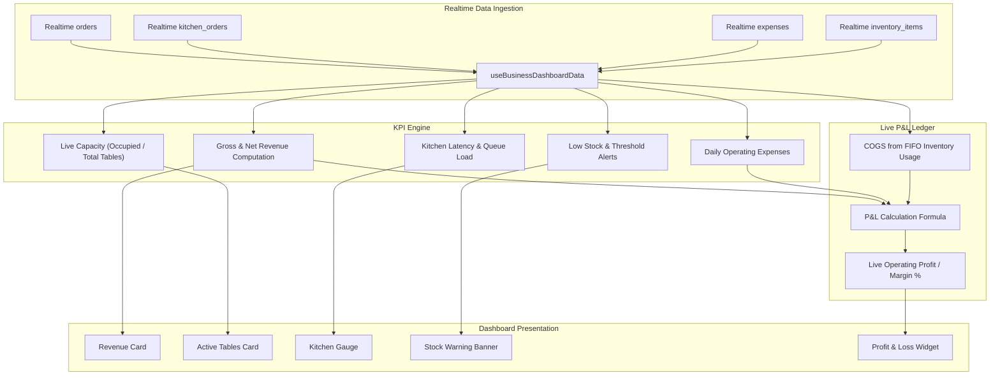

---

## 2. Orders Ledger Component

### 2.1 Functional Specification
* **Component Path**: [`src/pages/Orders.tsx`](file:///G:/restaurant/Sudip/tasty-bite-harbor/src/pages/Orders.tsx)
* **Components**: [`src/components/Orders/OrderList.tsx`](file:///G:/restaurant/Sudip/tasty-bite-harbor/src/components/Orders/OrderList.tsx), [`src/components/Orders/OrderActions.tsx`](file:///G:/restaurant/Sudip/tasty-bite-harbor/src/components/Orders/OrderActions.tsx)
* **Utilities**: [`src/lib/order-utils.ts`](file:///G:/restaurant/Sudip/tasty-bite-harbor/src/lib/order-utils.ts)
* **Underlying Tables**: `orders`, `kitchen_orders`, `crm_customers`.

#### Key Capabilities:
1. **Multi-Source Ingestion**: Unifies orders punched via Counter POS, Dine-In table orders, Guest QR orders, and aggregator/delivery tickets.
2. **Order Lifecycle State Machine**:
   $$\text{Pending} \rightarrow \text{Preparing} \rightarrow \text{Ready} \rightarrow \text{Completed}$$
   * Supports manager-level **Revert Status** (e.g., from `completed` back to `pending` if payment was accidentally closed).
   * Supports order cancellation and voiding with reason logging.
3. **Data Formatting & Sanitization**:
   * Stored in array format in `orders.items` using [`formatOrderItemString`](file:///G:/restaurant/Sudip/tasty-bite-harbor/src/lib/order-utils.ts#L20-L36):
     ```typescript
     formatOrderItemString(quantity, name, price, notes, modifiers)
     // Output: "2x Farmhouse Pizza (Extra Cheese, Spicy) @350.00"
     ```
4. **CRM & WhatsApp Linkage**:
   * Automatically parses customer mobile number on checkout, fetches or creates `crm_customers` record, and increments loyalty points.
   * Integrated with Edge Function `send-whatsapp-unified` for automated receipt PDFs and Pay Later payment reminders.
5. **Non-Chargeable (NC) Orders**:
   * Strict audit compliance requiring mandatory `nc_reason` (e.g., "Owner Table", "Food Tasting", "Guest Complaint").
   * Stored with `order_type: 'non-chargeable'`, net total ₹0.00, isolated from taxable revenue reports.

### 2.2 Dedicated Flow Diagram

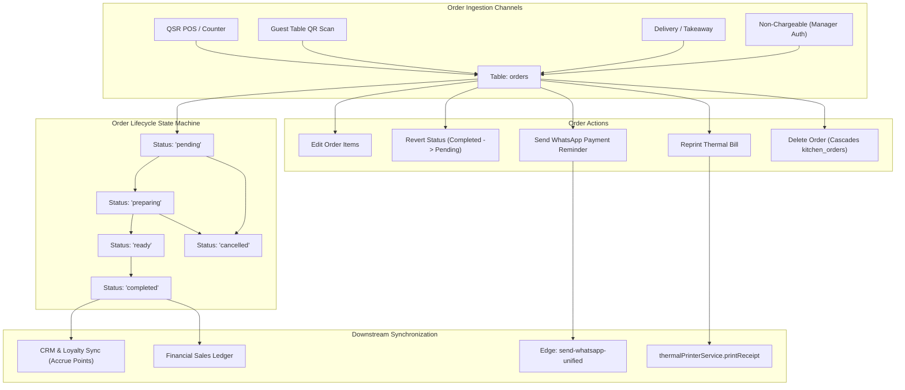

---

## 3. QSR POS & QuickServe POS

### 3.1 Functional Specification
* **Component Path**: [`src/components/QSR/QSRPosMain.tsx`](file:///G:/restaurant/Sudip/tasty-bite-harbor/src/components/QSR/QSRPosMain.tsx), [`src/pages/QuickServePOS.tsx`](file:///G:/restaurant/Sudip/tasty-bite-harbor/src/pages/QuickServePOS.tsx)
* **Sub-Components**: [`QSROrderPad.tsx`](file:///G:/restaurant/Sudip/tasty-bite-harbor/src/components/QSR/QSROrderPad.tsx), [`QSRCartBottomSheet.tsx`](file:///G:/restaurant/Sudip/tasty-bite-harbor/src/components/QSR/QSRCartBottomSheet.tsx), [`AdaptivePaymentDialog.tsx`](file:///G:/restaurant/Sudip/tasty-bite-harbor/src/components/Orders/POS/AdaptivePaymentDialog.tsx)
* **Underlying Tables**: `orders`, `kitchen_orders`, `tables`, `menu_items`, `menu_item_variants`.

#### Key Capabilities:
1. **Multi-Mode Operation**:
   * `dine_in`: Table grid selection; updates table status to `occupied`.
   * `takeaway`: Fast counter service with direct customer name/phone intake.
   * `delivery`: Delivery partner routing with rider assignment drawer.
   * `nc`: Non-chargeable authorization with mandatory reason entry.
2. **Hold & Recall Architecture**:
   * **Hold Order**: Saves an active cart to `kitchen_orders` with `status: 'held'` to free up the POS terminal for other walk-ins.
   * **Recall Table**: Clicking an occupied table fetches `kitchen_orders` where `id = table.activeOrderId`, restoring items and pricing into cart.
3. **"Send to Kitchen" & Additional Items (Rounds & Deltas)**:
   * **Round 1 (Initial Order)**: Inserts `kitchen_orders` with `round_number: 1`, `status: 'new'`. Prints initial thermal ticket `*** KOT ***`.
   * **Round 2+ (Add-on Order)**: Increments `round_number = (existing.round_number || 1) + 1`.
   * **Delta Math**:
     ```typescript
     const previouslyPrinted = existingItem?.printed_qty || 0;
     const delta = item.quantity - previouslyPrinted;
     if (delta > 0) deltaItemsToPrint.push({ ...item, printed_qty: previouslyPrinted });
     ```
   * Updates `kitchen_orders` with full array and resets prep timers (`started_at: null`, `completed_at: null`) so KDS rings kitchen.
   * Sends only delta items to printer with flag `isAddition: true`, producing ticket header `*** ADDITION ***` (Round X) and footer `** ADDITION ONLY **`.
4. **Checkout & Multi-Tender Payment**:
   * Implements platform-adaptive checkout: Web desktop uses [`PaymentDialog.tsx`](file:///G:/restaurant/Sudip/tasty-bite-harbor/src/components/Orders/POS/PaymentDialog.tsx), Android APK renders [`MobilePaymentDialog.tsx`](file:///G:/restaurant/Sudip/tasty-bite-harbor/src/components/Orders/POS/MobilePaymentDialog.tsx).
   * Tenders: Cash Drawer, Card POS, Dynamic UPI QR code (generated via ESC/POS 2D barcode bytes or onscreen canvas), Split Payment, Pay Later, NC.
   * On settlement: Marks order completed, releases table to `available`, and invokes `deduct-inventory-on-prep`.

### 3.2 Dedicated Flow Diagram

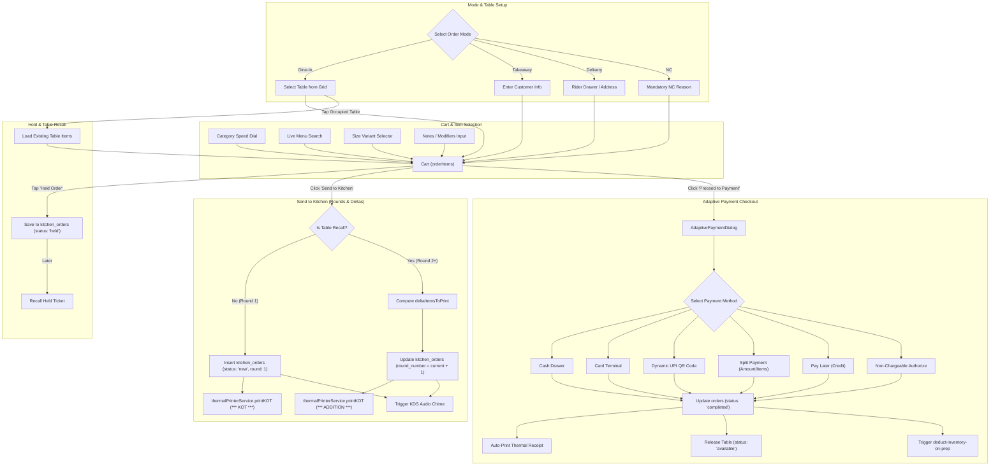

---

## 4. Digital Twin: Live Outlet Blueprint

### 4.1 Functional Specification
* **Component Path**: [`src/pages/DigitalTwin.tsx`](file:///G:/restaurant/Sudip/tasty-bite-harbor/src/pages/DigitalTwin.tsx)
* **Canvas Component**: [`src/components/Tables/FloorPlanCanvas.tsx`](file:///G:/restaurant/Sudip/tasty-bite-harbor/src/components/Tables/FloorPlanCanvas.tsx)
* **Action Modal**: [`src/components/Tables/TableActionModal.tsx`](file:///G:/restaurant/Sudip/tasty-bite-harbor/src/components/Tables/TableActionModal.tsx)
* **Hook**: [`src/hooks/useTableFloorPlan.ts`](file:///G:/restaurant/Sudip/tasty-bite-harbor/src/hooks/useTableFloorPlan.ts)
* **Underlying Tables**: `tables`, `table_sections`, `restaurant_floor_elements`, `orders`, `kitchen_orders`.

#### Key Capabilities:
1. **Interactive 2D Blueprint Canvas**:
   * Drag-and-drop table nodes and architectural elements mapped directly to physical coordinates $(x, y)$.
   * Elements supported: Walls, doors, windows, bar counters, cash stations, restrooms, and pillars.
   * Element adjustments: Resize $(w, h)$ and rotate in $90^\circ$ increments ($0^\circ, 90^\circ, 180^\circ, 270^\circ$).
2. **Visual Table States & Badges**:
   * `available` (Emerald Green): Ready for walk-in seating.
   * `seated` (Blue): Guests seated, placing order.
   * `served` (Orange): Food delivered, dining in progress.
   * `billed` (Purple): Bill presented, waiting for settlement.
   * `dirty` (Gray/Red): Vacated, needs busboy sanitization.
3. **Table Action Modal (`TableActionModal.tsx`)**:
   * **Table Turn Time Tracker**: Displays elapsed dining time ($<30$m Green, $30-60$m Amber, $>60$m Red alert).
   * **Live Running Items**: Itemized list with pricing and KOT prep status.
   * **Course Firing Fast-Buttons**: "Fire Starters", "Fire Mains", "Fire Dessert" triggers course priority broadcasts to Kitchen KDS.
   * **Table Transfer & Merge**: Transfer order items between tables or merge adjacent tabs.
   * **Split Bill Integration**: Direct link to split bill settlement modal.
4. **AI Traffic & Revenue Simulation**:
   * Evaluates table turnaround velocity, bottlenecks, and revenue density per square foot.

### 4.2 Dedicated Flow Diagram

```mermaid
flowchart TD
    subgraph Blueprint_Canvas ["2D Blueprint Canvas Engine"]
        SEC["Section Tabs: Main, Patio, Rooftop, AC"] --> CANVAS["FloorPlanCanvas"]
        CANVAS --> ARCH["Architectural Elements (restaurant_floor_elements)"]
        ARCH --> ELEM["Walls, Doors, Windows, Bars, Cash Counters, Restrooms"]
        ELEM --> EDIT["Drag, Resize, Rotate (0°, 90°, 180°, 270°)"]
    end

    subgraph Live_Nodes ["Live Table Nodes & Color States"]
        CANVAS --> TNODES["Table Visual Nodes"]
        TNODES --> ST_AVAIL["Available (Emerald Green)"]
        TNODES --> ST_SEAT["Seated / Ordering (Blue)"]
        TNODES --> ST_SERVE["Food Served / Dining (Orange)"]
        TNODES --> ST_BILL["Bill Presented (Purple)"]
        TNODES --> ST_DIRT["Dirty / Needs Bus (Gray/Red)"]
    end

    subgraph Table_Action_Modal ["Table Interaction Modal"]
        TNODES -->|Click Table| MODAL["TableActionModal"]
        MODAL --> TIMER["Turn-Time Tracker (<30m, 30-60m, >60m alert)"]
        MODAL --> RUNNING["Running Items List & KOT Status Badges"]
        
        MODAL --> ACT_FIRE["Kitchen Course Firing: Starters, Mains, Dessert"]
        MODAL --> ACT_POS["Punch POS Order -> Redirect to /pos?table=X"]
        MODAL --> ACT_SPLIT["Split Bill Check -> TableSplitBillDialog"]
        MODAL --> ACT_MERGE["Transfer / Merge -> TableMergeTransferDialog"]
        MODAL --> ACT_CLEAN["Mark Clean & Available"]
    end

    subgraph AI_Simulation ["AI Traffic & Revenue Simulation"]
        SEC --> SIM_TAB["AI Traffic & Revenue Simulation Tab"]
        SIM_TAB --> SIM_ENG["RestaurantSimulation Engine"]
        SIM_ENG --> HEATMAP["Foot-Traffic & Bottleneck Heatmap"]
        SIM_ENG --> METRICS["Revenue per Seat-Hour & Turnaround Velocity"]
    end
```

---

## 5. Kitchen Display System (KDS)

### 5.1 Functional Specification
* **Component Path**: [`src/pages/Kitchen.tsx`](file:///G:/restaurant/Sudip/tasty-bite-harbor/src/pages/Kitchen.tsx)
* **Components**: [`src/components/Kitchen/KitchenDisplay.tsx`](file:///G:/restaurant/Sudip/tasty-bite-harbor/src/components/Kitchen/KitchenDisplay.tsx), [`src/components/Kitchen/KitchenLoadGauge.tsx`](file:///G:/restaurant/Sudip/tasty-bite-harbor/src/components/Kitchen/KitchenLoadGauge.tsx)
* **Hook**: [`src/hooks/useActiveKitchenOrders.tsx`](file:///G:/restaurant/Sudip/tasty-bite-harbor/src/hooks/useActiveKitchenOrders.tsx)
* **Underlying Tables**: `kitchen_orders`, `orders`.

#### Key Capabilities:
1. **Real-Time Ticket Board & Audio Dispatch**:
   * Listens on Postgres channel for new `kitchen_orders`. Plays Web Audio API synth chime and speech synthesis (`"New order for Table X"`).
2. **Station Filtering**:
   * Filters tickets by chef station: Grill, Fryer, Tandoor, Pantry, Beverage, Dessert.
3. **Urgency Indicators & Latency Timers**:
   * Continuous elapsed timer from `created_at`:
     * $\le 10$ mins: Green (Normal prep time).
     * $10 - 20$ mins: Yellow (Warning threshold).
     * $> 20$ mins: Flashing Red (Delayed order requiring expeditor intervention).
4. **Item-Level Checklist & Bumping**:
   * Chefs cross off individual items as prepared via `item_completion_status` boolean array.
   * Clicking "Bump Ticket" updates `status: 'completed'`, logs `bumped_at`, and notifies POS.
5. **Inventory Depletion Trigger**:
   * Clicking "Start Prep" or bumping a ticket triggers the background edge function `deduct-inventory-on-prep`.

### 5.2 Dedicated Flow Diagram

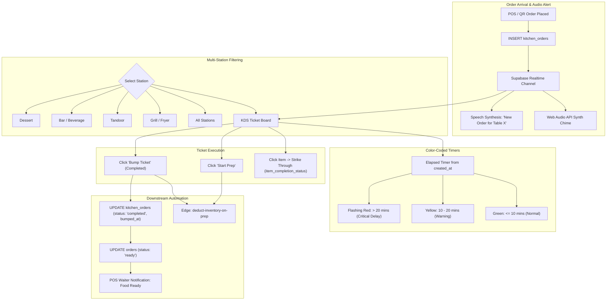

---

## 6. Recipes & Costing Management

### 6.1 Functional Specification
* **Component Path**: [`src/pages/RecipeManagement.tsx`](file:///G:/restaurant/Sudip/tasty-bite-harbor/src/pages/RecipeManagement.tsx)
* **Hook**: [`src/hooks/useRecipes.tsx`](file:///G:/restaurant/Sudip/tasty-bite-harbor/src/hooks/useRecipes.tsx)
* **Batch Production Code**: [`src/pages/Inventory.tsx:L470-L520`](file:///G:/restaurant/Sudip/tasty-bite-harbor/src/pages/Inventory.tsx#L470-L520)
* **Underlying Tables**: `recipes`, `recipe_ingredients`, `inventory_items`, `menu_items`, `menu_item_variants`.

#### Key Capabilities:
1. **Bill of Materials (BOM) Linking**:
   * Maps each `menu_items` entry to raw ingredients in `inventory_items`.
   * Defines ingredient quantity and culinary unit (g, kg, ml, l, pcs).
2. **Cost Calculation Engine**:
   $$\text{Portion Cost} = \sum (\text{Ingredient Quantity} \times \text{Unit Cost})$$
   $$\text{Ideal Food Cost \%} = \left( \frac{\text{Portion Cost}}{\text{Selling Price (excl. Tax)}} \right) \times 100$$
   $$\text{Gross Margin \%} = 100 - \text{Ideal Food Cost \%}$$
3. **Variant-Specific Ingredients (Replacement Model)**:
   * Base ingredients (`variant_id IS NULL`) are included in all portion sizes.
   * Specific size ingredients (`variant_id === variant.id`) replace base ingredient quantities.
4. **Batch Production Recipes (Homemade Sub-Recipes)**:
   * Converts raw ingredients into prepared inventory items (e.g., Tomatoes + Herbs $\rightarrow$ Pizza Sauce).
   * Consumes raw materials (`transaction_type: 'production_consumed'`).
   * Credits prepared stock balance (`transaction_type: 'production_output'`).
   * Measures shrinkage / production wastage:
     $$\text{Wastage Quantity} = \max(0, \text{Input Weight} - \text{Output Weight})$$

### 6.2 Dedicated Flow Diagram

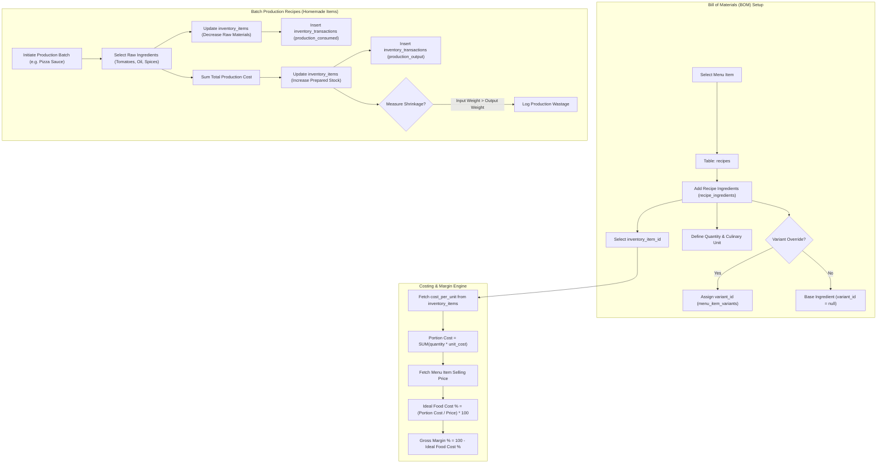

---

## 7. Menu Management & Size Variants

### 7.1 Functional Specification
* **Component Path**: [`src/pages/Menu.tsx`](file:///G:/restaurant/Sudip/tasty-bite-harbor/src/pages/Menu.tsx)
* **Components**: [`src/components/Menu/AddMenuItemForm.tsx`](file:///G:/restaurant/Sudip/tasty-bite-harbor/src/components/Menu/AddMenuItemForm.tsx), [`src/components/Menu/AIImportDialog.tsx`](file:///G:/restaurant/Sudip/tasty-bite-harbor/src/components/Menu/AIImportDialog.tsx), [`src/components/Menu/Quick86Modal.tsx`](file:///G:/restaurant/Sudip/tasty-bite-harbor/src/components/Menu/Quick86Modal.tsx)
* **Hook**: [`src/hooks/use86Cascade.ts`](file:///G:/restaurant/Sudip/tasty-bite-harbor/src/hooks/use86Cascade.ts)
* **Underlying Tables**: `menu_items`, `menu_item_variants`, `categories`.

#### Key Capabilities:
1. **Catalog Architecture**:
   * Categories $\rightarrow$ Subcategories $\rightarrow$ Menu Items $\rightarrow$ Size Variants.
   * Core parameters: Name, base price, tax rate (GST 5%), preparation time, dietary tags (Veg, Non-Veg, Egg, Vegan, Gluten-Free).
2. **Size Variants Engine (`menu_item_variants`)**:
   * Allows offering portion sizes (Regular, Medium, Large, Half, Full) without cluttering the catalog.
   * **Smart Pricing Hints**:
     * $1.5\times$ base price: `"💡 Tip: ₹${suggested} (1.5× of Small) works well for Medium"`
     * $2.0\times$ base price: `"💡 Tip: ₹${suggested} (2× of Small) is a common Large price"`
3. **Out of Stock 86 Cascade (`use86Cascade.ts`)**:
   * **Single Dish 86**: Toggles `menu_items.is_available = false`, instantly locking the dish across POS, QR menus, and aggregators.
   * **Ingredient 86 Cascade**: When an inventory raw material runs out (e.g., Paneer stock $= 0$), `toggleIngredientCascadeMutation` finds all recipes using that inventory item and 86's all affected dishes simultaneously.
4. **Gemini AI Vision Menu Importer**:
   * Extracts categories, items, prices, and size variants directly from a physical menu photo.

### 7.2 Dedicated Flow Diagram

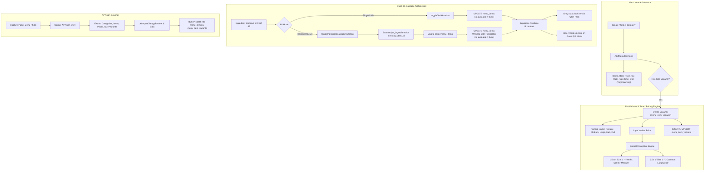

---

## 8. Tables & Floor Management

### 8.1 Functional Specification
* **Component Path**: [`src/pages/Tables.tsx`](file:///G:/restaurant/Sudip/tasty-bite-harbor/src/pages/Tables.tsx)
* **Hook**: [`src/hooks/useTables.tsx`](file:///G:/restaurant/Sudip/tasty-bite-harbor/src/hooks/useTables.tsx)
* **Grid Component**: [`src/components/Tables/TableGrid.tsx`](file:///G:/restaurant/Sudip/tasty-bite-harbor/src/components/Tables/TableGrid.tsx)
* **Underlying Tables**: `tables`, `table_sections`.

#### Key Capabilities:
1. **Section Zones**:
   * Classifies restaurant floor into distinct physical areas (Main Dining, AC Family, Patio, Rooftop, Bar).
2. **Table Definition & Capacities**:
   * Assigns seating capacity (2-pax, 4-pax, 8-pax, Banquet) to prevent overbooking.
3. **Dynamic Table QR Code Engine**:
   * Generates unique QR codes encoded with URL `/customer-order?table=<name>`.
   * Supports exporting SVG and high-resolution PNG for acrylic standee printing.
4. **State Synchronization**:
   * Realtime broadcast on status transitions: `available` $\rightarrow$ `occupied` $\rightarrow$ `billed` $\rightarrow$ `dirty` $\rightarrow$ `available`.

### 8.2 Dedicated Flow Diagram

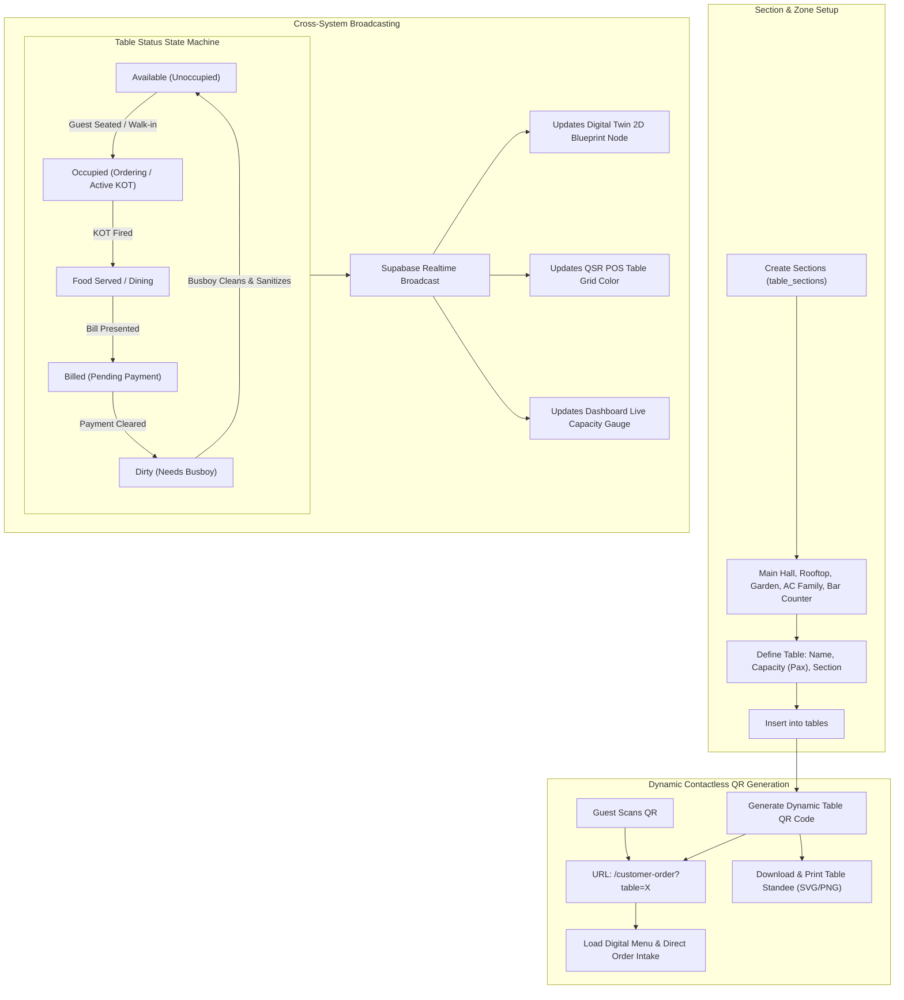

---

## 9. Inventory & FIFO Deductions

### 9.1 Functional Specification
* **Component Path**: [`src/pages/Inventory.tsx`](file:///G:/restaurant/Sudip/tasty-bite-harbor/src/pages/Inventory.tsx)
* **Edge Function**: [`supabase/functions/deduct-inventory-on-prep/index.ts`](file:///G:/restaurant/Sudip/tasty-bite-harbor/supabase/functions/deduct-inventory-on-prep/index.ts)
* **Underlying Tables**: `inventory_items`, `inventory_lots`, `inventory_transactions`, `suppliers`.

#### Key Capabilities:
1. **Raw Material Catalog**:
   * Tracks stock balance, base unit of measurement, minimum reorder thresholds, and suppliers.
2. **Inward Stock & FIFO Lots (`inventory_lots`)**:
   * Each purchase receipt creates a lot row recording `purchase_date`, `unit_cost`, `quantity_remaining`, and batch/expiry info.
3. **Culinary Unit Conversion Table**:
   Normalizes disparate culinary measures to raw stock base units:

   | Measure Group | Input Units | Base Inventory Unit | Conversion Ratio |
   | :--- | :--- | :--- | :--- |
   | **Weight** | `g`, `gram` | `kg` | $\times 0.001$ |
   | **Volume** | `ml`, `milliliter` | `l` | $\times 0.001$ |
   | **Volume (Bar)**| `tbsp` (15ml), `tsp` (5ml) | `l` | $\times 0.015$, $\times 0.005$ |
   | **Volume (Baking)**| `cup` (240ml) | `l` | $\times 0.24$ |
   | **Count** | `piece`, `pcs` | `piece` | $1 : 1$ |
   | **Multipack**| `dozen` | `piece` | $\times 12$ |

4. **FIFO Lot Consumption & COGS Valuation**:
   * When `deduct-inventory-on-prep` executes:
     1. Queries `inventory_lots` where `inventory_item_id = ?` and `quantity_remaining > 0` ordered by `purchase_date ASC` (oldest lot first).
     2. Depletes the oldest lot first until exhausted, then flows into subsequent lots.
     3. Writes immutable rows to `inventory_transactions` with `transaction_type: 'usage'` and exact lot purchase cost.
     4. If lot stock is exhausted, falls back to `inventory_items.cost_per_unit`.
     5. Decrements `inventory_items.quantity = quantity - deductAmount`.

### 9.2 Dedicated Flow Diagram

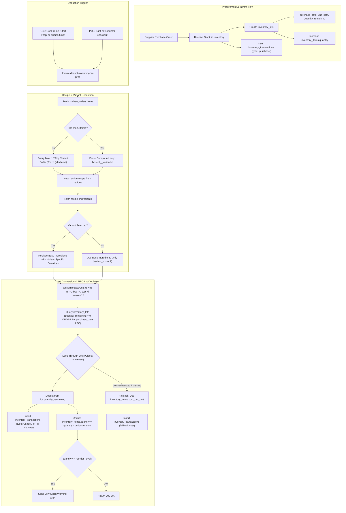

---

## 10. Expenses & Food Wastage Management

### 10.1 Functional Specification
* **Component Path**: [`src/pages/Expenses.tsx`](file:///G:/restaurant/Sudip/tasty-bite-harbor/src/pages/Expenses.tsx)
* **Components**: [`src/components/Expenses/ExpensesList.tsx`](file:///G:/restaurant/Sudip/tasty-bite-harbor/src/components/Expenses/ExpensesList.tsx), [`src/components/Expenses/ExpenseWastageTab.tsx`](file:///G:/restaurant/Sudip/tasty-bite-harbor/src/components/Expenses/ExpenseWastageTab.tsx)
* **Hook**: [`src/hooks/useExpenseData.tsx`](file:///G:/restaurant/Sudip/tasty-bite-harbor/src/hooks/useExpenseData.tsx)
* **Underlying Tables**: `expenses`, `expense_categories`, `inventory_items`, `inventory_transactions`.

#### Key Capabilities:
1. **Operating Expense Logging**:
   * Logs direct and indirect overheads: Rent, Electricity/Gas, Salaries/Wages, Repairs/Maintenance, Marketing, Packaging, and Ingredients.
   * Multi-account tenders: Petty Cash Drawer, Bank Transfer, UPI, Corporate Credit Card.
2. **Food Wastage & Spoilage Ledger (`ExpenseWastageTab.tsx`)**:
   * Records food losses with mandatory reason classification: `Burnt in Kitchen`, `Expired Shelf Life`, `Dropped / Spilled`, `Over-Prepared Batch`.
   * Automatically calculates financial loss:
     $$\text{Loss Amount} = \text{Wasted Quantity} \times \text{Ingredient Cost Per Unit}$$
   * Deducts quantity from `inventory_items`, logs transaction `type: 'waste'` in `inventory_transactions`, and auto-inserts an expense entry into `expenses` under "Food Wastage".
3. **Consolidated P&L Statement**:
   $$\text{Net Operating Profit} = \text{Gross Revenue} - \text{Discounts} - \text{COGS (FIFO Usage)} - \text{Wastage Losses} - \text{Operating Expenses}$$

### 10.2 Dedicated Flow Diagram

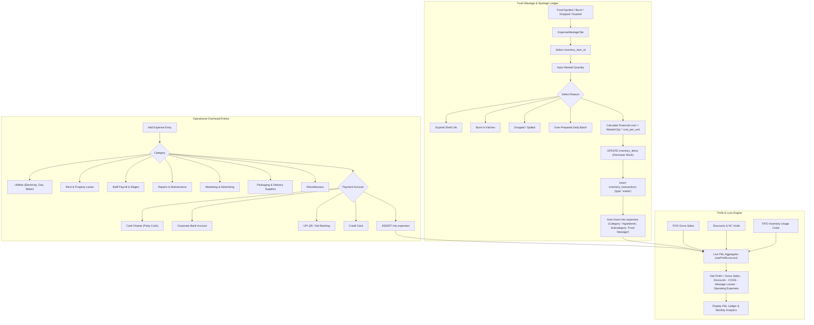

---

## 11. Hardware Thermal & Bluetooth Printing Pipeline

* **Service Path**: [`src/services/thermalPrinterService.ts`](file:///G:/restaurant/Sudip/tasty-bite-harbor/src/services/thermalPrinterService.ts)
* **Native Android Bridge**: [`src/services/nativePrinterBridge.ts`](file:///G:/restaurant/Sudip/tasty-bite-harbor/src/services/nativePrinterBridge.ts)

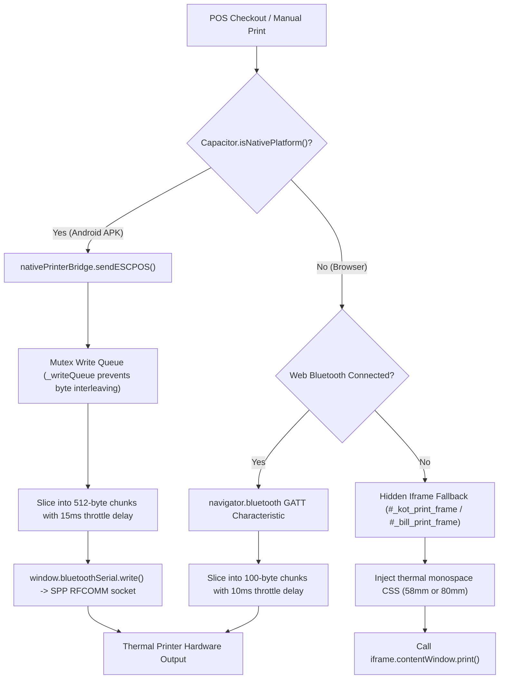

---

## 12. Operations Database Entity Relationship (ER) Diagram

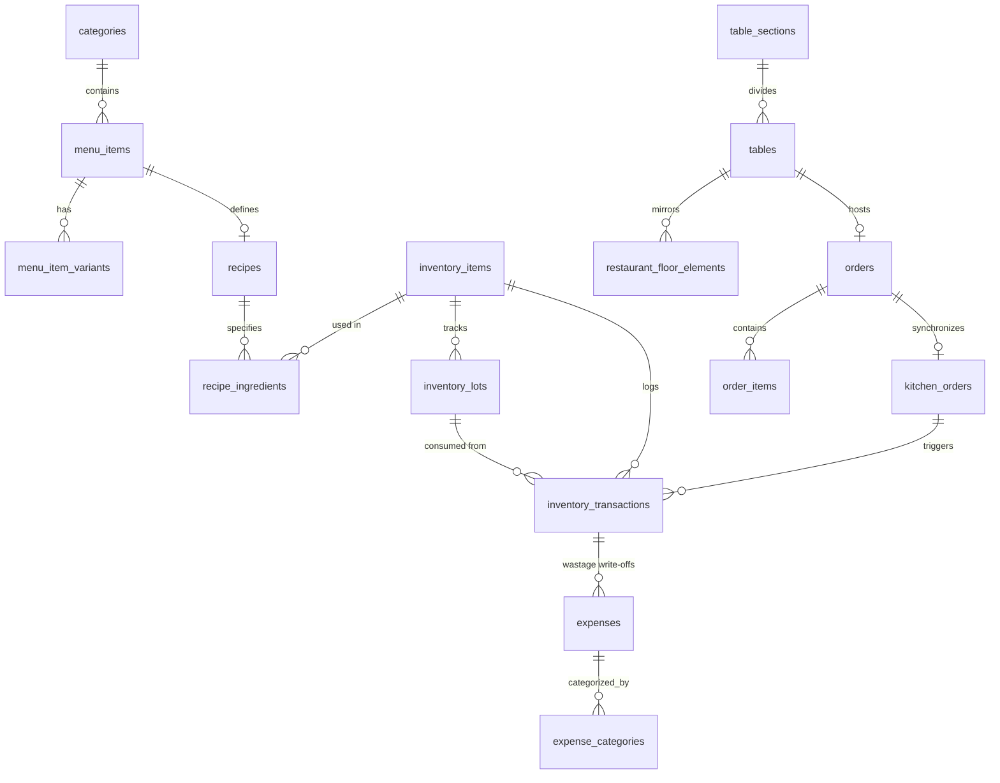
