# Tasty Bite Harbor: Complete Operations Architecture, Component Flow Diagrams & Technical Guide

A comprehensive, unified technical reference document providing both **in-depth functional specifications** and **dedicated Mermaid flowcharts** for all 10 Operations components in the restaurant management system, updated with all latest features, offline capabilities, AI automation, and hardware integrations.

---

## Master System Architecture

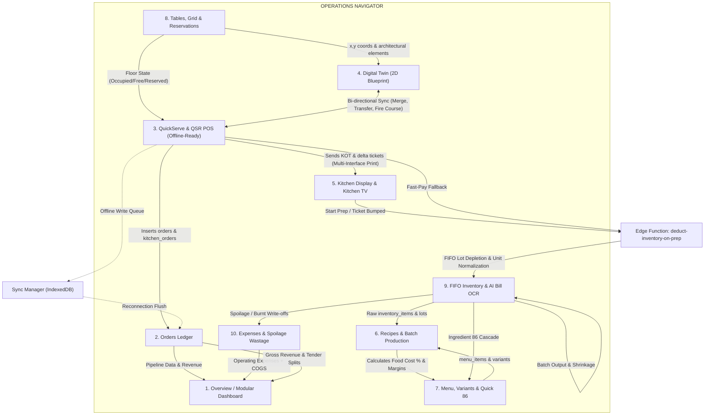
```mermaid
flowchart TD
    subgraph UI_Operations ["OPERATIONS NAVIGATOR"]
        OV["1. Overview / Modular Dashboard"]
        ORD["2. Orders Ledger"]
        POS["3. QuickServe & QSR POS (Offline-Ready)"]
        DT["4. Digital Twin (2D Blueprint)"]
        KDS["5. Kitchen Display & Kitchen TV"]
        RCP["6. Recipes & Batch Production"]
        MNU["7. Menu, Variants & Quick 86"]
        TBL["8. Tables, Grid & Reservations"]
        INV["9. FIFO Inventory & AI Bill OCR"]
        EXP["10. Expenses & Spoilage Wastage"]
    end

    MNU -->|"menu_items & variants"| RCP
    INV -->|"Raw inventory_items & lots"| RCP
    RCP -->|"Calculates Food Cost % & Margins"| MNU
    TBL -->|"x,y coords & architectural elements"| DT
    TBL -->|"Floor State (Occupied/Free/Reserved)"| POS
    DT <-->|"Bi-directional Sync (Merge, Transfer, Fire Course)"| POS
    POS -->|"Inserts orders & kitchen_orders"| ORD
    POS -->|"Sends KOT & delta tickets (Multi-Interface Print)"| KDS
    ORD -->|"Pipeline Data & Revenue"| OV
    KDS -->|"Start Prep / Ticket Bumped"| INV_EDGE["Edge Function: deduct-inventory-on-prep"]
    POS -->|"Fast-Pay Fallback"| INV_EDGE
    INV_EDGE -->|"FIFO Lot Depletion & Unit Normalization"| INV
    INV -->|"Ingredient 86 Cascade"| MNU
    INV -->|"Batch Output & Shrinkage"| INV
    INV -->|"Spoilage / Burnt Write-offs"| EXP
    EXP -->|"Operating Expenses + COGS"| OV
    ORD -->|"Gross Revenue & Tender Splits"| OV
    POS -.->|"Offline Write Queue"| SYNC["Sync Manager (IndexedDB)"]
    SYNC -.->|"Reconnection Flush"| ORD
```

---

## 1. Overview (Dashboard & Analytics)

### 1.1 Functional Specification

* **Component Paths**: [`src/pages/Dashboard.tsx`](file:///g:/restaurant/Sudip/tasty-bite-harbor/src/pages/Dashboard.tsx), [`src/pages/EnhancedDashboard.tsx`](file:///g:/restaurant/Sudip/tasty-bite-harbor/src/pages/EnhancedDashboard.tsx)
* **Modular Widgets**: [`src/components/Dashboard/widgets/WidgetPickerDialog.tsx`](file:///g:/restaurant/Sudip/tasty-bite-harbor/src/components/Dashboard/widgets/WidgetPickerDialog.tsx), [`src/components/Dashboard/widgets/WidgetRenderer.tsx`](file:///g:/restaurant/Sudip/tasty-bite-harbor/src/components/Dashboard/widgets/WidgetRenderer.tsx), [`src/hooks/useWidgetPreferences.ts`](file:///g:/restaurant/Sudip/tasty-bite-harbor/src/hooks/useWidgetPreferences.ts)
* **Food Truck Mode**: [`src/components/Dashboard/FoodTruckDashboard.tsx`](file:///g:/restaurant/Sudip/tasty-bite-harbor/src/components/Dashboard/FoodTruckDashboard.tsx)
* **Data Hooks**: [`src/hooks/useBusinessDashboardData.tsx`](file:///g:/restaurant/Sudip/tasty-bite-harbor/src/hooks/useBusinessDashboardData.tsx), [`src/hooks/useRealtimeSubscription.tsx`](file:///g:/restaurant/Sudip/tasty-bite-harbor/src/hooks/useRealtimeSubscription.tsx)
* **Underlying Tables**: `orders`, `order_items`, `kitchen_orders`, `tables`, `inventory_items`, `expenses`, `user_widget_preferences`.

#### Key Capabilities:

1. **Real-Time Data Ingestion**: Automatically establishes WebSocket subscriptions to PostgreSQL changes on `orders`, `kitchen_orders`, and `expenses`.
2. **Aggregated Business Metrics**:
   * **Gross Sales**: Total value of all orders punched today across POS, Takeaway, Delivery, and QR ordering.
   * **Net Sales**: Gross Sales minus customer discounts, promotional vouchers, and voided/non-chargeable items.
   * **Live Capacity Tracker**: Ratio of occupied tables to total active tables ($occupied / total$).
   * **Kitchen Latency Gauge**: Average preparation delay and current active tickets waiting in kitchen queue.
   * **Stock Threshold Monitor**: Immediate alert count of ingredients currently below their minimum reorder point.
3. **Modular Widget Customization**:
   * Store and retrieve user layout preferences in `user_widget_preferences`.
   * Operators can add, remove, and reorder KPI widgets (Revenue, Active Orders, Table Status, Fast Movers, Kitchen Load).
4. **Specialized Food Truck Mode (`location_type === 'mobile'`)**:
   * Renders [`FoodTruckDashboard.tsx`](file:///g:/restaurant/Sudip/tasty-bite-harbor/src/components/Dashboard/FoodTruckDashboard.tsx) with GPS location publishing, event stop scheduling, battery/generator tracker, and fast-tap counter layout.
5. **Live Profit & Loss Engine**:
   $$
   \text{Gross Sales} - \text{Discounts} - \text{Taxes} - \text{COGS (from FIFO inventory deductions)} - \text{Operating Expenses} = \text{Live Operating Profit}
   $$

### 1.2 Flow Diagram

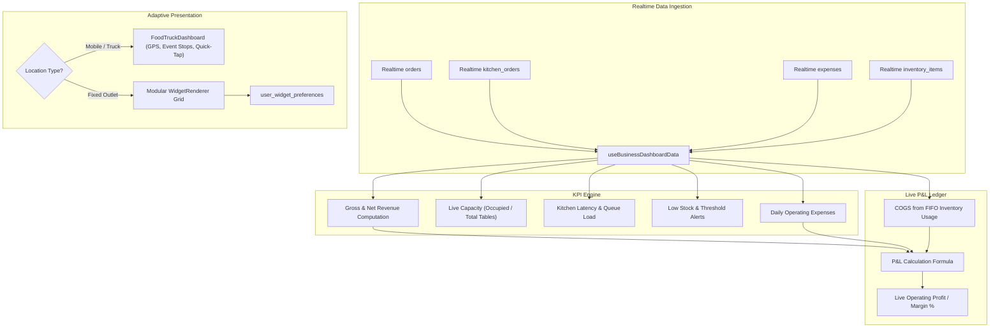
```mermaid
flowchart TD
    subgraph Ingestion ["Realtime Data Ingestion"]
        CH1["Realtime orders"] --> DATA["useBusinessDashboardData"]
        CH2["Realtime kitchen_orders"] --> DATA
        CH3["Realtime expenses"] --> DATA
        CH4["Realtime inventory_items"] --> DATA
    end

    subgraph Computation ["KPI Engine"]
        DATA --> REV["Gross & Net Revenue Computation"]
        DATA --> TBL["Live Capacity (Occupied / Total Tables)"]
        DATA --> KDS_LAT["Kitchen Latency & Queue Load"]
        DATA --> INV_ALERT["Low Stock & Threshold Alerts"]
        DATA --> EXP_CALC["Daily Operating Expenses"]
    end

    subgraph PnL ["Live P&L Ledger"]
        REV --> PNL_ENGINE["P&L Calculation Formula"]
        EXP_CALC --> PNL_ENGINE
        DATA --> FIFO_COGS["COGS from FIFO Inventory Usage"]
        FIFO_COGS --> PNL_ENGINE
        PNL_ENGINE --> PROFIT["Live Operating Profit / Margin %"]
    end

    subgraph Presentation ["Adaptive Presentation"]
        CHECK_TYPE{"Location Type?"}
        CHECK_TYPE -- Mobile / Truck --> TRUCK["FoodTruckDashboard (GPS, Event Stops, Quick-Tap)"]
        CHECK_TYPE -- Fixed Outlet --> WIDGET_GRID["Modular WidgetRenderer Grid"]
        WIDGET_GRID --> PREF["user_widget_preferences"]
    end
```

---

## 2. Orders Ledger Component

### 2.1 Functional Specification

* **Component Path**: [`src/pages/Orders.tsx`](file:///g:/restaurant/Sudip/tasty-bite-harbor/src/pages/Orders.tsx)
* **Components**: [`src/components/Orders/OrderList.tsx`](file:///g:/restaurant/Sudip/tasty-bite-harbor/src/components/Orders/OrderList.tsx), [`src/components/Orders/OrderActions.tsx`](file:///g:/restaurant/Sudip/tasty-bite-harbor/src/components/Orders/OrderActions.tsx)
* **Utilities**: [`src/lib/order-utils.ts`](file:///g:/restaurant/Sudip/tasty-bite-harbor/src/lib/order-utils.ts), [`src/utils/syncManager.ts`](file:///g:/restaurant/Sudip/tasty-bite-harbor/src/utils/syncManager.ts)
* **Underlying Tables**: `orders`, `kitchen_orders`, `crm_customers`.

#### Key Capabilities:

1. **Multi-Source Ingestion**: Unifies orders punched via QuickServe POS, Dine-In table orders, Guest QR orders, Swiggy/Zomato aggregator feeds, and offline queued writes.
2. **Order Lifecycle State Machine**:
   $$
   \text{Pending} \rightarrow \text{Preparing} \rightarrow \text{Ready} \rightarrow \text{Completed}
   $$

   * Supports manager-level **Revert Status** (e.g., from `completed` back to `pending` if payment was accidentally closed).
   * Supports order cancellation and voiding with reason logging.
3. **Data Formatting & Sanitization**:
   * Stored in array format in `orders.items` using [`formatOrderItemString`](file:///g:/restaurant/Sudip/tasty-bite-harbor/src/lib/order-utils.ts#L20-L36):
     ```typescript
     formatOrderItemString(quantity, name, price, notes, modifiers)
     // Output: "2x Farmhouse Pizza (Extra Cheese, Spicy) @350.00"
     ```
4. **CRM & WhatsApp Linkage**:
   * Automatically parses customer mobile number on checkout, fetches or creates `crm_customers` record, and increments loyalty points.
   * Integrated with Edge Function `send-whatsapp-unified` with Meta Cloud API and per-restaurant sender identities (`whatsapp_phone_number_id`).
5. **Non-Chargeable (NC) Orders**:
   * Strict audit compliance requiring mandatory `nc_reason` (e.g., "Owner Table", "Food Tasting", "Guest Complaint").
   * Stored with `order_type: 'non-chargeable'`, net total ₹0.00, isolated from taxable revenue reports.

### 2.2 Flow Diagram

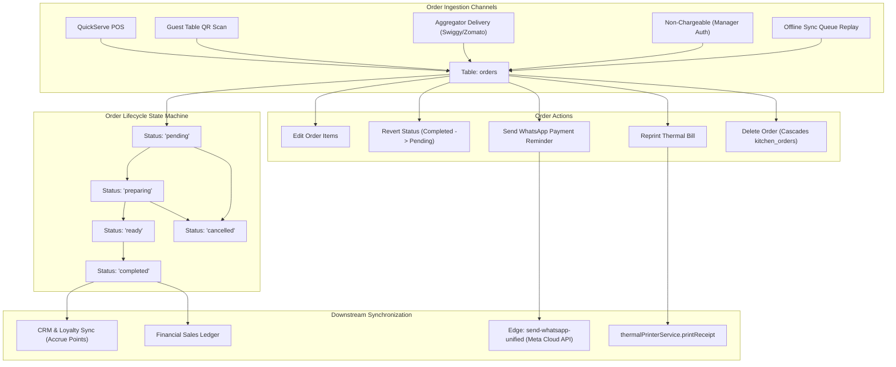
```mermaid
flowchart TD
    subgraph Order_Sources ["Order Ingestion Channels"]
        POS_IN["QuickServe POS"] --> ORDER_TABLE["Table: orders"]
        QR_IN["Guest Table QR Scan"] --> ORDER_TABLE
        DLV_IN["Aggregator Delivery (Swiggy/Zomato)"] --> ORDER_TABLE
        NC_IN["Non-Chargeable (Manager Auth)"] --> ORDER_TABLE
        OFF_IN["Offline Sync Queue Replay"] --> ORDER_TABLE
    end

    subgraph State_Machine ["Order Lifecycle State Machine"]
        ORDER_TABLE --> S1["Status: 'pending'"]
        S1 --> S2["Status: 'preparing'"]
        S2 --> S3["Status: 'ready'"]
        S3 --> S4["Status: 'completed'"]
        S1 --> SX["Status: 'cancelled'"]
        S2 --> SX
    end

    subgraph User_Actions ["Order Actions"]
        ORDER_TABLE --> ACT1["Edit Order Items"]
        ORDER_TABLE --> ACT2["Revert Status (Completed -> Pending)"]
        ORDER_TABLE --> ACT3["Send WhatsApp Payment Reminder"]
        ORDER_TABLE --> ACT4["Reprint Thermal Bill"]
        ORDER_TABLE --> ACT5["Delete Order (Cascades kitchen_orders)"]
    end

    subgraph Integrations ["Downstream Synchronization"]
        S4 --> CRM["CRM & Loyalty Sync (Accrue Points)"]
        ACT3 --> WA_FN["Edge: send-whatsapp-unified (Meta Cloud API)"]
        ACT4 --> PRINT_SVC["thermalPrinterService.printReceipt"]
        S4 --> FIN["Financial Sales Ledger"]
    end
```

---

## 3. QuickServe & QSR POS (Unified Architecture)

### 3.1 Functional Specification

* **Component Paths**: [`src/pages/QuickServePOS.tsx`](file:///g:/restaurant/Sudip/tasty-bite-harbor/src/pages/QuickServePOS.tsx), [`src/components/QSR/QSRPosMain.tsx`](file:///g:/restaurant/Sudip/tasty-bite-harbor/src/components/QSR/QSRPosMain.tsx)
* **Sub-Components**: [`src/components/QuickServe/QSMenuGrid.tsx`](file:///g:/restaurant/Sudip/tasty-bite-harbor/src/components/QuickServe/QSMenuGrid.tsx), [`src/components/QuickServe/QSOrderPanel.tsx`](file:///g:/restaurant/Sudip/tasty-bite-harbor/src/components/QuickServe/QSOrderPanel.tsx), [`src/components/QuickServe/QSPaymentSheet.tsx`](file:///g:/restaurant/Sudip/tasty-bite-harbor/src/components/QuickServe/QSPaymentSheet.tsx), [`src/components/QuickServe/QSHeldOrdersDrawer.tsx`](file:///g:/restaurant/Sudip/tasty-bite-harbor/src/components/QuickServe/QSHeldOrdersDrawer.tsx), [`src/components/QuickServe/QSCustomItemDialog.tsx`](file:///g:/restaurant/Sudip/tasty-bite-harbor/src/components/QuickServe/QSCustomItemDialog.tsx), [`src/components/QuickServe/DailySummaryDialog.tsx`](file:///g:/restaurant/Sudip/tasty-bite-harbor/src/components/QuickServe/DailySummaryDialog.tsx)
* **Offline Sync**: [`src/utils/syncManager.ts`](file:///g:/restaurant/Sudip/tasty-bite-harbor/src/utils/syncManager.ts), [`src/contexts/NetworkStatusContext.tsx`](file:///g:/restaurant/Sudip/tasty-bite-harbor/src/contexts/NetworkStatusContext.tsx)
* **Underlying Tables**: `orders`, `kitchen_orders`, `tables`, `menu_items`, `menu_item_variants`, `promotion_campaigns`, `loyalty_programs`.

> [!NOTE]
> **Architecture Update**: Legacy basic POS (`src/pages/POS.tsx` and `src/components/Orders/POS/POSMode.tsx`) has been completely decommissioned. All POS traffic and aliases are now unified under QuickServe POS.

#### Key Capabilities:

1. **Multi-Mode Operation**:
   * `dine_in`: Table grid selection; updates table status to `occupied`.
   * `takeaway`: Fast counter service with direct customer name/phone intake.
   * `delivery`: Delivery partner routing with rider assignment drawer.
   * `nc`: Non-chargeable authorization with mandatory reason entry.
2. **Offline-First Resilience**:
   * Works uninterrupted when internet fails (`useNetworkStatus`).
   * Generates localized sequence numbers with [`generateOfflineOrderNumber`](file:///g:/restaurant/Sudip/tasty-bite-harbor/src/utils/syncManager.ts#L45-L65).
   * Writes orders to IndexedDB write queue via `enqueueWrite` and automatically syncs to Supabase on reconnection.
3. **Promotions & Loyalty Integration**:
   * **Coupons Engine**: Evaluates active promotional campaigns from `promotion_campaigns` (`min_order_value`, `discount_type`, `discount_value`).
   * **Loyalty Redemption**: Enforces restaurant-configured redemption point caps and conversion rates from `loyalty_programs`.
4. **Ad-Hoc / Custom Item Punching (`QSCustomItemDialog.tsx`)**:
   * Allows punching off-menu, special requests, or open-price items with custom tax rates on the fly.
5. **Hold & Recall Architecture (`useHeldOrders.ts`)**:
   * **Hold Order**: Saves an active cart to `kitchen_orders` with `status: 'held'` to free up the terminal.
   * **Recall Drawer**: Visual badge showing held count; tap to resume or discard.
6. **Multi-Round KOT & Delta Math**:
   * **Round 1 (Initial Order)**: Inserts `kitchen_orders` with `round_number: 1`, `status: 'new'`. Prints initial thermal ticket `*** KOT ***`.
   * **Round 2+ (Add-on Order)**: Computes delta quantity:
     ```typescript
     const previouslyPrinted = existingItem?.printed_qty || 0;
     const delta = item.quantity - previouslyPrinted;
     if (delta > 0) deltaItemsToPrint.push({ ...item, printed_qty: previouslyPrinted });
     ```
   * Sends only delta items to printer with flag `isAddition: true`, producing ticket header `*** ADDITION ***` (Round X).
7. **Daily Cash Register Closing (`DailySummaryDialog.tsx`)**:
   * End-of-shift reconciliation showing tender breakdown (Cash, UPI, Card, NC, Credit), total orders, average ticket size, and variance report.

### 3.2 Flow Diagram

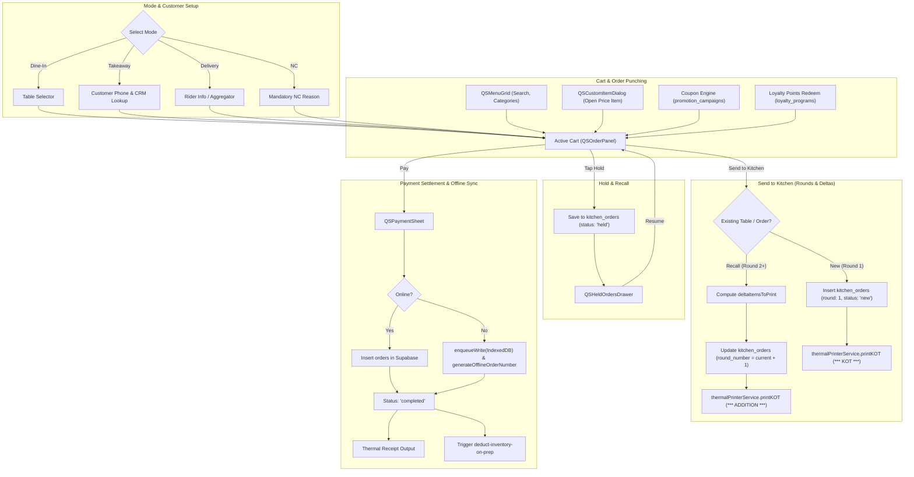
```mermaid
flowchart TD
    subgraph Mode_Select ["Mode & Customer Setup"]
        MODE{"Select Mode"}
        MODE -->|Dine-In| TBL_PICK["Table Selector"]
        MODE -->|Takeaway| CUST["Customer Phone & CRM Lookup"]
        MODE -->|Delivery| DLV["Rider Info / Aggregator"]
        MODE -->|NC| NC_FORM["Mandatory NC Reason"]
    end

    subgraph Cart_Ops ["Cart & Order Punching"]
        TBL_PICK --> CART["Active Cart (QSOrderPanel)"]
        CUST --> CART
        DLV --> CART
        NC_FORM --> CART
      
        MENU["QSMenuGrid (Search, Categories)"] --> CART
        CUSTOM_ITEM["QSCustomItemDialog (Open Price Item)"] --> CART
        COUPON["Coupon Engine (promotion_campaigns)"] --> CART
        LOYALTY["Loyalty Points Redeem (loyalty_programs)"] --> CART
    end

    subgraph Hold_Recall_Flow ["Hold & Recall"]
        CART -->|Tap Hold| HOLD_SAVE["Save to kitchen_orders (status: 'held')"]
        HOLD_SAVE --> HELD_DRAWER["QSHeldOrdersDrawer"]
        HELD_DRAWER -->|Resume| CART
    end

    subgraph Kitchen_Dispatch ["Send to Kitchen (Rounds & Deltas)"]
        CART -->|Send to Kitchen| CHECK_ROUND{"Existing Table / Order?"}
        CHECK_ROUND -- New (Round 1) --> K1["Insert kitchen_orders (round: 1, status: 'new')"]
        CHECK_ROUND -- Recall (Round 2+) --> K2["Compute deltaItemsToPrint"]
        K2 --> K3["Update kitchen_orders (round_number = current + 1)"]
        K1 --> PRINT_KOT["thermalPrinterService.printKOT (*** KOT ***)"]
        K3 --> PRINT_ADD["thermalPrinterService.printKOT (*** ADDITION ***)"]
    end

    subgraph Checkout ["Payment Settlement & Offline Sync"]
        CART -->|Pay| PAY_SHEET["QSPaymentSheet"]
        PAY_SHEET --> NET{"Online?"}
        NET -- Yes --> SUPA_INSERT["Insert orders in Supabase"]
        NET -- No --> OFF_QUEUE["enqueueWrite(IndexedDB) & generateOfflineOrderNumber"]
      
        SUPA_INSERT --> SETTLE_DONE["Status: 'completed'"]
        OFF_QUEUE --> SETTLE_DONE
        SETTLE_DONE --> AUTO_PRINT["Thermal Receipt Output"]
        SETTLE_DONE --> DEDUCT_INV["Trigger deduct-inventory-on-prep"]
    end
```

---

## 4. Digital Twin: Live Outlet Blueprint

### 4.1 Functional Specification

* **Component Path**: [`src/pages/DigitalTwin.tsx`](file:///g:/restaurant/Sudip/tasty-bite-harbor/src/pages/DigitalTwin.tsx)
* **Canvas Components**: [`src/components/Tables/FloorPlanCanvas.tsx`](file:///g:/restaurant/Sudip/tasty-bite-harbor/src/components/Tables/FloorPlanCanvas.tsx), [`src/components/Tables/ArchitecturalElementNode.tsx`](file:///g:/restaurant/Sudip/tasty-bite-harbor/src/components/Tables/ArchitecturalElementNode.tsx)
* **Action Modals**: [`src/components/Tables/TableActionModal.tsx`](file:///g:/restaurant/Sudip/tasty-bite-harbor/src/components/Tables/TableActionModal.tsx), [`src/components/Tables/TableSplitBillDialog.tsx`](file:///g:/restaurant/Sudip/tasty-bite-harbor/src/components/Tables/TableSplitBillDialog.tsx), [`src/components/Tables/TableMergeTransferDialog.tsx`](file:///g:/restaurant/Sudip/tasty-bite-harbor/src/components/Tables/TableMergeTransferDialog.tsx)
* **Hook**: [`src/hooks/useTableFloorPlan.ts`](file:///g:/restaurant/Sudip/tasty-bite-harbor/src/hooks/useTableFloorPlan.ts)
* **Underlying Tables**: `tables`, `table_sections`, `restaurant_floor_elements`, `orders`, `kitchen_orders`.

#### Key Capabilities:

1. **Interactive 2D Blueprint Canvas**:
   * Drag-and-drop table nodes and architectural elements mapped directly to physical coordinates $(x, y)$.
   * Elements supported: Walls, doors, windows, bar counters, cash stations, restrooms, and structural pillars.
   * Element adjustments: Resize $(w, h)$ and rotate in $90^\circ$ increments ($0^\circ, 90^\circ, 180^\circ, 270^\circ$).
2. **Visual Table States & Badges**:
   * `available` (Emerald Green): Ready for seating.
   * `seated` (Blue): Guests seated, ordering in progress.
   * `served` (Orange): Food delivered, dining active.
   * `billed` (Purple): Bill presented, waiting for payment.
   * `dirty` (Gray/Red): Vacated, needs busboy cleaning.
3. **Table Action Modal (`TableActionModal.tsx`)**:
   * **Table Turn Time Tracker**: Displays elapsed dining time ($<30$m Green, $30-60$m Amber, $>60$m Red alert).
   * **Live Running Items**: Itemized list with pricing and KOT prep status.
   * **Course Firing Fast-Buttons**: "Fire Starters", "Fire Mains", "Fire Dessert" triggers course priority broadcasts to Kitchen KDS.
   * **Table Transfer & Merge**: Transfer order items between tables or merge adjacent tabs.
   * **Split Bill Integration**: Direct link to split bill settlement modal (`TableSplitBillDialog.tsx`).
4. **AI Traffic & Revenue Simulation**:
   * Evaluates table turnaround velocity, bottlenecks, and revenue density per seat-hour.

### 4.2 Flow Diagram


```mermaid
flowchart TD
    subgraph Blueprint_Canvas ["2D Blueprint Canvas Engine"]
        SEC["Section Tabs: Main, Patio, Rooftop, AC"] --> CANVAS["FloorPlanCanvas"]
        CANVAS --> ARCH["Architectural Elements (restaurant_floor_elements)"]
        ARCH --> ELEM["Walls, Doors, Windows, Bars, Cash Counters, Restrooms"]
        ELEM --> EDIT["Drag, Resize, Rotate (0°, 90°, 180°, 270°)"]
    end

    subgraph Live_Nodes ["Live Table Nodes & Color States"]
        CANVAS --> TNODES["Table Visual Nodes"]
        TNODES --> ST_AVAIL["Available (Emerald Green)"]
        TNODES --> ST_SEAT["Seated / Ordering (Blue)"]
        TNODES --> ST_SERVE["Food Served / Dining (Orange)"]
        TNODES --> ST_BILL["Bill Presented (Purple)"]
        TNODES --> ST_DIRT["Dirty / Needs Bus (Gray/Red)"]
    end

    subgraph Table_Action_Modal ["Table Interaction Modal"]
        TNODES -->|Click Table| MODAL["TableActionModal"]
        MODAL --> TIMER["Turn-Time Tracker (<30m, 30-60m, >60m alert)"]
        MODAL --> RUNNING["Running Items List & KOT Status Badges"]
      
        MODAL --> ACT_FIRE["Kitchen Course Firing: Starters, Mains, Dessert"]
        MODAL --> ACT_POS["Punch POS Order -> Redirect to /quickserve-pos?table=X"]
        MODAL --> ACT_SPLIT["Split Bill Check -> TableSplitBillDialog"]
        MODAL --> ACT_MERGE["Transfer / Merge -> TableMergeTransferDialog"]
        MODAL --> ACT_CLEAN["Mark Clean & Available"]
    end

    subgraph AI_Simulation ["AI Traffic & Revenue Simulation"]
        SEC --> SIM_TAB["AI Traffic & Revenue Simulation Tab"]
        SIM_TAB --> SIM_ENG["RestaurantSimulation Engine"]
        SIM_ENG --> HEATMAP["Foot-Traffic & Bottleneck Heatmap"]
        SIM_ENG --> METRICS["Revenue per Seat-Hour & Turnaround Velocity"]
    end
```

---

## 5. Kitchen Display System (KDS) & Kitchen TV

### 5.1 Functional Specification

* **Component Paths**: [`src/pages/Kitchen.tsx`](file:///g:/restaurant/Sudip/tasty-bite-harbor/src/pages/Kitchen.tsx), [`src/pages/KitchenTV.tsx`](file:///g:/restaurant/Sudip/tasty-bite-harbor/src/pages/KitchenTV.tsx)
* **Components**: [`src/components/Kitchen/KitchenDisplay.tsx`](file:///g:/restaurant/Sudip/tasty-bite-harbor/src/components/Kitchen/KitchenDisplay.tsx), [`src/components/Kitchen/OrderTicket.tsx`](file:///g:/restaurant/Sudip/tasty-bite-harbor/src/components/Kitchen/OrderTicket.tsx), [`src/components/Kitchen/KitchenVoiceSettings.tsx`](file:///g:/restaurant/Sudip/tasty-bite-harbor/src/components/Kitchen/KitchenVoiceSettings.tsx), [`src/components/Kitchen/KitchenLoadGauge.tsx`](file:///g:/restaurant/Sudip/tasty-bite-harbor/src/components/Kitchen/KitchenLoadGauge.tsx)
* **Audio & Voice Hooks**: [`src/hooks/useKitchenSounds.ts`](file:///g:/restaurant/Sudip/tasty-bite-harbor/src/hooks/useKitchenSounds.ts), [`src/hooks/useActiveKitchenOrders.tsx`](file:///g:/restaurant/Sudip/tasty-bite-harbor/src/hooks/useActiveKitchenOrders.tsx)
* **Aggregator Delivery Hook**: [`src/hooks/useOnlineDelivery.ts`](file:///g:/restaurant/Sudip/tasty-bite-harbor/src/hooks/useOnlineDelivery.ts)
* **Underlying Tables**: `kitchen_orders`, `orders`, `aggregator_stores`.

#### Key Capabilities:

1. **Vernacular Spoken Voice Calls (10+ Indian Languages)**:
   * Speeds up prep by reading new ticket items aloud via browser SpeechSynthesis.
   * Supported: Hindi, Marathi, Gujarati, Bengali, Tamil, Telugu, Kannada, Malayalam, Punjabi, and English.
   * Auto-detects installed OS/Windows speech packs and provides speed rate control ($0.5\times$ to $2.0\times$).
2. **Overdue Order Siren**:
   * Continuous, periodic audible alert for delayed tickets ($>20$ minutes).
3. **Second-by-Second Aging & Urgency Timers**:
   * Fresh ($<10$ mins): Emerald Green.
   * Warning ($10-20$ mins): Amber.
   * Critical Overdue ($\ge 20$ mins): Flashing Crimson Red.
4. **Interactive Drag-and-Drop Item Reordering**:
   * Chefs can drag and reorder items within an order ticket (`@hello-pangea/dnd` in [`OrderTicket.tsx`](file:///g:/restaurant/Sudip/tasty-bite-harbor/src/components/Kitchen/OrderTicket.tsx)) to prioritize urgent components.
5. **Item Completion & Batch Action**:
   * Single click strikes through individual items.
   * "Complete All" button marks entire ticket prepared in one tap.
6. **Ticket Priority Badges**:
   * Supports `normal`, `rush`, and `vip` priority tags with color-coded borders.
7. **Dedicated Kitchen TV Mode (`src/pages/KitchenTV.tsx`)**:
   * Designed for wall-mounted Android TVs and HDMI screens.
   * Easy PIN-based or Email login (no keyboard required).
   * Dynamic font scaling (`text-base`, `text-lg`, `text-xl`) for long-distance readability.
   * Integrated Quick 86 shortcut directly on the TV control bar.
8. **Online Aggregator Live Feed**:
   * Displays Swiggy / Zomato order tags directly on KDS tickets with connected store status (`useOnlineDelivery.ts`).

### 5.2 Flow Diagram

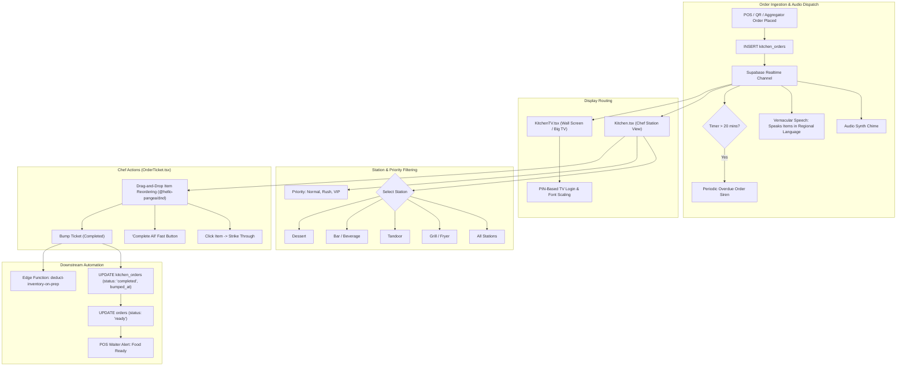
```mermaid
flowchart TD
    subgraph Intake ["Order Ingestion & Audio Dispatch"]
        POS_DISPATCH["POS / QR / Aggregator Order Placed"] --> DB_INSERT["INSERT kitchen_orders"]
        DB_INSERT --> RT_SUB["Supabase Realtime Channel"]
        RT_SUB --> CHIME["Audio Synth Chime"]
        RT_SUB --> SPEECH["Vernacular Speech: Speaks Items in Regional Language"]
        RT_SUB --> OVERDUE_CHECK{"Timer > 20 mins?"}
        OVERDUE_CHECK -- Yes --> SIREN["Periodic Overdue Order Siren"]
    end

    subgraph Displays ["Display Routing"]
        RT_SUB --> KDS_VIEW["Kitchen.tsx (Chef Station View)"]
        RT_SUB --> TV_VIEW["KitchenTV.tsx (Wall Screen / Big TV)"]
        TV_VIEW --> PIN_AUTH["PIN-Based TV Login & Font Scaling"]
    end

    subgraph Station_Routing ["Station & Priority Filtering"]
        KDS_VIEW --> STATION_TABS{"Select Station"}
        STATION_TABS --> ST_ALL["All Stations"]
        STATION_TABS --> ST_GRILL["Grill / Fryer"]
        STATION_TABS --> ST_TANDOOR["Tandoor"]
        STATION_TABS --> ST_BAR["Bar / Beverage"]
        STATION_TABS --> ST_DESSERT["Dessert"]
      
        KDS_VIEW --> PRIORITY["Priority: Normal, Rush, VIP"]
    end

    subgraph Ticket_Execution ["Chef Actions (OrderTicket.tsx)"]
        KDS_VIEW --> DND["Drag-and-Drop Item Reordering (@hello-pangea/dnd)"]
        DND --> ITEM_STRIKE["Click Item -> Strike Through"]
        DND --> COMPLETE_ALL["'Complete All' Fast Button"]
        DND --> BUMP["Bump Ticket (Completed)"]
    end

    subgraph Automation ["Downstream Automation"]
        BUMP --> UPDATE_DB["UPDATE kitchen_orders (status: 'completed', bumped_at)"]
        UPDATE_DB --> SYNC_ORDERS["UPDATE orders (status: 'ready')"]
        BUMP --> INV_DEDUCT["Edge Function: deduct-inventory-on-prep"]
        SYNC_ORDERS --> POS_ALERT["POS Waiter Alert: Food Ready"]
    end
```

---

## 6. Recipes & Batch Production Management

### 6.1 Functional Specification

* **Component Path**: [`src/pages/RecipeManagement.tsx`](file:///g:/restaurant/Sudip/tasty-bite-harbor/src/pages/RecipeManagement.tsx)
* **Hook**: [`src/hooks/useRecipes.tsx`](file:///g:/restaurant/Sudip/tasty-bite-harbor/src/hooks/useRecipes.tsx)
* **Batch Production**: [`src/components/Inventory/HomemadeIngredientPicker.tsx`](file:///g:/restaurant/Sudip/tasty-bite-harbor/src/components/Inventory/HomemadeIngredientPicker.tsx)
* **Underlying Tables**: `recipes`, `recipe_ingredients`, `inventory_items`, `menu_items`, `menu_item_variants`.

#### Key Capabilities:

1. **Bill of Materials (BOM) Linking**:

   * Maps each `menu_items` entry to raw ingredients in `inventory_items`.
   * Defines ingredient quantity and culinary unit (g, kg, ml, l, pcs).
2. **Cost Calculation Engine**:

   $$
   \text{Portion Cost} = \sum (\text{Ingredient Quantity} \times \text{Unit Cost})
   $$

   $$
   \text{Ideal Food Cost \%} = \left( \frac{\text{Portion Cost}}{\text{Selling Price (excl. Tax)}} \right) \times 100
   $$

   $$
   \text{Gross Margin \%} = 100 - \text{Ideal Food Cost \%}
   $$
3. **Variant-Specific Ingredients (Replacement Model)**:

   * Base ingredients (`variant_id IS NULL`) are included in all portion sizes.
   * Specific size ingredients (`variant_id === variant.id`) replace base ingredient quantities.
4. **Batch Production Recipes (Homemade Sub-Recipes)**:

   * Converts raw ingredients into prepared inventory items (e.g., Tomatoes + Herbs $\rightarrow$ Pizza Sauce).
   * Consumes raw materials (`transaction_type: 'production_consumed'`).
   * Credits prepared stock balance (`transaction_type: 'production_output'`).
   * Measures shrinkage / production wastage:
     $$
     \text{Wastage Quantity} = \max(0, \text{Input Weight} - \text{Output Weight})
     $$

### 6.2 Flow Diagram

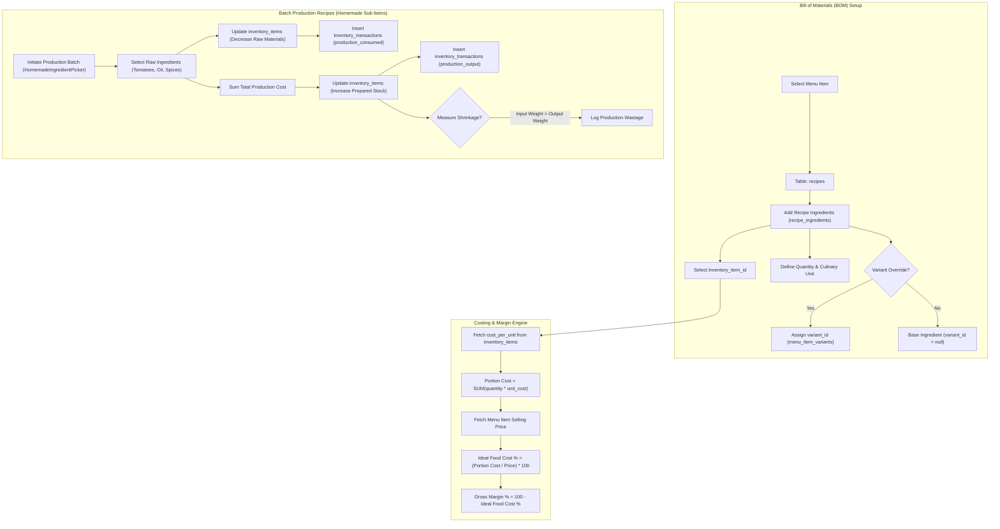
```mermaid
flowchart TD
    subgraph Recipe_Authoring ["Bill of Materials (BOM) Setup"]
        MENU_ITEM["Select Menu Item"] --> RECIPE["Table: recipes"]
        RECIPE --> ING_LIST["Add Recipe Ingredients (recipe_ingredients)"]
        ING_LIST --> RAW_ITEM["Select inventory_item_id"]
        ING_LIST --> QTY["Define Quantity & Culinary Unit"]
        ING_LIST --> VAR_OVERRIDE{"Variant Override?"}
        VAR_OVERRIDE -->|Yes| LINK_VAR["Assign variant_id (menu_item_variants)"]
        VAR_OVERRIDE -->|No| BASE_ING["Base Ingredient (variant_id = null)"]
    end

    subgraph Cost_Analytics ["Costing & Margin Engine"]
        RAW_ITEM --> FETCH_COST["Fetch cost_per_unit from inventory_items"]
        FETCH_COST --> PORTION_COST["Portion Cost = SUM(quantity * unit_cost)"]
        PORTION_COST --> SELLING_PRICE["Fetch Menu Item Selling Price"]
        SELLING_PRICE --> FOOD_COST_PCT["Ideal Food Cost % = (Portion Cost / Price) * 100"]
        FOOD_COST_PCT --> GROSS_MARGIN["Gross Margin % = 100 - Ideal Food Cost %"]
    end

    subgraph Batch_Production ["Batch Production Recipes (Homemade Sub-Items)"]
        PROD_START["Initiate Production Batch (HomemadeIngredientPicker)"] --> PICK_INPUTS["Select Raw Ingredients (Tomatoes, Oil, Spices)"]
        PICK_INPUTS --> DEDUCT_RAW["Update inventory_items (Decrease Raw Materials)"]
        DEDUCT_RAW --> LOG_CONSUMED["Insert inventory_transactions (production_consumed)"]
      
        PICK_INPUTS --> CALC_BATCH_COST["Sum Total Production Cost"]
        CALC_BATCH_COST --> CREDIT_OUTPUT["Update inventory_items (Increase Prepared Stock)"]
        CREDIT_OUTPUT --> LOG_OUTPUT["Insert inventory_transactions (production_output)"]
      
        CREDIT_OUTPUT --> SHRINKAGE{"Measure Shrinkage?"}
        SHRINKAGE -->|Input Weight > Output Weight| LOG_SHRINK["Log Production Wastage"]
    end
```

---

## 7. Menu Management & Quick 86 Cascade

### 7.1 Functional Specification

* **Component Path**: [`src/pages/Menu.tsx`](file:///g:/restaurant/Sudip/tasty-bite-harbor/src/pages/Menu.tsx)
* **Components**: [`src/components/Menu/AddMenuItemForm.tsx`](file:///g:/restaurant/Sudip/tasty-bite-harbor/src/components/Menu/AddMenuItemForm.tsx), [`src/components/Menu/AIImportDialog.tsx`](file:///g:/restaurant/Sudip/tasty-bite-harbor/src/components/Menu/AIImportDialog.tsx), [`src/components/Menu/Quick86Modal.tsx`](file:///g:/restaurant/Sudip/tasty-bite-harbor/src/components/Menu/Quick86Modal.tsx)
* **Hook**: [`src/hooks/use86Cascade.ts`](file:///g:/restaurant/Sudip/tasty-bite-harbor/src/hooks/use86Cascade.ts)
* **Underlying Tables**: `menu_items`, `menu_item_variants`, `categories`.

#### Key Capabilities:

1. **Catalog Architecture**:
   * Categories $\rightarrow$ Subcategories $\rightarrow$ Menu Items $\rightarrow$ Size Variants.
   * Core parameters: Name, base price, tax rate (GST 5%), preparation time, dietary tags (Veg, Non-Veg, Egg, Vegan, Gluten-Free).
2. **Size Variants Engine (`menu_item_variants`)**:
   * Allows offering portion sizes (Regular, Medium, Large, Half, Full) without catalog clutter.
   * **Smart Pricing Hints**:
     * $1.5\times$ base price: `"💡 Tip: ₹${suggested} (1.5× of Small) works well for Medium"`
     * $2.0\times$ base price: `"💡 Tip: ₹${suggested} (2× of Small) is a common Large price"`
3. **Out of Stock 86 Cascade (`use86Cascade.ts`)**:
   * **Single Dish 86**: Toggles `menu_items.is_available = false`, instantly locking the dish across POS, QR menus, and aggregators.
   * **Ingredient 86 Cascade**: When an inventory raw material runs out (e.g., Paneer stock $= 0$), `toggleIngredientCascadeMutation` finds all recipes using that inventory item and 86's all affected dishes simultaneously.
4. **Gemini AI Vision Menu Importer**:
   * Extracts categories, items, prices, and size variants directly from a physical menu photo.

### 7.2 Flow Diagram

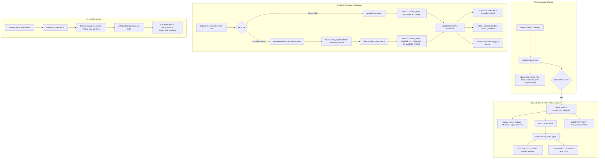
```mermaid
flowchart TD
    subgraph Menu_Creation ["Menu Item Architecture"]
        CAT["Create / Select Category"] --> ITEM_FORM["AddMenuItemForm"]
        ITEM_FORM --> CORE_FIELDS["Name, Base Price, Tax Rate, Prep Time, Diet (Veg/Non-Veg)"]
        ITEM_FORM --> VAR_TOGGLE{"Has Size Variants?"}
    end

    subgraph Variants_Engine ["Size Variants & Smart Pricing Engine"]
        VAR_TOGGLE -- Yes --> VAR_ROWS["Define Variants (menu_item_variants)"]
        VAR_ROWS --> V_NAME["Variant Name: Regular, Medium, Large, Half, Full"]
        VAR_ROWS --> V_PRICE["Input Variant Price"]
      
        V_PRICE --> SMART_HINT["Smart Pricing Hint Engine"]
        SMART_HINT --> HINT1["1.5x of Size 1: '💡 Works well for Medium'"]
        SMART_HINT --> HINT2["2.0x of Size 1: '💡 Common Large price'"]
      
        VAR_ROWS --> DB_VAR["INSERT / UPSERT menu_item_variants"]
    end

    subgraph Out_Of_Stock_86 ["Quick 86 Cascade Architecture"]
        OUT_OF_STOCK["Ingredient Stockout or Chef 86"] --> CHECK_TYPE{"86 Mode"}
      
        CHECK_TYPE -->|Single Dish| DISH_86["toggleDishMutation"]
        DISH_86 --> SET_FALSE["UPDATE menu_items (is_available = false)"]
      
        CHECK_TYPE -->|Ingredient Level| CASCADE_86["toggleIngredientCascadeMutation"]
        CASCADE_86 --> FIND_RECIPES["Scan recipe_ingredients for inventory_item_id"]
        FIND_RECIPES --> FIND_DISHES["Map to linked menu_items"]
        FIND_DISHES --> MASS_DISABLE["UPDATE menu_items WHERE id IN (linkedIds) (is_available = false)"]
      
        SET_FALSE --> REALTIME_SYNC["Supabase Realtime Broadcast"]
        MASS_DISABLE --> REALTIME_SYNC
        REALTIME_SYNC --> POS_LOCK["Grey out & lock item in QuickServe POS"]
        REALTIME_SYNC --> QR_LOCK["Hide / mark sold-out on Guest QR Menu"]
        REALTIME_SYNC --> AGG_SYNC["Push 86 status to Swiggy & Zomato"]
    end

    subgraph AI_Extraction ["AI Vision Scanner"]
        MENU_PHOTO["Capture Paper Menu Photo"] --> GEMINI["Gemini AI Vision OCR"]
        GEMINI --> EXTRACT["Extract Categories, Items, Prices, Size Variants"]
        EXTRACT --> PREVIEW["AIImportDialog (Review & Edit)"]
        PREVIEW --> BULK_SAVE["Bulk INSERT into menu_items & menu_item_variants"]
    end
```

---

## 8. Tables, Grid & Reservations Management

### 8.1 Functional Specification

* **Component Path**: [`src/pages/Tables.tsx`](file:///g:/restaurant/Sudip/tasty-bite-harbor/src/pages/Tables.tsx)
* **Views**:
  * `floorplan`: [`src/components/Tables/FloorPlanCanvas.tsx`](file:///g:/restaurant/Sudip/tasty-bite-harbor/src/components/Tables/FloorPlanCanvas.tsx)
  * `grid`: [`src/components/Tables/TableCard.tsx`](file:///g:/restaurant/Sudip/tasty-bite-harbor/src/components/Tables/TableCard.tsx)
  * `reservations`: [`src/components/Tables/ReservationsList.tsx`](file:///g:/restaurant/Sudip/tasty-bite-harbor/src/components/Tables/ReservationsList.tsx), [`src/components/Tables/TableBookingDialog.tsx`](file:///g:/restaurant/Sudip/tasty-bite-harbor/src/components/Tables/TableBookingDialog.tsx)
  * `qr`: [`src/components/QR/QRCodeManagement.tsx`](file:///g:/restaurant/Sudip/tasty-bite-harbor/src/components/QR/QRCodeManagement.tsx)
* **Hooks**: [`src/hooks/useTables.tsx`](file:///g:/restaurant/Sudip/tasty-bite-harbor/src/hooks/useTables.tsx), [`src/hooks/useReservations.ts`](file:///g:/restaurant/Sudip/tasty-bite-harbor/src/hooks/useReservations.ts), [`src/hooks/useTableFloorPlan.ts`](file:///g:/restaurant/Sudip/tasty-bite-harbor/src/hooks/useTableFloorPlan.ts)
* **Underlying Tables**: `tables`, `table_sections`, `reservations`, `restaurant_floor_elements`.

#### Key Capabilities:

1. **4 Unified View Modes**:
   * **Floorplan**: 2D interactive canvas with architectural elements, rotation, and table turn-time tracking.
   * **Grid View**: High-speed table cards with occupancy tags, active order totals, and quick actions.
   * **Reservations**: Dedicated table booking engine managing guest names, party size, time slots, and check-in status.
   * **QR Management**: Standee QR code generation, preview, and batch export (SVG/PNG).
2. **Section Zones**:
   * Classifies restaurant floor into physical areas (Main Dining, AC Family, Patio, Rooftop, Bar).
3. **Capacity & Seating Control**:
   * Enforces seating limits (2-pax, 4-pax, 8-pax, Banquet) to prevent overbooking.
4. **State Synchronization**:
   * Realtime broadcast on status transitions: `available` $\rightarrow$ `occupied` $\rightarrow$ `dining` $\rightarrow$ `billed` $\rightarrow$ `dirty` $\rightarrow$ `available`.

### 8.2 Flow Diagram

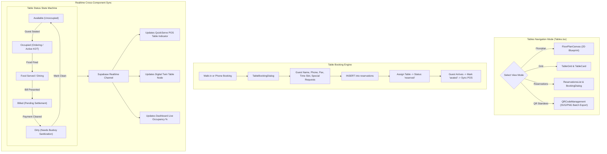
```mermaid
flowchart TD
    subgraph View_Router ["Tables Navigation Mode (Tables.tsx)"]
        VIEW_MODE{"Select View Mode"}
        VIEW_MODE -->|Floorplan| FP["FloorPlanCanvas (2D Blueprint)"]
        VIEW_MODE -->|Grid| GRID["TableGrid & TableCard"]
        VIEW_MODE -->|Reservations| RES["ReservationsList & BookingDialog"]
        VIEW_MODE -->|QR Standees| QR_MGT["QRCodeManagement (SVG/PNG Batch Export)"]
    end

    subgraph Reservation_Flow ["Table Booking Engine"]
        GUEST["Walk-in or Phone Booking"] --> RES_DIALOG["TableBookingDialog"]
        RES_DIALOG --> RES_DATA["Guest Name, Phone, Pax, Time Slot, Special Requests"]
        RES_DATA --> DB_RES["INSERT into reservations"]
        DB_RES --> ASSIGN_TBL["Assign Table -> Status: 'reserved'"]
        ASSIGN_TBL --> CHECKIN["Guest Arrives -> Mark 'seated' -> Sync POS"]
    end

    subgraph State_Transitions ["Table Status State Machine"]
        ST_AVAILABLE["Available (Unoccupied)"] -->|Guest Seated| ST_OCCUPIED["Occupied (Ordering / Active KOT)"]
        ST_OCCUPIED -->|Food Fired| ST_DINING["Food Served / Dining"]
        ST_DINING -->|Bill Presented| ST_BILLED["Billed (Pending Settlement)"]
        ST_BILLED -->|Payment Cleared| ST_DIRTY["Dirty (Needs Busboy Sanitization)"]
        ST_DIRTY -->|Mark Clean| ST_AVAILABLE
    end

    subgraph Cross_Sync ["Realtime Cross-Component Sync"]
        State_Transitions --> BROADCAST["Supabase Realtime Channel"]
        BROADCAST --> POS_GRID["Updates QuickServe POS Table Indicator"]
        BROADCAST --> DT_NODE["Updates Digital Twin Table Node"]
        BROADCAST --> DASH_GAUGE["Updates Dashboard Live Occupancy %"]
    end
```

---

## 9. Inventory, FIFO Deductions & AI Procurement

### 9.1 Functional Specification

* **Component Path**: [`src/pages/Inventory.tsx`](file:///g:/restaurant/Sudip/tasty-bite-harbor/src/pages/Inventory.tsx)
* **Sub-Components**: [`src/components/Inventory/BillUploadDialog.tsx`](file:///g:/restaurant/Sudip/tasty-bite-harbor/src/components/Inventory/BillUploadDialog.tsx), [`src/components/Inventory/PurchaseOrderSuggestions.tsx`](file:///g:/restaurant/Sudip/tasty-bite-harbor/src/components/Inventory/PurchaseOrderSuggestions.tsx), [`src/components/Inventory/Stocktake.tsx`](file:///g:/restaurant/Sudip/tasty-bite-harbor/src/components/Inventory/Stocktake.tsx), [`src/components/Inventory/StorageLocations.tsx`](file:///g:/restaurant/Sudip/tasty-bite-harbor/src/components/Inventory/StorageLocations.tsx), [`src/components/Inventory/InventoryLots.tsx`](file:///g:/restaurant/Sudip/tasty-bite-harbor/src/components/Inventory/InventoryLots.tsx)
* **Edge Function**: [`supabase/functions/deduct-inventory-on-prep/index.ts`](file:///g:/restaurant/Sudip/tasty-bite-harbor/supabase/functions/deduct-inventory-on-prep/index.ts)
* **Partition Migration**: [`supabase/migrations/20260925171500_partition_audit_and_inventory_tables.sql`](file:///g:/restaurant/Sudip/tasty-bite-harbor/supabase/migrations/20260925171500_partition_audit_and_inventory_tables.sql)
* **Underlying Tables**: `inventory_items`, `inventory_lots`, `inventory_transactions` (partitioned monthly), `storage_locations`, `suppliers`, `purchase_orders`.

#### Key Capabilities:

1. **AI Invoice / Bill OCR Scanner (`BillUploadDialog.tsx`)**:

   * Upload supplier paper invoice photo or PDF.
   * Gemini AI Vision OCR extracts supplier, invoice number, items, quantities, unit prices, and GST.
   * Auto-creates `inventory_lots` directly without manual typing.
2. **Inward Stock & FIFO Lots (`inventory_lots`)**:

   * Each purchase receipt logs a lot row: `purchase_date`, `unit_cost`, `quantity_remaining`, and expiry.
3. **Culinary Unit Conversion Table**:
   Normalizes disparate culinary measures to raw stock base units:

   | Measure Group             | Input Units                    | Base Inventory Unit | Conversion Ratio                   |
   | :------------------------ | :----------------------------- | :------------------ | :--------------------------------- |
   | **Weight**          | `g`, `gram`                | `kg`              | $\times 0.001$                   |
   | **Volume**          | `ml`, `milliliter`         | `l`               | $\times 0.001$                   |
   | **Volume (Bar)**    | `tbsp` (15ml), `tsp` (5ml) | `l`               | $\times 0.015$, $\times 0.005$ |
   | **Volume (Baking)** | `cup` (240ml)                | `l`               | $\times 0.24$                    |
   | **Count**           | `piece`, `pcs`             | `piece`           | $1 : 1$                          |
   | **Multipack**       | `dozen`                      | `piece`           | $\times 12$                      |
4. **FIFO Lot Consumption & COGS Valuation**:

   * When `deduct-inventory-on-prep` executes:
     1. Queries `inventory_lots` where `inventory_item_id = ?` and `quantity_remaining > 0` ordered by `purchase_date ASC`.
     2. Depletes the oldest lot first until exhausted, then flows into subsequent lots.
     3. Writes immutable rows to `inventory_transactions` with `transaction_type: 'usage'` and exact lot cost.
     4. Decrements `inventory_items.quantity = quantity - deductAmount`.
5. **AI Purchase Order Suggestions (`PurchaseOrderSuggestions.tsx`)**:

   * Evaluates weekly consumption run-rates and lead times to calculate suggested reorder quantities before stockouts happen.
6. **Physical Stocktake & Reconciliation (`Stocktake.tsx`)**:

   * Periodic shelf counting with variance calculations between system quantity and physical count.
7. **Multi-Location Storage Tracking (`StorageLocations.tsx`)**:

   * Tracks stock across separate physical bins: Deep Freezer, Dry Pantry, Cold Storage, Bar Back.
8. **High-Volume Database Partitioning**:

   * Range partitioning by month on `inventory_transactions` ensures microsecond query latency as transactions scale to millions.

### 9.2 Flow Diagram

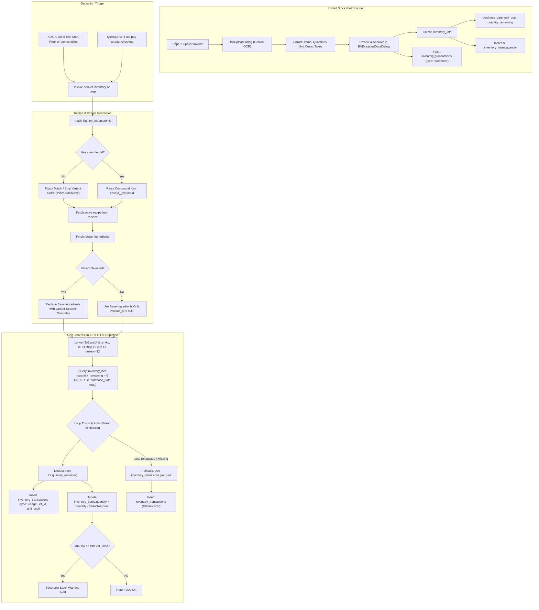
```mermaid
flowchart TD
    subgraph Inward_Procurement ["Inward Stock & AI Scanner"]
        PAPER_BILL["Paper Supplier Invoice"] --> OCR["BillUploadDialog (Gemini OCR)"]
        OCR --> EXTRACT["Extract: Items, Quantities, Unit Costs, Taxes"]
        EXTRACT --> CONFIRM["Review & Approve in BillExtractedDataDialog"]
        CONFIRM --> CREATE_LOT["Create inventory_lots"]
        CREATE_LOT --> LOT_DATA["purchase_date, unit_cost, quantity_remaining"]
        CREATE_LOT --> UPDATE_STOCK["Increase inventory_items.quantity"]
        CONFIRM --> LOG_PURCHASE["Insert inventory_transactions (type: 'purchase')"]
    end

    subgraph Deduct_Trigger ["Deduction Trigger"]
        KDS_PREP["KDS: Cook clicks 'Start Prep' or bumps ticket"] --> TRIGGER_DEDUCT["Invoke deduct-inventory-on-prep"]
        POS_INSTANT["QuickServe: Fast-pay counter checkout"] --> TRIGGER_DEDUCT
    end

    subgraph Resolution ["Recipe & Variant Resolution"]
        TRIGGER_DEDUCT --> FETCH_KO["Fetch kitchen_orders.items"]
        FETCH_KO --> RESOLVE_NAME{"Has menuItemId?"}
        RESOLVE_NAME -- No --> FUZZY["Fuzzy Match / Strip Variant Suffix ('Pizza (Medium)')"]
        RESOLVE_NAME -- Yes --> PARSE_VAR["Parse Compound Key: baseId__variantId"]
      
        FUZZY --> FETCH_RECIPE["Fetch active recipe from recipes"]
        PARSE_VAR --> FETCH_RECIPE
      
        FETCH_RECIPE --> LOAD_INGS["Fetch recipe_ingredients"]
        LOAD_INGS --> REPLACEMENT_MODEL{"Variant Selected?"}
        REPLACEMENT_MODEL -- Yes --> OVERLAY["Replace Base Ingredients with Variant-Specific Overrides"]
        REPLACEMENT_MODEL -- No --> BASE_ONLY["Use Base Ingredients Only (variant_id = null)"]
    end

    subgraph FIFO_Engine ["Unit Conversion & FIFO Lot Depletion"]
        OVERLAY --> CONVERT["convertToBaseUnit: g->kg, ml->l, tbsp->l, cup->l, dozen->12"]
        BASE_ONLY --> CONVERT
      
        CONVERT --> QUERY_LOTS["Query inventory_lots (quantity_remaining > 0 ORDER BY purchase_date ASC)"]
      
        QUERY_LOTS --> LOOP_LOTS{"Loop Through Lots (Oldest to Newest)"}
        LOOP_LOTS --> DEPLETE_LOT["Deduct from lot.quantity_remaining"]
        DEPLETE_LOT --> LOG_USAGE["Insert inventory_transactions (type: 'usage', lot_id, unit_cost)"]
      
        LOOP_LOTS -->|Lots Exhausted / Missing| FALLBACK_COST["Fallback: Use inventory_items.cost_per_unit"]
        FALLBACK_COST --> LOG_FALLBACK_USAGE["Insert inventory_transactions (fallback cost)"]
      
        DEPLETE_LOT --> TOTAL_DEPLETE["Update inventory_items.quantity = quantity - deductAmount"]
        TOTAL_DEPLETE --> REORDER_CHECK{"quantity <= reorder_level?"}
        REORDER_CHECK -- Yes --> ALERT["Send Low Stock Warning Alert"]
        REORDER_CHECK -- No --> COMPLETE["Return 200 OK"]
    end
```

---

## 10. Expenses & Food Wastage Management

### 10.1 Functional Specification

* **Component Path**: [`src/pages/Expenses.tsx`](file:///g:/restaurant/Sudip/tasty-bite-harbor/src/pages/Expenses.tsx)
* **Tabs**:
  * `overview`: [`src/components/Expenses/ExpensesOverview.tsx`](file:///g:/restaurant/Sudip/tasty-bite-harbor/src/components/Expenses/ExpensesOverview.tsx)
  * `expenses`: [`src/components/Expenses/ExpensesList.tsx`](file:///g:/restaurant/Sudip/tasty-bite-harbor/src/components/Expenses/ExpensesList.tsx)
  * `analytics`: [`src/components/Expenses/ExpenseAnalytics.tsx`](file:///g:/restaurant/Sudip/tasty-bite-harbor/src/components/Expenses/ExpenseAnalytics.tsx)
  * `wastage`: [`src/components/Expenses/ExpenseWastageTab.tsx`](file:///g:/restaurant/Sudip/tasty-bite-harbor/src/components/Expenses/ExpenseWastageTab.tsx)
* **Hook**: [`src/hooks/useExpenseData.tsx`](file:///g:/restaurant/Sudip/tasty-bite-harbor/src/hooks/useExpenseData.tsx)
* **Underlying Tables**: `expenses`, `expense_categories`, `inventory_items`, `inventory_transactions`.

#### Key Capabilities:

1. **Operating Expense Logging**:
   * Logs overheads: Rent, Electricity/Gas, Salaries/Wages, Maintenance, Marketing, Packaging, and Ingredients.
   * Multi-account tenders: Petty Cash Drawer, Bank Transfer, UPI, Corporate Credit Card.
2. **Food Wastage & Spoilage Ledger (`ExpenseWastageTab.tsx`)**:
   * Records food losses with mandatory reason classification: `Burnt in Kitchen`, `Expired Shelf Life`, `Dropped / Spilled`, `Over-Prepared Batch`.
   * Automatically calculates financial loss:
     $$
     \text{Loss Amount} = \text{Wasted Quantity} \times \text{Ingredient Cost Per Unit}
     $$
   * Deducts quantity from `inventory_items`, logs transaction `type: 'waste'` in `inventory_transactions`, and auto-inserts an expense entry into `expenses` under "Food Wastage".
3. **Consolidated Live P&L Statement**:
   $$
   \text{Net Operating Profit} = \text{Gross Revenue} - \text{Discounts} - \text{COGS (FIFO Usage)} - \text{Wastage Losses} - \text{Operating Expenses}
   $$

### 10.2 Flow Diagram

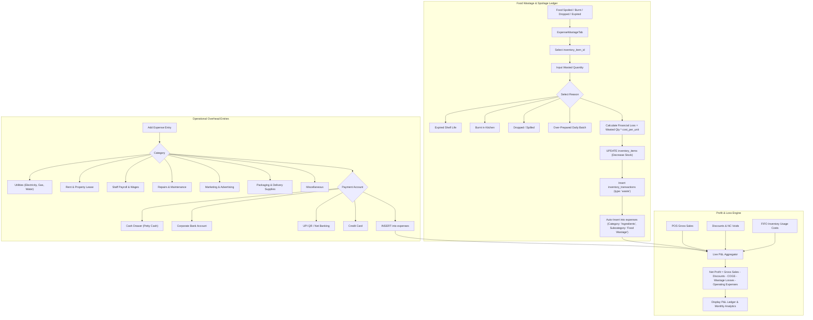
```mermaid
flowchart TD
    subgraph Direct_Expenses ["Operational Overhead Entries"]
        ADD_EXP["Add Expense Entry"] --> EXP_CATEGORY{"Category"}
        EXP_CATEGORY --> C_UTIL["Utilities (Electricity, Gas, Water)"]
        EXP_CATEGORY --> C_RENT["Rent & Property Lease"]
        EXP_CATEGORY --> C_PAY["Staff Payroll & Wages"]
        EXP_CATEGORY --> C_MAINT["Repairs & Maintenance"]
        EXP_CATEGORY --> C_MKT["Marketing & Advertising"]
        EXP_CATEGORY --> C_PKG["Packaging & Delivery Supplies"]
        EXP_CATEGORY --> C_MISC["Miscellaneous"]

        EXP_CATEGORY --> ACCOUNT{"Payment Account"}
        ACCOUNT --> A_CASH["Cash Drawer (Petty Cash)"]
        ACCOUNT --> A_BANK["Corporate Bank Account"]
        ACCOUNT --> A_UPI["UPI QR / Net Banking"]
        ACCOUNT --> A_CARD["Credit Card"]
      
        ACCOUNT --> SAVE_EXP["INSERT into expenses"]
    end

    subgraph Wastage_Ledger ["Food Wastage & Spoilage Ledger"]
        WASTE_OCCUR["Food Spoiled / Burnt / Dropped / Expired"] --> WASTE_TAB["ExpenseWastageTab"]
        WASTE_TAB --> PICK_INV["Select inventory_item_id"]
        PICK_INV --> INPUT_WASTE_QTY["Input Wasted Quantity"]
        INPUT_WASTE_QTY --> REASON{"Select Reason"}
        REASON --> R_EXPIRE["Expired Shelf Life"]
        REASON --> R_BURNT["Burnt in Kitchen"]
        REASON --> R_DROP["Dropped / Spilled"]
        REASON --> R_OVERPREP["Over-Prepared Daily Batch"]

        REASON --> CALC_LOSS["Calculate Financial Loss = Wasted Qty * cost_per_unit"]
        CALC_LOSS --> WRITE_OFF_INV["UPDATE inventory_items (Decrease Stock)"]
        WRITE_OFF_INV --> LOG_WASTE_TRANS["Insert inventory_transactions (type: 'waste')"]
        LOG_WASTE_TRANS --> POST_WASTE_EXP["Auto-Insert into expenses (Category: 'Ingredients', Subcategory: 'Food Wastage')"]
    end

    subgraph PnL_Consolidation ["Profit & Loss Engine"]
        SAVE_EXP --> LIVE_PNL["Live P&L Aggregator"]
        POST_WASTE_EXP --> LIVE_PNL
      
        POS_SALES["POS Gross Sales"] --> LIVE_PNL
        POS_DISCOUNTS["Discounts & NC Voids"] --> LIVE_PNL
        FIFO_COGS["FIFO Inventory Usage Costs"] --> LIVE_PNL

        LIVE_PNL --> EQUATION["Net Profit = Gross Sales - Discounts - COGS - Wastage Losses - Operating Expenses"]
        EQUATION --> REPORT["Display P&L Ledger & Monthly Analytics"]
    end
```

---

## 11. Multi-Interface Hardware Printing Pipeline

* **Service Path**: [`src/services/thermalPrinterService.ts`](file:///g:/restaurant/Sudip/tasty-bite-harbor/src/services/thermalPrinterService.ts)
* **Native Android Bridge**: [`src/services/nativePrinterBridge.ts`](file:///g:/restaurant/Sudip/tasty-bite-harbor/src/services/nativePrinterBridge.ts)
* **Settings & Discovery UI**: [`src/components/Settings/PrinterSettings.tsx`](file:///g:/restaurant/Sudip/tasty-bite-harbor/src/components/Settings/PrinterSettings.tsx)
* **Kiosk Terminal Lock**: [`src/utils/kioskShortcut.ts`](file:///g:/restaurant/Sudip/tasty-bite-harbor/src/utils/kioskShortcut.ts)

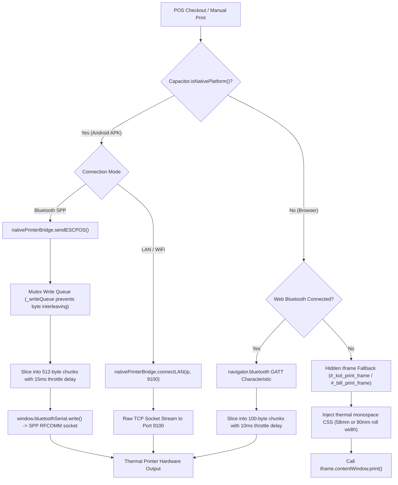
```mermaid
flowchart TD
    A["POS Checkout / Manual Print"] --> B{"Capacitor.isNativePlatform()?"}
  
    %% Native Android Path
    B -- Yes (Android APK) --> C{"Connection Mode"}
  
    C -- Bluetooth SPP --> D["nativePrinterBridge.sendESCPOS()"]
    D --> E["Mutex Write Queue (_writeQueue prevents byte interleaving)"]
    E --> F["Slice into 512-byte chunks with 15ms throttle delay"]
    F --> G["window.bluetoothSerial.write() -> SPP RFCOMM socket"]
    G --> HARDWARE["Thermal Printer Hardware Output"]

    C -- LAN / WiFi --> H["nativePrinterBridge.connectLAN(ip, 9100)"]
    H --> I["Raw TCP Socket Stream to Port 9100"]
    I --> HARDWARE

    %% Web Browser Path
    B -- No (Browser) --> J{"Web Bluetooth Connected?"}
    J -- Yes --> K["navigator.bluetooth GATT Characteristic"]
    K --> L["Slice into 100-byte chunks with 10ms throttle delay"]
    L --> HARDWARE

    %% Browser Fallback
    J -- No --> M["Hidden Iframe Fallback (#_kot_print_frame / #_bill_print_frame)"]
    M --> N["Inject thermal monospace CSS (58mm or 80mm roll width)"]
    N --> O["Call iframe.contentWindow.print()"]
```

### Supported Hardware Capabilities:

1. **Paper Roll Width Selector**:
   * Toggle between `58mm` and `80mm` rolls directly in [`PrinterSettings.tsx`](file:///g:/restaurant/Sudip/tasty-bite-harbor/src/components/Settings/PrinterSettings.tsx), persisted via `setPaperSize`.
2. **Bluetooth Discovery (Android APK)**:
   * Realtime scan for nearby unpaired Bluetooth thermal printers (`discoverUnpairedBluetooth`) with location permission handling.
3. **Direct LAN / Network Socket**:
   * Direct high-speed network socket connection to Port `9100` for kitchen and receipt printers on the same WiFi/LAN network.
4. **Dedicated Kiosk Mode Shortcut**:
   * One-click download of desktop shortcut (`downloadKioskShortcut`) configured to launch Chromium in fullscreen `--kiosk` mode with silent printing enabled.

---

## 12. Operations Database Entity Relationship (ER) Diagram

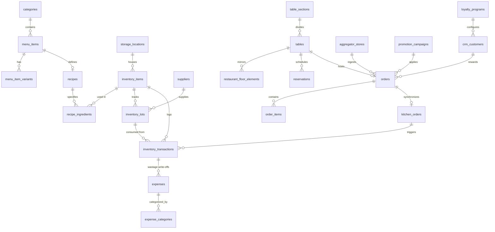
```mermaid
erDiagram
    categories ||--o{ menu_items : contains
    menu_items ||--o{ menu_item_variants : has
    menu_items ||--o| recipes : defines
    recipes ||--o{ recipe_ingredients : specifies
    inventory_items ||--o{ recipe_ingredients : "used in"
    inventory_items ||--o{ inventory_lots : tracks
    inventory_items ||--o{ inventory_transactions : logs
    inventory_lots ||--o{ inventory_transactions : "consumed from"
    storage_locations ||--o{ inventory_items : houses
    suppliers ||--o{ inventory_lots : supplies
  
    table_sections ||--o{ tables : divides
    tables ||--o{ restaurant_floor_elements : mirrors
    tables ||--o{ reservations : schedules
    tables ||--o| orders : hosts
    orders ||--o{ order_items : contains
    orders ||--o| kitchen_orders : synchronizes
    kitchen_orders ||--o{ inventory_transactions : triggers

    aggregator_stores ||--o{ orders : ingests
    promotion_campaigns ||--o{ orders : applies
    loyalty_programs ||--o{ crm_customers : configures
    crm_customers ||--o{ orders : rewards

    expenses ||--o{ expense_categories : categorized_by
    inventory_transactions ||--o{ expenses : "wastage write-offs"
```
