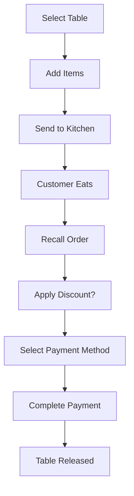
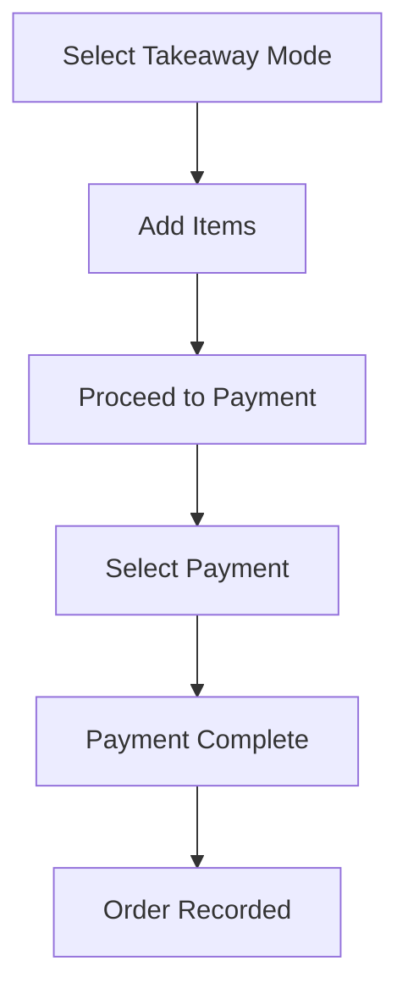
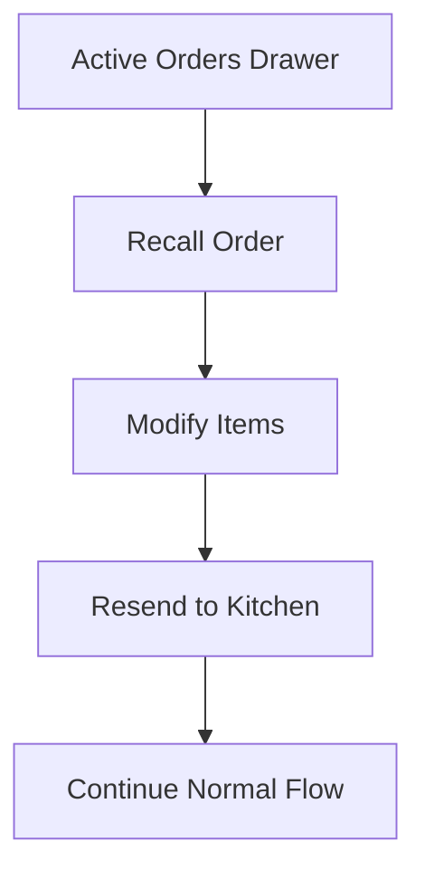

# QSR POS - Quality Assurance Testing Guide

> **Last Updated:** January 2026  
> **Component:** QSR (Quick Service Restaurant) Point of Sale  
> **Test Status:** ✅ All Tests Passing

---

## Table of Contents

1. [Overview](#overview)
2. [Pre-requisites](#pre-requisites)
3. [Test Environment Setup](#test-environment-setup)
4. [Test Cases](#test-cases)
5. [User Flows](#user-flows)
6. [Known Issues](#known-issues)
7. [Regression Testing](#regression-testing)

> 📋 **Test Execution Tracking:** See [QSR-POS-Test-Tracker.md](./QSR-POS-Test-Tracker.md) to record test results and view execution history.

---

## Overview

The QSR POS is a mobile-first, fast-paced ordering system designed for quick-service restaurants. It integrates with the Kitchen Display System (KDS) for real-time order tracking.

### Key Features to Test
- Order creation and management
- Table selection and status tracking
- Multiple payment methods (Cash, Card, UPI)
- Discount application (percentage & flat)
- Kitchen order synchronization
- Order recall and modification

### Architecture

```
┌─────────────────┐     ┌─────────────────┐     ┌─────────────────┐
│   QSR POS UI    │────▶│  Supabase DB    │◀────│      KDS        │
│  (React/TS)     │     │  (PostgreSQL)   │     │  (Real-time)    │
└─────────────────┘     └─────────────────┘     └─────────────────┘
        │                        │
        ▼                        ▼
┌─────────────────┐     ┌─────────────────┐
│ Payment Dialog  │     │  Orders Table   │
│ (Cash/Card/UPI) │     │  Kitchen Orders │
└─────────────────┘     └─────────────────┘
```

---

## Pre-requisites

### Test Credentials
```
Email: jangamsudip@gmail.com
Password: password
```

### Required Setup
1. Development server running (`npm run dev`)
2. Supabase connection configured
3. At least 1 table configured in Tables Management
4. At least 3-5 menu items available

### Access URLs
- QSR POS: `/qsr-pos`
- Kitchen Display: `/kitchen`
- Tables Management: `/tables`
- Orders History: `/orders`

---

## Test Environment Setup

### Starting the Application
```bash
cd g:/restaurant/Sudip/tasty-bite-harbor
npm run dev
# Application runs at http://localhost:8080
```

### Database Tables Used
| Table | Purpose |
|-------|---------|
| `restaurant_tables` | Table configuration and status |
| `kitchen_orders` | Orders sent to kitchen |
| `orders` | Order records for history |
| `menu_items` | Menu items catalog |

---

## Test Cases

### TC-001: Table Selection

| Field | Value |
|-------|-------|
| **Priority** | High |
| **Category** | Order Management |
| **Pre-conditions** | User logged in, Dine-In mode selected |

**Steps:**
1. Navigate to `/qsr-pos`
2. Ensure "Dine In" mode is selected (default)
3. Verify table grid is displayed
4. Click on an available (green) table
5. Verify menu view is shown
6. Verify header shows table name (e.g., "Table T1")

**Expected Results:**
- ✅ Tables display with correct status colors (green=available, orange=occupied)
- ✅ Selected table opens menu view
- ✅ Header updates to show table name
- ✅ Back button appears in header

---

### TC-002: Add Items to Order

| Field | Value |
|-------|-------|
| **Priority** | High |
| **Category** | Order Management |
| **Pre-conditions** | Table selected, menu visible |

**Steps:**
1. Browse menu categories (if multiple exist)
2. Click on a menu item
3. Verify toast notification "Added"
4. Verify cart FAB shows item count
5. Add 2-3 more items
6. Click cart FAB to expand bottom sheet

**Expected Results:**
- ✅ Items appear in cart with correct prices
- ✅ Cart total updates correctly
- ✅ Item count badge updates on FAB

---

### TC-003: Edit Item Quantity

| Field | Value |
|-------|-------|
| **Priority** | High |
| **Category** | Order Management |
| **Pre-conditions** | Items in cart |

**Steps:**
1. Expand cart bottom sheet
2. Find item with quantity controls (+/-)
3. Click "+" to increment quantity
4. Verify quantity increases
5. Click "-" to decrement
6. Verify quantity decreases
7. Decrement to 0 (should remove item)

**Expected Results:**
- ✅ Quantity changes immediately
- ✅ Cart total recalculates
- ✅ Item removed when quantity reaches 0

---

### TC-004: Send to Kitchen (Post-Pay Flow)

| Field | Value |
|-------|-------|
| **Priority** | Critical |
| **Category** | Kitchen Integration |
| **Pre-conditions** | Items in cart, table selected |

**Steps:**
1. Expand cart bottom sheet
2. Click "Send to Kitchen"
3. Verify success toast
4. Navigate to Kitchen Display (`/kitchen`)
5. Verify order appears with correct items

**Expected Results:**
- ✅ Order sent successfully
- ✅ Cart clears after send
- ✅ Table status changes to "occupied"
- ✅ Order visible in KDS with "New Order" status

---

### TC-005: Cash Payment

| Field | Value |
|-------|-------|
| **Priority** | Critical |
| **Category** | Payments |
| **Pre-conditions** | Order sent to kitchen, table occupied |

**Steps:**
1. Click on occupied table
2. Recall order from Active Orders (or it auto-loads)
3. Click "Proceed to Payment"
4. Review order details in confirmation step
5. Click "Proceed to Payment Methods"
6. Select "Cash"
7. Verify payment completes

**Expected Results:**
- ✅ Payment dialog opens with correct total
- ✅ Cash payment processes
- ✅ Success confirmation shown
- ✅ Table returns to "available" status

---

### TC-006: Card Payment

| Field | Value |
|-------|-------|
| **Priority** | Critical |
| **Category** | Payments |
| **Pre-conditions** | Order ready for payment |

**Steps:**
1. Proceed through payment dialog to method selection
2. Select "Card"
3. Verify payment processes

**Expected Results:**
- ✅ Card payment option visible
- ✅ Payment completes successfully
- ✅ Order marked as completed

---

### TC-007: UPI/QR Payment

| Field | Value |
|-------|-------|
| **Priority** | Critical |
| **Category** | Payments |
| **Pre-conditions** | Order ready for payment |

**Steps:**
1. Proceed through payment dialog to method selection
2. Select "UPI / QR Code"
3. Verify QR code is generated
4. Verify amount shown is correct
5. Click "Mark as Paid"

**Expected Results:**
- ✅ QR code displays with correct amount
- ✅ Payment completes on "Mark as Paid"
- ✅ Order marked as completed

---

### TC-008: Percentage Discount

| Field | Value |
|-------|-------|
| **Priority** | High |
| **Category** | Discounts |
| **Pre-conditions** | Order in payment confirmation step |

**Steps:**
1. In payment dialog, locate "Discount (%)" input
2. Enter 10 (for 10% discount)
3. Verify discount amount calculated
4. Verify total reduced correctly

**Expected Results:**
- ✅ Discount shows as "-₹XX.XX"
- ✅ Total recalculates correctly
- ✅ Max discount is 100%

---

### TC-009: Cash (Flat) Discount

| Field | Value |
|-------|-------|
| **Priority** | High |
| **Category** | Discounts |
| **Pre-conditions** | Order in payment confirmation step |

**Steps:**
1. In payment dialog, locate "Cash Discount" input
2. Enter a flat amount (e.g., 50)
3. Verify discount applied
4. Verify total reduced

**Expected Results:**
- ✅ Flat discount applied correctly
- ✅ Cannot exceed subtotal
- ✅ Combined with percentage discount if both set

---

### TC-010: Recall Order

| Field | Value |
|-------|-------|
| **Priority** | High |
| **Category** | Order Management |
| **Pre-conditions** | At least one active order in system |

**Steps:**
1. Click "Active Orders" button in header
2. Find an order in the drawer
3. Click "Recall Order"
4. Verify items loaded into cart

**Expected Results:**
- ✅ Order items appear in cart
- ✅ Correct total displayed
- ✅ Can modify and resend to kitchen

---

### TC-011: Back to Tables Navigation

| Field | Value |
|-------|-------|
| **Priority** | Medium |
| **Category** | Navigation |
| **Pre-conditions** | Table selected, viewing menu |

**Steps:**
1. Select a table to view menu
2. Locate back button (arrow icon) in header
3. Click back button
4. Verify return to table selection

**Expected Results:**
- ✅ Returns to table grid
- ✅ Cart cleared if no order sent
- ✅ Header reverts to "QSR POS"

---

### TC-012: KDS Strikethrough Sync

| Field | Value |
|-------|-------|
| **Priority** | Medium |
| **Category** | KDS Integration |
| **Pre-conditions** | Order in KDS, at least one item completed |

**Steps:**
1. Send order to kitchen
2. Open Kitchen Display (`/kitchen`)
3. Mark an item as complete (checkbox)
4. Return to QSR POS
5. Open payment dialog for that order
6. Check item styling

**Expected Results:**
- ✅ Completed items show strikethrough
- ✅ Green background on completed items
- ✅ "✓ Ready" badge displayed

---

## User Flows

### Flow 1: Complete Dine-In Order (Post-Pay)



### Flow 2: Quick Takeaway (Pre-Pay)



### Flow 3: Modify Existing Order



---

## Known Issues

### Minor Issues (Non-blocking)

| Issue | Workaround | Status |
|-------|------------|--------|
| Session timeout on extended use | Re-login | Monitoring |
| Occasional initial table load delay | Click "Refresh Tables" | Has retry button |

---

## Regression Testing

### When to Run Full Regression

- After major QSR POS changes
- After payment system modifications
- After KDS integration updates
- Before production deployments

### Quick Smoke Test (5 minutes)

1. ✅ Login works
2. ✅ Tables load
3. ✅ Can add items
4. ✅ Send to kitchen works
5. ✅ Cash payment completes

---

## Test Data Cleanup

After testing, clean up test orders:

```sql
-- View test orders (don't run in production!)
SELECT * FROM orders WHERE created_at > NOW() - INTERVAL '1 day';

-- Clean test kitchen orders (use with caution)
DELETE FROM kitchen_orders WHERE source LIKE 'QSR-%' AND created_at > NOW() - INTERVAL '1 hour';
```

---

## Contact

For questions about QSR POS testing, refer to:
- Component: `src/components/QSR/QSRPosMain.tsx`
- Payment: `src/components/Orders/POS/PaymentDialog.tsx`
- Tables: `src/components/QSR/QSRTableGrid.tsx`
