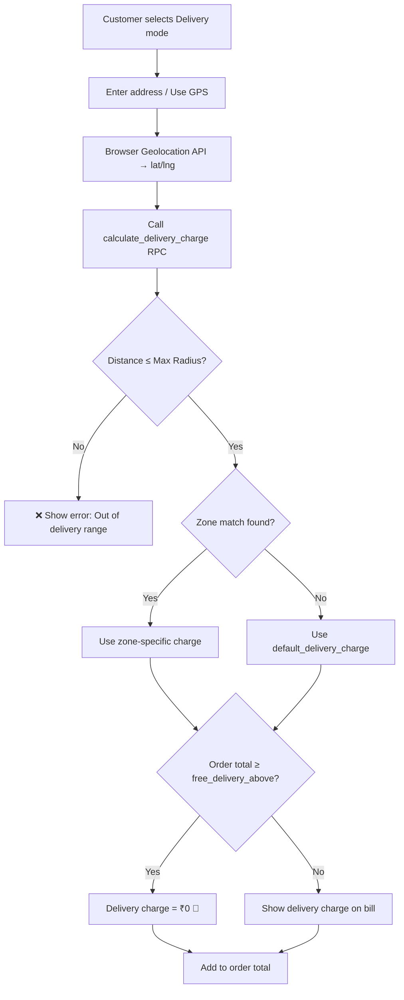

# QuickServe POS — Takeaway + Delivery + Future Online Ordering

Rainy season = less dine-in. QuickServe currently hardcodes `order_type: "takeaway"` for everything. Need to add proper **Counter**, **Takeaway**, and **Delivery** mode selection, plus delivery address/geolocation capture with **distance-based dynamic delivery charges** and **configurable max delivery radius**.

## Current State

| Aspect | Status |
|---|---|
| QuickServe `order_type` | Hardcoded `"takeaway"` everywhere — [QSPaymentSheet.tsx](file:///g:/restaurant/Sudip/tasty-bite-harbor/src/components/QuickServe/QSPaymentSheet.tsx), [QuickServePOS.tsx](file:///g:/restaurant/Sudip/tasty-bite-harbor/src/pages/QuickServePOS.tsx) |
| `orders` table | Has `order_type` column (text, nullable) — already supports any string |
| `orders_unified` table | Has `delivery_address`, `delivery_notes` columns — **`orders` table does NOT** |
| `kitchen_orders` table | Has `order_type` column |
| QSR POS | Already has full mode selector (dine_in/takeaway/delivery/nc) via [QSRModeSelector.tsx](file:///g:/restaurant/Sudip/tasty-bite-harbor/src/components/QSR/QSRModeSelector.tsx) |
| Geo/address | No geolocation columns exist on `orders` table |
| `customers` table | Has name, phone, loyalty_points — no address fields |
| `restaurant_settings` | Exists — no delivery config fields yet |

## Decisions Confirmed

| Question | Answer |
|---|---|
| Production DB | `clmsoetktmvhazctlans` — non-destructive only ✅ |
| Delivery charges | **Distance-based, dynamically calculated** |
| Max delivery radius | **Configurable from Settings** |
| Rider assignment / live tracking | **Phase 3** — basic address capture only for now |

---

## Proposed Changes

### Phase 1: QuickServe Order Mode + Delivery + Dynamic Charges (THIS BUILD)

---

### Database Schema

#### [NEW] Migration: `supabase/migrations/20260707220000_quickserve_delivery_support.sql`

```sql
-- ═══════════════════════════════════════════════════════════════
-- 1. orders table: delivery fields
-- ═══════════════════════════════════════════════════════════════
ALTER TABLE orders ADD COLUMN IF NOT EXISTS delivery_address text;
ALTER TABLE orders ADD COLUMN IF NOT EXISTS delivery_notes text;
ALTER TABLE orders ADD COLUMN IF NOT EXISTS delivery_lat double precision;
ALTER TABLE orders ADD COLUMN IF NOT EXISTS delivery_lng double precision;
ALTER TABLE orders ADD COLUMN IF NOT EXISTS delivery_status text DEFAULT 'pending';
  -- values: pending | assigned | picked_up | delivered | cancelled
ALTER TABLE orders ADD COLUMN IF NOT EXISTS estimated_delivery_time timestamptz;
ALTER TABLE orders ADD COLUMN IF NOT EXISTS delivery_charge numeric(10,2) DEFAULT 0;
ALTER TABLE orders ADD COLUMN IF NOT EXISTS delivery_distance_km numeric(6,2);

-- ═══════════════════════════════════════════════════════════════
-- 2. customers table: saved addresses for repeat delivery
-- ═══════════════════════════════════════════════════════════════
ALTER TABLE customers ADD COLUMN IF NOT EXISTS address text;
ALTER TABLE customers ADD COLUMN IF NOT EXISTS address_lat double precision;
ALTER TABLE customers ADD COLUMN IF NOT EXISTS address_lng double precision;
ALTER TABLE customers ADD COLUMN IF NOT EXISTS landmark text;
ALTER TABLE customers ADD COLUMN IF NOT EXISTS pincode text;

-- ═══════════════════════════════════════════════════════════════
-- 3. delivery_zones: tiered distance-based pricing
-- ═══════════════════════════════════════════════════════════════
CREATE TABLE IF NOT EXISTS delivery_zones (
  id uuid PRIMARY KEY DEFAULT gen_random_uuid(),
  restaurant_id uuid NOT NULL REFERENCES restaurants(id) ON DELETE CASCADE,
  zone_name text NOT NULL,           -- e.g. "0-2 km", "2-5 km", "5-10 km"
  min_distance_km numeric(6,2) NOT NULL DEFAULT 0,
  max_distance_km numeric(6,2) NOT NULL,
  delivery_charge numeric(10,2) NOT NULL DEFAULT 0,
  is_active boolean NOT NULL DEFAULT true,
  created_at timestamptz DEFAULT now(),
  updated_at timestamptz DEFAULT now(),
  CONSTRAINT delivery_zones_distance_check CHECK (max_distance_km > min_distance_km)
);

ALTER TABLE delivery_zones ENABLE ROW LEVEL SECURITY;

CREATE POLICY "delivery_zones_select" ON delivery_zones
  FOR SELECT TO authenticated
  USING (restaurant_id IN (SELECT get_user_accessible_restaurants(auth.uid())));

CREATE POLICY "delivery_zones_insert" ON delivery_zones
  FOR INSERT TO authenticated
  WITH CHECK (restaurant_id IN (SELECT get_user_accessible_restaurants(auth.uid())));

CREATE POLICY "delivery_zones_update" ON delivery_zones
  FOR UPDATE TO authenticated
  USING (restaurant_id IN (SELECT get_user_accessible_restaurants(auth.uid())));

CREATE POLICY "delivery_zones_delete" ON delivery_zones
  FOR DELETE TO authenticated
  USING (restaurant_id IN (SELECT get_user_accessible_restaurants(auth.uid())));

-- ═══════════════════════════════════════════════════════════════
-- 4. restaurant_settings: delivery config
-- ═══════════════════════════════════════════════════════════════
ALTER TABLE restaurant_settings 
  ADD COLUMN IF NOT EXISTS delivery_enabled boolean DEFAULT false;
ALTER TABLE restaurant_settings 
  ADD COLUMN IF NOT EXISTS max_delivery_radius_km numeric(6,2) DEFAULT 10;
ALTER TABLE restaurant_settings 
  ADD COLUMN IF NOT EXISTS restaurant_lat double precision;
ALTER TABLE restaurant_settings 
  ADD COLUMN IF NOT EXISTS restaurant_lng double precision;
ALTER TABLE restaurant_settings 
  ADD COLUMN IF NOT EXISTS default_delivery_charge numeric(10,2) DEFAULT 30;
ALTER TABLE restaurant_settings 
  ADD COLUMN IF NOT EXISTS free_delivery_above numeric(10,2);
  -- NULL = no free delivery threshold

-- ═══════════════════════════════════════════════════════════════
-- 5. Indexes
-- ═══════════════════════════════════════════════════════════════
CREATE INDEX IF NOT EXISTS idx_orders_delivery_status 
  ON orders(restaurant_id, delivery_status) 
  WHERE order_type = 'delivery';

CREATE INDEX IF NOT EXISTS idx_orders_order_type 
  ON orders(restaurant_id, order_type);

CREATE INDEX IF NOT EXISTS idx_delivery_zones_restaurant 
  ON delivery_zones(restaurant_id, is_active);

-- ═══════════════════════════════════════════════════════════════
-- 6. DB function: calculate delivery charge by distance
-- ═══════════════════════════════════════════════════════════════
CREATE OR REPLACE FUNCTION calculate_delivery_charge(
  p_restaurant_id uuid,
  p_delivery_lat double precision,
  p_delivery_lng double precision
) RETURNS jsonb
LANGUAGE plpgsql SECURITY DEFINER
AS $$
DECLARE
  v_restaurant_lat double precision;
  v_restaurant_lng double precision;
  v_max_radius numeric;
  v_distance_km numeric;
  v_charge numeric := 0;
  v_zone_name text := 'default';
  v_default_charge numeric;
  v_free_above numeric;
BEGIN
  -- Get restaurant location and settings
  SELECT restaurant_lat, restaurant_lng, max_delivery_radius_km, 
         default_delivery_charge, free_delivery_above
  INTO v_restaurant_lat, v_restaurant_lng, v_max_radius, 
       v_default_charge, v_free_above
  FROM restaurant_settings
  WHERE restaurant_id = p_restaurant_id
  LIMIT 1;

  -- Restaurant location not set
  IF v_restaurant_lat IS NULL OR v_restaurant_lng IS NULL THEN
    RETURN jsonb_build_object(
      'success', false,
      'error', 'Restaurant location not configured. Set it in Settings → Delivery.'
    );
  END IF;

  -- Haversine distance calculation
  v_distance_km := round(
    (6371 * acos(
      cos(radians(v_restaurant_lat)) * cos(radians(p_delivery_lat)) *
      cos(radians(p_delivery_lng) - radians(v_restaurant_lng)) +
      sin(radians(v_restaurant_lat)) * sin(radians(p_delivery_lat))
    ))::numeric, 2
  );

  -- Check max radius
  IF v_distance_km > COALESCE(v_max_radius, 10) THEN
    RETURN jsonb_build_object(
      'success', false,
      'error', format('Delivery address is %.1f km away. Max radius is %s km.', 
                       v_distance_km, v_max_radius),
      'distance_km', v_distance_km,
      'max_radius_km', v_max_radius
    );
  END IF;

  -- Find matching delivery zone
  SELECT dz.delivery_charge, dz.zone_name
  INTO v_charge, v_zone_name
  FROM delivery_zones dz
  WHERE dz.restaurant_id = p_restaurant_id
    AND dz.is_active = true
    AND v_distance_km >= dz.min_distance_km
    AND v_distance_km < dz.max_distance_km
  ORDER BY dz.min_distance_km
  LIMIT 1;

  -- No zone matched → use default charge
  IF v_charge IS NULL THEN
    v_charge := COALESCE(v_default_charge, 30);
    v_zone_name := 'default';
  END IF;

  RETURN jsonb_build_object(
    'success', true,
    'distance_km', v_distance_km,
    'charge', v_charge,
    'zone_name', v_zone_name,
    'free_delivery_above', v_free_above
  );
END;
$$;
```

---

### Delivery Charge Calculation Flow



---

### Frontend — QuickServe Components

#### [NEW] `src/components/QuickServe/QSModeSelector.tsx`

Order mode selector for QuickServe, foodcart-optimized:
- 3 modes: **🍽️ Counter** | **📦 Takeaway** | **🛵 Delivery**
- Compact pill design matching QuickServe header gradient
- Default mode = `"counter"` (current behavior preserved)
- When "Delivery" selected → shows delivery input below
- Delivery option hidden if `delivery_enabled = false` in settings

#### [NEW] `src/components/QuickServe/QSDeliveryInput.tsx`

Delivery address capture component:
- Text input for full address
- Optional landmark + pincode fields
- **"📍 Use GPS"** button → browser geolocation API → get lat/lng
- Reverse geocode lat/lng to readable address (free Nominatim API)
- **Live delivery charge calculation** — calls `calculate_delivery_charge` RPC as user enters address
- Shows: distance (km), charge (₹), zone name, free delivery threshold
- Out-of-range → red error, blocks order submission
- Auto-fill from customer's saved address if phone matched
- Saves address back to `customers` table on order success

#### [NEW] `src/hooks/useDeliveryConfig.ts`

Hook to fetch delivery settings + zones:
- Fetches `restaurant_settings` delivery columns
- Fetches `delivery_zones` for current restaurant
- Exposes `isDeliveryEnabled`, `maxRadius`, `restaurantLocation`, `zones`
- Exposes `calculateCharge(lat, lng)` → calls RPC

#### [MODIFY] `src/pages/QuickServePOS.tsx`

- Add `orderMode` state: `'counter' | 'takeaway' | 'delivery'` (default: `'counter'`)
- Add delivery state: `deliveryAddress`, `deliveryLat`, `deliveryLng`, `deliveryNotes`, `deliveryCharge`, `deliveryDistance`
- Render `QSModeSelector` in header below stats pills
- Render `QSDeliveryInput` when mode = delivery
- Pass `orderMode` + delivery data to `QSOrderPanel`, `QSPaymentSheet`, `handleSendToKitchen`
- In `handleSendToKitchen`:
  - `counter` → `order_type: 'dine-in'`
  - `takeaway` → `order_type: 'takeaway'`
  - `delivery` → `order_type: 'delivery'` + all delivery fields
- Order total = items subtotal - discounts + **delivery_charge**

#### [MODIFY] `src/components/QuickServe/QSPaymentSheet.tsx`

- Accept `orderMode` and `deliveryCharge` props
- Stop hardcoding `order_type: "takeaway"` — use mode-based value
- For delivery: include `delivery_address`, `delivery_lat`, `delivery_lng`, `delivery_notes`, `delivery_charge`, `delivery_distance_km` in order insert
- Show delivery charge as separate line item in payment summary
- Total = subtotal - discounts + delivery charge

#### [MODIFY] `src/components/QuickServe/QSOrderPanel.tsx`

- Show order mode badge at top (🍽️ Counter | 📦 Takeaway | 🛵 Delivery)
- For delivery: show delivery address summary + charge
- Delivery charge shown as separate line in totals
- Block "Send to Kitchen" / "Pay" if delivery mode but no address

#### [MODIFY] `src/components/QuickServe/QSActiveOrders.tsx`

- Show order type badge on each card (🍽️ / 📦 / 🛵)
- For delivery orders: show address + delivery status
- Add delivery status update buttons: mark picked_up → delivered

#### [MODIFY] `src/components/QuickServe/DailySummaryDialog.tsx`

- Already tracks `delivery` count — ensure `counter` maps to `dine-in` in breakdown
- Add delivery revenue vs delivery charges breakdown in summary

#### [MODIFY] `src/components/QuickServe/QSCustomerInput.tsx`

- When customer found by phone + mode = delivery → auto-populate saved address
- On order success: save/update customer address fields

---

### Settings UI — Delivery Configuration

#### [NEW] `src/components/Settings/DeliverySettings.tsx`

New settings section (add as tab/section in existing Settings page):
- **Enable/Disable Delivery** toggle
- **Restaurant Location** — "Set My Location" button → GPS capture → save lat/lng
- **Max Delivery Radius** — slider/input (km), default 10
- **Default Delivery Charge** — input (₹), fallback when no zone matches
- **Free Delivery Above** — input (₹), nullable (leave blank = no free delivery)
- **Delivery Zones** — CRUD table:

| Zone Name | Min (km) | Max (km) | Charge (₹) | Active |
|---|---|---|---|---|
| Nearby | 0 | 2 | ₹20 | ✅ |
| Medium | 2 | 5 | ₹40 | ✅ |
| Far | 5 | 10 | ₹70 | ✅ |

#### [MODIFY] `src/pages/Settings.tsx`

- Add "Delivery" tab/section linking to `DeliverySettings`

---

### TypeScript Types

#### [MODIFY] `src/integrations/supabase/types.ts`

Regenerate after migration via `npx supabase gen types typescript --project-id clmsoetktmvhazctlans` to pick up new columns on `orders`, `customers`, `restaurant_settings`, and new `delivery_zones` table.

---

## Phase 2: Online Ordering System (FUTURE — Architecture Only)

> [!NOTE]  
> **Not built now.** Schema from Phase 1 is forward-compatible.

### 2A. Customer-Facing Online Storefront

| Component | Design |
|---|---|
| Public menu | Extend existing `/customer-order/:slug` for direct URL access |
| Customer auth | Phone OTP via MSG91 (already integrated) |
| Cart + Checkout | Extend `customer_order_sessions` with `order_type = 'online_delivery'` |
| Address capture | Reuse `QSDeliveryInput` with Google Maps autocomplete |
| Order tracking | `delivery_status` column (Phase 1) → Supabase Realtime |
| Delivery charge | Same `calculate_delivery_charge` RPC — shared logic |

### 2B. Online Payment System

| Component | Design |
|---|---|
| Gateway | Razorpay (already integrated) — extend edge functions |
| UPI | Already have UPI QR generation |
| COD | `payment_method = 'cod'`, `payment_status = 'pending'` |
| Verification | Existing `verify-razorpay-payment` edge function |
| Refunds | Existing `process-razorpay-refund` edge function |

### 2C. Delivery Management (Phase 3)

| Component | Design |
|---|---|
| Rider management | New `delivery_riders` table |
| Order assignment | New `delivery_assignments` table |
| Live tracking | Supabase Realtime on rider location |
| WhatsApp notify | Order confirmation + tracking via MSG91 |

---

## Verification Plan

### Manual Verification
1. Run migration on prod DB `clmsoetktmvhazctlans` — verify columns added, `delivery_zones` table created
2. Open Settings → Delivery → set restaurant location via GPS, configure zones
3. QuickServe POS → verify 3-mode selector appears
4. **Counter order** → `order_type = 'dine-in'` in DB ✅
5. **Takeaway order** → `order_type = 'takeaway'` ✅
6. **Delivery order**:
   - Enter address → GPS capture → distance calculated
   - Charge shown dynamically based on zone
   - Out-of-range address → blocked with error
   - Order saved with all delivery fields ✅
7. Active Orders → delivery badge + address visible
8. Daily Summary → counter/takeaway/delivery breakdown correct
9. Repeat customer → saved address auto-fills
10. Test `free_delivery_above` threshold — charge = ₹0 when order exceeds threshold
