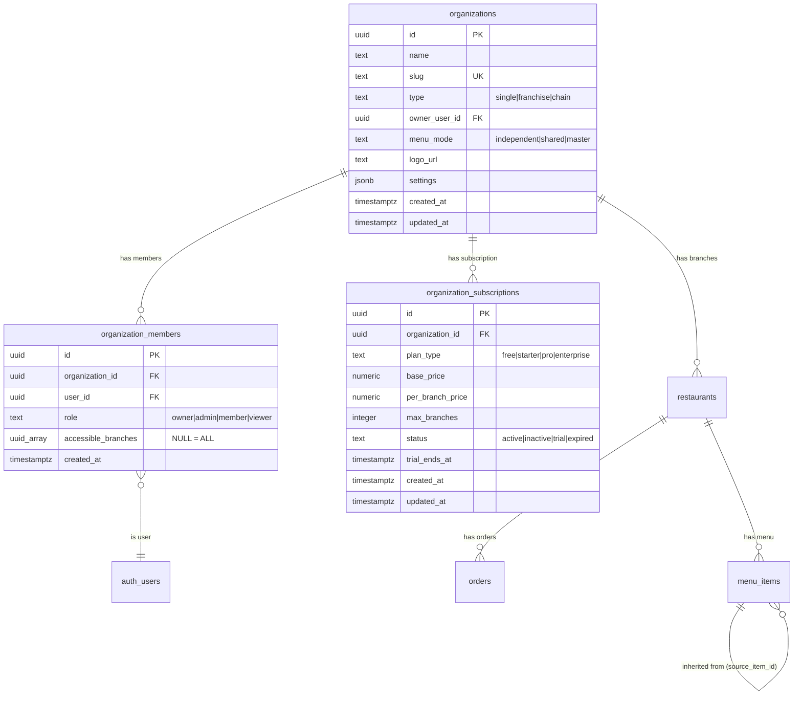

# Franchise Management System — Complete Analysis & Change Specification

**Document Version:** 1.0  
**Date:** 2026-06-28  
**Author:** Systems Architecture Team  
**Status:** DRAFT — Pending Approval  
**Project:** Swadeshi Solutions — Tasty Bite Harbor  
**Supabase Project ID:** `bpheiklhiwwcrugmxivp`

---

## Table of Contents

1. [Executive Summary](#1-executive-summary)
2. [Current System State](#2-current-system-state)
3. [Architecture Decision](#3-architecture-decision)
4. [Database Changes Required](#4-database-changes-required)
5. [DB Impact Analysis](#5-db-impact-analysis)
6. [Frontend Changes Required](#6-frontend-changes-required)
7. [Edge Function Changes](#7-edge-function-changes)
8. [Risk Assessment](#8-risk-assessment)
9. [Testing Strategy](#9-testing-strategy)
10. [Rollback Plan](#10-rollback-plan)
11. [Effort Estimates & Timeline](#11-effort-estimates--timeline)
12. [Open Questions](#12-open-questions)
13. [Appendix: File Reference Map](#13-appendix-file-reference-map)

---

## 1. Executive Summary

This document outlines the complete plan to add **franchise management** to the existing Tasty Bite Harbor restaurant management system. The goal is to allow franchise owners to manage multiple restaurant locations (branches) under a single organization while preserving `restaurant_id` as the primary tenant key across all 126+ existing tables.

### Key Guarantee

> **Single-restaurant users will experience ZERO changes.** An auto-organization is created behind the scenes during data migration. No new screens, no new login flow, no migration from their side.

### Approach Chosen

**Hybrid Org-First (Approach C)** — adds an `organizations` layer on top of existing `restaurants` without rewriting any of the 250+ RLS policies. A single helper function `get_user_accessible_restaurants()` bridges the gap.

### Impact Summary

| Metric | Value |
|---|---|
| New tables created | 3 |
| Existing tables modified | 2 (columns added only) |
| Existing tables untouched | 124+ |
| Existing RLS policies rewritten | 0 |
| New RLS policies added | 6 (on new tables only) |
| Existing data deleted | 0 |
| Risk to production | LOW |

---

## 2. Current System State

### Database

| Metric | Value |
|---|---|
| Total tables | 126+ (all RLS enabled) |
| Total indexes | 349 (127 PK + 6 Unique + 216 FK) |
| Total RLS policies | ~250 |
| Total DB functions | 56 |
| Total edge functions | 46 |
| Active restaurants | 4 |
| Active users | 17 |

### Tenant Isolation Model (Current)

```
profiles.restaurant_id → used by all data hooks
                       → used by all RLS policies (Pattern 1 & 2)
                       → 1 user = 1 restaurant (no multi-branch)
```

### Key Files

| Purpose | Path |
|---|---|
| Restaurant ID hook | `src/hooks/useRestaurantId.tsx` |
| Auth hook | `src/hooks/useAuth.tsx` |
| Access control | `src/hooks/useAccessControl.tsx` |
| Routes | `src/components/Auth/Routes.tsx` |
| App routes | `src/components/Auth/AppRoutes.tsx` |
| Supabase types | `src/integrations/supabase/types.ts` (8,250 lines) |
| Supabase client | `src/integrations/supabase/client.ts` |

### RLS Policy Patterns in Use

| Pattern | Used By | Mechanism |
|---|---|---|
| Pattern 1: Component-Based | ~40 tables | `user_has_table_access(table, restaurant_id)` |
| Pattern 2: Restaurant-Scoped CRUD | ~20 tables | `restaurant_id = get_user_restaurant_id()` |
| Pattern 3: Organization-Scoped | Not yet implemented | — |
| Pattern 4: Public Access (QR/Anon) | 5 tables | Anon role |
| Pattern 5: Platform Admin Override | 5 tables | `is_platform_admin()` |
| Pattern 6: Self-Access (Staff) | 4 tables | `auth.uid() = user_id` |

---

## 3. Architecture Decision

### Why Hybrid Org-First (Approach C)?

Three approaches were evaluated:

| Approach | Description | Effort | Risk | Verdict |
|---|---|---|---|---|
| **A: Org Layer** | Rewrite all 250+ RLS policies to use `organization_id` | 40+ hours | 🔴 High — production risk | ❌ Rejected |
| **B: Franchise Group** | Add `franchise_groups` linking table | 12 hours | 🟡 Medium — becomes technical debt | ❌ Rejected |
| **C: Hybrid Org-First** | Add `organizations` table + helper function, zero RLS rewrites | 22-31 hours | 🟢 Low | ✅ Chosen |

### Architecture Diagram

```
┌──────────────────────────────────────────────────────────────┐
│                     ORGANIZATIONS                            │
│  id, name, slug, type(single|franchise|chain), owner_user_id │
│  menu_mode(independent|shared|master), logo_url, settings    │
├──────────────────────────────────────────────────────────────┤
│     ┌──────────────────┐      ┌──────────────────────────┐  │
│     │ org_members       │      │ org_subscriptions        │  │
│     │ user_id           │      │ plan_type                │  │
│     │ role (owner/      │      │ max_branches             │  │
│     │   admin/member/   │      │ base_price               │  │
│     │   viewer)         │      │ per_branch_price         │  │
│     │ accessible_       │      └──────────────────────────┘  │
│     │   branches[]      │                                    │
│     └──────────────────┘                                     │
│                                                              │
│     ┌─────────────┐  ┌─────────────┐  ┌─────────────┐      │
│     │ Restaurant   │  │ Restaurant   │  │ Restaurant   │      │
│     │ (HQ)         │  │ (Branch 1)   │  │ (Branch 2)   │      │
│     │ branch_code  │  │ branch_code  │  │ branch_code  │      │
│     │ is_hq: true  │  │ is_hq: false │  │ is_hq: false │      │
│     └──────┬──────┘  └──────┬──────┘  └──────┬──────┘      │
│            │                │                │               │
│     All 126+ data     All 126+ data    All 126+ data        │
│     tables FK →       tables FK →      tables FK →          │
│     restaurant_id     restaurant_id    restaurant_id         │
└──────────────────────────────────────────────────────────────┘
```

### ER Diagram (New Tables)



---

## 4. Database Changes Required

### 4.1 Migration File 1: Schema Creation

**File:** `supabase/migrations/20260628_001_franchise_schema.sql`

```sql
-- =============================================
-- FRANCHISE SCHEMA: New Tables + Column Extensions
-- =============================================

BEGIN;

-- 1. Organizations table
CREATE TABLE IF NOT EXISTS organizations (
  id UUID PRIMARY KEY DEFAULT gen_random_uuid(),
  name TEXT NOT NULL,
  slug TEXT UNIQUE,
  type TEXT DEFAULT 'single' CHECK (type IN ('single', 'franchise', 'chain')),
  owner_user_id UUID REFERENCES auth.users(id),
  menu_mode TEXT DEFAULT 'independent' CHECK (menu_mode IN ('independent', 'shared', 'master')),
  logo_url TEXT,
  settings JSONB DEFAULT '{}',
  created_at TIMESTAMPTZ DEFAULT now(),
  updated_at TIMESTAMPTZ DEFAULT now()
);

-- 2. Organization members (franchise-level roles)
CREATE TABLE IF NOT EXISTS organization_members (
  id UUID PRIMARY KEY DEFAULT gen_random_uuid(),
  organization_id UUID NOT NULL REFERENCES organizations(id) ON DELETE CASCADE,
  user_id UUID NOT NULL REFERENCES auth.users(id) ON DELETE CASCADE,
  role TEXT DEFAULT 'member' CHECK (role IN ('owner', 'admin', 'member', 'viewer')),
  accessible_branches UUID[] DEFAULT NULL,  -- NULL = ALL branches
  created_at TIMESTAMPTZ DEFAULT now(),
  UNIQUE(organization_id, user_id)
);

-- 3. Organization subscriptions
CREATE TABLE IF NOT EXISTS organization_subscriptions (
  id UUID PRIMARY KEY DEFAULT gen_random_uuid(),
  organization_id UUID NOT NULL REFERENCES organizations(id) ON DELETE CASCADE,
  plan_type TEXT DEFAULT 'starter' CHECK (plan_type IN ('free', 'starter', 'pro', 'enterprise')),
  base_price NUMERIC(10,2) DEFAULT 0,
  per_branch_price NUMERIC(10,2) DEFAULT 0,
  max_branches INTEGER DEFAULT 1,
  status TEXT DEFAULT 'active' CHECK (status IN ('active', 'inactive', 'trial', 'expired')),
  trial_ends_at TIMESTAMPTZ,
  created_at TIMESTAMPTZ DEFAULT now(),
  updated_at TIMESTAMPTZ DEFAULT now()
);

-- 4. Extend restaurants table (3 nullable columns)
ALTER TABLE restaurants
  ADD COLUMN IF NOT EXISTS organization_id UUID REFERENCES organizations(id) ON DELETE RESTRICT,
  ADD COLUMN IF NOT EXISTS branch_code TEXT DEFAULT 'HQ',
  ADD COLUMN IF NOT EXISTS is_headquarters BOOLEAN DEFAULT false;

-- 5. Extend menu_items for franchise menu sync (3 nullable columns)
ALTER TABLE menu_items
  ADD COLUMN IF NOT EXISTS organization_id UUID REFERENCES organizations(id),
  ADD COLUMN IF NOT EXISTS origin TEXT DEFAULT 'branch' CHECK (origin IN ('master', 'branch', 'inherited')),
  ADD COLUMN IF NOT EXISTS source_item_id UUID REFERENCES menu_items(id);

-- 6. Indexes for performance
CREATE INDEX IF NOT EXISTS idx_org_members_user ON organization_members(user_id);
CREATE INDEX IF NOT EXISTS idx_org_members_org ON organization_members(organization_id);
CREATE INDEX IF NOT EXISTS idx_org_subs_org ON organization_subscriptions(organization_id);
CREATE INDEX IF NOT EXISTS idx_restaurants_org ON restaurants(organization_id);
CREATE INDEX IF NOT EXISTS idx_menu_items_org ON menu_items(organization_id);
CREATE INDEX IF NOT EXISTS idx_menu_items_source ON menu_items(source_item_id);

COMMIT;
```

### 4.2 Migration File 2: Data Migration

**File:** `supabase/migrations/20260628_002_franchise_data_migration.sql`

```sql
-- =============================================
-- DATA MIGRATION: Auto-create orgs for existing restaurants
-- Wrapped in transaction — all or nothing
-- =============================================

BEGIN;

-- Step 1: Create a single-type org for each existing restaurant
DO $$
DECLARE
  r RECORD;
  v_org_id UUID;
  v_owner_id UUID;
BEGIN
  FOR r IN SELECT id, name FROM restaurants WHERE organization_id IS NULL
  LOOP
    -- Generate org
    v_org_id := gen_random_uuid();

    INSERT INTO organizations (id, name, type, menu_mode)
    VALUES (v_org_id, r.name, 'single', 'independent');

    -- Link restaurant to org
    UPDATE restaurants SET
      organization_id = v_org_id,
      is_headquarters = true,
      branch_code = 'HQ'
    WHERE id = r.id;

    -- Find owner/admin for this restaurant
    SELECT p.id INTO v_owner_id
    FROM profiles p
    WHERE p.restaurant_id = r.id
      AND p.role IN ('admin', 'owner')
    LIMIT 1;

    -- Create org membership if owner found
    IF v_owner_id IS NOT NULL THEN
      UPDATE organizations SET owner_user_id = v_owner_id WHERE id = v_org_id;

      INSERT INTO organization_members (organization_id, user_id, role)
      VALUES (v_org_id, v_owner_id, 'owner')
      ON CONFLICT (organization_id, user_id) DO NOTHING;
    END IF;
  END LOOP;
END $$;

COMMIT;
```

### 4.3 Migration File 3: RLS & Functions

**File:** `supabase/migrations/20260628_003_franchise_rls_functions.sql`

```sql
-- =============================================
-- FRANCHISE: RLS Policies + Helper Functions
-- =============================================

BEGIN;

-- ========================
-- HELPER FUNCTION: Get all restaurants a user can access
-- Returns: UUID array of restaurant IDs
-- Used by: franchise-aware RLS policies
-- ========================
CREATE OR REPLACE FUNCTION get_user_accessible_restaurants(p_user_id UUID)
RETURNS UUID[] AS $$
  SELECT COALESCE(
    (SELECT CASE
      WHEN om.accessible_branches IS NOT NULL THEN om.accessible_branches
      ELSE ARRAY_AGG(r.id)
    END
    FROM organization_members om
    JOIN restaurants r ON r.organization_id = om.organization_id
    WHERE om.user_id = p_user_id
    GROUP BY om.accessible_branches),
    ARRAY[(SELECT restaurant_id FROM profiles WHERE id = p_user_id)]
  );
$$ LANGUAGE sql SECURITY DEFINER STABLE;

-- ========================
-- RPC: Atomic franchise creation
-- Creates: organization + HQ restaurant + subscription in one call
-- ========================
CREATE OR REPLACE FUNCTION create_franchise_organization(
  p_org_name TEXT,
  p_org_type TEXT DEFAULT 'franchise',
  p_menu_mode TEXT DEFAULT 'independent',
  p_hq_name TEXT DEFAULT NULL,
  p_hq_branch_code TEXT DEFAULT 'HQ',
  p_plan_type TEXT DEFAULT 'starter',
  p_max_branches INTEGER DEFAULT 5
) RETURNS JSONB AS $$
DECLARE
  v_org_id UUID;
  v_restaurant_id UUID;
  v_sub_id UUID;
BEGIN
  -- Create organization
  INSERT INTO organizations (name, type, menu_mode)
  VALUES (p_org_name, p_org_type, p_menu_mode)
  RETURNING id INTO v_org_id;

  -- Create HQ restaurant
  INSERT INTO restaurants (name, organization_id, branch_code, is_headquarters)
  VALUES (COALESCE(p_hq_name, p_org_name || ' HQ'), v_org_id, p_hq_branch_code, true)
  RETURNING id INTO v_restaurant_id;

  -- Create subscription
  INSERT INTO organization_subscriptions (organization_id, plan_type, max_branches)
  VALUES (v_org_id, p_plan_type, p_max_branches)
  RETURNING id INTO v_sub_id;

  RETURN jsonb_build_object(
    'organization_id', v_org_id,
    'restaurant_id', v_restaurant_id,
    'subscription_id', v_sub_id
  );
END;
$$ LANGUAGE plpgsql SECURITY DEFINER;

-- ========================
-- RLS: organizations
-- ========================
ALTER TABLE organizations ENABLE ROW LEVEL SECURITY;

CREATE POLICY "org_select" ON organizations FOR SELECT TO authenticated
  USING (
    id IN (SELECT organization_id FROM organization_members WHERE user_id = auth.uid())
    OR is_platform_admin()
  );

CREATE POLICY "org_insert" ON organizations FOR INSERT TO authenticated
  WITH CHECK (is_platform_admin());

CREATE POLICY "org_update" ON organizations FOR UPDATE TO authenticated
  USING (
    owner_user_id = auth.uid() OR is_platform_admin()
  );

-- ========================
-- RLS: organization_members
-- ========================
ALTER TABLE organization_members ENABLE ROW LEVEL SECURITY;

CREATE POLICY "orgmem_select" ON organization_members FOR SELECT TO authenticated
  USING (
    user_id = auth.uid()
    OR organization_id IN (
      SELECT organization_id FROM organization_members
      WHERE user_id = auth.uid() AND role IN ('owner', 'admin')
    )
    OR is_platform_admin()
  );

CREATE POLICY "orgmem_manage" ON organization_members FOR ALL TO authenticated
  USING (
    organization_id IN (
      SELECT organization_id FROM organization_members
      WHERE user_id = auth.uid() AND role IN ('owner', 'admin')
    )
    OR is_platform_admin()
  );

-- ========================
-- RLS: organization_subscriptions
-- ========================
ALTER TABLE organization_subscriptions ENABLE ROW LEVEL SECURITY;

CREATE POLICY "orgsub_select" ON organization_subscriptions FOR SELECT TO authenticated
  USING (
    organization_id IN (SELECT organization_id FROM organization_members WHERE user_id = auth.uid())
    OR is_platform_admin()
  );

CREATE POLICY "orgsub_manage" ON organization_subscriptions FOR ALL TO authenticated
  USING (is_platform_admin());

-- ========================
-- CRITICAL: Extend existing restaurants RLS for franchise owners
-- Without this, franchise owners can only see their profiles.restaurant_id
-- ========================
CREATE POLICY "Franchise owner can view branches" ON restaurants
  FOR SELECT TO authenticated
  USING (
    id = ANY(get_user_accessible_restaurants(auth.uid()))
  );

CREATE POLICY "Franchise owner can update branches" ON restaurants
  FOR UPDATE TO authenticated
  USING (
    id = ANY(get_user_accessible_restaurants(auth.uid()))
  );

COMMIT;
```

---

## 5. DB Impact Analysis

### 5.1 Tables Impact Matrix

| Category | Count | Details |
|---|---|---|
| **New tables** | 3 | `organizations`, `organization_members`, `organization_subscriptions` |
| **Modified tables** (columns added) | 2 | `restaurants` (+3 cols), `menu_items` (+3 cols) |
| **Untouched tables** | 124+ | All orders, inventory, staff, financial, hotel, CRM, loyalty, marketing, payment, QR, audit tables |
| **RLS policies rewritten** | 0 | Existing policies remain as-is |
| **RLS policies added** | 8 | 6 on new tables + 2 on `restaurants` |

### 5.2 Column Changes Detail

#### `restaurants` Table (46 → 49 columns)

| New Column | Type | Default | Nullable | FK | Purpose |
|---|---|---|---|---|---|
| `organization_id` | UUID | NULL | Yes | `organizations(id) ON DELETE RESTRICT` | Links restaurant to franchise org |
| `branch_code` | TEXT | `'HQ'` | Yes | — | Human-readable branch identifier |
| `is_headquarters` | BOOLEAN | `false` | Yes | — | Marks the primary branch |

#### `menu_items` Table (15 → 18 columns)

| New Column | Type | Default | Nullable | FK | Purpose |
|---|---|---|---|---|---|
| `organization_id` | UUID | NULL | Yes | `organizations(id)` | For cross-branch menu queries |
| `origin` | TEXT | `'branch'` | Yes | — | `master`/`branch`/`inherited` |
| `source_item_id` | UUID | NULL | Yes | `menu_items(id)` self-ref | Points to master menu item |

### 5.3 Blast Radius (Measured from Codebase)

| What | Count | Will It Break? | Why |
|---|---|---|---|
| Frontend `.from("restaurants")` queries | **47 occurrences** (~35 files) | **No** | Existing SELECTs don't mention new columns; new columns are nullable |
| Frontend `.from("menu_items")` queries | **18 occurrences** | **No** | Same reason — additive nullable columns |
| Edge functions referencing `restaurants` or `menu_items` | **32 occurrences** | **No** | Server-side queries unaffected by additive columns |
| Supabase auto-generated types | **8,250 lines** in `types.ts` | **Yes — must regenerate** | New columns must be reflected in TypeScript types |
| `restaurant` slug trigger | 1 trigger | **No** | Only fires on `name` column changes |

### 5.4 Data Migration Impact

| Operation | Rows | Reversible? |
|---|---|---|
| INSERT into `organizations` | 4 new rows | Yes — `DROP TABLE` |
| UPDATE `restaurants.organization_id` | 4 rows | Yes — `SET NULL` |
| UPDATE `restaurants.is_headquarters` | 4 rows | Yes — `SET NULL` |
| UPDATE `restaurants.branch_code` | 4 rows | Yes — `SET NULL` |
| INSERT into `organization_members` | 4-8 rows | Yes — `DROP TABLE` |

---

## 6. Frontend Changes Required

### 6.1 New Files

| File | Purpose |
|---|---|
| `src/contexts/OrganizationContext.tsx` | Multi-org/branch awareness context |
| `src/hooks/useOrganization.ts` | Shorthand for OrganizationContext |
| `src/hooks/useBranchSwitcher.ts` | Branch switch logic + cache invalidation |
| `src/components/Auth/FranchiseGuard.tsx` | Route guard for franchise routes |
| `src/components/Franchise/FranchiseLayout.tsx` | Sidebar layout for `/franchise/*` |
| `src/components/Layout/BranchSwitcher.tsx` | Header dropdown for branch switching |
| `src/pages/Franchise/FranchiseDashboard.tsx` | Cross-branch KPIs |
| `src/pages/Franchise/BranchManagement.tsx` | Add/edit/deactivate branches |
| `src/pages/Franchise/TeamManagement.tsx` | Invite users, assign org roles |
| `src/pages/Franchise/MenuSync.tsx` | Master menu editor |
| `src/pages/Franchise/CrossBranchOrders.tsx` | Aggregated order view |
| `src/pages/Franchise/CrossBranchInventory.tsx` | Stock levels across branches |
| `src/pages/Franchise/CrossBranchStaff.tsx` | Staff overview across branches |
| `src/pages/Franchise/CrossBranchPnL.tsx` | Consolidated P&L |
| `src/pages/Franchise/FranchiseSettings.tsx` | Org settings |
| `src/pages/Platform/FranchiseManagement.tsx` | Platform admin wizard (new/overwrite) |
| `src/pages/Platform/FranchiseDetail.tsx` | Platform admin franchise detail |

### 6.2 Modified Files

| File | Change | Risk |
|---|---|---|
| `src/hooks/useRestaurantId.tsx` | Add org-aware branch: if org member → return `currentBranch.id`, else → existing behavior | 🟡 Medium — core hook |
| `src/components/Auth/Routes.tsx` | Add `/franchise/*` route group | 🟢 Low — additive |
| `src/App.tsx` | Wrap with `<OrganizationProvider>` | 🟢 Low — additive |
| `src/integrations/supabase/types.ts` | Regenerate via CLI | 🟢 Low — automated |
| Sidebar/Header component | Add `<BranchSwitcher />` | 🟡 Medium — modifies existing UI |

### 6.3 User Roles

| Role | Scope | Access | Routes |
|---|---|---|---|
| **Platform Admin** | System-wide | Create orgs, manage all | `/platform/*` |
| **Franchise Owner** | Organization | All branches, full management | `/franchise/*` |
| **Franchise Admin** | Organization | Delegated branches | `/franchise/*` |
| **Franchise Viewer** | Organization | Read-only cross-branch | `/franchise/*` |
| **Restaurant Admin** | Single branch | Full access to their restaurant | `/dashboard/*` |
| **Manager** | Single branch | Operational management | `/dashboard/*` |
| **Chef/Waiter/Staff** | Single branch | Role-scoped | `/dashboard/*` |

### 6.4 Franchise Manager Windows (9 Total)

| # | Route | Purpose |
|---|---|---|
| 1 | `/franchise` | Dashboard — cross-branch KPIs: total revenue, orders, top branch, alerts |
| 2 | `/franchise/branches` | Branch Management — add/edit/deactivate branches, set HQ |
| 3 | `/franchise/team` | Team Management — invite users, assign org roles, set branch access |
| 4 | `/franchise/menu-sync` | Menu Sync — master menu editor, push to branches, price overrides |
| 5 | `/franchise/orders` | Cross-Branch Orders — aggregated view with branch filter |
| 6 | `/franchise/inventory` | Cross-Branch Inventory — stock levels, low-stock alerts |
| 7 | `/franchise/staff` | Cross-Branch Staff — overview, attendance summary |
| 8 | `/franchise/pnl` | Cross-Branch P&L — consolidated + branch breakdown |
| 9 | `/franchise/settings` | Franchise Settings — org name, logo, menu mode, subscription |

---

## 7. Edge Function Changes

### 7.1 New Edge Function

| Function | Purpose |
|---|---|
| `invite-franchise-owner` | Creates auth user (or links existing), creates profile with `restaurant_id` = HQ, creates `organization_members` row with `role = 'owner'`, sends invite email via Resend |

### 7.2 Existing Edge Functions

**No modifications required.** All 46 existing edge functions operate on `restaurant_id` which remains unchanged.

---

## 8. Risk Assessment

### 8.1 Critical Risks

| # | Risk | Probability | Impact | Mitigation |
|---|---|---|---|---|
| 1 | **Data migration fails mid-way** — partial orgs created, restaurants left without `organization_id` | Low | 🔴 High | Entire migration wrapped in `BEGIN...COMMIT` transaction. Any failure = full rollback. |
| 2 | **Existing `restaurants` RLS blocks franchise owner** — current policy: `id IN (SELECT restaurant_id FROM profiles WHERE id = auth.uid())`. A franchise owner whose `profiles.restaurant_id` = HQ cannot see Branch 2. | Medium | 🔴 High | Migration adds new RLS policies: `id = ANY(get_user_accessible_restaurants(auth.uid()))`. This is the **most critical SQL** in the migration. |

### 8.2 Medium Risks

| # | Risk | Probability | Impact | Mitigation |
|---|---|---|---|---|
| 3 | **`ALTER TABLE` locks table** — concurrent INSERT/UPDATE waits | Low (4 rows) | 🟡 Medium | Run during off-peak (3 AM). Lock duration <10ms with 4 rows. |
| 4 | **`types.ts` out of sync** — TypeScript errors | High (will happen) | 🟡 Medium | Run `supabase gen types typescript` immediately after migration. |
| 5 | **`get_user_accessible_restaurants()` slow** — degrades all RLS queries for franchise users | Low | 🟡 Medium | Function marked `STABLE` (cached per transaction). Index on `organization_members(user_id)`. Sub-millisecond with 4 restaurants. |

### 8.3 Low Risks

| # | Risk | Probability | Impact | Mitigation |
|---|---|---|---|---|
| 6 | **Cascade delete destroys data** — deleting org wipes restaurants | Low | 🟡 Medium | `ON DELETE RESTRICT` on FK. Cannot delete org while branches exist. |
| 7 | **Slug trigger conflict** — fires when updating restaurants | Low | 🟢 Low | Slug trigger only fires on `name` changes. Our UPDATE sets `organization_id`, `branch_code`, `is_headquarters`. No conflict. |

---

## 9. Testing Strategy

### Stage 1: Local Supabase (Dev Machine)

```bash
# Reset local DB and replay all migrations
npx supabase db reset

# Verify tables created
npx supabase db lint

# Verify data migration
psql -c "SELECT r.name, o.name as org_name, r.branch_code, r.is_headquarters
         FROM restaurants r
         JOIN organizations o ON o.id = r.organization_id;"

# Verify RLS helper
psql -c "SELECT get_user_accessible_restaurants('<test_user_id>');"

# Verify franchise creation RPC
psql -c "SELECT create_franchise_organization('Test Franchise', 'franchise', 'master', 'Test HQ');"

# Regenerate types
npx supabase gen types typescript --local > src/integrations/supabase/types.ts

# Build frontend — must pass with zero errors
npm run build
```

### Stage 2: Supabase Branch (Isolated Staging DB)

```bash
# Create a database branch (copy of production)
npx supabase branches create franchise-test

# Apply migration to branch only
npx supabase db push --branch franchise-test

# Automated verification queries
psql $BRANCH_URL -c "
  -- All 4 restaurants have organization_id
  SELECT count(*) = 0 AS pass FROM restaurants WHERE organization_id IS NULL;

  -- All orgs have at least 1 member
  SELECT count(*) = (SELECT count(*) FROM organizations) AS pass
  FROM (SELECT DISTINCT organization_id FROM organization_members) sub;

  -- Existing single-user RLS still works
  SET ROLE authenticated;
  SET request.jwt.claims = '{\"sub\": \"<existing_user_id>\"}';
  SELECT count(*) > 0 AS pass FROM orders;
"
```

### Stage 3: Shadow Run (Production Data, Staging Env)

1. Trigger manual Supabase backup
2. Restore backup to staging project
3. Run migration against restored data
4. Login as each of the 4 restaurant admins — verify data visible
5. Login as platform admin — verify all restaurants visible
6. Test franchise creation RPC
7. Verify no orphaned data

### Stage 4: Production Deployment

```
Pre-flight Checklist:
☐ Manual backup triggered on Supabase dashboard
☐ Off-peak window confirmed (3:00 AM IST)
☐ Migration SQL reviewed by team
☐ Rollback SQL tested on staging
☐ types.ts regeneration command ready
☐ Frontend build tested with new types

Deployment Order:
1. Run 3 SQL migration files (~2 seconds total)
2. Regenerate types.ts
3. Deploy frontend to Netlify
4. Smoke test: login as existing user → verify dashboard
5. Monitor Supabase logs for 30 minutes
```

---

## 10. Rollback Plan

### Complete Rollback SQL

If anything goes wrong, this SQL restores the DB to its exact pre-migration state:

```sql
-- =============================================
-- ROLLBACK: Franchise Migration
-- Removes ALL franchise changes
-- Safe: only drops what was added
-- Execution time: <5 seconds
-- =============================================

BEGIN;

-- Step 1: Clear data from modified columns
UPDATE restaurants SET
  organization_id = NULL,
  branch_code = NULL,
  is_headquarters = NULL;

UPDATE menu_items SET
  organization_id = NULL,
  origin = NULL,
  source_item_id = NULL;

-- Step 2: Drop franchise RLS on restaurants
DROP POLICY IF EXISTS "Franchise owner can view branches" ON restaurants;
DROP POLICY IF EXISTS "Franchise owner can update branches" ON restaurants;

-- Step 3: Drop RLS on new tables
DROP POLICY IF EXISTS "org_select" ON organizations;
DROP POLICY IF EXISTS "org_insert" ON organizations;
DROP POLICY IF EXISTS "org_update" ON organizations;
DROP POLICY IF EXISTS "orgmem_select" ON organization_members;
DROP POLICY IF EXISTS "orgmem_manage" ON organization_members;
DROP POLICY IF EXISTS "orgsub_select" ON organization_subscriptions;
DROP POLICY IF EXISTS "orgsub_manage" ON organization_subscriptions;

-- Step 4: Drop indexes
DROP INDEX IF EXISTS idx_org_members_user;
DROP INDEX IF EXISTS idx_org_members_org;
DROP INDEX IF EXISTS idx_org_subs_org;
DROP INDEX IF EXISTS idx_restaurants_org;
DROP INDEX IF EXISTS idx_menu_items_org;
DROP INDEX IF EXISTS idx_menu_items_source;

-- Step 5: Drop functions
DROP FUNCTION IF EXISTS get_user_accessible_restaurants(UUID);
DROP FUNCTION IF EXISTS create_franchise_organization(TEXT, TEXT, TEXT, TEXT, TEXT, TEXT, INTEGER);

-- Step 6: Drop new tables (order matters for FK deps)
DROP TABLE IF EXISTS organization_subscriptions;
DROP TABLE IF EXISTS organization_members;
DROP TABLE IF EXISTS organizations;

-- Step 7: Remove columns from existing tables
ALTER TABLE restaurants
  DROP COLUMN IF EXISTS organization_id,
  DROP COLUMN IF EXISTS branch_code,
  DROP COLUMN IF EXISTS is_headquarters;

ALTER TABLE menu_items
  DROP COLUMN IF EXISTS organization_id,
  DROP COLUMN IF EXISTS origin,
  DROP COLUMN IF EXISTS source_item_id;

COMMIT;

-- Step 8 (manual): Regenerate types
-- npx supabase gen types typescript > src/integrations/supabase/types.ts
```

### Rollback Safety

| Concern | Answer |
|---|---|
| Will rollback delete any existing data? | **No** — only drops new tables and new columns |
| Will rollback break existing queries? | **No** — restores exact pre-migration schema |
| How long does rollback take? | **< 5 seconds** |
| Is it tested? | Must test on staging branch before production deploy |

---

## 11. Effort Estimates & Timeline

### By Phase

| Phase | What | Effort | Risk |
|---|---|---|---|
| Phase 1 | 3 SQL migration files (schema, data, RLS) | 3-4 hours | 🟡 Medium |
| Phase 2 | OrganizationContext + hook updates | 4-5 hours | 🟢 Low |
| Phase 3 | Franchise routes & guards | 2-3 hours | 🟢 Low |
| Phase 4 | 9 franchise UI pages | 6-8 hours | 🟢 Low |
| Phase 5 | Platform admin wizard | 2-3 hours | 🟢 Low |
| Phase 6 | Edge function (invite-owner) | 1-2 hours | 🟢 Low |
| Phase 7 | Branch switcher + header integration | 1-2 hours | 🟡 Medium |
| Testing | All 4 stages | 3-4 hours | — |
| **Total** | | **22-31 hours** | |

### Recommended Timeline

| Day | Work | Deliverable |
|---|---|---|
| Day 1 | Phase 1 (DB migrations) + test on local + staging | Verified schema on staging branch |
| Day 2 | Phase 2-3 (OrganizationContext + Routes) | Frontend compiles, no regressions |
| Day 3 | Phase 4-5 (9 franchise pages + admin wizard) | Functional franchise UI |
| Day 4 | Phase 6-7 (Edge function + branch switcher) | Complete feature |
| Day 5 | Full testing (all 4 stages) + production deploy | Live in production |

---

## 12. Open Questions

> **These must be answered before implementation begins.**

| # | Question | Options | Recommended |
|---|---|---|---|
| Q1 | Franchise owner access level | Read-only / View+Edit / View+Edit+Approve | View+Edit+Approve |
| Q2 | Menu sync model | Identical everywhere / Same items different prices / Independent | Master with price overrides |
| Q3 | Subscription billing | Per-restaurant / Per-org / Base + per-branch | Base + per-branch |
| Q4 | Branch creation | Self-service by franchise owner / Platform admin only | Platform admin only (for now) |
| Q5 | Inter-branch inventory transfer | Needed at launch? | Phase 2 (later) |
| Q6 | Cross-branch loyalty | Points earned at A redeemable at B? | Phase 2 (later) |

---

## 13. Appendix: File Reference Map

### Files That Query `restaurants` Table (47 occurrences)

| File | Type |
|---|---|
| `src/hooks/useRestaurantId.tsx` | Core hook |
| `src/hooks/useOfflineCache.ts` | Infrastructure |
| `src/hooks/useWhatsAppCampaigns.tsx` | Marketing |
| `src/pages/Index.tsx` | Dashboard |
| `src/pages/Dashboard.tsx` | Dashboard |
| `src/pages/Settings.tsx` | Settings |
| `src/pages/CustomerOrder.tsx` | QR Ordering |
| `src/pages/PublicTruckPage.tsx` | Public |
| `src/pages/PublicEnrollmentPage.tsx` | Public |
| `src/pages/Platform/RestaurantManagement.tsx` | Platform Admin |
| `src/pages/Platform/PlatformDashboard.tsx` | Platform Admin |
| `src/pages/Platform/PlatformAnalytics.tsx` | Platform Admin |
| `src/pages/Platform/AllUsers.tsx` | Platform Admin |
| `src/components/Auth/BrandingSection.tsx` | Auth |
| `src/components/Layout/Sidebar.tsx` | Layout |
| `src/components/Settings/QRSettingsTab.tsx` | Settings |
| `src/components/Settings/PaymentSettingsTab.tsx` | Settings |
| `src/components/Settings/LocationSettingsTab.tsx` | Settings |
| `src/components/Settings/SystemConfigurationTab.tsx` | Settings |
| `src/components/Orders/ActiveOrdersList.tsx` | Orders |
| `src/components/Orders/POS/PaymentDialog.tsx` | POS |
| `src/components/QSR/QSRPosMain.tsx` | QSR |
| `src/components/QuickServe/QSPaymentSheet.tsx` | QuickServe |
| `src/components/Rooms/BillingHistory.tsx` | Hotel |
| `src/components/Rooms/CheckoutComponents/RoomCheckoutPage.tsx` | Hotel |
| `src/components/Rooms/CheckoutComponents/CheckoutSuccessDialog.tsx` | Hotel |
| `src/components/UserManagement/CreateUserDialog.tsx` | User Mgmt |
| `src/components/Admin/RestaurantManagement.tsx` | Admin |
| `src/components/Admin/GlobalUserManagement.tsx` | Admin |
| `src/components/Admin/EditRestaurantDialog.tsx` | Admin |
| `src/components/Admin/DeleteRestaurantDialog.tsx` | Admin |
| `src/components/Admin/CreateRestaurantDialog.tsx` | Admin |
| `src/components/Dashboard/FoodTruckDashboard.tsx` | Dashboard |
| `src/components/Dashboard/LocationTodayWidget.tsx` | Dashboard |
| `src/components/Dashboard/widgets/LocationPerformanceWidget.tsx` | Dashboard |
| `src/components/CRM/QRCodeGenerator.tsx` | CRM |

### Edge Functions Referencing `restaurants` or `menu_items` (32 occurrences)

These are spread across the 46 deployed edge functions in `supabase/functions/`. None require modification — they operate on `restaurant_id` which is unchanged.

---

*End of Document*
