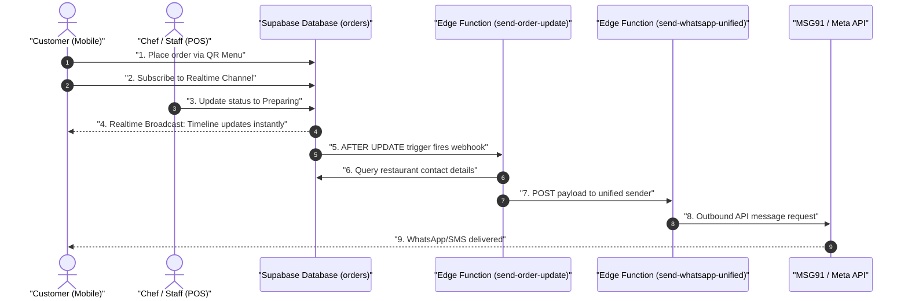

# Order Status Tracking System Architecture & Flow

This document details the system design, real-time database triggers, edge functions, and customer-facing interfaces that enable live order tracking and automated WhatsApp/SMS notifications.

---

## 1. Flow Diagram (Architecture & Sequence)



---

## 2. Step-by-Step Flow Explanation

### Step 1: Order Intake & Session
* **Action**: Customer scans Table/Room QR code -> enters name/phone -> submits order.
* **Database**: `submit-qr-order` edge function inserts order into the `orders` table. The order details are saved with `status = 'pending'` and the customer's mobile number stored in the `customer_phone` column.

### Step 2: Real-time UI Tracker (Pull)
* **Action**: On order success, the mobile page displays the `OrderTracker` component.
* **Logic**: The client initializes a Supabase Postgres Changes subscription:
  ```typescript
  supabase.channel('order-status').on('postgres_changes', { event: 'UPDATE', table: 'orders', filter: 'id=eq.orderId' })
  ```
* **UX**: Customer sees a progress line: **Received -> Preparing -> Ready -> Served**.

### Step 3: Status Transition at POS/Kitchen
* **Action**: The chef or POS attendant changes the order state (e.g., clicks "Start Cooking" or "Serve").
* **Database**: Updates `orders.status` to `'preparing'`, `'ready'`, or `'completed'`.

### Step 4: Webhook Invocation
* **Action**: Postgres trigger `tr_orders_status_update` fires.
* **Logic**: It calls `net.http_post()` to asynchronously push the old and new records to the `send-order-update` edge function. This is non-blocking to prevent UI delay.

### Step 5: Notification Routing
* **Action**: The `send-order-update` Deno function processes the request.
* **Logic**: 
  1. Confirms the status changed to an approved milestone (`preparing`, `ready`, or `completed`).
  2. Queries the `restaurants` table to resolve the restaurant's display name and contact number.
  3. Maps the status to templates (`order_preparing`, `order_ready`, `order_completed`).
  4. Invokes the unified messaging function `send-whatsapp-unified` via internal HTTP call.

### Step 6: Customer Delivery
* **Action**: The unified sender reads platform credentials from `platform_config` (MSG91 or Meta Cloud API).
* **Delivery**: Dispatches the pre-approved WhatsApp template to the user's `customer_phone`.

---

## 3. Configuration & Deployment Checklist

To put this system in production, perform the following tasks:

1. **Deploy Migration**:
   Apply [20260604130000_add_order_status_webhook.sql](file:///g:/restaurant/Sudip/tasty-bite-harbor/supabase/migrations/20260604130000_add_order_status_webhook.sql) to add the pg_net trigger on the database.
   ```bash
   npx supabase db push
   ```

2. **Deploy Edge Function**:
   Deploy the `send-order-update` directory to your active Supabase project:
   ```bash
   npx supabase functions deploy send-order-update
   ```

3. **Configure Environment Secrets**:
   Verify secrets are set in your Supabase Vault:
   * `MSG91_AUTH_KEY` (if using MSG91)
   * `WHATSAPP_ACCESS_TOKEN` (if using Meta Cloud)

4. **Verify WhatsApp Templates**:
   Ensure you have templates matching the template names (`order_preparing`, `order_ready`, `order_completed`) approved in your provider dashboard.
