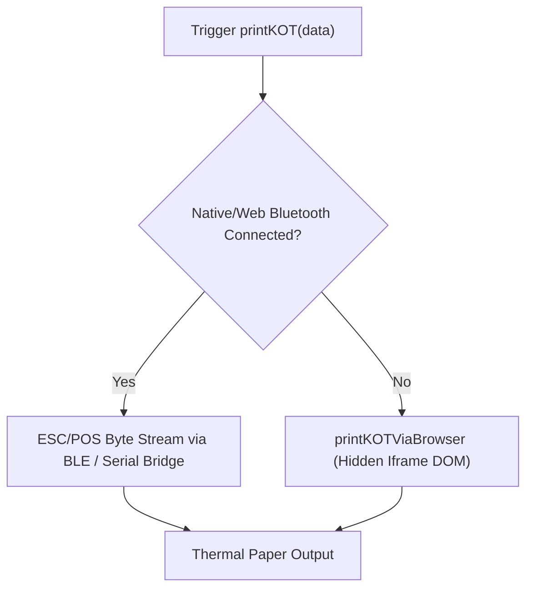

# QSR POS: "Send to Kitchen", Additional Items & Printing Architecture

Detailed breakdown of the POS kitchen order dispatch flow, additional items (rounds/deltas), and dual-mode thermal/browser printing pipeline.

---

## 1. "Send to Kitchen" Button Pipeline

* **Component Source**: [`src/components/QSR/QSRPosMain.tsx`](file:///G:/restaurant/Sudip/tasty-bite-harbor/src/components/QSR/QSRPosMain.tsx)
* **Handler**: [`handleSendToKitchen`](file:///G:/restaurant/Sudip/tasty-bite-harbor/src/components/QSR/QSRPosMain.tsx#L618-L900)
* **Trigger**: "Send to Kitchen" button click in [`QSROrderPad.tsx`](file:///G:/restaurant/Sudip/tasty-bite-harbor/src/components/QSR/QSROrderPad.tsx) or mobile [`QSRCartBottomSheet.tsx`](file:///G:/restaurant/Sudip/tasty-bite-harbor/src/components/QSR/QSRCartBottomSheet.tsx).

### Execution Steps (New Order)

1. **Validation**:
   * Ensures cart is not empty (`orderItems.length > 0`).
   * Validates `restaurantId`.

2. **Customer & Source Resolution**:
   * Resolves order source: `QSR-Table <number>` for Dine-In, or `QSR-Takeaway`, `QSR-Delivery`, `QSR-Nc`.
   * Fallback for customer name: `customerName.trim()` or table label to prevent null constraint errors.

3. **Item Preparation**:
   * Maps cart items to `kitchen_orders` schema.
   * Sets initial `printed_qty = item.quantity`.
   * All items flagged for printing in `deltaItemsToPrint`.

4. **Database Operations**:
   * **Insert `kitchen_orders`**:
     ```typescript
     {
       restaurant_id: restaurantId,
       source: `QSR-${orderSource}`,
       status: "new",
       items: finalKitchenItems,
       order_type: orderTypeMap[orderMode],
       customer_name: finalCustomerName,
       customer_phone: customerPhone || null,
       server_name: attendantName,
       priority: "normal",
       round_number: 1
     }
     ```
   * **Insert `orders`**:
     * Creates linked pending transaction record in `orders` table.
     * Updates `kitchen_orders.order_id` with `createdOrder.id` for cross-system syncing.

5. **Table Status Update**:
   * If `orderMode === "dine_in"`, sets table status to `"occupied"` via `updateTableStatus(selectedTable.id, "occupied")`.

6. **KOT Dispatch**:
   * Calls `thermalPrinterService.printKOT({...})`.

7. **Cart & Query Invalidation**:
   * Clears cart state: `setOrderItems([])`, `setSelectedTable(null)`, `setCustomerName("")`.
   * Invalidates React Query caches: `["active-kitchen-orders"]`, `["qs-active-orders"]`, `["active-orders"]`, `["all-orders"]`.

---

## 2. Additional Table Order Items (Rounds & Delta Logic)

When customers already seated at a table place follow-up orders (add-on drinks, desserts, second course).

### Flow

1. **Order Recall**:
   * Cashier taps an occupied table in [`QSRTableGrid.tsx`](file:///G:/restaurant/Sudip/tasty-bite-harbor/src/components/QSR/QSRTableGrid.tsx).
   * [`handleSelectTable`](file:///G:/restaurant/Sudip/tasty-bite-harbor/src/components/QSR/QSRPosMain.tsx#L363-L446) fetches active kitchen order:
     ```typescript
     const { data: kitchenOrder } = await supabase
       .from("kitchen_orders")
       .select("*")
       .eq("id", table.activeOrderId)
       .maybeSingle();
     ```
   * Loads existing items into cart (`orderItems`).
   * Sets `recalledKitchenOrderId = kitchenOrder.id`.
   * Sets `pendingKitchenOrderId = kitchenOrder.id`.

2. **User Adds Items / Increases Quantities**:
   * Additional menu items are appended or quantities incremented in `orderItems`.

3. **Delta Calculation on "Send to Kitchen"**:
   * Re-fetches the latest `kitchen_orders` record from database.
   * Computes next round:
     ```typescript
     currentRound = (existingKitchenOrder.round_number || 1) + 1;
     ```
   * Calculates delta for each item against what was previously printed:
     ```typescript
     const existingItem = existingItems.find(ei => ei.name === item.name && ei.price === item.price);
     const previouslyPrinted = existingItem?.printed_qty || 0;
     const delta = item.quantity - previouslyPrinted;

     if (delta > 0) {
       deltaItemsToPrint.push({
         name: item.name,
         quantity: item.quantity,
         printed_qty: previouslyPrinted, // Used by printer to subtract
         price: item.price,
         notes: item.notes
       });
     }
     ```

4. **Kitchen Order Update**:
   * Updates existing row in `kitchen_orders`:
     ```typescript
     {
       items: finalKitchenItems, // All items, with printed_qty = item.quantity
       status: "new",            // Re-alerts KDS
       round_number: currentRound,
       started_at: null,         // Reset prep status for new round
       completed_at: null,
       bumped_at: null
     }
     ```
   * Updates linked `orders` row with newly combined items array and recalculated total.

5. **Print Addition Ticket**:
   * Sends only `deltaItemsToPrint` to printer service with `isAddition: true` and `roundNumber: currentRound`.

---

## 3. KOT (Kitchen Order Ticket) Printing Logic

* **Service File**: [`src/services/thermalPrinterService.ts`](file:///G:/restaurant/Sudip/tasty-bite-harbor/src/services/thermalPrinterService.ts)
* **Method**: [`printKOT(data, options)`](file:///G:/restaurant/Sudip/tasty-bite-harbor/src/services/thermalPrinterService.ts#L665-L763)
* **Fallback**: [`printKOTViaBrowser(data)`](file:///G:/restaurant/Sudip/tasty-bite-harbor/src/services/thermalPrinterService.ts#L412-L543)



### Ticket Header Logic
* **Initial Order (`currentRound === 1` / `!isAddition`)**:
  * Centered bold: `*** KOT ***`
  * Line 1: `Table: <TableName>`
* **Follow-up Order (`currentRound > 1` / `isAddition === true`)**:
  * Centered bold: `*** ADDITION ***`
  * Line 1: `Table: <TableName>` | `Round: <roundNumber>`
* **Common Info Block**:
  * Line 2: `Server: <ServerName>` | `<OrderType>`
  * Line 3: `<DD/MM/YYYY>` | `<HH:MM AM/PM>`

### Delta Filtering in Printer Engine
```typescript
for (const item of data.items) {
  const deltaQty = item.printed_qty !== undefined ? (item.quantity - item.printed_qty) : item.quantity;
  const printQty = deltaQty > 0 ? deltaQty : item.quantity;
  if (printQty > 0) {
    // ESC/POS: bold item line
    receipt += `${printQty}x  ${item.name}\n`;
    if (item.notes) receipt += `    * ${item.notes}\n`;
    totalItems += printQty;
  }
}
```
* Even if full cart was passed, printer only prints the delta quantity.

### Ticket Footer Logic
* Prints: `Total: <totalItems> items`
* If `isAddition`: centered banner `** ADDITION ONLY **`.
* Feed lines + partial paper cut command (`\x1dV\x41\x03`).

### USB / Browser Fallback Engine (`printKOTViaBrowser`)
* Detects configured paper width (`58mm` vs `80mm`).
* Injects `@page { size: <paperMm>mm auto; margin: 0; }` into hidden `#_kot_print_frame` iframe.
* Renders thermal monospace HTML and calls `iframe.contentWindow.print()`.

---

## 4. Bill Printing Logic

* **UI Callers**:
  * Auto-printed upon payment completion in [`PaymentDialog.tsx`](file:///G:/restaurant/Sudip/tasty-bite-harbor/src/components/Orders/POS/PaymentDialog.tsx#L720-L815) and [`MobilePaymentDialog.tsx`](file:///G:/restaurant/Sudip/tasty-bite-harbor/src/components/Orders/POS/MobilePaymentDialog.tsx).
  * Manual reprint: "Print Bill" / "Print Again" / "Print Preview" in [`OrderActions.tsx`](file:///G:/restaurant/Sudip/tasty-bite-harbor/src/components/Orders/OrderActions.tsx#L104-L118) and [`PaymentDialog.tsx`](file:///G:/restaurant/Sudip/tasty-bite-harbor/src/components/Orders/POS/PaymentDialog.tsx#L1246).
* **Service Methods**:
  * Hardware ESC/POS: [`printReceipt(data)`](file:///G:/restaurant/Sudip/tasty-bite-harbor/src/services/thermalPrinterService.ts#L765-L925)
  * Browser/USB Fallback: [`printReceiptViaBrowser(data)`](file:///G:/restaurant/Sudip/tasty-bite-harbor/src/services/thermalPrinterService.ts#L549-L663)

### Data Object Structure (`ReceiptData`)
```typescript
interface ReceiptData {
  restaurantName: string;
  address?: string;
  phone?: string;
  gstin?: string;
  billNumber: string;
  date: string;
  time: string;
  tableName?: string;
  customerName?: string;
  customerMobile?: string;
  serverName?: string;
  items: { name: string; quantity: number; price: number }[];
  subtotal: number;
  cgst: number;
  sgst: number;
  discount: number;
  netAmount: number;
  currencySymbol: string;
  upiId?: string; // Embedded as ESC/POS QR code
}
```

### Layout & ESC/POS Formatting
1. **Header**:
   * Double-height/bold restaurant name centered.
   * Address, phone number, GSTIN lines.
   * Dashed separator line.
2. **Metadata Rows**:
   * `Bill#: <billNumber>` | `To: Table <X> / Customer`
   * `Date: <date>` | `Time: <time>`
   * `Server: <name>` | `Ph: <phone>`
   * Dashed separator line.
3. **Item Grid (Column Padded)**:
   * Width calculation: 32 columns (58mm) or 48 columns (80mm).
   * Columns: `Item` (left aligned), `Qty` (fixed width), `Rate` (fixed width), `Amt` (right aligned).
4. **Summary & Taxes**:
   * `Sub Total: <subtotal>`
   * `Discount: -<discount>` (if $> 0$)
   * `CGST: <cgst>` | `SGST: <sgst>` (if $> 0$)
   * Double-width / bold: `Net Amount: <currency><netAmount>`
5. **UPI Dynamic QR Code**:
   * If `upiId` is configured, constructs `upi://pay?pa=...&pn=...&am=...` URL.
   * Encodes ESC/POS 2D barcode commands:
     ```
     \x1d(k\x04\x001A2\x00      # Model
     \x1d(k\x03\x001C\x06      # Module size
     \x1d(k\x03\x001E1         # Error correction level L
     \x1d(k<len>\x001P0<payload> # Store data
     \x1d(k\x03\x001Q0         # Print symbol
     ```
6. **Footer**:
   * `"Thank You! Please visit again"`
   * Cut command: `\x1dV\x41\x03`.

---

## 5. Summary Matrix

| Operation | Trigger | Target Tables | Print Function | Print Content |
| :--- | :--- | :--- | :--- | :--- |
| **New Order** | "Send to Kitchen" | `kitchen_orders`, `orders`, `tables` | `printKOT` | `*** KOT ***`, all items |
| **Add Items** | "Send to Kitchen" (Recalled) | `kitchen_orders` (update), `orders` (update) | `printKOT` | `*** ADDITION ***`, Round X, delta items only |
| **Hold Order** | "Hold Order" | `kitchen_orders` (`status: 'held'`) | None | None |
| **Checkout/Pay** | "Confirm Payment" | `orders` (`status: 'completed'`), `tables` (`available`) | `printReceipt` | Full bill with taxes, breakdown & UPI QR |
| **Manual Bill** | "Print Bill" button | None (read-only) | `printReceipt` | Full receipt reprint |
