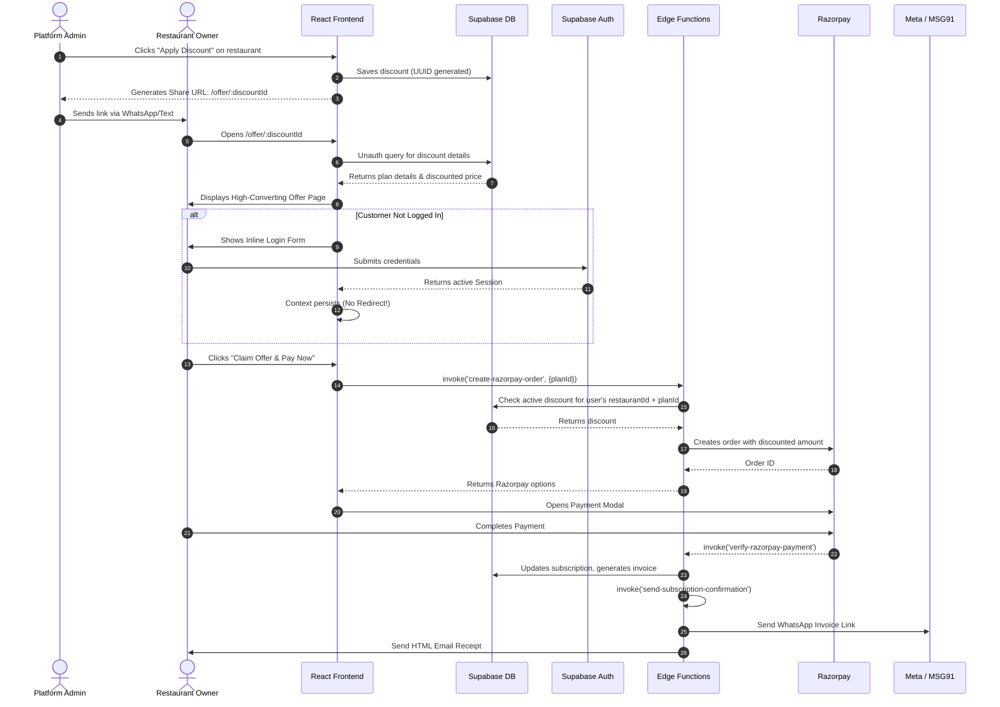
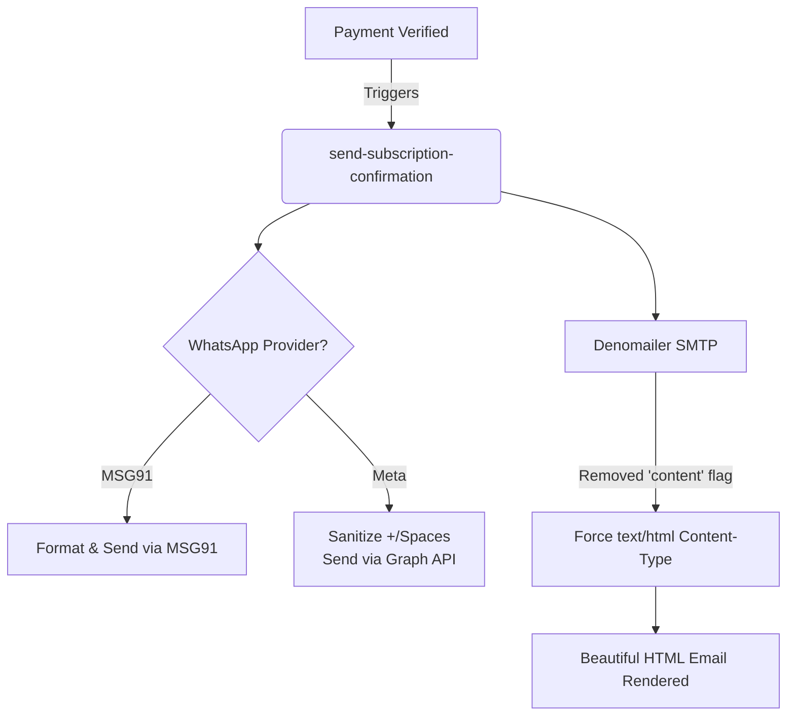

# Swadeshi Solutions Special Offer & Checkout Pipeline

This document summarizes the complete end-to-end flow of the customized subscription architecture implemented to improve conversions, tracking, and notification reliability.

## 1. System Architecture & Flow Logic

We completely restructured how customers receive and interact with special subscription discounts. Instead of sending a static plan link and hoping they apply a code, the platform now creates a "White Glove" checkout experience utilizing dynamic routing, seamless login, and background edge function verification.

### End-to-End Special Offer Workflow



---

## 2. Component Enhancements Breakdown

### A. The Dynamic Offer Landing Page
- **File:** `SpecialOfferPage.tsx`
- **Logic:** This page intercepts the `/offer/:discountId` route.
- **Unauthenticated Access:** To allow the customer to see their personalized offer *before* forcing them to log in, we added a new Supabase Row Level Security (RLS) policy:
  ```sql
  CREATE POLICY "Anyone can view active discounts by id" ON subscription_discounts
  FOR SELECT USING (status = 'active' AND (expires_at IS NULL OR expires_at > now()));
  ```
- **Frictionless Login:** We modified the core `AuthForm.tsx` to accept an `onSuccess` prop. This prevents the default behavior of redirecting the user to `/dashboard` upon login. Instead, the user stays on the offer page, the login form vanishes, and the Razorpay payment button appears smoothly.

### B. Admin Discount Generation
- **File:** `DiscountDialog.tsx`
- **Logic:** When an admin applies a discount to a restaurant, the system captures the newly generated `discountId`.
- **Template Updates:** The UI's "WhatsApp Auto" and "Copy Text" tools were updated to inject `https://swadeshisolutions.co.in/offer/[uuid]` instead of the generic `/subscription` page.

### C. Secure Pricing Verification
- **File:** `create-razorpay-order` (Edge Function)
- **Logic:** The frontend *never* sends the discounted price to the server (preventing manipulation). Instead, it only sends the `planId`. The edge function fetches the customer's `restaurantId` securely from their auth context, queries `subscription_discounts` to find any active discounts for that specific restaurant+plan combination, and natively adjusts the Razorpay order amount.

---

## 3. Communication Fixes (WhatsApp & Email)

The post-payment confirmation pipeline handles generating the HTML invoice, sending the WhatsApp notification, and firing off the SMTP email. We resolved two major bugs in this pipeline:

### WhatsApp Delivery Issue (Meta Cloud API)
- **Problem:** MSG91 strips out invalid characters natively, but the `meta_cloud` API expects highly formatted JSON. Because `restaurant.phone` might contain spaces, dashes, or `+` signs (e.g., `+91 99999 99999`), Meta's API silently dropped the message, even while returning a 200 HTTP status code back to Supabase.
- **Fix:** In `send-whatsapp-unified`, we introduced sanitization for Meta payloads:
  ```typescript
  let cleanPhoneMeta = phoneNumber.replace(/[\+\-\s]/g, "");
  if (cleanPhoneMeta.length === 10) cleanPhoneMeta = "91" + cleanPhoneMeta;
  ```

### Email HTML Rendering Issue (Denomailer)
- **Problem:** Customers were receiving emails showing raw `<!DOCTYPE html>` tags.
- **Root Cause:** The `denomailer@1.6.0` library attempts to create a `multipart/alternative` email if both `content` (plain text) and `html` parameters are provided. Due to a bug in how it writes the MIME boundaries, email clients like Gmail were failing to parse the HTML section and falling back to treating the entire payload as plain text.
- **Fix:** We audited **six** different edge functions (`send-subscription-confirmation`, `send-email-bill`, `send-inquiry`, `send-email`, `forgot-password`). We entirely removed the `content` parameter, forcing `denomailer` to transmit a pure `text/html` payload. We also appended `\r\n` carriage returns to comply with strict SMTP specs.


