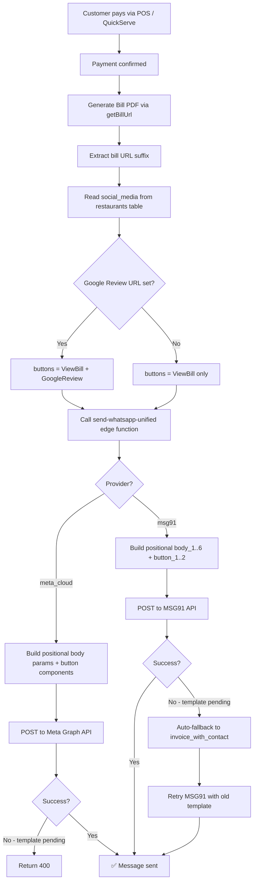
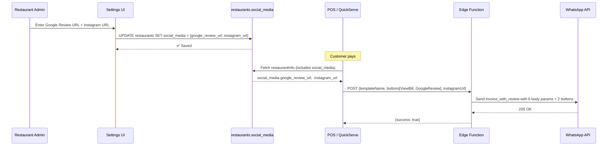
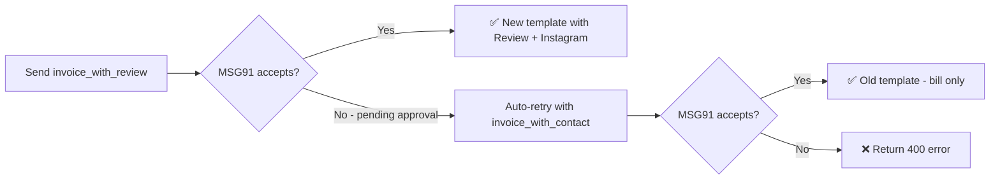

# WhatsApp Invoice with Review Buttons

> Feature added: 25 Jun 2026 · Affects POS, QuickServe, Settings, Edge Functions

---

## Overview

When a customer pays, the system sends a WhatsApp invoice via the `invoice_with_review` template. The message includes:
- Order details (amount, date, items)
- **View Bill** button → opens the digital bill PDF
- **Google Review** button → opens the restaurant's Google review page
- Instagram URL embedded in the body text (tappable hyperlink) — workaround for Meta's 2 URL-button limit

---

## Template: `invoice_with_review`

| Field | Value |
|---|---|
| **Name** | `invoice_with_review` |
| **Category** | Marketing |
| **Language** | English (`en`) |
| **Footer** | Powered by Swadeshi Solutions |
| **Provider** | Meta Cloud API / MSG91 (auto-detected) |

### Body Text

```
Dear {{1}},

Thank you for your recent order at {{2}}! Your invoice is now available. ✨

💰 Amount : {{3}}
📅 Date : {{4}}

We hope you enjoyed your dining experience! Looking forward to serving you again. Have a wonderful day! 🌿

If you have any queries regarding your order, please do not hesitate to contact us at {{5}} today.

⭐ Loved your experience? Drop us a Google review — it means the world to us!
📸 Follow us on Instagram: {{6}} — stay updated with our latest offers! 🍽️
```

### Variable Mapping

| Variable | Value | Source |
|---|---|---|
| `{{1}}` | Customer name | POS / QS input |
| `{{2}}` | Restaurant name | `restaurants.name` |
| `{{3}}` | Order amount | Calculated total |
| `{{4}}` | Order date & time | `new Date()` formatted |
| `{{5}}` | Contact number | `restaurants.phone` |
| `{{6}}` | Instagram URL | `restaurants.social_media.instagram_url` |

### Buttons (2 max — Meta hard limit for URL type)

| Index | Label | URL Type | Dynamic Part |
|---|---|---|---|
| 0 | 📋 View Bill | Dynamic suffix | Bill URL suffix (e.g. `abc123`) |
| 1 | ⭐ Google Review | Dynamic suffix | Full review URL |

> **Why Instagram is in the body:** Meta enforces a maximum of **2 URL buttons** per template. Instagram is included as `{{6}}` in the body — WhatsApp auto-renders it as a tappable hyperlink.

---

## Architecture

### End-to-End Flow



### Settings → Message Flow



### Fallback Logic (MSG91 path)



---

## Files Changed

### Frontend

| File | Change |
|---|---|
| [`SystemConfigurationTab.tsx`](file:///g:/restaurant/Sudip/tasty-bite-harbor/src/components/Settings/SystemConfigurationTab.tsx) | Added **Social & Review Links** card with Google Review URL + Instagram URL inputs. Saves to `restaurants.social_media` JSON. Live preview of WhatsApp button layout. |
| [`PaymentDialog.tsx`](file:///g:/restaurant/Sudip/tasty-bite-harbor/src/components/Orders/POS/PaymentDialog.tsx) | Changed template from `invoice_with_contact` → `invoice_with_review`. Passes `buttons[]` (View Bill + Google Review) and `instagramUrl` from `restaurantInfo.social_media`. |
| [`QSPaymentSheet.tsx`](file:///g:/restaurant/Sudip/tasty-bite-harbor/src/components/QuickServe/QSPaymentSheet.tsx) | Same as PaymentDialog — uses `invoice_with_review` template + social links from `restaurantDetails.social_media`. |
| [`CreateTemplateDialog.tsx`](file:///g:/restaurant/Sudip/tasty-bite-harbor/src/components/Marketing/CreateTemplateDialog.tsx) | `DEFAULT_FOOTER` updated: `"billed by Swadeshi Solutions"` → `"Powered by Swadeshi Solutions"` |
| [`CreateMetaTemplateDialog.tsx`](file:///g:/restaurant/Sudip/tasty-bite-harbor/src/components/Platform/CreateMetaTemplateDialog.tsx) | Same footer update. |

### Edge Function

| File | Change |
|---|---|
| [`send-whatsapp-unified/index.ts`](file:///g:/restaurant/Sudip/tasty-bite-harbor/supabase/functions/send-whatsapp-unified/index.ts) | Full rework of body param building — switched from **named** (`parameter_name: "customer_name"`) to **positional** (`{{1}}`–`{{6}}`). Added `instagramUrl` to destructuring. Multi-button support (loops `buttons[]` with correct indices). Buttons capped at 2 (`slice(0,2)`) for Meta limit. Language code: `en` (not `en_US`). Auto-fallback to `invoice_with_contact` when primary template fails. |

---

## Database

No schema changes required. Uses existing `restaurants.social_media` JSON column:

```json
{
  "google_review_url": "https://g.page/r/YOUR_PLACE_ID/review",
  "instagram_url": "https://www.instagram.com/your_handle"
}
```

Other existing keys in `social_media` are preserved (merge strategy used on save).

---

## Settings UI

**Location:** Settings → System Configuration → Social & Review Links

- **Google Review URL** input — full URL from Google Business Profile
- **Instagram Profile URL** input — full Instagram profile URL
- **Live preview** shows which buttons will appear on the WhatsApp invoice
- **Save Social Links** button → persists to `restaurants.social_media`

> Each restaurant configures their own links independently. The system is multi-tenant — no hardcoded URLs anywhere.

---

## Edge Function: Body Param Format

### Meta Cloud API (positional, no `parameter_name`)
```json
{
  "type": "body",
  "parameters": [
    { "type": "text", "text": "Sudip" },
    { "type": "text", "text": "Vanam Restaurant" },
    { "type": "text", "text": "Rs.234.98" },
    { "type": "text", "text": "25/06/2026 22:45" },
    { "type": "text", "text": "8308901233" },
    { "type": "text", "text": "https://www.instagram.com/brewbites" }
  ]
}
```

### MSG91 (positional keys `body_1`..`body_6`)
```json
{
  "body_1": { "type": "text", "value": "Sudip" },
  "body_2": { "type": "text", "value": "Vanam Restaurant" },
  "body_3": { "type": "text", "value": "Rs.234.98" },
  "body_4": { "type": "text", "value": "25/06/2026 22:45" },
  "body_5": { "type": "text", "value": "8308901233" },
  "body_6": { "type": "text", "value": "https://www.instagram.com/brewbites" },
  "button_1": { "subtype": "url", "type": "text", "value": "abc123def" },
  "button_2": { "subtype": "url", "type": "text", "value": "https://g.page/r/xyz/review" }
}
```

---

## Known Issues & Gotchas

> [!IMPORTANT]
> Meta template language must be **`en`** (English), NOT `en_US` (English US). Using `en_US` causes error 132001 "template does not exist in translation" even if the template is approved.

> [!WARNING]
> Meta hard-limits URL-type buttons to **2 per template**. Instagram cannot be a 3rd button — it lives in the body as `{{6}}` instead.

> [!NOTE]
> While `invoice_with_review` is pending Meta approval, the MSG91 path auto-falls back to `invoice_with_contact` (5 body variables, 1 bill button). Once approved, the new template is used automatically — no code change needed.

> [!TIP]
> Variables cannot be at the **start or end** of a Meta template body. Always ensure static text surrounds every variable, especially the last one (`{{6}}`).

---

## Deployment

Edge function must be redeployed after any change to `index.ts`:

```bash
npx supabase functions deploy send-whatsapp-unified --project-ref clmsoetktmvhazctlans
```
