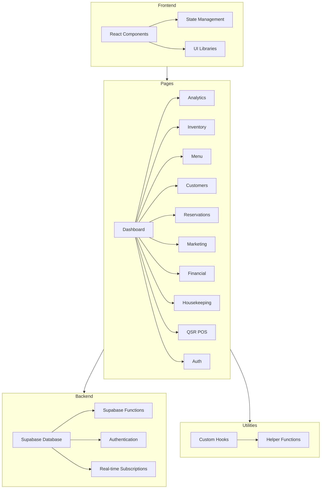

    

    <b>Automatic Architecture Diagrams from Code</b> 
    <a href="https://github.com/swark-io/swark">GitHub</a> • <a href="https://swark.io">Website</a> • <a href="mailto:contact@swark.io">Contact Us</a>

## Usage Instructions

1. **Render the Diagram**: Use the links below to open it in Mermaid Live Editor, or install the [Mermaid Support](https://marketplace.visualstudio.com/items?itemName=bierner.markdown-mermaid) extension.
2. **Recommended Model**: If available for you, use `claude-3.5-sonnet` [language model](vscode://settings/swark.languageModel). It can process more files and generates better diagrams.
3. **Iterate for Best Results**: Language models are non-deterministic. Generate the diagram multiple times and choose the best result.

## Generated Content
**Model**: GPT-4o - [Change Model](vscode://settings/swark.languageModel)  
**Mermaid Live Editor**: [View](https://mermaid.live/view#pako:eNptk8luwjAQhl_F8rm8AIdKQEhDIWyhJ6eHSTKARWJHXpAQ6rvXJE5x1d78zYz_WTy-01JWSMc0FycF7ZkcolwQom3RY6ykMCiqh5GQCdsjlIbMZNNKgcLoz94xZZkBgyQFASdsnMc7ZuxjQVa8UKA4DtETMhq9kmkIswd0eX6ln0J5-ckescy2UIBGEoHpDl5w_vTEVpSGSzHkitnEmrMriJfwsHvz26OTemR4gySzhS4Vb8NrUVfVPIQ4hLf_6_0wvObGddrHJmxmtZENSaS8DNILlmDdovpTatIpL_5X3rq5etV3FoE-FxJU5W8u2URAfXM9DlorthBX17VUN29JWYrCelj7wlANFzZuIBrVFcKKtiwFdUHDxclbdizmAkTJofaWPUuk1XhBbJ9hGdtle7LdZJ4P3St4eO_6XIawCiENYR3CJoRtCLsQ9iFkIRx-DXdY7l5uGHB36Df0uX1PY_DE9IW6CTbAK_eB7jl1e9ZgTsckpxUewdYmp18uyLaV-xwRB_eUDR0bZfGFgjUyu4lyYCXt6UzHR6g1fn0DY2gbCA) | [Edit](https://mermaid.live/edit#pako:eNptk8luwjAQhl_F8rm8AIdKQEhDIWyhJ6eHSTKARWJHXpAQ6rvXJE5x1d78zYz_WTy-01JWSMc0FycF7ZkcolwQom3RY6ykMCiqh5GQCdsjlIbMZNNKgcLoz94xZZkBgyQFASdsnMc7ZuxjQVa8UKA4DtETMhq9kmkIswd0eX6ln0J5-ckescy2UIBGEoHpDl5w_vTEVpSGSzHkitnEmrMriJfwsHvz26OTemR4gySzhS4Vb8NrUVfVPIQ4hLf_6_0wvObGddrHJmxmtZENSaS8DNILlmDdovpTatIpL_5X3rq5etV3FoE-FxJU5W8u2URAfXM9DlorthBX17VUN29JWYrCelj7wlANFzZuIBrVFcKKtiwFdUHDxclbdizmAkTJofaWPUuk1XhBbJ9hGdtle7LdZJ4P3St4eO_6XIawCiENYR3CJoRtCLsQ9iFkIRx-DXdY7l5uGHB36Df0uX1PY_DE9IW6CTbAK_eB7jl1e9ZgTsckpxUewdYmp18uyLaV-xwRB_eUDR0bZfGFgjUyu4lyYCXt6UzHR6g1fn0DY2gbCA)

