    

    <b>Automatic Architecture Diagrams from Code</b> 
    <a href="https://github.com/swark-io/swark">GitHub</a> • <a href="https://swark.io">Website</a> • <a href="mailto:contact@swark.io">Contact Us</a>

## Usage Instructions

1. **Render the Diagram**: Use the links below to open it in Mermaid Live Editor, or install the [Mermaid Support](https://marketplace.visualstudio.com/items?itemName=bierner.markdown-mermaid) extension.
2. **Recommended Model**: If available for you, use `claude-3.5-sonnet` [language model](vscode://settings/swark.languageModel). It can process more files and generates better diagrams.
3. **Iterate for Best Results**: Language models are non-deterministic. Generate the diagram multiple times and choose the best result.

## Generated Content
**Model**: GPT-4o - [Change Model](vscode://settings/swark.languageModel)  
**Mermaid Live Editor**: [View](https://mermaid.live/view#pako:eNqNVsGOmzAQ_RXk86YfkEOlaNNKqEVqsxv1YHpwwAlWwaa2qRpt9t87BmzPBqfZA3g87zFm_PwQL6RSNSdrUsqTZn2TPW9LmWVmOEzTz1pJy2Xtklm26XsK1895ltNN_sGav_N8y0xzUEzXNEQI_SQbJiteR9Yig9iPg7Gq49rQEGF0V1C4cAZKSd4WTLIT77i0dJFB7M1gG-puOCdZe7aiMjRECC2Y_sWtkCcaIoR-EbZquKTziJBc_oGllT7TEOGqXA7U3VDu-9PumzJ0GlD-K5M1rPqDH4ywnL6dBt4o1RsF91a0ZirBRGwSxfDwvIboYK_2fatYTVEcCUelO2at0yWGEYZFTaVFb4WS47p0kYnkwfBCHUTLKUSrbgz_08fzuee-Dycfm-Sbi_VadcotYmgMI6x07d55GmK6ms8W9UGEfhtN4fKJ5fvk4AuIxoV89z07MMMfW-EOYDUOeHMmeGyEWndfVAdzZavVx0ve9UpbcwGPJdPBMkl0YawkKxgrje6KdP7aVunXBnHSgD90STR4K4nO7kpiwV3pumCxJDC5LAm9NdgsTz5y9oYDATlogS2OvWMEORAxusgxFsLdZAbxEMMf4hHfFbeQawERL1pn7AhExP16TX3XCJuM5dAg4c2ys4wIB585IGiYLgwaIgB9nhw6CXld0yFIphHe8h7sZjIlL1eOdWxU9h3shczveIb5XU3Rwkcubtl97rRH93n-FNxnwubdI5EHAqU6Jmr4eXgpiW3gMJVknZWk5kc2tLYkr0Aa-ppZvhUMvpUdWVs98AcCe6CezrLyc62GU0PWR9Ya_voPkwEOhQ) | [Edit](https://mermaid.live/edit#pako:eNqNVsGOmzAQ_RXk86YfkEOlaNNKqEVqsxv1YHpwwAlWwaa2qRpt9t87BmzPBqfZA3g87zFm_PwQL6RSNSdrUsqTZn2TPW9LmWVmOEzTz1pJy2Xtklm26XsK1895ltNN_sGav_N8y0xzUEzXNEQI_SQbJiteR9Yig9iPg7Gq49rQEGF0V1C4cAZKSd4WTLIT77i0dJFB7M1gG-puOCdZe7aiMjRECC2Y_sWtkCcaIoR-EbZquKTziJBc_oGllT7TEOGqXA7U3VDu-9PumzJ0GlD-K5M1rPqDH4ywnL6dBt4o1RsF91a0ZirBRGwSxfDwvIboYK_2fatYTVEcCUelO2at0yWGEYZFTaVFb4WS47p0kYnkwfBCHUTLKUSrbgz_08fzuee-Dycfm-Sbi_VadcotYmgMI6x07d55GmK6ms8W9UGEfhtN4fKJ5fvk4AuIxoV89z07MMMfW-EOYDUOeHMmeGyEWndfVAdzZavVx0ve9UpbcwGPJdPBMkl0YawkKxgrje6KdP7aVunXBnHSgD90STR4K4nO7kpiwV3pumCxJDC5LAm9NdgsTz5y9oYDATlogS2OvWMEORAxusgxFsLdZAbxEMMf4hHfFbeQawERL1pn7AhExP16TX3XCJuM5dAg4c2ys4wIB585IGiYLgwaIgB9nhw6CXld0yFIphHe8h7sZjIlL1eOdWxU9h3shczveIb5XU3Rwkcubtl97rRH93n-FNxnwubdI5EHAqU6Jmr4eXgpiW3gMJVknZWk5kc2tLYkr0Aa-ppZvhUMvpUdWVs98AcCe6CezrLyc62GU0PWR9Ya_voPkwEOhQ)

```mermaid
graph TD
  subgraph Frontend
    App[App]
    AI[AI.tsx]
    Dashboard[Dashboard.tsx]
    EnhancedDashboard[EnhancedDashboard.tsx]
    Customers[Customers.tsx]
    CRM[CRM.tsx]
    ChannelManagement[ChannelManagement.tsx]
    Auth[Auth.tsx]
    Analytics[Analytics.tsx]
    Marketing[Marketing.tsx]
    Kitchen[Kitchen.tsx]
    Inventory[Inventory.tsx]
    Menu[Menu.tsx]
    QSRPos[QSRPos.tsx]
    LandingWebsite[LandingWebsite.tsx]
  end

  subgraph Utils
    aiAnalytics[aiAnalytics.ts]
    imageUpload[imageUpload.ts]
    formatters[formatters.ts]
    subscriptionUtils[subscriptionUtils.ts]
    useMobile[use-mobile.tsx]
  end

  subgraph Types
    auth[auth.ts]
    promotions[promotions.ts]
    orders[orders.ts]
    customer[customer.ts]
    qsr[qsr.ts]
  end

  subgraph Integrations
    supabaseClient[client.ts]
    supabaseTypes[types.ts]
  end

  App -->|Imports| AI
  App -->|Imports| Dashboard
  App -->|Imports| EnhancedDashboard
  App -->|Imports| Customers
  App -->|Imports| CRM
  App -->|Imports| ChannelManagement
  App -->|Imports| Auth
  App -->|Imports| Analytics
  App -->|Imports| Marketing
  App -->|Imports| Kitchen
  App -->|Imports| Inventory
  App -->|Imports| Menu
  App -->|Imports| QSRPos
  App -->|Imports| LandingWebsite

  AI -->|Uses| aiAnalytics
  AI -->|Uses| subscriptionUtils
  Dashboard -->|Uses| formatters
  EnhancedDashboard -->|Uses| formatters
  Customers -->|Uses| customer
  CRM -->|Uses| customer
  ChannelManagement -->|Uses| promotions
  Auth -->|Uses| auth
  Analytics -->|Uses| orders
  Marketing -->|Uses| promotions
  Kitchen -->|Uses| qsr
  Inventory -->|Uses| orders
  Menu -->|Uses| imageUpload
  QSRPos -->|Uses| qsr

  aiAnalytics -->|Depends on| supabaseClient
  imageUpload -->|Depends on| supabaseClient
  subscriptionUtils -->|Depends on| supabaseClient
  auth -->|Depends on| supabaseTypes
  promotions -->|Depends on| supabaseTypes
  orders -->|Depends on| supabaseTypes
  customer -->|Depends on| supabaseTypes
  qsr -->|Depends on| supabaseTypes
```

