    

    <b>Automatic Architecture Diagrams from Code</b> 
    <a href="https://github.com/swark-io/swark">GitHub</a> • <a href="https://swark.io">Website</a> • <a href="mailto:contact@swark.io">Contact Us</a>

## Usage Instructions

1. **Render the Diagram**: Use the links below to open it in Mermaid Live Editor, or install the [Mermaid Support](https://marketplace.visualstudio.com/items?itemName=bierner.markdown-mermaid) extension.
2. **Recommended Model**: If available for you, use `claude-3.5-sonnet` [language model](vscode://settings/swark.languageModel). It can process more files and generates better diagrams.
3. **Iterate for Best Results**: Language models are non-deterministic. Generate the diagram multiple times and choose the best result.

## Generated Content
**Model**: GPT-4o - [Change Model](vscode://settings/swark.languageModel)  
**Mermaid Live Editor**: [View](https://mermaid.live/view#pako:eNp1VsFu4yAQ_RXL53Y_IIeVss1W68NKu01zwjkQexKj2uAFXCWq-u-LAcNQ4kOcmfceZpgZRv4oG9FCuSlrfpF07IrXXc2LQk0n5z5LwTXwdgaLYjuOxPy-aXU9eoTT_qZZo0iwMDvpjswPhO2o6k6CypYEC7FPk9JiAKlIsBD7zDjlDaM9CRZif4lJwRvAyPiFYAdp_u5f_ghF3B_CK97CldgnQn_yzuwCbYw5Q5B6z4axB_cmZCPFQYH8TTm9wABck9RFuhfRA9KlLs6WCYZDj6QZgk9zHYErUGQxcKUqsq2Cbwue9MEP2ryFNgjofhrpiSpw8FxbbX2yGMeFmZtgD_KdNWAbovBOEDxPvNFMcBNde4HoeoHfOw_soFmvQliqkWyc11mYZIg5oX8hG0yCDmMvaEuQHQVnIQeq9dyK0Yw0ZbH1kR0Fk41gwrvm0b_eRvDRN77fLUQWD21osuY46i6Ux4VsTWCOcXbklKbns6OsGRkJpvfeqU2xE2Ak6v4pH5AxIjpKMQi0NvrrR63MHDGWVfn74rvnqWdz6y5u4fxjKnIbBY11053MYCoeH7_HkZSAJmfYD_cXg2HkYDBMGgzi6YJxN1cwYkcABrIJgkk0NjCcDgrMpKMhOczXSZAE4SdAkqLK53HJn0WzK5RL0jrmPLoefod5ANxbOZMhL6uKUCarSO5NTt97QSjpqgLXd1Xkim3p5Zo4wtZvdVnWAKtK1A2rmrQ1XL6XSeEUaYvcU2Stsh6775tVwbbKSx7Qu2dMsESGaRvtF7Z8KE2ZB8pa8_3yUZe6M8HX5aaoyxbOdOp1XX4a0TS2VMOOUTN-hnKj5QQPpUmB2N94s_hSTJeu3Jxpr-DzP-TLLFc) | [Edit](https://mermaid.live/edit#pako:eNp1VsFu4yAQ_RXL53Y_IIeVss1W68NKu01zwjkQexKj2uAFXCWq-u-LAcNQ4kOcmfceZpgZRv4oG9FCuSlrfpF07IrXXc2LQk0n5z5LwTXwdgaLYjuOxPy-aXU9eoTT_qZZo0iwMDvpjswPhO2o6k6CypYEC7FPk9JiAKlIsBD7zDjlDaM9CRZif4lJwRvAyPiFYAdp_u5f_ghF3B_CK97CldgnQn_yzuwCbYw5Q5B6z4axB_cmZCPFQYH8TTm9wABck9RFuhfRA9KlLs6WCYZDj6QZgk9zHYErUGQxcKUqsq2Cbwue9MEP2ryFNgjofhrpiSpw8FxbbX2yGMeFmZtgD_KdNWAbovBOEDxPvNFMcBNde4HoeoHfOw_soFmvQliqkWyc11mYZIg5oX8hG0yCDmMvaEuQHQVnIQeq9dyK0Yw0ZbH1kR0Fk41gwrvm0b_eRvDRN77fLUQWD21osuY46i6Ux4VsTWCOcXbklKbns6OsGRkJpvfeqU2xE2Ak6v4pH5AxIjpKMQi0NvrrR63MHDGWVfn74rvnqWdz6y5u4fxjKnIbBY11053MYCoeH7_HkZSAJmfYD_cXg2HkYDBMGgzi6YJxN1cwYkcABrIJgkk0NjCcDgrMpKMhOczXSZAE4SdAkqLK53HJn0WzK5RL0jrmPLoefod5ANxbOZMhL6uKUCarSO5NTt97QSjpqgLXd1Xkim3p5Zo4wtZvdVnWAKtK1A2rmrQ1XL6XSeEUaYvcU2Stsh6775tVwbbKSx7Qu2dMsESGaRvtF7Z8KE2ZB8pa8_3yUZe6M8HX5aaoyxbOdOp1XX4a0TS2VMOOUTN-hnKj5QQPpUmB2N94s_hSTJeu3Jxpr-DzP-TLLFc)

```mermaid
graph TD
  subgraph Frontend
    App[App.tsx]
    Analytics[Analytics.tsx]
    Auth[Auth.tsx]
    Dashboard[Dashboard.tsx]
    Customers[Customers.tsx]
    Financial[Financial.tsx]
    Housekeeping[Housekeeping.tsx]
    QSRPos[QSRPos.tsx]
    Index[Index.tsx]
    EnhancedDashboard[EnhancedDashboard.tsx]
    SimpleIndex[SimpleIndex.tsx]
    UserManagement[UserManagement.tsx]
    RoleManagement[RoleManagement.tsx]
    ChannelManagement[ChannelManagement.tsx]
    Expenses[Expenses.tsx]
    AI[AI.tsx]
  end

  subgraph Backend
    subgraph Supabase
      Database[Database]
      AuthService[Auth Service]
      Functions[Edge Functions]
    end
  end

  subgraph Utils
    subscriptionUtils[subscriptionUtils.ts]
    imageUpload[imageUpload.ts]
    formatters[formatters.ts]
    aiAnalytics[aiAnalytics.ts]
    utils[utils.ts]
  end

  subgraph Types
    customerTypes[customer.ts]
    authTypes[auth.ts]
    ordersTypes[orders.ts]
    staffTypes[staff.ts]
    reservationsTypes[reservations.ts]
    qsrTypes[qsr.ts]
    promotionsTypes[promotions.ts]
  end

  subgraph Integrations
    SupabaseClient[Supabase Client]
    SupabaseTypes[Supabase Types]
  end

  App --> Analytics
  App --> Auth
  App --> Dashboard
  App --> Customers
  App --> Financial
  App --> Housekeeping
  App --> QSRPos
  App --> Index
  App --> EnhancedDashboard
  App --> SimpleIndex
  App --> UserManagement
  App --> RoleManagement
  App --> ChannelManagement
  App --> Expenses
  App --> AI

  Analytics --> subscriptionUtils
  Analytics --> SupabaseClient
  Analytics --> aiAnalytics

  Auth --> SupabaseClient

  Dashboard --> SupabaseClient

  Customers --> customerTypes
  Customers --> SupabaseClient

  Financial --> SupabaseClient

  Housekeeping --> SupabaseClient

  QSRPos --> qsrTypes

  Index --> SupabaseClient

  EnhancedDashboard --> SupabaseClient

  SimpleIndex --> SupabaseClient

  UserManagement --> authTypes

  RoleManagement --> authTypes

  ChannelManagement --> SupabaseClient

  Expenses --> SupabaseClient

  AI --> aiAnalytics
  AI --> SupabaseClient

  SupabaseClient --> Supabase
  SupabaseTypes --> Supabase
```

