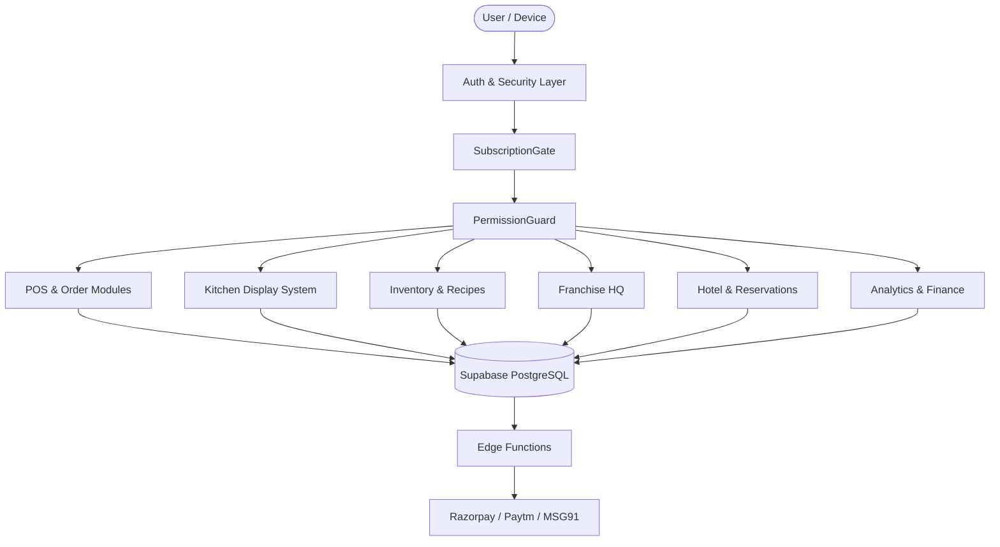
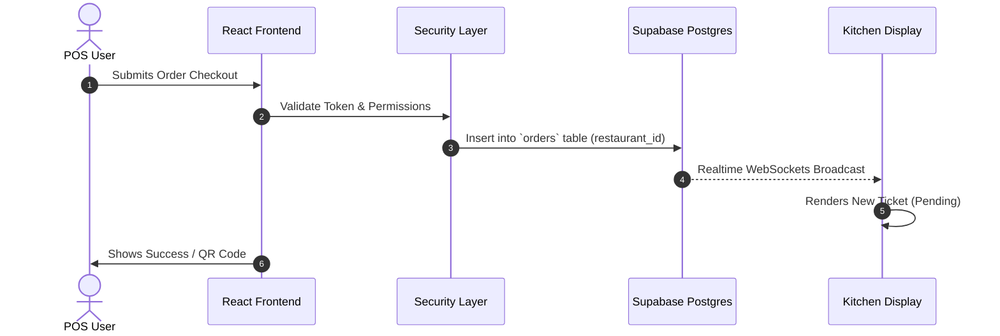
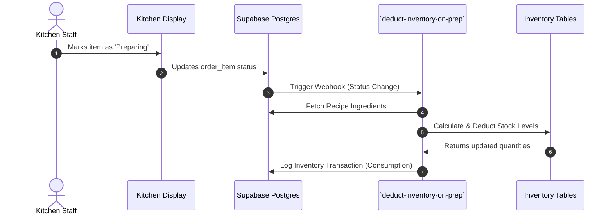

# Tasty Bite Harbor — Detailed System Architecture & Flow

## 1. System Architecture Overview

Tasty Bite Harbor is an enterprise-grade restaurant and hospitality operating system. It operates on a multi-tenant cloud architecture using React 18, TypeScript, and Supabase.

## 2. Core Components and Functionality

### 2.1 Authentication & Security Layer
*   **`SubscriptionGate`**: Ensures the active tenant organization has a valid subscription plan. Blocks access if expired.
*   **`PermissionGuard` & `FeatureLock`**: Evaluates the user's role against required route components (e.g., `orders.view`, `inventory.manage`).
*   **Row-Level Security (RLS)**: Enforces strict tenant isolation at the database level using `restaurant_id` and `organization_id`.

### 2.2 Multi-Format POS & Orders
*   **Standard POS (`/pos`)**: Table-based ordering interface for dine-in. Supports split billing, merging tables, and NC (Non-Chargeable) tracking.
*   **QSR POS (`/qsr-pos`)**: High-speed tap-to-order interface optimized for Quick Service Restaurants.
*   **QuickServe POS (`/quickserve-pos`)**: Optimized for counter and takeaway operations with instantaneous Razorpay/Paytm QR payment integration.
*   **Offline Cache Engine (`useOfflineCache`)**: Queues orders locally in the browser when internet disconnects and auto-syncs when online.

### 2.3 Kitchen Display System (KDS)
*   **Realtime Sync**: Subscribes to Supabase WebSocket channels to instantly render new order tickets.
*   **Audio Alerts (`useSpeechAnnouncement`)**: Announces new tickets and priority updates to kitchen staff.
*   **Ticket States**: Tracks items through `Pending`, `Preparing`, and `Ready` states.

### 2.4 Franchise & Multi-Branch Management
*   **Branch Switcher**: Allows organization owners to seamlessly switch operational context between HQ and local branches (Mumbai, Pune, Nashik).
*   **Menu Synchronization**: Centralized master menu at HQ pushes items to local branches. Local branches can optionally override pricing.
*   **Cross-Branch Insights**: Consolidated views of orders, P&L, inventory stock, and staff roaming attendance.

### 2.5 Inventory & Recipe Engineering
*   **Recipe Formulas (`BatchProductionManager`)**: Defines raw material breakdowns for every menu item (e.g., 1 Burger = 1 Bun, 150g Patty).
*   **Automated Deductions**: Links POS sales directly to raw material depletion.
*   **Purchase Orders & OCR**: Auto-suggests POs based on low stock alerts. Extracts data from supplier bills via OCR integration.

### 2.6 Hotel Room & Reservations
*   **Availability Heatmap (`TableAvailabilityHeatMap`)**: Visual calendar grid for room and table bookings.
*   **Room Billing**: Merges restaurant room service tabs with the final hotel checkout invoice.
*   **Housekeeping Workflow**: Triggers cleaning schedules post-checkout and manages room amenity restocking.

### 2.7 Analytics, Finance & GST
*   **AI Chart Builder (`AIChartBuilder`)**: Allows users to type natural language prompts to generate customized Highcharts/Recharts graphs.
*   **GST Automation**: Generates GSTR-1, GSTR-3B, and HSN summary reports dynamically based on localized tax rules.
*   **Invoice Distribution**: Connects with MSG91 Cloud API to push PDF receipts directly to customer WhatsApp numbers.

---

## 3. Detailed Data & Process Flows

### 3.1 Order Processing Flow

### 3.2 Inventory Auto-Deduction Flow

## 4. Edge Functions (Serverless Backend)
Over 46 edge functions handle asynchronous processing outside the main frontend thread:
*   `extract-bill-details`: Processes image uploads for automatic expense categorization.
*   `deduct-inventory-on-prep`: Heavy formula calculations for recipe stock depletion.
*   `create-razorpay-order` / `paytm-webhook`: Manages payment intents and asynchronous callback verifications.
*   `auto-clock-out`: Cron-triggered job to manage forgotten staff time-clock shifts.
